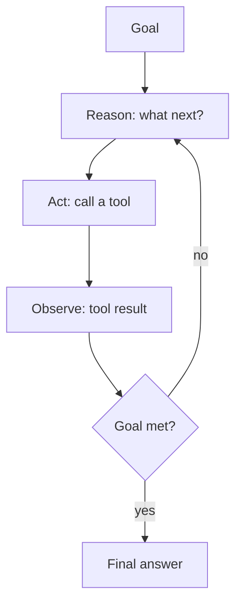
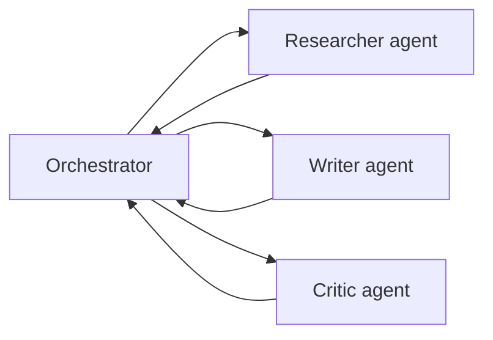

## Learning objectives

- Define an **agent** precisely and build the reason–act–observe loop.
- Add **memory** (short- and long-term) so agents remember across turns.
- Coordinate **multi-agent** systems and know when they help vs hurt.
- Apply guardrails that keep autonomous systems safe and bounded.

## Prerequisites

[Structured Outputs & Tools](/courses/ai-python/structured-outputs-and-tools) (the tool loop) and [RAG](/courses/ai-python/rag-systems) (for retrieval memory).

## The core idea in one line

> An **agent** is an LLM in a loop with tools, deciding its own next action until a goal is met — the tool-use loop from earlier, plus memory, planning, and guardrails.

**Analogy — a capable intern with a to-do list and a phone.** You give the intern a goal, not step-by-step instructions. They think ("I need last quarter's numbers"), act (call finance — a tool), observe the answer, and decide the next step, repeating until done. Memory is their notebook; guardrails are the rules ("never wire money without approval"). A bad agent is an intern with no rules and unlimited phone credit — expensive and dangerous.

## The agent loop (ReAct)



```python
def agent(goal: str, tools: dict, max_steps: int = 8) -> str:
    messages = [{"role": "system", "content": SYSTEM_WITH_TOOL_INSTRUCTIONS},
                {"role": "user", "content": goal}]
    for _ in range(max_steps):                    # ← hard cap: safety + cost
        reply = llm.chat(messages, tools=schemas(tools))
        if not reply.tool_calls:
            return reply.content                   # goal reached
        messages.append(reply.message)
        for call in reply.tool_calls:
            result = tools[call.name](**validate(call.args))   # validate!
            messages.append({"role": "tool", "tool_call_id": call.id,
                             "content": str(result)})
    return "Stopped: step limit reached."          # never loop forever
```

An agent is *mostly this*. Everything else — memory, multiple agents — is enrichment.

## Memory

The model is stateless; memory is something *you* maintain and feed back.

| Memory | What | How |
|---|---|---|
| **Short-term** | This conversation | Keep messages in the context window; summarize when it fills |
| **Long-term** | Facts across sessions | Store in a vector DB; retrieve relevant bits per turn (RAG) |
| **Working** | Scratchpad for a task | Intermediate results in state (e.g. LangGraph state) |

```python
def remember(user_id: str, fact: str):
    memory_store.add(embed(fact), metadata={"user": user_id})

def recall(user_id: str, query: str, k=3) -> list[str]:
    return memory_store.search(embed(query), where={"user": user_id}, k=k)
```

Short-term memory hits the context limit; the standard fix is **rolling summarization** — replace old turns with a compact summary so the window never overflows.

## Multi-agent systems

Split a hard job across specialized agents that collaborate:



- **Orchestrator/worker** — a manager delegates subtasks and assembles results.
- **Debate/critic** — one agent proposes, another critiques; quality improves through review.

But multi-agent is not automatically better. It multiplies cost and latency and adds coordination failure modes. **Prefer a single well-equipped agent** until a task genuinely benefits from specialization or parallel research.

## Guardrails — non-negotiable for autonomy

1. **Step/iteration cap** — never an unbounded loop (cost + runaway behavior).
2. **Tool allow-list & validation** — validate every argument; whitelist side-effecting tools.
3. **Human-in-the-loop** for irreversible actions (payments, deletes, emails) — require approval.
4. **Budgets** — cap total tokens/cost per run; abort when exceeded.
5. **Observability** — log every reason/act/observe so failures are auditable.

```python
if action.is_irreversible and not human_approved(action):
    return "Pausing for approval: " + action.describe()
```

## Common mistakes

1. **No step cap** — the agent loops, burning money.
2. **Too many tools** — the model picks wrong; keep the toolset small and well-described.
3. **Trusting tool arguments** — hallucinated args trigger bad actions; validate.
4. **Multi-agent for everything** — added cost/latency with no benefit; start single-agent.
5. **No memory strategy** — the agent forgets or the context overflows mid-task.

## Performance & cost

- Each step is a model call — steps × tokens is your cost; caps and small toolsets keep it bounded.
- Parallelize independent tool calls; serialize dependent ones.
- Summarize history aggressively; long transcripts are the silent cost driver.

## Interview questions

1. **"What is an AI agent?"** — An LLM in a reason–act–observe loop with tools, choosing its own steps toward a goal, plus memory and guardrails.
2. **"How do agents remember?"** — Short-term via context (with summarization), long-term via a vector store retrieved per turn.
3. **"When are multi-agent systems worth it?"** — When specialization/parallelism genuinely helps; otherwise a single agent is cheaper and simpler.
4. **"What guardrails does an autonomous agent need?"** — Step caps, tool validation/allow-lists, human approval for irreversible actions, budgets, and logging.

## Summary

- An agent is the tool-use loop deciding its own next action until done.
- Memory is engineered: context + summarization (short-term) and vector retrieval (long-term).
- Multi-agent adds power *and* cost — reach for it only when it pays.
- Guardrails (caps, validation, human-in-loop, budgets, logging) are mandatory for autonomy.

## Exercises

**Easy**

1. Take your tool-use loop and add a `max_steps` cap plus a log line per step.
2. List which of these actions need human approval: read a file, send an email, delete a record, compute a sum.

**Intermediate**

3. Add long-term memory: store user facts in a vector store and recall relevant ones each turn. Demonstrate recall across two "sessions."
4. Implement rolling summarization: when history exceeds N tokens, replace old turns with a summary.

**Advanced / architecture**

5. Design an orchestrator + researcher + writer system for "produce a sourced market brief." Define each agent's tools, the message flow, and cost controls.

**Debugging**

6. An agent occasionally deletes the wrong record. Walk through the guardrails that would have prevented it and where to insert each.

**Mini project**

Build a research agent: given a question, it can `web_search`, `read_url`, and `remember`/`recall`, loops with a step cap and budget, cites sources, and asks for approval before any write action. Log the full reason/act/observe trace.

## Quiz

<details>
<summary>1. What's the minimal definition of an agent?</summary>
An LLM in a loop with tools, choosing its own next action until a goal is met.
</details>

<details>
<summary>2. How do you stop short-term memory overflowing the context?</summary>
Rolling summarization — replace old turns with a compact summary.
</details>

<details>
<summary>3. Give one reason to prefer a single agent over multi-agent.</summary>
Lower cost/latency and fewer coordination failures; multi-agent only pays off with real specialization/parallelism.
</details>

<details>
<summary>4. Which action always warrants human-in-the-loop?</summary>
Irreversible ones — payments, deletions, sending emails — require explicit approval.
</details>

## Further reading

- "ReAct: Synergizing Reasoning and Acting" (Yao et al., 2022)
- Anthropic "Building effective agents"; multi-agent research write-ups
- Next lesson: [Security, Cost & Production Deployment](/courses/ai-python/ai-in-production)
