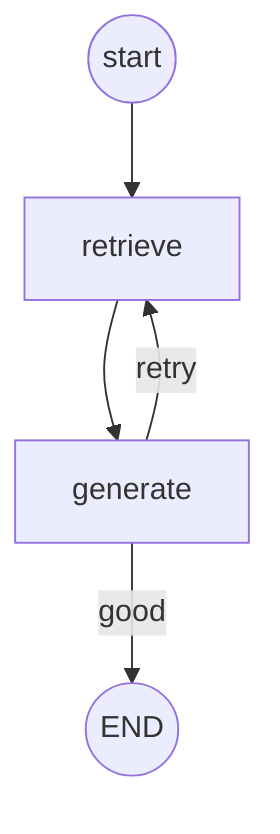
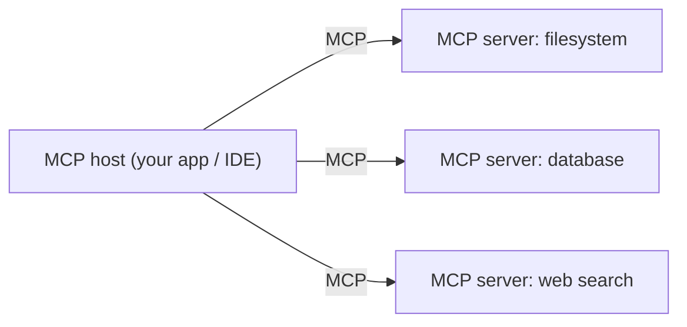

## Learning objectives

- Know what **LangChain**, **LangGraph**, and **MCP** each solve — and when *not* to use them.
- Compose a chain with LCEL and reason about the abstraction cost.
- Model a stateful, branching workflow as a **LangGraph** state machine.
- Understand **MCP** as a universal protocol for tools and context.

## Prerequisites

[Structured Outputs & Tools](/courses/ai-python/structured-outputs-and-tools) and [Streaming & Async](/courses/ai-python/streaming-and-async).

## The core idea in one line

> These are **orchestration tools**: LangChain wires steps together, LangGraph adds state and loops, and MCP standardizes how apps expose tools/context to any model — plumbing, not intelligence.

**Analogy — kitchen equipment.** The model is the chef. LangChain is a set of pre-built kitchen gadgets that chain steps ("blend, then strain, then plate"). LangGraph is the kitchen's *workflow board* — with loops ("keep reducing until thick") and branches ("if too salty, add potato"). MCP is standardized power sockets and connectors, so any appliance (tool) plugs into any kitchen (model host) without a custom adapter. Handy — but a great chef with a knife can still outcook a badly-run gadget kitchen.

## LangChain — composition with LCEL

LangChain's modern core is **LCEL** (LangChain Expression Language): pipe components with `|`.

```python
from langchain_openai import ChatOpenAI
from langchain_core.prompts import ChatPromptTemplate
from langchain_core.output_parsers import StrOutputParser

prompt = ChatPromptTemplate.from_template("Translate to French: {text}")
chain = prompt | ChatOpenAI(model="gpt-4o-mini") | StrOutputParser()
chain.invoke({"text": "Good morning"})     # → "Bonjour"
```

`prompt | model | parser` reads left to right: format → call → extract. Chains compose, stream, and run async for free. Useful — but note you could write this in ~6 lines of plain SDK code. **Use LangChain when the abstraction saves more than it hides.**

> [!WARNING]
> Frameworks add indirection: harder debugging, version churn, and a stack trace ten layers deep. For simple apps, the raw SDK is often clearer. Adopt a framework when your orchestration is genuinely complex, not by default.

## LangGraph — state machines for agents

Real agents loop and branch: call a tool, check a result, maybe retry, maybe ask the user. That's a **graph of states**, not a linear chain. LangGraph models it explicitly.

```python
from langgraph.graph import StateGraph, END
from typing import TypedDict

class State(TypedDict):
    question: str
    answer: str
    attempts: int

def retrieve(s: State) -> State: ...        # each node returns updated state
def generate(s: State) -> State: ...
def is_good(s: State) -> str:               # a conditional edge
    return END if s["answer"] else "retrieve"

g = StateGraph(State)
g.add_node("retrieve", retrieve)
g.add_node("generate", generate)
g.set_entry_point("retrieve")
g.add_edge("retrieve", "generate")
g.add_conditional_edges("generate", is_good)   # loop back or finish
app = g.compile()
app.invoke({"question": "…", "answer": "", "attempts": 0})
```



LangGraph's value: explicit state, loops, checkpoints (resume where you left off), and human-in-the-loop pauses — hard to hand-roll cleanly. This is where a framework earns its keep.

## MCP — the Model Context Protocol

Every app re-implements tool integrations differently. **MCP** is an open protocol that standardizes how a host (Claude Desktop, an IDE, your app) discovers and calls **tools**, **resources**, and **prompts** exposed by external **MCP servers**.



- Write a tool **once** as an MCP server; any MCP-capable host can use it — no bespoke glue per app.
- Think "USB for AI tools": one connector standard instead of N custom integrations.

```python
# A minimal MCP server (conceptual) exposing one tool.
from mcp.server.fastmcp import FastMCP
mcp = FastMCP("demo")

@mcp.tool()
def add(a: int, b: int) -> int:
    """Add two numbers."""
    return a + b

# Run it; an MCP host can now discover and call `add`.
```

## Choosing — a decision guide

| Situation | Reach for |
|---|---|
| A few sequential steps | Plain SDK (skip frameworks) |
| Reusable, composable pipelines | LangChain / LCEL |
| Loops, branches, state, human-in-loop | LangGraph |
| Sharing tools across many apps/hosts | MCP |

## Common mistakes

1. **Framework-first** — adopting LangChain for a 10-line task, then fighting its abstractions.
2. **Hidden cost/latency** — chains can make extra model calls you didn't notice; log usage.
3. **Version churn** — these libraries move fast; pin versions and read changelogs.
4. **Confusing MCP with a framework** — MCP is a *protocol*, orthogonal to LangChain/LangGraph.

## Performance & cost

- Each chain/graph node may be a model call — measure end-to-end token usage, not per node.
- LangGraph checkpoints add storage but enable resume/retry without recomputing prior steps.
- Framework overhead is usually negligible next to model latency, but debugging time is a real cost.

## Interview questions

1. **"LangChain vs LangGraph?"** — LangChain composes steps (chains); LangGraph adds explicit state, loops, and branches for agent workflows.
2. **"When would you NOT use a framework?"** — Simple, few-step apps where raw SDK is clearer and easier to debug.
3. **"What problem does MCP solve?"** — Standardizes tool/context integration so a tool written once works across many hosts/models.
4. **"Is MCP a competitor to LangChain?"** — No — it's a protocol for exposing tools/context, orthogonal to orchestration frameworks.

## Summary

- LangChain composes steps; LangGraph models stateful, looping agent workflows; MCP standardizes tool/context sharing.
- Frameworks trade indirection for power — worth it for complex orchestration, overkill for simple apps.
- MCP is "USB for AI tools": write a tool once, use it everywhere.

## Exercises

**Easy**

1. Build a 3-step LCEL chain (prompt | model | parser) and run it. Then write the same thing with the raw SDK; compare line counts and clarity.
2. Draw the state graph for a "retrieve → generate → (retry if empty)" flow.

**Intermediate**

3. Implement the LangGraph example so it retries retrieval up to 2 times before ending.
4. Write a minimal MCP server exposing two tools and describe how a host would discover them.

**Advanced / architecture**

5. You have three apps that all need a "search company docs" tool. Compare (a) copying the tool into each vs (b) an MCP server. What do you gain and lose?

**Debugging**

6. A LangChain app is 3× more expensive than expected. Explain how hidden intermediate model calls cause this and how you'd find them.

**Mini project**

Rebuild your RAG agent from the earlier lessons as a LangGraph state machine with nodes for retrieve, grade-relevance, generate, and (conditionally) retry. Add a checkpoint so a run can resume after a crash.

## Quiz

<details>
<summary>1. What does the `|` operator do in LCEL?</summary>
Pipes components: the output of each becomes the input of the next (prompt → model → parser).
</details>

<details>
<summary>2. Why LangGraph over a plain chain for agents?</summary>
Agents need loops, branches, and state; LangGraph models those explicitly with checkpoints and human-in-the-loop.
</details>

<details>
<summary>3. In one line, what is MCP?</summary>
An open protocol standardizing how apps expose and consume tools/context — "USB for AI tools."
</details>

<details>
<summary>4. When should you skip these frameworks?</summary>
For simple, few-step apps where the raw SDK is clearer and easier to debug.
</details>

## Further reading

- LangChain (LCEL) and LangGraph docs
- modelcontextprotocol.io — the MCP spec and SDKs
- Next lesson: [Building AI Agents](/courses/ai-python/ai-agents)
