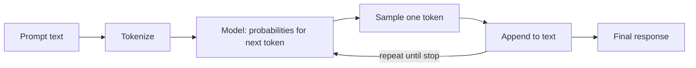

## Learning objectives

- Explain **next-token prediction** and why "it just predicts the next word" is both true and powerful.
- Reason about **context windows**, and what happens when you exceed them.
- Control randomness with **temperature**, **top-p**, and related sampling knobs.
- Understand *why* models hallucinate, and the practical levers that reduce it.

## Prerequisites

[The Modern AI Landscape](/courses/ai-python/modern-ai-landscape). No math beyond "a probability is a number between 0 and 1."

## The core idea in one line

> An LLM is a function that, given some text, outputs a **probability for every possible next token**. Generation is just doing that repeatedly, appending the chosen token each time.

**Analogy — the world's best autocomplete.** Your phone's keyboard suggests the next word from the last few. An LLM does the same thing, but "the last few words" can be your entire document, and its sense of "what word comes next" was learned from a huge slice of human writing. Everything impressive — answering questions, writing code — emerges from doing this one thing extremely well.

## How a response is actually produced



The loop, in pseudocode:

```python
tokens = tokenize(prompt)
while True:
    logits = model(tokens)          # a score for every token in the vocabulary
    probs = softmax(logits / temperature)   # scores → probabilities
    next_token = sample(probs)      # pick one according to the probabilities
    if next_token == END:           # the model emits a stop token
        break
    tokens.append(next_token)
text = detokenize(tokens)
```

Two consequences fall straight out of this loop:

- **Generation is sequential** — token *n+1* depends on token *n*. That's why latency grows with output length and why streaming (a later lesson) exists.
- **The model never "looks ahead" or "plans"** in the human sense; coherence emerges from each step being conditioned on everything so far.

## The context window

The **context window** is the maximum number of tokens (prompt **+** response) the model can consider at once — think of it as the model's short-term memory or desk space.

```python
# Rough rule of thumb (English): 1 token ≈ 4 characters ≈ 0.75 words.
# A 128k-token window ≈ ~300 pages of text.
```

- Everything the model "knows" for this call must fit in the window: system instructions, conversation history, retrieved documents, and the answer.
- **Exceed it and the API errors** (or silently truncates, depending on the client). Managing what goes in the window is a core skill — it's why we chunk documents and summarize history.
- Bigger windows are not free: cost scales with tokens, and quality can degrade when key facts are buried in a very long context ("lost in the middle").

## Temperature and sampling — controlling randomness

`temperature` scales the probabilities before sampling:

| temperature | Effect | Use for |
|---|---|---|
| `0` | Deterministic-ish: always take the most likely token | Extraction, classification, code, JSON |
| `0.2–0.5` | Slightly varied, still focused | Q&A, summaries |
| `0.7–1.0` | Creative, more surprising | Brainstorming, marketing copy |
| `> 1.2` | Often incoherent | Rarely useful |

```python
# Deterministic-friendly: same input → (almost) same output.
client.chat(messages, temperature=0)

# Creative: expect variety on repeated calls.
client.chat(messages, temperature=0.9)
```

Related knobs:

- **top-p (nucleus sampling)** — sample only from the smallest set of tokens whose probabilities sum to `p` (e.g. `0.9`). A different way to trim the long tail. Tune *either* temperature *or* top-p, not both aggressively.
- **max_tokens** — a hard cap on response length (and cost). Set it deliberately.
- **stop sequences** — strings that force generation to halt.

> [!NOTE]
> Even at `temperature=0`, outputs are not guaranteed byte-identical across runs — floating-point and provider-side batching introduce tiny nondeterminism. Design tests to assert *shape*, not exact strings.

## Why models hallucinate

A hallucination is a confident, fluent, **wrong** statement. It follows directly from the mechanism: the model optimizes for *plausible next tokens*, not *true* ones. If a plausible-sounding citation fits the pattern, it will produce one — real or not.

Levers that reduce hallucination:

1. **Give it the facts** (retrieval / RAG) instead of relying on training memory.
2. **Ask it to cite** the provided source, and reject answers without a citation.
3. **Lower temperature** for factual tasks.
4. **Let it say "I don't know"** — explicitly permit refusal in the system prompt.
5. **Verify with tools** — have it call a calculator or database rather than compute in its head.

## Common misconceptions

- **"The model looks things up."** No — by default it only has patterns learned during training, frozen at a cutoff date.
- **"temperature=0 makes it correct."** It makes it *consistent*, not *accurate*. A wrong answer becomes a reliably wrong answer.
- **"More context is always better."** Irrelevant context dilutes attention and costs more; precision beats volume.
- **"It understands like a person."** It models statistical structure of language; that's enough to be useful and enough to be confidently wrong.

## Performance, memory & cost implications

- **Latency ≈ prompt processing + (tokens_out × per-token time).** Long outputs dominate; cap `max_tokens`.
- **Cost = input_tokens × in_rate + output_tokens × out_rate.** Output tokens are usually more expensive. Trimming prompts and outputs saves real money at scale.
- **The KV cache** (provider-side) makes continuing a generation cheaper than restarting; some providers bill cached input tokens at a discount — structure prompts so the stable part comes first.

## Interview questions

1. **"What is an LLM doing mechanically?"** — Repeated next-token prediction: probabilities over a vocabulary, sample, append, repeat until a stop token.
2. **"What is a context window and why does it matter?"** — Max tokens (prompt+response) considered at once; it bounds history, retrieved context, and answer length, and drives cost.
3. **"What does temperature control?"** — Randomness of sampling; low for deterministic/extraction tasks, high for creative ones.
4. **"Why do LLMs hallucinate and how do you mitigate it?"** — They optimize plausibility, not truth; mitigate with retrieval, citations, low temperature, permitted refusal, and tool verification.

## Summary

- An LLM predicts the next token over and over; that single mechanism produces all its behavior.
- The context window is finite short-term memory shared by instructions, history, retrieved docs, and the answer.
- Temperature/top-p trade determinism for creativity — pick per task.
- Hallucination is inherent to "predict plausible text"; ground the model with facts, citations, and tools.

## Exercises

**Easy**

1. Estimate the token count of a 1,200-word document using the 0.75-words-per-token rule. Would it fit a 4k window alongside a 500-token answer?
2. Pick temperatures for: extracting an invoice total, writing a birthday poem, classifying support tickets. Justify each.

**Intermediate**

3. Call any provider twice at `temperature=0` and twice at `temperature=1` with the same prompt. Describe the difference in variety.
4. Write a function `will_fit(prompt_tokens, max_answer, window)` that returns whether a request fits, with a safety margin.

**Advanced / debugging**

5. A summarizer returns truncated output on long inputs with no error. List three likely causes (window overflow, `max_tokens` cap, client truncation) and how you'd confirm each.

**Interview scenario**

6. A user reports the model "invented a legal case." Explain to a non-technical PM why this happens and the three changes you'd ship to prevent it.

**Mini project**

Build `token_budget.py`: given a system prompt, chat history, and a target answer length, it reports how many tokens remain in a chosen window and warns before you overflow. (Use a real tokenizer like `tiktoken` if available, else the character heuristic.)

## Quiz

<details>
<summary>1. Does the model plan the whole sentence before writing it?</summary>
No — it produces one token at a time, each conditioned on everything generated so far. Coherence is emergent.
</details>

<details>
<summary>2. What shares the context window besides the answer?</summary>
System instructions, conversation history, and any retrieved documents — all compete for the same token budget.
</details>

<details>
<summary>3. Which temperature for reliable JSON extraction?</summary>
Near 0 — you want the most likely, most consistent tokens.
</details>

<details>
<summary>4. Name two ways to reduce hallucination.</summary>
Provide facts via retrieval and require citations; also lower temperature, permit "I don't know," and verify with tools.
</details>

## Further reading

- Andrej Karpathy, "Let's build GPT" / "Intro to LLMs" talks — the mechanism, visualized
- Provider docs on sampling parameters (temperature, top_p, stop)
- "Lost in the Middle" (Liu et al.) — why long-context recall degrades
