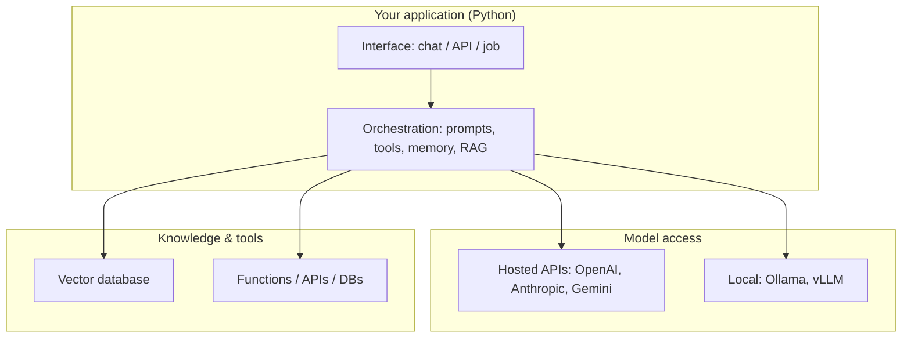

## Learning objectives

- Describe what an **AI engineer** builds and how that differs from an ML engineer or data scientist.
- Map the modern AI ecosystem: models, providers, hosting, and the tooling layer.
- Understand the anatomy of a real LLM application end to end.
- Choose sensibly between hosted APIs and local models for a given problem.

## Prerequisites

Comfortable intermediate Python (functions, classes, `async` basics, `pip`/virtualenvs). No machine-learning background is required — this course treats the model as a component you call, not a thing you train.

## The core idea in one line

> An **AI engineer** builds software *around* pre-trained models — they wire an LLM into a product with retrieval, tools, memory, and guardrails. They do not train models from scratch.

Think of the LLM as a **very capable but forgetful contractor**. It is brilliant at language tasks, but it has no memory of your business, no access to your database, and it will confidently make things up if you don't give it the right context. Your job is everything around that contractor: handing it the right documents, letting it use tools, checking its work, and keeping it on budget.

## AI engineer vs ML engineer vs data scientist

| Role | Owns | Typical tools | Trains models? |
|---|---|---|---|
| Data scientist | Insight from data | pandas, notebooks, statistics | Sometimes (small) |
| ML engineer | Training & serving models | PyTorch, TensorFlow, GPUs | Yes |
| **AI engineer** | **Products built on models** | **LLM APIs, vector DBs, orchestration** | **No — calls existing models** |

The rise of strong general-purpose models (GPT, Claude, Gemini, Llama) moved most product value from *training* to *integration*. That integration layer is this whole course.

## The ecosystem, one layer at a time



- **Model access** — a hosted API (fastest to start, pay per token) or a local runtime (private, fixed cost).
- **Orchestration** — where *you* live: assembling prompts, calling tools, retrieving context, enforcing structure.
- **Knowledge & tools** — a vector database for private documents, plus functions the model can call to act on the world.

## Anatomy of a real LLM application

A production feature is rarely "call the model, return the text." It is a pipeline:

```python
# Conceptual shape — every stage is a lesson later in this course.
def answer(question: str) -> str:
    context = retrieve(question)            # RAG: fetch relevant private docs
    messages = build_prompt(question, context)  # prompt engineering
    reply = llm.chat(messages, tools=TOOLS)      # provider API + tool calling
    if reply.tool_calls:                    # the agent loop
        results = run_tools(reply.tool_calls)
        reply = llm.chat(messages + results)
    validate(reply)                         # structured output / guardrails
    log_cost(reply.usage)                   # cost & observability
    return reply.text
```

Every line above is a topic you will master: retrieval, prompting, provider APIs, tool calling, agents, validation, and cost. Keep this skeleton in mind — the rest of the course fills it in.

## Hosted API vs local model — when to use which

| Factor | Hosted API | Local (Ollama/vLLM) |
|---|---|---|
| Time to first call | Minutes | Hours (setup, GPU) |
| Quality ceiling | Highest (frontier models) | Good, below frontier |
| Cost model | Per token (scales with use) | Fixed hardware |
| Data privacy | Leaves your network | Stays on your machine |
| Best for | Most products, prototypes | Sensitive data, high volume, offline |

**When NOT to reach for an LLM at all:** exact arithmetic, deterministic business rules, anything a regex or SQL query solves reliably. An LLM is the wrong tool for problems with one correct, checkable answer that classical code already nails — you would add cost, latency, and a hallucination risk for nothing.

## Common misconceptions

1. **"AI engineering means training models."** Almost never. You integrate pre-trained models.
2. **"Bigger model = always better."** Bigger costs more and is slower; a smaller model with good retrieval often wins.
3. **"The model knows my data."** It knows nothing past its training cutoff and nothing private. Retrieval fixes that.
4. **"It's non-deterministic, so I can't test it."** You test it with *evaluations* — a whole discipline covered later.

## Production notes

- Treat model choice as a **runtime config**, not a hardcode. You will switch models for cost/quality, so hide the provider behind a thin interface (built in the *Provider APIs* lesson).
- Budget for **latency**: a frontier model can take seconds. Streaming and async (later lessons) are how you keep the UI responsive.
- **Cost compounds**: every token in and out is billed. Measuring cost from day one prevents nasty surprises.

## Interview questions

1. **"What does an AI engineer do that an ML engineer doesn't?"** — Build products around existing models; focus on retrieval, orchestration, tools, and reliability rather than training.
2. **"When would you choose a local model over an API?"** — Strict data privacy, high sustained volume where per-token cost exceeds hardware, or offline requirements.
3. **"Why isn't the biggest model always the right choice?"** — Cost, latency, and diminishing returns; retrieval and prompting often close the gap more cheaply.
4. **"Sketch the components of an LLM app."** — Interface, orchestration (prompt/tools/memory), model access, and a knowledge/tool layer, plus evaluation and cost tracking.

## Summary

- AI engineering is **integration**, not training: you build software around capable pre-trained models.
- The stack has four layers — interface, orchestration, model access, and knowledge/tools.
- A real feature is a pipeline: retrieve → prompt → call → use tools → validate → measure.
- Choose hosted vs local by privacy, volume, and quality needs; and know when an LLM is the wrong tool entirely.

## Exercises

**Easy**

1. List three features in apps you use that are almost certainly LLM-powered, and one that looks like AI but is probably plain code.
2. For a "summarize my emails" feature, label which of the four stack layers each requirement touches.

**Intermediate**

3. Write a one-paragraph decision memo choosing hosted vs local for a hospital chatbot that reads patient notes. Justify with the table above.
4. Take the `answer()` skeleton and annotate each line with the lesson (later in this course) that implements it.

**Advanced / architecture**

5. Design the component diagram for a customer-support assistant that must cite company docs, escalate to a human, and never reveal another customer's data. Mark where retrieval, tools, and guardrails live.

**Interview scenario**

6. A stakeholder says "let's fine-tune our own model." Give three cheaper things to try first and explain when fine-tuning is actually justified.

**Mini project**

Write a `landscape.py` that prints a table of 4–5 models you could use (name, provider, hosted/local, rough cost tier, best use case). You'll extend it in later lessons into a real provider-agnostic client.

## Quiz

<details>
<summary>1. Does an AI engineer typically train models?</summary>
No — they build applications around pre-trained models. Training is an ML-engineering concern.
</details>

<details>
<summary>2. Where does "orchestration" sit in the stack?</summary>
Between the interface and the model — it assembles prompts, calls tools, retrieves context, and enforces structure.
</details>

<details>
<summary>3. Give one reason to pick a local model.</summary>
Data privacy (data never leaves your network), high sustained volume, or offline operation.
</details>

<details>
<summary>4. Why is retrieval part of nearly every serious LLM app?</summary>
The model has no knowledge of your private or post-training-cutoff data; retrieval injects that context at query time.
</details>

## Further reading

- Provider docs: platform.openai.com, docs.anthropic.com, ai.google.dev
- "Emerging architectures for LLM applications" — a16z (skim for the layered mental model)
- The rest of this course — each layer becomes a full lesson
