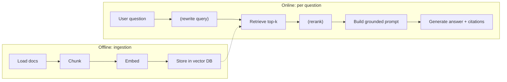

## Learning objectives

- Explain the full **RAG** pipeline and why each stage exists.
- Diagnose why *naive* RAG returns wrong or ungrounded answers.
- Improve retrieval with reranking, hybrid search, and query rewriting.
- Enforce **grounding**: answers that cite sources or refuse.

## Prerequisites

[Vector Databases](/courses/ai-python/vector-databases) and [Prompt Engineering](/courses/ai-python/prompt-engineering) (you can read them in either order, but you'll want both).

## The core idea in one line

> **Retrieval-Augmented Generation** = fetch relevant text at query time and put it in the prompt, so the model answers from *your* facts instead of its frozen memory.

**Analogy — open-book vs closed-book exam.** A raw LLM takes a closed-book exam from memory: fast, but it misremembers and invents. RAG hands it the open book, turned to the right page, and says "answer using this." Same student, far fewer wrong answers — and you can check which page it used.

## The pipeline



**Ingestion** (offline, once): load → chunk → embed → store.
**Query** (online, per request): (optionally rewrite) → retrieve → (rerank) → build prompt → generate.

## Naive RAG, and why it disappoints

```python
def naive_rag(question: str) -> str:
    chunks = retrieve(question, k=4)              # from the vector DB
    context = "\n\n".join(chunks)
    messages = [
        {"role": "system", "content": "Answer the question."},
        {"role": "user", "content": f"{context}\n\nQuestion: {question}"},
    ]
    return llm.chat(messages)
```

This *works in demos* and fails in production because:

- The **prompt doesn't force grounding** — the model may ignore the context and answer from memory.
- No **citations** — you can't verify or debug.
- No **"I don't know"** path — irrelevant context still yields a confident answer.
- Retrieval is **single-shot** — a vague question retrieves vague chunks.

## Production-grade RAG

```python
SYSTEM = """You are a support assistant. Answer ONLY using the numbered sources below.
- Cite sources inline like [1], [2].
- If the sources do not contain the answer, say "I don't have that information."
- Never use outside knowledge."""

def rag(question: str) -> str:
    candidates = retrieve(question, k=12)          # over-fetch
    top = rerank(question, candidates)[:4]         # keep the truly relevant
    sources = "\n".join(f"[{i+1}] {c}" for i, c in enumerate(top))
    messages = [
        {"role": "system", "content": SYSTEM},
        {"role": "user", "content": f"Sources:\n{sources}\n\nQuestion: {question}"},
    ]
    return llm.chat(messages, temperature=0)        # factual → low temperature
```

Line by line, the fixes:

- **Over-fetch then rerank** — retrieve many candidates, then use a cross-encoder/reranker to keep the few that actually answer the question. Embedding similarity is a coarse filter; reranking is the precise one.
- **Numbered sources + inline citations** — makes answers verifiable and debuggable.
- **Explicit refusal clause** — turns "confidently wrong" into "honestly unsure."
- **temperature=0** — factual answering, not creativity.

## Techniques that move the needle

| Technique | Problem it solves |
|---|---|
| **Reranking** (cross-encoder) | Embedding top-k contains near-misses |
| **Hybrid search** (keyword + vector) | Exact IDs/codes that embeddings miss |
| **Query rewriting** | Vague or pronoun-heavy questions ("what about it?") |
| **Multi-query** | One phrasing retrieves too narrowly |
| **Metadata filtering** | Wrong tenant/date leaking in |
| **Contextual chunking** | Chunks lack surrounding meaning |

You don't need all of these on day one. Add them when evaluation (below) shows a specific failure.

## Evaluate RAG — don't eyeball it

RAG has two failure surfaces; measure both:

- **Retrieval quality** — did the right chunk make it into the top-k? (recall@k)
- **Answer quality** — is the final answer correct and grounded in what was retrieved? (faithfulness)

```python
# A tiny eval harness: known question → expected source id.
cases = [("How do I reset my password?", "handbook-pw-0")]
hits = sum(expected in [id_of(c) for c in retrieve(q, k=5)] for q, expected in cases)
print(f"recall@5 = {hits/len(cases):.0%}")
```

Track this over time. "It felt better" is not an engineering statement.

## Common mistakes

1. **No grounding instruction** — the whole point of RAG, skipped.
2. **k too small** — the answer chunk never gets retrieved; increase k, then rerank.
3. **Dumping raw chunks with no structure** — number them and label sources.
4. **Ignoring the "no answer" case** — always permit refusal.
5. **Never measuring retrieval separately** — you can't fix what you don't isolate.

## Performance & cost

- Context tokens dominate RAG cost — over-fetch for retrieval, but only send the reranked few to the model.
- Cache embeddings and, where possible, cache answers for identical questions.
- Reranking adds latency; use it on the candidate set, not the whole corpus.

## Interview questions

1. **"What problem does RAG solve?"** — Gives the model private/fresh knowledge it wasn't trained on, reducing hallucination.
2. **"Why does naive RAG fail in production?"** — No grounding/citations/refusal and single-shot retrieval.
3. **"Retrieval vs reranking?"** — Retrieval is coarse recall over many candidates; reranking is precise ordering of a few.
4. **"How do you evaluate a RAG system?"** — Separately: retrieval recall@k and answer faithfulness, on a labeled set.

## Summary

- RAG injects relevant text at query time so the model answers from your facts.
- Ingestion (load/chunk/embed/store) is offline; retrieval+generation is online.
- Naive RAG fails without grounding, citations, refusal, and reranking.
- Measure retrieval and answer quality separately, and improve the stage that's actually broken.

## Exercises

**Easy**

1. Take the `naive_rag` function and add the three grounding fixes (numbered sources, citation instruction, refusal clause).
2. Ask a question your knowledge base can't answer. Verify the improved system refuses instead of inventing.

**Intermediate**

3. Implement over-fetch + a simple reranker (re-score candidates by keyword overlap with the query) and compare answers to naive top-k.
4. Add a query-rewriting step that expands a terse question before retrieval; show a case where it helps.

**Advanced / architecture**

5. Design RAG for a docs site with 500k chunks across 50 customers: cover isolation, freshness (re-indexing on doc updates), and cost control. Draw the ingestion and query paths.

**Debugging**

6. Users report the assistant answers from general knowledge, ignoring the docs. The context is being retrieved correctly. Identify the two prompt-level causes and fix them.

**Mini project**

Build `rag_cli.py`: point it at a folder, ingest it (chunk/embed/store), then answer questions from the terminal with inline `[n]` citations and a refusal path. Include a `--eval` mode that runs a small labeled set and prints recall@k.

## Quiz

<details>
<summary>1. What are the two phases of RAG?</summary>
Offline ingestion (load, chunk, embed, store) and online query (retrieve, optionally rerank, generate).
</details>

<details>
<summary>2. Why over-fetch and then rerank?</summary>
Embedding similarity is coarse; over-fetching improves recall and reranking restores precision by keeping only truly relevant chunks.
</details>

<details>
<summary>3. What single instruction most reduces hallucination in RAG?</summary>
"Answer only from the provided sources, and say you don't know if they don't contain the answer."
</details>

<details>
<summary>4. Why evaluate retrieval and generation separately?</summary>
A wrong answer could be a retrieval miss or a generation failure; isolating them tells you what to fix.
</details>

## Further reading

- "Retrieval-Augmented Generation" (Lewis et al., 2020) — the original paper
- Ragas / evaluation frameworks for RAG faithfulness
- Next lesson: [Prompt Engineering](/courses/ai-python/prompt-engineering)
