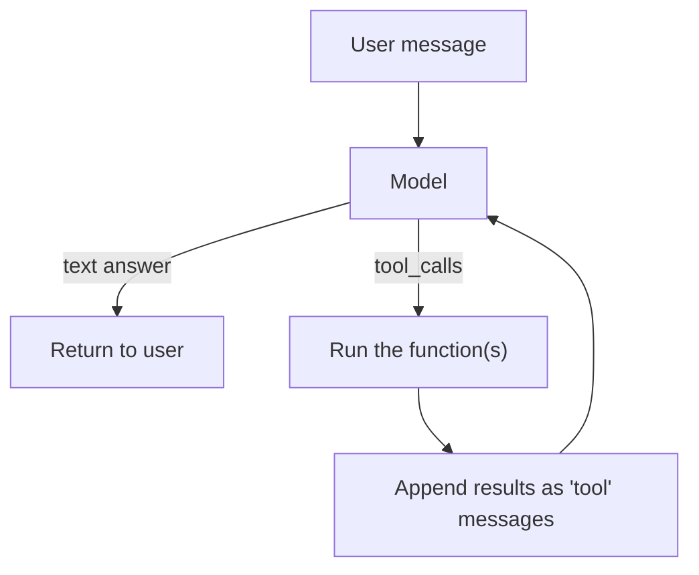

## Learning objectives

- Force the model to return **valid JSON** matching a schema, with Pydantic.
- Understand **function/tool calling**: letting the model call your Python.
- Build the **tool-use loop** that turns a chat model into an automation.
- Handle validation, errors, and the difference between structured outputs and tools.

## Prerequisites

[Prompt Engineering](/courses/ai-python/prompt-engineering) and Python typing / [Pydantic basics](/courses/fastapi/pydantic-deep-dive) help a lot.

## The core idea in one line

> **Structured outputs** make the model fill in a form you define; **tool calling** lets the model ask *your code* to do something and use the result.

**Analogy — a form vs a phone.** Structured output is handing the model a form with labeled fields and requiring every blank filled correctly — no free-form essays. Tool calling is giving the model a phone: when it needs a fact or an action it can't do itself (today's weather, a database write), it "calls" a function you registered and waits for the answer before continuing.

## Structured outputs with Pydantic

Free-text parsing is fragile. Define the shape once and validate:

```python
from pydantic import BaseModel, Field

class Invoice(BaseModel):
    vendor: str
    total: float = Field(description="Grand total in USD")
    due_date: str  # ISO date
    line_items: list[str]

# Many SDKs accept a schema directly and guarantee conforming JSON:
resp = client.responses.parse(
    model="gpt-4o-mini",
    input=f"Extract invoice fields:\n{raw_text}",
    text_format=Invoice,          # provider validates output against this
)
invoice: Invoice = resp.output_parsed   # already typed and validated
```

If your provider/SDK doesn't support schema-enforced output, do it manually and *validate*:

```python
import json
raw = client.chat(messages + [{"role": "system",
      "content": f"Return ONLY JSON matching: {Invoice.model_json_schema()}"}])
invoice = Invoice.model_validate_json(raw)   # raises on bad data — catch and retry
```

The rule: **never trust raw model JSON; always validate with a schema.** A `ValidationError` is your signal to retry or repair.

## Tool (function) calling

You describe functions; the model decides when to call them and with what arguments; you execute and return the result.

```python
def get_weather(city: str) -> str:
    return f"{city}: 22°C, clear"      # real impl calls an API

tools = [{
    "type": "function",
    "function": {
        "name": "get_weather",
        "description": "Get current weather for a city.",
        "parameters": {
            "type": "object",
            "properties": {"city": {"type": "string"}},
            "required": ["city"],
        },
    },
}]
```

The model does **not** run your function — it returns a *request* to call it. You run it and hand back the output.

## The tool-use loop



```python
def run(question: str) -> str:
    messages = [{"role": "user", "content": question}]
    while True:
        reply = client.chat(messages, tools=tools)
        if not reply.tool_calls:
            return reply.content                 # model is done
        messages.append(reply.message)           # record the tool request
        for call in reply.tool_calls:
            args = json.loads(call.function.arguments)
            result = REGISTRY[call.function.name](**args)   # execute
            messages.append({
                "role": "tool",
                "tool_call_id": call.id,
                "content": str(result),
            })
        # loop: model now sees the results and continues
```

This loop is the heart of every "agent" (later lesson). An agent is mostly *this loop* plus more tools, memory, and guardrails.

## Structured outputs vs tools — which when?

| Want | Use |
|---|---|
| Extract/classify into a known shape | **Structured output** (schema) |
| Fetch live data or perform an action | **Tool calling** |
| Route to one of N handlers | Tool calling (each handler a tool) or an enum in structured output |
| Both (call a tool, then return typed result) | Combine them |

## Common mistakes

1. **Parsing JSON with regex/`eval`** — use a schema validator; `eval` is a security hole.
2. **No retry on validation failure** — models occasionally emit malformed JSON; catch and re-ask.
3. **Executing tool args without checks** — the model can hallucinate arguments; validate/whitelist before running side effects.
4. **Vague tool descriptions** — the model calls the wrong tool or fills bad args. Descriptions are prompts.
5. **Unbounded tool loop** — always cap iterations to avoid runaway calls (and cost).

## Security note

Tool calling means the model can trigger real actions. Treat tool arguments as **untrusted input**: validate types, whitelist allowed operations, and never let a tool run arbitrary shell/SQL from model-provided strings. (Full treatment in the [security lesson](/courses/ai-python/ai-in-production).)

## Performance & cost

- Each loop iteration is another model call — cap iterations and prefer batching parallel tool calls.
- Schemas add tokens; keep them minimal but precise.
- Structured-output mode can be slightly slower but removes an entire class of parsing bugs — usually worth it.

## Interview questions

1. **"How do you guarantee valid JSON from an LLM?"** — Schema-enforced structured outputs, and always validate (e.g. Pydantic) with retry on failure.
2. **"Does the model execute your functions?"** — No; it returns a request to call them. Your code executes and returns results.
3. **"Describe the tool-use loop."** — Call model → if tool_calls, run them, append results, call again → repeat until a text answer.
4. **"Security risks of tool calling?"** — Hallucinated/malicious args triggering real actions; mitigate with validation, whitelisting, and iteration caps.

## Summary

- Structured outputs make the model fill a typed form; validate every time.
- Tool calling lets the model request that your code run; you execute and return results.
- The tool-use loop (call → run tools → feed back → repeat) is the basis of agents.
- Treat model-provided JSON and tool arguments as untrusted; validate and cap.

## Exercises

**Easy**

1. Define a `Person(name, age, email)` Pydantic model and extract it from a messy sentence; handle a `ValidationError`.
2. Write a `get_time(timezone)` tool and its JSON schema.

**Intermediate**

3. Implement the tool-use loop with two tools (`get_weather`, `get_time`) and a `max_iterations` cap.
4. Add a retry: if structured-output validation fails, re-ask the model with the error message included.

**Advanced**

5. Build a mini "assistant" that can look up an order (tool) and return a typed `OrderStatus` structured output combining both mechanisms.

**Debugging**

6. A tool loop sometimes never terminates. Given the loop code above, list two causes and add the guards that fix them.

**Mini project**

Build `tools_agent.py`: a registry-based tool-calling loop where adding a tool is just decorating a function. Include argument validation, an iteration cap, and logging of every call. You'll reuse this in the agents lesson.

## Quiz

<details>
<summary>1. Should you ever `eval()` model JSON?</summary>
Never — it's a remote-code-execution risk. Parse with `json` and validate with a schema.
</details>

<details>
<summary>2. What does the model return for a tool call?</summary>
A structured request (function name + arguments) — not the executed result. You run it.
</details>

<details>
<summary>3. What terminates the tool-use loop?</summary>
A model reply with no tool_calls (a final text answer) — or your iteration cap.
</details>

<details>
<summary>4. Why validate tool arguments?</summary>
The model can hallucinate or be manipulated into bad arguments that trigger real side effects.
</details>

## Further reading

- OpenAI structured outputs & function calling; Anthropic tool use docs
- Pydantic docs — `model_validate_json`, `model_json_schema`
- Next lesson: [OpenAI, Anthropic & Gemini APIs](/courses/ai-python/provider-apis)
