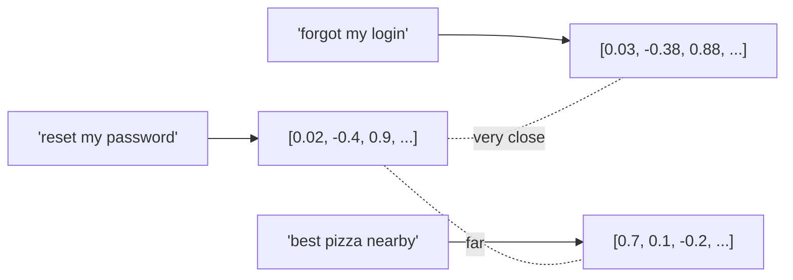

## Learning objectives

- Explain what **tokens** are and why they drive cost, limits, and latency.
- Explain what an **embedding** is and how text becomes a vector.
- Use **cosine similarity** to measure semantic closeness.
- Build a tiny semantic-search function from scratch — the seed of RAG.

## Prerequisites

[How LLMs Actually Work](/courses/ai-python/llm-fundamentals). Basic Python lists; a little intuition for vectors helps but isn't required.

## Part 1 — Tokens

### The core idea

Models don't see characters or words — they see **tokens**: sub-word chunks from a fixed vocabulary. `"tokenization"` might split into `token` + `ization`; `"Python"` is often one token, `"antidisestablishmentarianism"` several.

**Analogy — LEGO bricks.** The model has a fixed box of bricks (the vocabulary, ~100k–200k pieces). Any text is built from those bricks. Common words are single big bricks; rare words are assembled from small ones. Everything you pay for and every limit you hit is counted in bricks, not letters.

```python
# With OpenAI's tiktoken (pip install tiktoken)
import tiktoken
enc = tiktoken.get_encoding("cl100k_base")
ids = enc.encode("AI engineering is fun!")
print(len(ids), ids)          # e.g. 6 tokens
print([enc.decode([i]) for i in ids])  # see the pieces
```

### Why tokens matter in practice

- **Cost** is per token (in and out). "Make the prompt shorter" literally means "use fewer tokens."
- **Context window** is measured in tokens, not words.
- **Rules of thumb (English):** 1 token ≈ 4 chars ≈ 0.75 words. Code, JSON, and non-English text tokenize *less* efficiently — more tokens per character.
- **Non-English penalty:** many tokenizers use more tokens for e.g. Uzbek or Chinese text than for English of the same length — a real cost and latency factor for multilingual apps.

## Part 2 — Embeddings

### The core idea

An **embedding** is a list of numbers (a vector, e.g. 1536 dimensions) that represents the *meaning* of a piece of text. Texts with similar meaning get vectors that point in similar directions — even when they share no words.

**Analogy — a map of meaning.** Imagine every phrase placed as a pin on an enormous map. "How do I reset my password?" and "I forgot my login credentials" land right next to each other, far from "best pizza in town." Embeddings are the coordinates of those pins. Search becomes "find the nearest pins," not "match the same words."



### Producing an embedding

```python
from openai import OpenAI
client = OpenAI()

def embed(text: str) -> list[float]:
    resp = client.embeddings.create(model="text-embedding-3-small", input=text)
    return resp.data[0].embedding   # e.g. length 1536
```

Embeddings come from a *different, cheaper model* than the chat model. You compute them once and store them (that's what a vector database does — next lesson).

### Cosine similarity — measuring closeness

Two vectors are "similar" when the **angle** between them is small. Cosine similarity captures that as a number in `[-1, 1]` (1 = identical direction).

```python
import math

def cosine(a: list[float], b: list[float]) -> float:
    dot = sum(x * y for x, y in zip(a, b))
    na = math.sqrt(sum(x * x for x in a))
    nb = math.sqrt(sum(y * y for y in b))
    return dot / (na * nb)
```

Why cosine and not raw distance? Cosine ignores vector length and compares *direction* (meaning), which is what these models encode. It's also the metric most vector databases default to.

### A tiny semantic search — RAG in miniature

```python
docs = [
    "To reset your password, click 'Forgot password' on the login page.",
    "Our office hours are 9am to 5pm, Monday to Friday.",
    "Refunds are processed within 5 business days.",
]
doc_vecs = [embed(d) for d in docs]      # precompute once

def search(query: str, k: int = 1) -> list[str]:
    q = embed(query)
    ranked = sorted(docs, key=lambda d: cosine(q, doc_vecs[docs.index(d)]), reverse=True)
    return ranked[:k]

search("I can't log in")   # → the password-reset doc, though it shares no keywords
```

That's the entire idea behind retrieval: embed your knowledge, embed the question, return the nearest chunks. Everything in the RAG lesson is this, made scalable and robust.

## Comparison — keyword vs semantic search

| | Keyword (BM25) | Semantic (embeddings) |
|---|---|---|
| Matches | Exact words | Meaning |
| "forgot login" finds "reset password"? | No | Yes |
| Handles synonyms/typos | Poorly | Well |
| Cost | Cheap, no model | Embedding call + vector store |
| Best in production | **Hybrid: use both** | **Hybrid: use both** |

## Common mistakes

1. **Mixing embedding models** — vectors from different models aren't comparable. Re-embed everything if you switch models.
2. **Embedding huge blobs** — one vector for a 50-page PDF loses detail. Chunk first (next lesson).
3. **Forgetting to normalize / using the wrong metric** — match your similarity metric to what the database and model expect (usually cosine).
4. **Ignoring cost of re-embedding** — embedding a large corpus repeatedly is a real bill; cache aggressively.

## Performance, memory & cost

- A 1536-dim float32 vector ≈ 6 KB. A million chunks ≈ 6 GB — memory and index choice (next lesson) start to matter.
- Embedding is far cheaper than generation, but not free; batch inputs (`input=[...]`) to amortize request overhead.
- Similarity math is cheap per pair but O(n) across a corpus — which is exactly why vector *indexes* exist.

## Interview questions

1. **"What's a token?"** — A sub-word unit from the model's fixed vocabulary; cost and limits are counted in tokens.
2. **"What's an embedding?"** — A vector encoding meaning; similar texts get similar vectors, enabling semantic search.
3. **"Why cosine similarity?"** — It compares direction (meaning), ignores magnitude, and matches how embeddings are trained/stored.
4. **"Keyword vs semantic search?"** — Keyword matches exact terms; semantic matches meaning; production usually combines them (hybrid).

## Summary

- Tokens are the currency of LLMs — cost, context, and latency are all measured in them.
- Embeddings turn text into vectors where distance ≈ difference in meaning.
- Cosine similarity ranks how close two meanings are.
- Embed docs once, embed the query, return nearest chunks — that's retrieval, and the foundation of RAG.

## Exercises

**Easy**

1. Use `tiktoken` (or the char heuristic) to compare token counts of the same sentence in English and another language. Note the difference.
2. Compute cosine similarity by hand for `[1,0]` vs `[0,1]` and `[1,1]` vs `[2,2]`. What do the results mean?

**Intermediate**

3. Extend the `search()` example to return the top-k with their scores, and print them sorted.
4. Add a keyword filter: only consider docs containing a required word, then rank the rest semantically (a baby hybrid search).

**Advanced**

5. Given 100k chunks, the linear scan is too slow. Describe (in words) how an approximate index would speed it up and the accuracy tradeoff.

**Debugging**

6. A colleague's semantic search returns garbage. You discover docs were embedded with `text-embedding-3-small` but queries with `text-embedding-3-large`. Explain precisely why results are meaningless.

**Mini project**

Build `mini_search.py`: load a folder of `.txt` files, embed each, and answer queries from the terminal by printing the most relevant file and a score. Cache embeddings to disk so you only pay once.

## Quiz

<details>
<summary>1. Are tokens the same as words?</summary>
No — they're sub-word chunks. Common words may be one token; rare words split into several.
</details>

<details>
<summary>2. What does an embedding represent?</summary>
The meaning of text as a vector; similar meanings → similar vectors.
</details>

<details>
<summary>3. Can you compare embeddings from two different models?</summary>
No — different models produce incompatible vector spaces. Use one model consistently.
</details>

<details>
<summary>4. Why chunk documents before embedding?</summary>
One vector per huge document blurs meaning; smaller chunks give precise, retrievable units.
</details>

## Further reading

- OpenAI `tiktoken` and embeddings guide; Anthropic token-counting docs
- "What are embeddings?" — Vicki Boykis (free book)
- Next lesson: [Vector Databases](/courses/ai-python/vector-databases)
