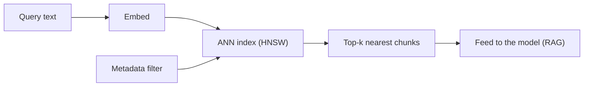

## Learning objectives

- Explain what a **vector database** does that a linear scan cannot.
- Understand approximate indexes (**HNSW**, IVF) at an intuitive level.
- Design good **chunking** and **metadata** strategies.
- Store and query vectors with a real library (Chroma), and know how pgvector/Qdrant/Pinecone compare.

## Prerequisites

[Tokens, Embeddings & Vector Space](/courses/ai-python/tokens-and-embeddings). You should be comfortable with embeddings and cosine similarity.

## The core idea in one line

> A vector database stores embeddings and finds the nearest ones to a query vector **fast** — using an index so it doesn't compare against every stored vector.

**Analogy — a librarian vs reading every book.** A linear scan (last lesson) is reading every book in the library to find the relevant one. A vector database is a librarian who has pre-organized the shelves by topic: you describe what you want and they walk almost straight to it. They might occasionally miss the single best book (approximate), but they return great results in milliseconds instead of hours.

## Why not just loop over vectors?

The brute-force `for each stored vector: cosine(query, v)` is **O(n)** per query. At 10 million chunks and thousands of queries per second, that's hopeless. Vector databases add:

- an **approximate nearest neighbor (ANN) index** for sub-linear search,
- **metadata filtering** ("only docs from 2024, tenant = X"),
- persistence, updates, and scaling you'd otherwise build yourself.



## Indexes, intuitively

- **HNSW (Hierarchical Navigable Small World)** — a multi-layer graph of vectors. Search hops through a sparse top layer to get close, then descends to refine. Great recall/speed; higher memory. The common default.
- **IVF (Inverted File)** — cluster vectors into buckets; search only the nearest few buckets. Lower memory, tunable via `nprobe`.
- The tradeoff is always **recall vs speed vs memory**. "Approximate" means you may occasionally miss the true top result — usually an excellent bargain.

## Chunking — the quality lever nobody thinks about

Retrieval quality is decided *before* you ever query: by how you split documents into chunks.

```python
def chunk(text: str, size: int = 800, overlap: int = 100) -> list[str]:
    """Fixed-size chunks with overlap so ideas spanning a boundary survive."""
    chunks, start = [], 0
    while start < len(text):
        end = start + size
        chunks.append(text[start:end])
        start = end - overlap        # overlap keeps context across cuts
    return chunks
```

Principles:

- **Too big** → one vector blends many ideas; retrieval is vague and you waste context tokens.
- **Too small** → facts get separated from the context that makes them meaningful.
- **Overlap** (~10–20%) prevents a sentence split across a boundary from vanishing.
- **Respect structure** — prefer splitting on paragraphs/headings over blind character counts when you can.

## Metadata — filter before you rank

Store fields alongside each vector so you can pre-filter:

```python
collection.add(
    ids=["doc1-chunk0"],
    embeddings=[vec],
    documents=[chunk_text],
    metadatas=[{"source": "handbook.pdf", "tenant": "acme", "year": 2024}],
)
# Query only Acme's 2024 docs, then rank semantically:
collection.query(query_embeddings=[qvec], n_results=4,
                 where={"tenant": "acme", "year": 2024})
```

Metadata filtering is how you enforce **multi-tenant isolation** ("never return another customer's data") and freshness — a security requirement, not a nicety.

## A working example with Chroma

```python
import chromadb
from openai import OpenAI

oai = OpenAI()
client = chromadb.PersistentClient(path="./vectors")   # local, file-backed
col = client.get_or_create_collection("kb")

def embed(texts: list[str]) -> list[list[float]]:
    r = oai.embeddings.create(model="text-embedding-3-small", input=texts)
    return [d.embedding for d in r.data]

def index(doc_id: str, text: str, meta: dict):
    parts = chunk(text)
    col.add(
        ids=[f"{doc_id}-{i}" for i in range(len(parts))],
        embeddings=embed(parts),
        documents=parts,
        metadatas=[meta] * len(parts),
    )

def retrieve(question: str, k: int = 4) -> list[str]:
    qvec = embed([question])[0]
    res = col.query(query_embeddings=[qvec], n_results=k)
    return res["documents"][0]
```

## Choosing a store

| Store | Runs where | Best for |
|---|---|---|
| **Chroma** | Embedded / local | Prototypes, small apps, notebooks |
| **pgvector** | Inside PostgreSQL | You already run Postgres; SQL + vectors together |
| **Qdrant** | Self-host / cloud | Production ANN with rich filtering |
| **Pinecone** | Managed cloud | Zero-ops scale, don't want to run infra |

> [!TIP]
> If your data already lives in PostgreSQL, start with **pgvector**. One database, transactional consistency, and no new service to operate usually beats a dedicated vector store until scale forces the switch.

## Common mistakes

1. **No overlap** → answers cut off at chunk boundaries.
2. **Chunk size copied from a blog** without testing on *your* documents.
3. **Skipping metadata filters** → cross-tenant leaks and stale results.
4. **Re-embedding with a new model but not re-indexing old vectors** → mixed, incompatible space.
5. **Treating top-k as truth** — retrieval returns *candidates*; the model still needs good instructions (RAG lesson).

## Performance & memory

- HNSW keeps the graph in RAM; budget memory ≈ vectors × dims × 4 bytes × a factor for graph links.
- Batch your `add`/`embed` calls; per-request overhead dominates otherwise.
- Tune `n_results` (k): more candidates = better recall but more tokens fed to the model = higher cost.

## Interview questions

1. **"Why a vector DB instead of a loop?"** — Sub-linear ANN search, metadata filtering, persistence, and scale.
2. **"What is HNSW?"** — A layered proximity graph enabling fast approximate nearest-neighbor search.
3. **"How do you prevent one tenant seeing another's data in RAG?"** — Metadata filtering (`where` clauses) enforced on every query.
4. **"How do you pick chunk size?"** — Empirically, per corpus; balance blended-meaning (too big) vs lost-context (too small), with overlap.

## Summary

- Vector databases add ANN indexes, filtering, and persistence so retrieval is fast at scale.
- HNSW/IVF trade a little recall for a lot of speed.
- Chunking and metadata are where retrieval quality is won or lost.
- Pick the store that fits your ops reality; pgvector is a great default if you run Postgres.

## Exercises

**Easy**

1. Index five short docs in Chroma with metadata and retrieve the top-2 for a query. Print the metadata of each hit.
2. Change `overlap` from 0 to 150 and describe how retrieval on a boundary-spanning fact changes.

**Intermediate**

3. Add a `where` filter so only docs with `year >= 2024` are searched. Verify older docs are excluded.
4. Write `best_chunk_size(docs, queries)` that tries several sizes and reports which retrieves the known-correct chunk most often.

**Advanced / architecture**

5. Design multi-tenant retrieval for a SaaS: how do you guarantee tenant isolation, and where could it fail if a developer forgets a filter? Propose a safeguard at the data-access layer.

**Debugging**

6. Retrieval quality dropped after a deploy. You find new documents were added but with a different embedding model. Explain the symptom and the fix.

**Mini project**

Build a reusable `KnowledgeBase` class: `add_document(path, meta)`, `search(query, k, filters)`, and disk persistence. Support both Chroma and an in-memory linear-scan backend behind the same interface, so tests run without a database.

## Quiz

<details>
<summary>1. What does "approximate" nearest neighbor mean?</summary>
The index may occasionally miss the exact top result in exchange for dramatically faster search — usually a great trade.
</details>

<details>
<summary>2. Why add overlap between chunks?</summary>
So a fact or sentence spanning a chunk boundary isn't split and lost.
</details>

<details>
<summary>3. How do you enforce multi-tenant isolation?</summary>
Store a tenant id in metadata and filter every query by it; enforce it at the data-access layer, not per call site.
</details>

<details>
<summary>4. When is pgvector a strong default?</summary>
When you already run PostgreSQL — you get vectors, SQL, and transactions in one system with no extra service.
</details>

## Further reading

- HNSW paper (Malkov & Yashunin) — skim the diagrams
- Chroma, Qdrant, pgvector docs; Pinecone learning center
- Next lesson: [Retrieval-Augmented Generation](/courses/ai-python/rag-systems)
