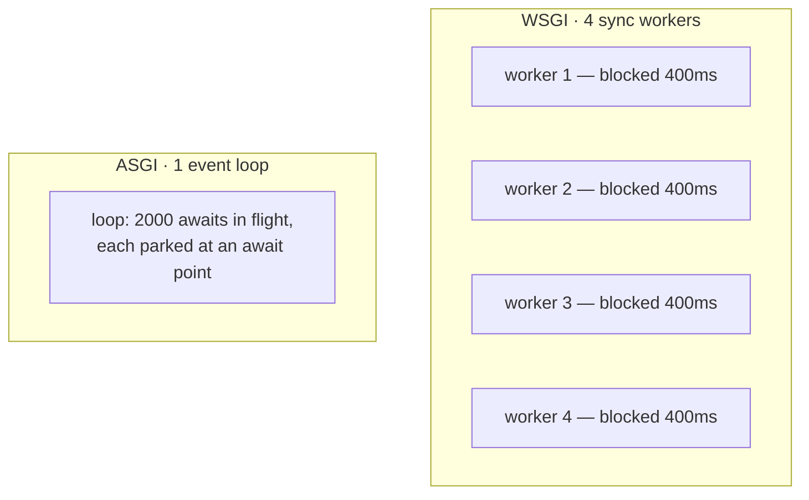

## Learning objectives

- Explain what `async def` actually buys a Django view — and what it doesn't.
- Use the async ORM (`aget`, `acreate`, `async for`) and `sync_to_async`/`async_to_sync` correctly.
- Build websocket features with Channels: consumers, groups, and a channel layer.
- Reason about concurrency, connection pools, and worker sizing under ASGI.
- Decide honestly whether a feature needs async at all.

## Prerequisites

Python [asyncio fundamentals](/courses/python/asyncio-fundamentals), [concurrency and the GIL](/courses/python/concurrency-gil-threads-processes), and the Django [request lifecycle](/courses/django/request-lifecycle).

## What async changes

Under WSGI, one worker handles one request at a time. Capacity = workers × (1 / latency). A view that spends 400 ms waiting on an HTTP call occupies a whole worker doing nothing.

Under ASGI with `async def`, a single process interleaves thousands of *waiting* requests on one event loop. The win is **concurrency for I/O-bound work**, not speed: an individual request is not faster, and CPU-bound work is not helped at all — it blocks the loop for everyone.



Use async when: many concurrent slow I/O calls (fan-out to APIs), long-lived connections (websockets, SSE), or high connection counts with low CPU. Skip it when: your view does one fast query and returns. Half the async Django code in the wild exists for views that would be better as plain sync functions.

## Async views and the ORM

```python
async def dashboard(request):
    # Concurrent fan-out — the whole point of async.
    weather, rates, news = await asyncio.gather(
        fetch_weather(), fetch_rates(), fetch_news()
    )
    # Async ORM: every method has an `a`-prefixed twin.
    profile = await Profile.objects.aget(user=request.user)
    recent = [o async for o in Order.objects.filter(user=request.user)[:10]]
    return JsonResponse({"profile": profile.as_dict(), "orders": len(recent)})
```

The rules that bite:

- **Iterating a queryset needs `async for`.** A plain `for o in qs` inside an async view raises `SynchronousOnlyOperation`.
- **Lazy attribute access is a sync query.** `order.customer.name` on an un-`select_related`ed FK blows up inside async code. Use `select_related`/`prefetch_related` — good practice anyway ([N+1 lesson](/courses/django/queryset-optimization)).
- **`.count()`, `.exists()`, `.first()` → `.acount()`, `.aexists()`, `.afirst()`.**
- **Transactions are still sync.** `async with transaction.atomic()` doesn't exist; wrap the transactional unit in `sync_to_async`.

Crossing the boundary:

```python
from asgiref.sync import sync_to_async, async_to_sync

# sync code called from async. thread_sensitive=True (default) runs it in ONE
# shared thread so the ORM's thread-local connection stays consistent.
result = await sync_to_async(legacy_report)(user_id)

# CPU-safe / connection-free work can go to a real thread pool:
digest = await sync_to_async(hash_big_file, thread_sensitive=False)(path)

# async code called from sync (a management command, a signal handler):
async_to_sync(notify_all)(message)
```

`thread_sensitive=True` is the default for a reason: database connections are thread-local, so parallel threads each open their own connection and can deadlock against each other's transactions. Only set `False` when the callable touches no DB.

The killer mistake is a blocking call with no `await` in front of it:

```python
async def bad(request):
    r = requests.get(url)           # blocks the ENTIRE event loop, all requests
    time.sleep(1)                   # same
    return HttpResponse(r.text)

async def good(request):
    async with httpx.AsyncClient() as client:
        r = await client.get(url)
    await asyncio.sleep(1)
    return HttpResponse(r.text)
```

One blocking call in one view degrades every concurrent request in that process. Under WSGI it would only have slowed itself down — this is the tax async charges for its concurrency.

## Middleware, and the sync/async sandwich

Middleware declares which modes it supports:

```python
class TimingMiddleware:
    async_capable = True
    sync_capable = True

    def __init__(self, get_response):
        self.get_response = get_response
        self.async_mode = iscoroutinefunction(get_response)
        if self.async_mode:
            markcoroutinefunction(self)

    async def __acall__(self, request):
        start = time.perf_counter()
        response = await self.get_response(request)
        response["X-Duration-Ms"] = f"{(time.perf_counter()-start)*1000:.1f}"
        return response

    def __call__(self, request):
        if self.async_mode:
            return self.__acall__(request)
        start = time.perf_counter()
        response = self.get_response(request)
        response["X-Duration-Ms"] = f"{(time.perf_counter()-start)*1000:.1f}"
        return response
```

If any middleware is sync-only, Django inserts thread adapters around it — and an async view behind a sync middleware ends up hopping threads on every request. Audit the stack: **one sync-only middleware can erase the benefit of every async view below it.**

## Channels: websockets

Django alone can't hold a websocket. Channels adds a protocol router and a consumer abstraction on top of ASGI.

```python
# asgi.py
application = ProtocolTypeRouter({
    "http": get_asgi_application(),
    "websocket": AuthMiddlewareStack(URLRouter([
        path("ws/rooms/<str:room>/", ChatConsumer.as_asgi()),
    ])),
})
```

```python
class ChatConsumer(AsyncJsonWebsocketConsumer):
    async def connect(self):
        self.room = self.scope["url_route"]["kwargs"]["room"]
        self.group = f"room_{self.room}"
        user = self.scope["user"]                 # from AuthMiddlewareStack

        if not user.is_authenticated or not await self.can_join(user, self.room):
            await self.close(code=4403)           # authorize BEFORE accepting
            return

        await self.channel_layer.group_add(self.group, self.channel_name)
        await self.accept()

    async def disconnect(self, code):
        await self.channel_layer.group_discard(self.group, self.channel_name)

    async def receive_json(self, content):
        text = (content.get("text") or "").strip()[:2000]
        if not text:
            return
        msg = await self.save_message(self.scope["user"], self.room, text)
        # Fan out to everyone in the group — including other server processes.
        await self.channel_layer.group_send(self.group, {
            "type": "chat.message",               # → routes to chat_message()
            "id": msg.id, "text": text, "author": self.scope["user"].username,
        })

    async def chat_message(self, event):
        await self.send_json({k: event[k] for k in ("id", "text", "author")})

    @database_sync_to_async
    def save_message(self, user, room, text):
        return Message.objects.create(author=user, room_id=room, body=text)

    @database_sync_to_async
    def can_join(self, user, room):
        return Membership.objects.filter(user=user, room_id=room).exists()
```

Key mechanics:

- **`type: "chat.message"` dispatches to the method `chat_message`.** Dots become underscores. A typo here fails silently — the message is dropped.
- **`database_sync_to_async`** is `sync_to_async` that also closes stale DB connections afterwards. Always use it, not the plain version, for ORM work in consumers.
- **The channel layer** (Redis in production) is what lets process A's `group_send` reach a socket held by process B. Without it, groups only work within one process — which looks fine on one dev machine and breaks the moment you scale to two.
- **Authorize in `connect` before `accept()`.** Accepting first and checking later means an unauthorized client has already established a connection.

```python
CHANNEL_LAYERS = {"default": {
    "BACKEND": "channels_redis.core.RedisChannelLayer",
    "CONFIG": {"hosts": [("redis", 6379)], "capacity": 1500, "expiry": 10},
}}
```

Sending to a websocket from ordinary sync code (a view, a signal, a Celery task):

```python
async_to_sync(get_channel_layer().group_send)(
    f"room_{room_id}", {"type": "chat.message", "text": "Server restarting", ...})
```

## Common mistakes

1. **Blocking calls in async views** — `requests`, `time.sleep`, heavy CPU, `psycopg2` sync calls. Stalls the whole loop.
2. **Sync ORM in async context** — `SynchronousOnlyOperation`, or worse, an implicit lazy FK load you didn't notice.
3. **`sync_to_async(..., thread_sensitive=False)` around ORM code** — connection-per-thread explosion and cross-thread transaction deadlocks.
4. **A sync-only middleware above async views** — thread hopping on every request; benefits gone.
5. **No channel layer, or in-memory layer in production** — groups silently only work per-process.
6. **`accept()` before authorization** in consumers.
7. **Unbounded groups** — a group per user × 100k users in Redis, never discarded, quietly filling memory.
8. **Assuming async makes it faster** — a single fast query view gains nothing and costs debuggability.

## Best practices

- Default to sync Django. Adopt async per-feature, where fan-out or long-lived connections justify it.
- Never mix: keep an async view fully async (`httpx`, `aget`, `async for`) rather than sprinkling `sync_to_async`.
- Use `select_related`/`prefetch_related` aggressively in async code — lazy loads are exceptions there, not just slowness.
- Wrap all consumer ORM access in `database_sync_to_async`.
- Cap message sizes and rate-limit `receive_json`; a websocket is an open door for abuse.
- Send an application-level heartbeat every ~30 s so proxies don't reap idle connections.
- Test consumers with `WebsocketCommunicator` — no browser required.

## Performance & memory notes

- Each ASGI process is one event loop on one core. Run `workers = cores` behind Uvicorn/Gunicorn's `UvicornWorker`; async does not free you from process-per-core.
- **Database connections are the real ceiling.** 4 processes × 2 000 concurrent async requests still contend for a Postgres pool of ~100. Use PgBouncer in transaction mode, and set `CONN_MAX_AGE` deliberately.
- Every open websocket holds memory in the process (buffers, scope, consumer instance) plus an entry in the channel layer — budget roughly 20–50 KB per connection and load-test to your target.
- `asyncio.gather` is where async pays: three 200 ms calls take 200 ms instead of 600.
- CPU work belongs off the loop — `sync_to_async(..., thread_sensitive=False)`, a process pool, or Celery.
- Profile with `PYTHONASYNCIODEBUG=1` in dev; it warns about coroutines that block the loop too long.

## Production tips

- Terminate websockets at a proxy that supports them (Nginx with `proxy_http_version 1.1` and the `Upgrade` headers; ALB with stickiness) and raise `proxy_read_timeout` well above your heartbeat interval.
- Deploys drop every websocket. Implement client-side reconnect with exponential backoff and jitter, and make consumers resume from a message id rather than replaying everything.
- Redis for the channel layer should be a **separate instance** from your cache — a cache eviction storm must not drop live messages.
- Monitor: open connection count, channel layer queue depth, `group_send` latency, and event loop lag. Loop lag climbing is the early warning that something is blocking.
- Keep the health check on a sync path so a blocked loop actually fails the check.

## Interview questions

1. **"What does async actually improve in Django?"** — Concurrency for I/O-bound work on one thread; not per-request latency, not CPU throughput.
2. **"What happens if you call `requests.get` in an async view?"** — It blocks the event loop, stalling every other concurrent request in that process. Under WSGI it would only have slowed itself.
3. **"Why `thread_sensitive=True` by default?"** — DB connections are thread-local; running sync ORM code in arbitrary threads creates connection sprawl and cross-thread transaction deadlocks.
4. **"How does a message reach a websocket held by another server process?"** — Through the channel layer (Redis): `group_send` publishes, every process subscribed to that group delivers to its local sockets.
5. **"Your async app is slower than the sync one. Debug it."** — Look for blocking calls, a sync-only middleware forcing thread hops, lazy ORM access wrapped in `sync_to_async`, and DB pool saturation.

## Summary

- Async buys I/O concurrency, not speed; one blocking call poisons the whole loop.
- The async ORM mirrors the sync one with `a`-prefixed methods and `async for`; transactions stay sync.
- `sync_to_async`/`async_to_sync` bridge the worlds; `thread_sensitive` protects the ORM.
- Channels adds consumers, groups, and a Redis channel layer for real-time features across processes.
- Connections and the channel layer — not Python — are the scaling limits.

## Exercises

**Easy**

1. Convert a view that makes three sequential `httpx` calls into one `asyncio.gather` and measure the latency change.
2. Rewrite a sync view using `aget`, `acount`, and `async for`, and make it fail once by leaving one sync call in — read the traceback.

**Medium**

3. Write async middleware supporting both modes that adds `X-Request-Id` and logs duration. Verify it works with both sync and async views.
4. Build a `ChatConsumer` with join authorization, a 2 000-character cap, and a per-connection rate limit of 5 messages/second. Test it with `WebsocketCommunicator`.

**Hard**

5. Build live order tracking: a Celery task updates an order's status, publishes to a Channels group, and connected browsers update without polling. Handle reconnect-with-resume (client sends `last_seen_id`), deploy restarts, and two server processes sharing one Redis channel layer. Load-test to 1 000 concurrent sockets and report memory per connection.

**Debugging exercise**

6. This consumer works for one user and drops messages under load. Find three bugs:

```python
class Consumer(AsyncWebsocketConsumer):
    async def connect(self):
        await self.accept()
        self.user = self.scope["user"]
        await self.channel_layer.group_add("room", self.channel_name)

    async def receive(self, text_data):
        msg = Message.objects.create(body=text_data, author=self.user)
        await self.channel_layer.group_send("room",
            {"type": "message", "body": text_data})

    async def new_message(self, event):
        await self.send(event["body"])
```

**Refactoring exercise**

7. An async view calls `sync_to_async` six times around individual ORM calls. Convert it to native async ORM methods with proper `select_related`, and compare query counts and latency.

**Mini project**

Build a collaborative to-do board: websocket-backed live updates, presence ("3 people viewing"), optimistic UI with server reconciliation, per-room authorization, Redis channel layer, reconnect-with-resume, and a load test proving 500 concurrent connections on one process. Document the memory and connection budget you measured.

## Quiz

<details>
<summary>1. Why does <code>for o in queryset</code> fail inside an async view?</summary>
Iteration executes the query synchronously; Django raises <code>SynchronousOnlyOperation</code> to stop you blocking the loop. Use <code>async for</code>.
</details>

<details>
<summary>2. What does <code>thread_sensitive=True</code> guarantee?</summary>
The wrapped sync code runs in a single shared thread, so thread-local database connections and transactions stay consistent across calls.
</details>

<details>
<summary>3. How does <code>type: "chat.message"</code> reach your code?</summary>
Channels dots-to-underscores the type and calls <code>chat_message(self, event)</code> on the consumer. No matching method means the event is silently dropped.
</details>

<details>
<summary>4. Why is an in-memory channel layer wrong in production?</summary>
Groups exist only inside one process, so a <code>group_send</code> from process A never reaches sockets held by process B. Works on one dev machine, breaks on two workers.
</details>

<details>
<summary>5. Does an async view remove the database connection limit?</summary>
No — it's usually the binding constraint. Thousands of concurrent coroutines still queue for a pool of ~100 Postgres connections; you need PgBouncer or lower concurrency.
</details>

## Further reading

- Django docs — "Asynchronous support", "Async views", "Async ORM"
- Channels documentation — consumers, channel layers, testing
- `asgiref` source: `sync.py` (`SyncToAsync`, `AsyncToSync`) — short and clarifying
