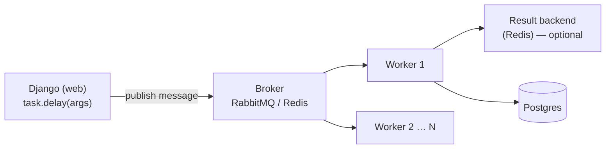
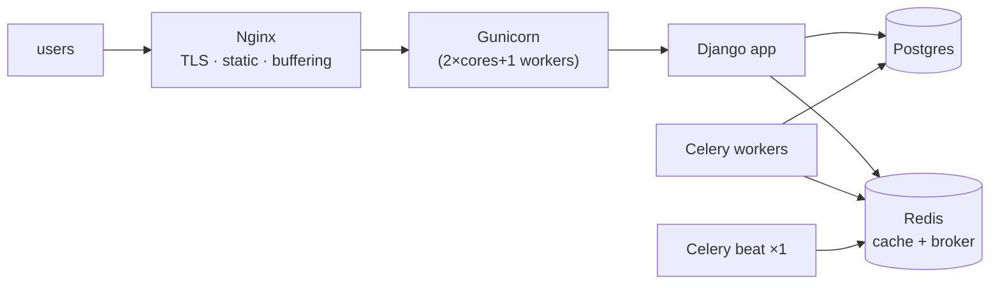

## Learning objectives

- Choose what to cache, at which layer, with which invalidation strategy — and know why invalidation is the hard part.
- Configure Redis-backed caching in Django and use the per-view, template, and low-level APIs.
- Explain Celery's architecture (broker, workers, backend) and write production-grade tasks: idempotent, retried, timed out.
- Deploy Django with Docker + Gunicorn + Nginx and a checklist you can defend in review.
- Reason about horizontal scaling: what scales trivially, what doesn't, and why statelessness is the price.

## Prerequisites

The whole Django track so far — this lesson operationalizes it. [Concurrency](/courses/python/concurrency-gil-threads-processes) helps for the worker-sizing discussion.

## Caching: buying speed with staleness

Every cache trades **freshness for speed** — the design question is never "should I cache" but "how stale is acceptable, and how will I invalidate". Django's layered options, outermost first:

| Layer | Tool | Granularity | Typical win |
|---|---|---|---|
| CDN / proxy | Cache-Control headers | whole response | static & anonymous pages |
| Per-view | `@cache_page(60)` | whole view response | expensive read-mostly pages |
| Template fragment | `` | HTML chunk | mixed pages, per-user bits |
| Low-level | `cache.get/set/delete` | anything | query results, computations |
| Session/backend | cache-backed sessions | infra | one query per request removed |

Setup — Redis is the standard backend (shared across processes/hosts, TTLs, atomic ops):

```python
CACHES = {
    "default": {
        "BACKEND": "django.core.cache.backends.redis.RedisCache",
        "LOCATION": env("REDIS_URL"),
        "KEY_PREFIX": "myapp:v1",       # namespacing + bulk-invalidation lever
    }
}
```

The low-level pattern you'll write most — **cache-aside**:

```python
def product_stats(product_id: int) -> dict:
    key = f"product:stats:{product_id}"
    stats = cache.get(key)
    if stats is None:                       # miss
        stats = expensive_aggregate(product_id)
        cache.set(key, stats, timeout=300)  # ALWAYS set a TTL
    return stats
```

**Invalidation strategies**, in order of preference:

1. **TTL-only** — simplest and most robust; correct wherever bounded staleness is fine (dashboards, counts). Short TTLs (30–300s) absorb enormous load: 100 req/s on a 60s TTL = 1 recompute per minute.
2. **Event-based delete** — on write, `cache.delete(key)` (in the service function that mutates — one choke point; `transaction.on_commit` so you don't invalidate for rolled-back writes). Precise, but every new write path must remember it — this is where bugs live.
3. **Key versioning** — include a version/updated_at in the key (`f"product:{id}:{obj.updated_at}"`); writes naturally miss old keys; old entries expire by TTL. Elegant when reads can fetch the version cheaply.

Two classic failure modes to name-drop *and* handle: **stampede** (hot key expires → 500 concurrent recomputes; mitigate with short lock keys — `cache.add` as a mutex — or staggered/jittered TTLs) and **cache-down behavior** (your app must degrade to slow, not to down: wrap cache calls, fail open).

## Celery: work that doesn't belong in a request

The request cycle has a budget (~hundreds of ms). Email, PDF generation, image processing, webhooks, report aggregation, third-party API syncs — all violate it. Celery moves them out:



`delay()` serializes the call (JSON) into the **broker** queue and returns in microseconds; separate **worker** processes consume, execute, and optionally store results. Web and workers share the codebase but scale independently.

```python
@shared_task(
    bind=True,
    autoretry_for=(RequestException, OperationalError),
    retry_backoff=True, retry_backoff_max=600, retry_jitter=True,
    max_retries=5,
    acks_late=True,
    time_limit=120, soft_time_limit=100,
)
def sync_invoice(self, invoice_id: int):
    invoice = Invoice.objects.get(pk=invoice_id)      # fetch fresh — see below
    if invoice.synced_at:                             # idempotency guard
        return "already-synced"
    resp = billing_api.push(invoice.as_payload())
    invoice.mark_synced(resp["external_id"])
```

Every decision in that decorator is a production lesson:

- **Pass ids, not objects.** Arguments are serialized; ORM instances don't belong on the wire, and by execution time the row may have changed — re-fetch inside the task.
- **Idempotent by design.** Retries, `acks_late` redelivery, and duplicate publishes all mean **at-least-once** execution. A task run twice must be harmless (guards, upserts, unique constraints, idempotency keys). This is the single most important Celery habit.
- **Retries with exponential backoff + jitter** for *transient* errors only — retrying a `ValidationError` five times is noise.
- **Time limits always** — a hung task otherwise occupies a worker forever.
- **Queue from `transaction.on_commit`** — else the worker can run before the row it needs commits (the classic "DoesNotExist in tasks" mystery):

```python
transaction.on_commit(lambda: sync_invoice.delay(invoice.pk))
```

**Celery beat** adds cron-style scheduling (nightly reports, cleanup) — run exactly one beat process. Route heavy/slow tasks to dedicated queues (`task_routes`) so quick tasks aren't stuck behind hour-long exports; size worker pools per queue. Monitor with Flower/queue-depth metrics — **queue depth growing = your #1 paging signal** that consumers can't keep up.

## Deployment: the reference topology



A production-shaped Dockerfile:

```dockerfile
FROM python:3.13-slim AS base
ENV PYTHONDONTWRITEBYTECODE=1 PYTHONUNBUFFERED=1
WORKDIR /app
COPY requirements.txt .
RUN pip install --no-cache-dir -r requirements.txt
COPY . .
RUN python manage.py collectstatic --noinput
RUN useradd -m appuser
USER appuser
CMD ["gunicorn", "config.wsgi:application",
     "--bind", "0.0.0.0:8000", "--workers", "5",
     "--timeout", "60", "--max-requests", "1000", "--max-requests-jitter", "100"]
```

The deploy checklist you should be able to recite: `DEBUG=False`; secrets from env; `ALLOWED_HOSTS` exact; `check --deploy` green ([security lesson](/courses/django/auth-and-security)); migrations applied before new code serves ([migration safety](/courses/django/models-and-the-orm)); static via `collectstatic` + WhiteNoise or Nginx/CDN; media on object storage (containers are ephemeral); health endpoint checking DB+cache; logs as JSON to stdout ([observability](/courses/python/errors-logging-and-observability)); error tracker wired; `CONN_MAX_AGE`/pgbouncer for connections.

**Scaling order of operations:** measure → cache → fix queries ([N+1, indexes](/courses/django/queryset-optimization)) → more Gunicorn workers → more app hosts behind the LB (requires statelessness: sessions in Redis, media in S3 — anything on local disk breaks at 2 hosts) → read replicas → then the exotic stuff. The database is almost always the real bottleneck; app tiers scale horizontally almost for free once stateless.

## Common mistakes

1. **Caching without TTLs** ("we delete on write" — until one write path forgets) — TTL is your safety net; set it everywhere.
2. **Caching per-user data under a shared key** (or `cache_page` on personalized views) — users see each other's data; include the varying dimensions in the key.
3. **Non-idempotent tasks** + retries = double emails, double charges.
4. **`.delay()` inside a transaction** without `on_commit` — worker races the commit.
5. **One queue for everything** — a burst of slow exports starves password-reset emails.
6. **Unbounded task payloads** (passing querysets/DataFrames) — serialize ids and re-derive.
7. **Running `runserver`/`DEBUG=True`/root user/`--workers 1` in production** — the four horsemen of the first outage.
8. **Local-disk state** (media uploads, file-based sessions) discovered at the moment of adding server #2.

## Best practices

- Name cache keys with a schema and prefix version (`app:v2:product:42:stats`) — grep-able, bulk-bustable.
- Wrap cache and broker calls with fail-open behavior + metrics: cache hit rate and queue depth on the main dashboard.
- Tasks: small args, re-fetch state, guard idempotency, explicit `queue=`, backoff+jitter, time limits — make it a copy-paste template in the repo.
- Deploys: run migrations as a release step, keep each migration backward-compatible one version, health-check-gated rollout, rollback rehearsed.
- Load-test before launch (locust/k6) — capacity arithmetic beats optimism.

## Performance & memory notes

- Redis round-trip ~0.2–1ms vs a warm Postgres aggregate at 10–500ms — cache hits are 1–3 orders of magnitude cheaper; but a cache *miss* now costs both systems. Watch hit rate, not just latency.
- Serialization dominates for big cached blobs (pickle/JSON of 1MB structures) — cache the smallest useful shape (rendered fragment or final dict, not the ORM soup).
- Gunicorn workers are full interpreter copies (~100–300MB each with a loaded Django app) — `2×cores+1` is a starting point bounded by RAM; `--max-requests` recycles leakers.
- Celery prefetch (`worker_prefetch_multiplier`) trades throughput vs fairness for long tasks — set to 1 for slow-task queues.

## Production tips

- Cache stampede on deploy: a cold cache + full traffic can take down the DB — warm critical keys post-deploy or ramp traffic.
- Version your task signatures: workers and web deploy at different moments; renaming a task or reordering args mid-deploy strands queued messages. Additive changes + tolerant kwargs.
- Dead-letter handling: after `max_retries`, tasks should land somewhere visible (error tracker + a table/queue you review), not vanish.
- Backups are a *restore* capability, not a cron job — test restores quarterly; keep at least one off-provider copy.

## Interview questions

1. **"Walk me through caching a slow dashboard."** — Identify staleness budget → layer choice → cache-aside with TTL + event invalidation via on_commit → stampede mitigation → hit-rate monitoring.
2. **"Why is cache invalidation famously hard?"** — Every write path must know every derived key; races between write and delete; the TTL safety-net + key-versioning strategies.
3. **"Explain Celery's architecture and delivery guarantees."** — Broker/worker/backend; at-least-once (retries, acks_late) ⇒ idempotency mandatory; ordering not guaranteed.
4. **"Your queue depth is growing — diagnosis?"** — Producer/consumer rate mismatch: slow task profile, worker count/pool, a poison message retrying forever, or a downstream dependency degraded; metrics per queue.
5. **"What breaks when you go from 1 to 3 app servers?"** — Local state: file sessions, media, in-process caches, cron duplication (beat!), sticky assumptions; the statelessness checklist.

## Summary

- Cache-aside + TTL is the workhorse; invalidation strategy is chosen per staleness budget; stampedes and cache-down are design cases, not surprises.
- Celery = broker + workers + at-least-once ⇒ idempotent, id-passing, retried, time-limited tasks queued after commit, on purpose-specific queues.
- The reference deploy (Nginx → Gunicorn → Django, Redis, Postgres, workers, one beat) plus the recitable checklist covers 90% of real Django operations; statelessness is the toll for horizontal scale.

## Exercises

**Easy**

1. Cache an expensive aggregate with cache-aside + 120s TTL; log hits/misses; measure before/after latency.
2. Convert a synchronous "send welcome email" view step into a Celery task queued via `on_commit`; prove the race exists without it (sleep before commit).

**Medium**

3. Implement event-based invalidation for product stats: delete keys from the single service function that mutates products, under `transaction.on_commit`; write a test that a stale read never survives a write by more than the TTL.
4. Add a second Celery queue `heavy`, route an export task to it, run two workers with different concurrency, and demonstrate quick tasks unaffected by a flood of exports.

**Hard**

5. Build stampede protection: wrap cache-aside with a `cache.add`-based lock and a stale-while-revalidate fallback (serve expired value while one worker recomputes). Load-test with threads to show one recompute per expiry.

**Debugging exercise**

6. Users occasionally get four identical receipts, and some receipts reference orders that "don't exist". Explain both from this code and fix:

```python
def checkout(request):
    with transaction.atomic():
        order = create_order(request)
        send_receipt.delay(order.id)      # inside the transaction
    ...

@shared_task(autoretry_for=(Exception,), max_retries=3)
def send_receipt(order_id):
    order = Order.objects.get(pk=order_id)
    email.send(order.user.email, render(order))   # no idempotency guard
```

**Refactoring exercise**

7. A views.py performs report generation inline (30s requests, users refresh and pile on). Refactor: enqueue task → return job id → status endpoint → download from object storage when ready; add idempotency so refresh-spam creates one job.

**Mini project**

Ship a small "link shortener + analytics" service production-style: Docker Compose with nginx/gunicorn/django/postgres/redis/worker/beat; redirects cached in Redis (versioned keys, TTL); click events pushed to a Celery task batching inserts; a beat job aggregating daily stats; health endpoint; JSON logs; a locustfile proving cached redirects survive 50× the uncached load.

## Quiz

<details>
<summary>1. Why must the TTL stay even when you delete keys on every write?</summary>
Defense in depth: a forgotten write path, a race between write and delete, or a failed delete otherwise leaves stale data cached forever. TTL bounds the blast radius.
</details>

<details>
<summary>2. What does at-least-once delivery force on task design?</summary>
Idempotency — retries, redelivery after worker crash (acks_late), and duplicate publishes mean any task can run twice; running twice must be safe.
</details>

<details>
<summary>3. Why pass <code>order.id</code> rather than <code>order</code> to a task?</summary>
Arguments are serialized to the broker: objects bloat/fail serialization, and the snapshot goes stale — the worker must re-fetch current state anyway.
</details>

<details>
<summary>4. Name the pieces that must move off local disk before adding a second app server.</summary>
Sessions (→ Redis/DB), media uploads (→ object storage), any file-based caches/locks; plus ensure exactly one beat scheduler across the fleet.
</details>

<details>
<summary>5. A hot cached key expires under 1000 req/s. What happens naively, and one mitigation?</summary>
A stampede — hundreds of concurrent recomputes hammer the DB. Mitigate with a lock key (single recomputer, others serve stale/wait) or jittered TTLs.
</details>

## Further reading

- Django docs — Cache framework; Celery docs — "Tasks" and "Monitoring" chapters (the Tasks page is required reading)
- Gunicorn design/settings docs; WhiteNoise docs
- "Architecture of Open Source Applications" — nginx chapter, for how your front proxy actually works
