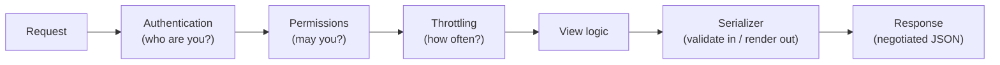

## Learning objectives

- Explain what DRF adds on top of Django views and when it earns its abstraction cost.
- Build serializers that validate, transform, and control exposure precisely.
- Use ViewSets + routers idiomatically, and drop down to APIView/generics when clearer.
- Wire pagination, filtering, throttling, JWT auth, and schema docs into a production API layer.
- Avoid the classic DRF performance traps (serializer N+1, unpaginated lists).

## Prerequisites

[Models and the ORM](/courses/django/models-and-the-orm) and [QuerySet Optimization](/courses/django/queryset-optimization). JWT theory in depth lives in the [FastAPI auth lesson](/courses/fastapi/auth-jwt-oauth2); here we apply it.

## What DRF actually provides

You can build JSON APIs with plain Django (`JsonResponse`, `json.loads`). DRF exists because every real API needs the same eight things, and hand-rolling them per-view breeds inconsistency: parsing/negotiation, **validation with field errors**, serialization of model graphs, auth schemes, permission checks, throttling, pagination, and self-describing schema. DRF's pipeline:



## Serializers: the API contract layer

A serializer is Pydantic's cousin ([comparison](/courses/fastapi/pydantic-deep-dive)): it declares the wire shape, validates inbound data, and renders outbound objects.

```python
class OrderSerializer(serializers.ModelSerializer):
    user_email = serializers.EmailField(source="user.email", read_only=True)
    total = serializers.DecimalField(max_digits=10, decimal_places=2,
                                     min_value=0)

    class Meta:
        model = Order
        fields = ["id", "status", "total", "user_email", "created_at"]
        read_only_fields = ["id", "status", "created_at"]

    def validate_total(self, value):                  # field-level hook
        if value > 10_000:
            raise serializers.ValidationError("exceeds order limit")
        return value

    def validate(self, attrs):                        # object-level hook
        ...
        return attrs
```

The flow you must know cold:

```python
ser = OrderSerializer(data=request.data)      # inbound
ser.is_valid(raise_exception=True)            # → 400 with per-field errors
order = ser.save()                            # create() or update()

ser = OrderSerializer(qs, many=True)          # outbound
ser.data                                      # list of dicts
```

Judgment calls that define good APIs:

- **`fields` is an allowlist — never `"__all__"`** on models with sensitive columns; new model fields must not leak into the API by default.
- **Explicit `read_only_fields`** for server-controlled state (status, timestamps, owner) — otherwise clients can PATCH themselves to `status="paid"`. This is a real, common vulnerability class (mass assignment).
- Nested serializers render related data; *writing* nested graphs is where serializers get hard — override `create()` and be explicit, or flatten the API (accept `line_items: [...]` and build children yourself in a transaction).
- The serializer is a **boundary contract**, deliberately decoupled from the model: you can rename fields (`source=`), compute (`SerializerMethodField` — sparingly, it's a Python call per object per field), and version by having `OrderSerializerV2`.

## Views: the spectrum

DRF offers four altitudes; fluency means choosing, not defaulting:

| Level | What you write | When |
|---|---|---|
| `APIView` | `get`/`post` methods by hand | odd endpoints: actions, webhooks, reports |
| Generics (`ListCreateAPIView`, …) | queryset + serializer_class | single-purpose CRUD endpoints |
| `ModelViewSet` | one class, router makes 6 routes | standard resource CRUD |
| `@action` on viewsets | extra RPC-ish routes (`POST /orders/{id}/cancel/`) | domain operations on a resource |

```python
class OrderViewSet(viewsets.ModelViewSet):
    serializer_class = OrderSerializer
    permission_classes = [IsAuthenticated]

    def get_queryset(self):                      # ← row-level scoping lives HERE
        return (Order.objects
                .filter(user=self.request.user)  # never trust client filters for this
                .select_related("user"))         # serializer N+1 prevention

    def perform_create(self, serializer):
        serializer.save(user=self.request.user)  # owner from auth, not payload

    @action(detail=True, methods=["post"])
    def cancel(self, request, pk=None):
        order = self.get_object()                # runs permission object-checks
        services.cancel_order(order)             # domain logic stays out of the view
        return Response(OrderSerializer(order).data)

router = DefaultRouter()
router.register("orders", OrderViewSet, basename="orders")
urlpatterns = [path("api/v1/", include(router.urls))]
```

Three habits in that snippet are the production core: **scoping in `get_queryset`** (tenancy/ownership enforced server-side on every route the viewset generates), **owner injection in `perform_create`**, and **eager-loading matched to the serializer's fields** — the serializer touching `order.user.email` without `select_related` is the N+1 problem wearing a REST costume.

## Auth, permissions, throttling

**Authentication** answers "who": `SessionAuthentication` (browser clients, needs CSRF), `TokenAuthentication` (simple static tokens), and for SPAs/mobile the de-facto standard **JWT via `djangorestframework-simplejwt`**:

```python
REST_FRAMEWORK = {
    "DEFAULT_AUTHENTICATION_CLASSES": [
        "rest_framework_simplejwt.authentication.JWTAuthentication",
    ],
    "DEFAULT_PERMISSION_CLASSES": ["rest_framework.permissions.IsAuthenticated"],
    "DEFAULT_THROTTLE_RATES": {"user": "1000/hour", "anon": "60/hour"},
}
# urls: TokenObtainPairView (login → access+refresh), TokenRefreshView
```

Access tokens short-lived (minutes), refresh tokens longer + rotated; the deep mechanics (claims, signatures, revocation tradeoffs) are covered in the [JWT lesson](/courses/fastapi/auth-jwt-oauth2) and apply verbatim.

**Permissions** answer "may you": global default `IsAuthenticated` (allowlist thinking — public endpoints opt *out* via `AllowAny`), plus object-level custom classes:

```python
class IsOwner(BasePermission):
    def has_object_permission(self, request, view, obj):
        return obj.user_id == request.user.id
```

Note the layering: `get_queryset` scoping already 404s foreign objects (good — doesn't leak existence); object permissions add explicit 403 semantics where you want them. **Throttling** answers "how often" — cache-backed rate limits per scope; essential on auth endpoints (credential stuffing) and expensive reports.

## Pagination, filtering, schema

- **Paginate by default, globally** (`DEFAULT_PAGINATION_CLASS`, `PAGE_SIZE`) — an unpaginated list endpoint is a time bomb that detonates when the table grows. `PageNumberPagination` for admin UIs; `CursorPagination` (keyset — [why](/courses/django/queryset-optimization)) for feeds and big tables.
- **Filtering**: `django-filter` integration gives declarative, validated query params (`?status=paid&created_after=...`); `SearchFilter`/`OrderingFilter` cover search and sort — with `ordering_fields` explicitly allowlisted (never let clients order by arbitrary columns; unindexed sorts are a DoS vector).
- **Schema**: `drf-spectacular` generates OpenAPI from your serializers/viewsets → Swagger UI/Redoc. The schema is only as honest as your typing — annotate `SerializerMethodField`s and custom actions. Contract-first clients, generated SDKs, and reviewable API diffs all fall out of this.

## Common mistakes

1. **`fields = "__all__"`** / missing `read_only_fields` → data leaks and mass-assignment writes.
2. **Serializer N+1** — nested serializers/`source="user.email"` without matching `select_related`/`prefetch_related`; test with `assertNumQueries`.
3. **Filtering ownership client-side** (`?user=me` respected from payload) instead of `get_queryset` scoping — an IDOR vulnerability, the most common real API security bug.
4. **Business logic in serializers `create()`** growing into a god-layer — serializers validate and shape; processes belong in services.
5. **Returning different shapes ad hoc** (dicts here, serializers there) — clients break; one serializer per resource per version.
6. **No throttle on login/refresh**, no pagination on lists, unbounded `ordering` — the three classic self-DoS configs.
7. **SerializerMethodField doing queries** — a query per object per field; precompute with `annotate` and read the annotation.

## Best practices

- Version from day one (`/api/v1/`); additive changes are free, breaking changes get a new version.
- Serializers per purpose when shapes diverge: `OrderListSerializer` (flat, cheap) vs `OrderDetailSerializer` (nested) — wired via `get_serializer_class()`.
- Standardize error shape (DRF's default `{"field": ["msg"]}` is fine — just keep it consistent, including custom exceptions via a custom `EXCEPTION_HANDLER`).
- Tests at the API boundary with `APIClient`: auth matrix (anon/user/owner/admin × endpoints), validation errors, and query-count budgets for list endpoints.
- Treat the OpenAPI schema as a reviewed artifact — schema diff in CI catches accidental contract changes.

## Performance & memory notes

- DRF's serialization is Python-level per-field work — for hot, huge list endpoints the serializer can dominate CPU. Escalation path: trim fields → `values()` + plain `Response` for read-only hotspots → cache the rendered payload ([caching lesson](/courses/django/caching-celery-and-deployment)).
- `many=True` serialization materializes the whole page — keep page sizes sane (≤100).
- Every `SerializerMethodField` is a Python call × rows; every un-annotated computed field a temptation to query.
- Auth classes run per request — JWT verification is cheap (one signature), DB-token schemes cost a query; session auth costs session load.

## Production tips

- CORS via `django-cors-headers` with an explicit origin allowlist (wildcards + credentials don't mix).
- Log request-id + user-id in API logs; return the request-id in error bodies so client reports are correlatable ([observability lesson](/courses/python/errors-logging-and-observability)).
- Rotate JWT signing keys with `kid` headers planned from the start; keep access tokens ≤15min so rotation and revocation stay tractable.
- Contract clients: publish the OpenAPI schema per release; generated TS/Python clients kill an entire class of integration bugs.

## Interview questions

1. **"What does DRF give you over plain Django views?"** — The eight concerns (auth→permissions→throttle→validate→serialize→paginate→negotiate→document) as a consistent, configurable pipeline.
2. **"Serializer vs Form?"** — Same validation lineage; serializers are content-type-agnostic, bidirectional (render + parse), and API-shaped; forms are HTML-shaped.
3. **"How do you prevent users seeing others' data?"** — `get_queryset` scoping (server-side, all routes) + object permissions; never client-supplied filters; explain IDOR.
4. **"ViewSet vs APIView — tradeoffs?"** — Convention + router-generated routes + shared hooks vs explicit control; drop altitude when overriding fights the abstraction.
5. **"Your list endpoint is slow — walk through diagnosis."** — Query count (serializer N+1) → eager-load to match serializer → page size → serializer CPU → values()/cache; measure at each step.

## Summary

- DRF standardizes the API pipeline; your job is the contract (serializers), the scoping (`get_queryset`), and the domain calls (services).
- Serializers: explicit fields, read-only server state, purpose-specific variants, eager-loading matched to shape.
- Security defaults: authenticated-by-default, ownership scoped server-side, throttled auth endpoints, allowlisted ordering/filtering.
- Paginate everything, version from day one, generate and review the schema.

## Exercises

**Easy**

1. Build `BookViewSet` (CRUD) with an explicit-fields serializer, router registration, and `IsAuthenticated`; verify all six generated routes with `APIClient`.
2. Add validation: `published_year` not in the future (field-level) and `title` unique per author (object-level, plus the matching DB constraint).

**Medium**

3. Add list/detail serializer split (`get_serializer_class`), `django-filter` filters (status, year range), `CursorPagination`, and an `assertNumQueries` budget test for the list route.
4. Implement `IsOwnerOrReadOnly` and an `@action` `POST /books/{id}/archive/` calling a service function; test the full auth matrix (anon 401, non-owner 403/404, owner 200).

**Hard**

5. Add JWT auth (simplejwt) with rotated refresh tokens, a throttle scope on the token endpoints, and a test that an expired access token 401s while refresh still works; then wire `drf-spectacular` and assert the schema contains your action endpoint.

**Debugging exercise**

6. This endpoint leaks and crawls. Enumerate the four distinct problems:

```python
class UserViewSet(viewsets.ModelViewSet):
    queryset = User.objects.all()                 # every user visible to anyone
    serializer_class = UserSerializer             # Meta.fields = "__all__" (password hash!)
    permission_classes = [AllowAny]
    # serializer has orders = OrderSerializer(many=True) → N+1, unpaginated
```

**Refactoring exercise**

7. Refactor a 120-line `APIView.post` that validates a nested order payload by hand (dict checks), creates models, and formats the response manually — into serializer-validated, service-executed, serializer-rendered form. Diff the line count and the test surface.

**Mini project**

Ship a "projects & tasks" API: `/api/v1/projects/` and nested tasks; JWT auth; members-only scoping; roles (owner can delete, member can edit); filters (status, due ranges); cursor pagination; `POST /tasks/{id}/complete/` action; OpenAPI docs; tests covering the auth matrix and a ≤4-query budget on task lists.

## Quiz

<details>
<summary>1. What happens on <code>ser.is_valid(raise_exception=True)</code> failure?</summary>
DRF's exception handler converts <code>ValidationError</code> into a 400 response with a per-field error dict — no try/except needed in the view.
</details>

<details>
<summary>2. Why does scoping belong in <code>get_queryset</code> rather than <code>list()</code>?</summary>
Every route the viewset generates (retrieve, update, delete, actions via <code>get_object</code>) flows through it — one choke point, no forgotten route.
</details>

<details>
<summary>3. A client PATCHes <code>{"status": "paid"}</code> and it works. What's the misconfiguration called and what's the fix?</summary>
Mass assignment — status wasn't in <code>read_only_fields</code>. Server-controlled state must be read-only; transitions happen via explicit actions.
</details>

<details>
<summary>4. When is <code>CursorPagination</code> worth its constraints (no page numbers, needs stable ordering)?</summary>
Large/append-heavy tables and infinite-scroll feeds — constant-time deep pagination and stability under concurrent inserts.
</details>

<details>
<summary>5. Where do serializer N+1s come from if the view has no loop?</summary>
Field access during rendering — nested serializers, <code>source="rel.field"</code>, method fields — each touching a lazy relation per object.
</details>

## Further reading

- DRF docs — Serializers, ViewSets & Routers, Permissions, Throttling (read the source of `ModelViewSet` once — it's short)
- drf-spectacular and djangorestframework-simplejwt docs
- "Classy DRF" (ccbv-style class explorer for DRF)
