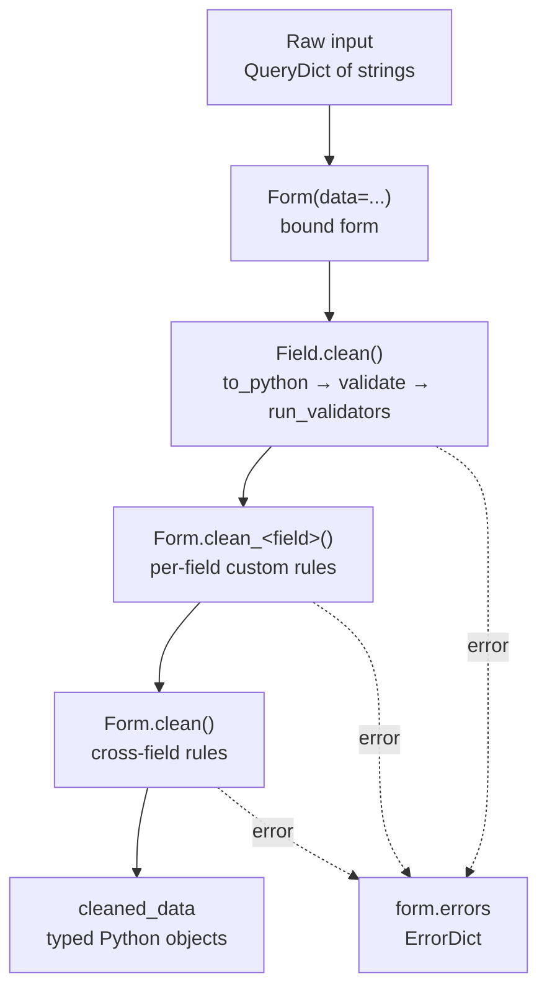

## Learning objectives

- Explain the full form lifecycle: unbound → bound → `is_valid()` → `cleaned_data`.
- Write `Form` and `ModelForm` classes and know exactly when each is right.
- Place validation at the correct layer: field, form, model, or database constraint.
- Handle file uploads, formsets, and dynamic forms without fighting the framework.
- Reuse Django's validation from DRF-style APIs and from service functions.

## Prerequisites

Django [models and the ORM](/courses/django/models-and-the-orm), the [request lifecycle](/courses/django/request-lifecycle), and Python [descriptors and the data model](/courses/python/oop-and-the-data-model) — form fields are descriptors with a validation pipeline attached.

## Why forms exist

A form is not "HTML rendering". A form is a **typed boundary**: untrusted strings come in, validated Python objects come out — or a structured set of errors does. Everything else (widgets, labels, CSS) is presentation glued to that core.



Three states matter:

| State | How you get it | `is_valid()` | `cleaned_data` |
|---|---|---|---|
| **Unbound** | `Form()` | `False` | absent (raises `AttributeError`) |
| **Bound, invalid** | `Form(data=request.POST)` | `False` | partially populated |
| **Bound, valid** | `Form(data=request.POST)` | `True` | fully populated, typed |

`is_valid()` is what *triggers* the pipeline — it calls `full_clean()` and caches the result. Reading `form.errors` also triggers it. Before either, nothing has been validated.

## The canonical view

```python
def subscribe(request):
    if request.method == "POST":
        form = SubscribeForm(request.POST)
        if form.is_valid():                     # runs the whole pipeline
            services.subscribe(**form.cleaned_data)   # domain call, typed args
            return redirect("subscribe_done")   # POST/Redirect/GET — no double submit
    else:
        form = SubscribeForm()                  # unbound: blank render
    return render(request, "subscribe.html", {"form": form})
```

That shape — POST branch, `is_valid()`, redirect on success, re-render with errors on failure — is the entire pattern. Memorize it; every CBV (`FormView`, `CreateView`) is this with the branches hidden in `dispatch()`.

## Fields: `to_python`, `validate`, `run_validators`

Each field runs three steps inside `Field.clean(value)`:

1. **`to_python(value)`** — coerce the string. `IntegerField` → `int`, `DateField` → `date`, `BooleanField` → `bool`. Failure raises `ValidationError` with code `"invalid"`.
2. **`validate(value)`** — built-in rules, chiefly `required`.
3. **`run_validators(value)`** — the list of callables in `validators=[...]`; *all* of them run and their errors accumulate.

```python
from django.core.exceptions import ValidationError
from django.core.validators import MinLengthValidator

def no_disposable(value: str) -> None:
    """Reusable validator: a callable that raises or returns None."""
    if value.split("@")[-1] in DISPOSABLE_DOMAINS:
        raise ValidationError("Disposable email addresses aren't accepted.",
                              code="disposable")

class SubscribeForm(forms.Form):
    email = forms.EmailField(
        label="Work email",
        validators=[no_disposable],
        error_messages={"required": "We need an email to send anything."},
        widget=forms.EmailInput(attrs={"autocomplete": "email",
                                       "class": "input"}),
    )
    plan = forms.ChoiceField(choices=Plan.choices)
    referral = forms.CharField(required=False, max_length=40,
                               validators=[MinLengthValidator(3)])
```

Always raise `ValidationError` with a **`code`** — that's how tests and API layers branch on the *kind* of failure instead of string-matching a message that a translator will change tomorrow.

## Custom hooks: `clean_<field>` and `clean`

```python
class TransferForm(forms.Form):
    source = forms.ModelChoiceField(queryset=Account.objects.none())
    target = forms.ModelChoiceField(queryset=Account.objects.none())
    amount = forms.DecimalField(max_digits=12, decimal_places=2, min_value=Decimal("0.01"))

    def __init__(self, *args, user, **kwargs):
        super().__init__(*args, **kwargs)
        # Narrow the querysets to the caller — authorization as validation.
        owned = Account.objects.filter(owner=user)
        self.fields["source"].queryset = owned
        self.fields["target"].queryset = owned

    def clean_amount(self):
        """Runs only if `amount` passed field-level validation."""
        amount = self.cleaned_data["amount"]
        if amount % Decimal("0.01") != 0:
            raise ValidationError("Amounts are limited to cents.", code="precision")
        return amount                      # MUST return the value

    def clean(self):
        """Cross-field rules. Fields that already failed are missing from cleaned_data."""
        cleaned = super().clean()
        source, target = cleaned.get("source"), cleaned.get("target")
        amount = cleaned.get("amount")
        if source and target and source == target:
            self.add_error("target", ValidationError(
                "Pick a different destination account.", code="same_account"))
        if source and amount and source.balance < amount:
            # No field= → a non-field error, rendered by {{ form.non_field_errors }}
            raise ValidationError("Insufficient funds.", code="insufficient")
        return cleaned
```

Three rules people get wrong constantly:

- **`clean_<field>` must return the value.** Forget the `return` and `cleaned_data[field]` silently becomes `None`.
- **In `clean()`, use `.get()`**, never `[...]`. A field that failed earlier is *not in* `cleaned_data`, and a `KeyError` there becomes a 500 on a form that should have re-rendered with errors.
- **`add_error(field, ...)` vs `raise`** — `add_error` attaches to a specific field and *removes it from `cleaned_data`*; a bare `raise` inside `clean()` produces a non-field error. Attach to a field whenever a field is at fault; users fix what's highlighted.

## ModelForm: the 80% case

```python
class ArticleForm(forms.ModelForm):
    class Meta:
        model = Article
        fields = ["title", "slug", "body", "tags", "published_at"]   # explicit allowlist
        widgets = {"body": forms.Textarea(attrs={"rows": 12})}
        help_texts = {"slug": "Leave blank to generate from the title."}

    def clean_slug(self):
        slug = self.cleaned_data.get("slug") or slugify(self.cleaned_data["title"])
        return slug
```

`ModelForm.save()` does two things: build/update the instance from `cleaned_data`, then `instance.save()`. `save(commit=False)` gives you the unsaved instance — the standard hook for fields the user must not control:

```python
article = form.save(commit=False)
article.author = request.user          # never trust a posted author id
article.save()
form.save_m2m()                        # required after commit=False if there are m2m fields
```

> **`fields = "__all__"` is a security bug waiting to happen.** Add `is_staff` or `balance` to a model later and it silently becomes user-editable — mass assignment, the same class of bug as Rails' 2012 GitHub compromise. Always list fields explicitly, or use `exclude` only on tiny internal forms you fully control.

`ModelForm` also runs **model validation**: `_post_clean()` calls `instance.full_clean()`, which runs field validators, `Model.clean()`, and — importantly — `validate_unique()`. That's how a duplicate slug becomes a friendly field error instead of an `IntegrityError` 500.

## Where does validation belong?

This is the question that separates tidy Django from a 900-line `views.py`.

| Layer | Runs when | Use it for |
|---|---|---|
| **DB constraint** (`UniqueConstraint`, `CheckConstraint`) | every write, including `bulk_create`, shell, other services | invariants that must be *true*, always |
| **Model** (`Model.clean`, field validators) | `full_clean()` — ModelForms, not raw `.save()` | business rules tied to one object |
| **Form** (`clean_*`, `clean`) | HTTP form submission only | input shape, cross-field UX rules, per-request context (the user) |
| **Service function** | whenever you call it | multi-object workflows, side effects |

The trap: **`Model.save()` does not call `full_clean()`.** `Article.objects.create(title="")` happily writes an empty title unless a DB constraint stops it. Validators alone are documentation; constraints are enforcement. Write both:

```python
class Article(models.Model):
    slug = models.SlugField(max_length=80)
    published_at = models.DateTimeField(null=True, blank=True)
    view_count = models.PositiveIntegerField(default=0)

    class Meta:
        constraints = [
            models.UniqueConstraint(fields=["slug"], name="uniq_article_slug"),
            models.CheckConstraint(check=Q(view_count__gte=0), name="views_nonneg"),
        ]
```

## Files, formsets, and dynamic fields

**Files** need two things people forget: `enctype="multipart/form-data"` on the `<form>`, and passing `request.FILES`:

```python
form = UploadForm(request.POST, request.FILES)
```

Validate uploads defensively — content type headers are attacker-controlled, and `file.name` may contain path separators:

```python
def clean_avatar(self):
    f = self.cleaned_data["avatar"]
    if f.size > 2 * 1024 * 1024:
        raise ValidationError("Keep avatars under 2 MB.", code="too_large")
    if Image.open(f).format not in {"PNG", "JPEG", "WEBP"}:   # sniff, don't trust
        raise ValidationError("PNG, JPEG, or WEBP only.", code="bad_format")
    f.seek(0)                                # rewind after reading!
    return f
```

**Formsets** manage N forms of the same kind, and `inlineformset_factory` handles a parent plus its children (an invoice and its line items) in one atomic submit:

```python
LineFormSet = inlineformset_factory(Invoice, Line, fields=["sku", "qty"],
                                    extra=1, can_delete=True, max_num=50)

formset = LineFormSet(request.POST, instance=invoice)
if form.is_valid() and formset.is_valid():
    with transaction.atomic():             # parent + children commit together
        invoice = form.save()
        formset.instance = invoice
        formset.save()
```

The management form (`{{ formset.management_form }}`) is **mandatory** in the template — without it every submit dies with "ManagementForm data is missing or has been tampered with".

**Dynamic fields** belong in `__init__`, never at class level (class bodies evaluate once, at import — a queryset there goes stale and leaks across requests):

```python
def __init__(self, *args, tenant, **kwargs):
    super().__init__(*args, **kwargs)
    for feature in tenant.features.all():
        self.fields[f"feature_{feature.pk}"] = forms.BooleanField(
            required=False, label=feature.name)
```

## Common mistakes

1. **Forgetting `return` in `clean_<field>`** — the value becomes `None` and downstream code writes nulls.
2. **`cleaned_data["x"]` inside `clean()`** — `KeyError` → 500 whenever `x` failed validation. Use `.get()`.
3. **`fields = "__all__"`** — mass assignment; a future model field becomes user-writable.
4. **Trusting model validators to run on `.save()`** — they don't. Only `full_clean()` runs them.
5. **Not rewinding an uploaded file** after reading it for validation — the saved file is truncated or empty.
6. **Querysets at class level** — `ModelChoiceField(queryset=Account.objects.filter(active=True))` is evaluated per-process, not per-request, and shows every tenant's rows. Narrow in `__init__`.
7. **Rendering after a successful POST instead of redirecting** — refresh re-submits the form and creates duplicates.

## Best practices

- One form per use case, not per model. `RegisterForm`, `AdminUserForm`, and `ProfileForm` may all touch `User` and should stay separate — their rules genuinely differ.
- Pass request context in as keyword args (`Form(..., user=request.user)`); never reach for globals or thread-locals inside a form.
- Keep forms free of side effects. Validate in the form, *do* in a service function — that's what makes both testable.
- Give every `ValidationError` a `code`, and test against codes.
- Mirror every business-critical validator with a DB constraint.
- Use `django-crispy-forms` or a small `` field partial rather than hand-writing markup per field.

## Performance & memory notes

- `ModelChoiceField` evaluates its queryset **on render** — a select with 50 000 options is a 50 000-row query plus a giant HTML payload. Use an autocomplete widget backed by a search endpoint past a few hundred rows.
- Formsets multiply queries: N child forms with `ModelChoiceField` can each hit the DB. Set `.queryset` once and reuse, or use `select_related` on the formset queryset ([N+1 lesson](/courses/django/queryset-optimization)).
- `form.is_valid()` on a `ModelForm` runs `validate_unique()`, which is one extra `SELECT` per unique field/constraint. Fine for one form, notable at 100 in a formset — pass `validate_unique=False` and rely on the DB constraint plus an `IntegrityError` handler for bulk paths.
- File uploads over `FILE_UPLOAD_MAX_MEMORY_SIZE` (2.5 MB default) spill to a temp file; below it they sit in RAM. A 100-worker deployment accepting 2 MB avatars can spike 200 MB — lower the threshold on memory-tight boxes.

## Production tips

- Set `DATA_UPLOAD_MAX_MEMORY_SIZE` and `DATA_UPLOAD_MAX_NUMBER_FIELDS` deliberately — the latter is the defense against a formset DoS with 100 000 posted fields.
- Cap uploads at the edge too (`client_max_body_size` in Nginx); a rejected 500 MB upload should never reach Python.
- Log `form.errors.as_json()` at DEBUG on unexpected validation failures — silent client-side mismatches are otherwise invisible.
- Serve user uploads from a separate domain or a storage bucket with `Content-Disposition: attachment`; an SVG or HTML file served from your origin is stored XSS.
- Add `autocomplete` attributes (`email`, `current-password`, `one-time-code`) — free UX and it makes password managers work ([forms UX rules](/courses/django/auth-and-security)).

## Interview questions

1. **"Walk me through what `is_valid()` actually does."** — `full_clean()` → per-field `clean()` (`to_python`/`validate`/`run_validators`) → `clean_<field>` hooks → `Form.clean()`; populates `cleaned_data` and `errors`; result is cached.
2. **"Difference between `Form` and `ModelForm`?"** — `ModelForm` derives fields from a model, runs `instance.full_clean()` in `_post_clean` (including `validate_unique`), and gains `save()`. Use plain `Form` when input doesn't map 1:1 to a model.
3. **"Where do you put a rule like 'end date after start date'?"** — `Form.clean()` for the UX error, plus a `CheckConstraint` for the guarantee. Explain why both.
4. **"Why is `fields = '__all__'` dangerous?"** — mass assignment; future fields silently become writable.
5. **"How do you validate a file upload safely?"** — size before content, sniff the real type rather than trusting `content_type`, rewind the handle, store outside the app origin, and cap at the proxy.

## Summary

- Forms are a typed, validating boundary; rendering is a side job.
- The pipeline is fixed: field `clean` → `clean_<field>` → `clean()`; each layer sees what survived the previous one.
- `ModelForm` bridges to models and runs model validation — but `.save()` alone never validates.
- Real invariants live in DB constraints; forms provide the human-friendly version of the same rule.
- Per-request context goes through `__init__`; side effects go in services.

## Exercises

**Easy**

1. Write a `ContactForm` (name, email, message, honeypot field that must stay empty) and a view following the POST/Redirect/GET pattern.
2. Add a reusable `validate_uzbek_phone` validator with `code="phone"`, and unit-test it directly — no HTTP involved.

**Medium**

3. Build an `EventForm` where `end` must be after `start` and capacity is 1–500. Add the matching `CheckConstraint`s, then prove in a shell that `Event.objects.create(...)` bypasses the form validation but not the constraints.
4. Convert a `ModelForm` using `fields = "__all__"` on a `User`-like model into an explicit allowlist, and write a test that fails if someone re-adds a privileged field.

**Hard**

5. Implement an invoice editor: one `InvoiceForm` plus an `inlineformset_factory` for lines, atomic save, per-line validation (qty > 0, SKU exists), and a form-level rule that the total must be under the customer's credit limit. Then measure the query count with `assertNumQueries` and get it under 10 for a 5-line invoice.

**Debugging exercise**

6. This form silently saves `None` for `username` and 500s on some submissions. Find both bugs:

```python
class SignupForm(forms.Form):
    username = forms.CharField(max_length=30)
    password = forms.CharField(widget=forms.PasswordInput)
    confirm = forms.CharField(widget=forms.PasswordInput)

    def clean_username(self):
        username = self.cleaned_data["username"].lower()

    def clean(self):
        if self.cleaned_data["password"] != self.cleaned_data["confirm"]:
            raise ValidationError("Passwords don't match.")
        return self.cleaned_data
```

**Refactoring exercise**

7. Take a view that reads 12 fields off `request.POST` by hand with `int(...)` casts wrapped in `try/except`, and replace it with a form. Count the lines removed and list the error cases you now get for free.

**Mini project**

Build a multi-step onboarding wizard (account → company → plan) that stores partial state in the session, validates each step independently, shows a progress indicator, allows going back without losing data, and only writes to the database in a single atomic transaction at the end. Handle the "user abandons at step 2 and returns tomorrow" case explicitly.

## Quiz

<details>
<summary>1. What is in <code>cleaned_data</code> for a field that failed validation?</summary>
Nothing — the key is absent. That's why <code>clean()</code> must use <code>.get()</code>.
</details>

<details>
<summary>2. Does <code>Model.save()</code> run your field validators?</summary>
No. Only <code>full_clean()</code> does, which <code>ModelForm</code> calls for you. Raw <code>.save()</code>/<code>.create()</code>/<code>bulk_create</code> skip validation entirely — use database constraints for guarantees.
</details>

<details>
<summary>3. Why must you call <code>form.save_m2m()</code> after <code>save(commit=False)</code>?</summary>
Many-to-many rows need the parent's primary key, so they're deferred. <code>save(commit=False)</code> hands you the unsaved instance and stashes the m2m data; <code>save_m2m()</code> writes it once the instance has a pk.
</details>

<details>
<summary>4. <code>add_error("email", ...)</code> vs <code>raise ValidationError(...)</code> inside <code>clean()</code>?</summary>
<code>add_error</code> attaches the error to that field (rendered beside the input) and pops it from <code>cleaned_data</code>; a bare raise becomes a non-field error rendered by <code>form.non_field_errors</code>.
</details>

<details>
<summary>5. Where does a queryset for a <code>ModelChoiceField</code> belong, and why?</summary>
In <code>__init__</code>. At class level it's evaluated once per process, so it goes stale and — worse — can't be narrowed to the current user/tenant, leaking other people's rows.
</details>

## Further reading

- Django docs — "Working with forms", "Form and field validation", "Formsets", "File uploads"
- Django source: `django/forms/forms.py::BaseForm.full_clean` — 40 readable lines that explain everything above
- OWASP — "Mass Assignment" and "Unrestricted File Upload" cheat sheets
