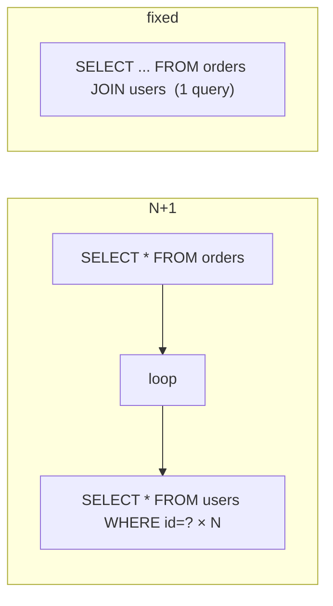

## Learning objectives

- Explain queryset laziness precisely: what triggers evaluation, what caches, what re-queries.
- Diagnose and eliminate N+1 queries with `select_related` and `prefetch_related` — and know how each works.
- Trim queries with `only`/`defer`/`values`, and page/stream large datasets safely.
- Design indexes from query patterns and read `EXPLAIN` output at a working level.
- Use transactions and locking (`atomic`, `select_for_update`) correctly under concurrency.

## Prerequisites

[Models and the ORM](/courses/django/models-and-the-orm). This lesson assumes you can read the SQL your querysets emit.

## Laziness: the contract

A queryset is a **description** of a query. Building one runs nothing:

```python
qs = Order.objects.filter(status="paid")     # no SQL
qs = qs.exclude(total=0).order_by("-id")     # still no SQL
```

SQL executes on: **iteration** (`for`, `list()`), slicing with a step, `len(qs)`, `bool(qs)`/`if qs:`, `repr` (REPL!), and terminal methods (`count()`, `exists()`, `first()`, `get()`, `aggregate()`).

After full evaluation, results live in the queryset's **result cache** — iterating again reuses it. But *derived* querysets (`qs.filter(...)`) and separate calls (`qs.count()` after `list(qs)` — actually count reuses cache when fully evaluated; `Order.objects.count()` does not) hit the DB again. Two idioms encode this correctly:

```python
if qs.exists(): ...        # cheap EXISTS query — when you won't iterate
orders = list(qs)          # evaluate ONCE — when you will
if orders: ...             # then reuse the list everywhere
```

## The N+1 problem — the most important pattern in this course

```python
orders = Order.objects.all()[:100]           # 1 query
for o in orders:
    print(o.user.email)                      # +100 queries (one per order!)
```

Accessing a FK attribute on an instance whose queryset didn't fetch it triggers a **lazy per-instance query**. 100 rows → 101 queries. It's invisible in dev (SQLite, 3 rows, 0.2ms queries) and catastrophic in prod (100 rows × 2ms + latency = a slow page and a hammered DB). This single pattern causes more real-world Django performance incidents than everything else combined.



### `select_related` — JOIN for to-one

```python
orders = Order.objects.select_related("user", "user__profile")[:100]  # 1 query, JOINs
```

Follows **ForeignKey/OneToOne** (to-one) relations by adding SQL JOINs and building the related instances from the same rows. Chain with `__` for depth. Cost: wider rows — select_related on a huge text-column table drags those columns along (combine with `only()` if needed).

### `prefetch_related` — batched second query for to-many

```python
users = User.objects.prefetch_related("orders")[:50]
# query 1: the 50 users
# query 2: SELECT * FROM orders WHERE user_id IN (...50 ids...)
# then Django stitches them together in Python
for u in users:
    u.orders.all()          # served from the prefetch cache — no SQL
```

For **reverse FKs and M2M** (to-many), a JOIN would duplicate parent rows; instead Django runs one extra `IN` query per relation and joins in memory. Two crucial details:

1. **Any filtering on the related manager busts the cache**: `u.orders.filter(status="paid")` runs a fresh query per user — N+1 sneaking back in. Filter *inside the prefetch* instead:

```python
User.objects.prefetch_related(
    Prefetch("orders",
             queryset=Order.objects.filter(status="paid").select_related("invoice"),
             to_attr="paid_orders")          # plain list attribute
)
```

2. `to_attr` stores a list (no manager, no accidental re-query) — prefer it for filtered prefetches.

Rule of memory: **to-one → `select_related` (JOIN); to-many → `prefetch_related` (IN + stitch)**. They compose freely.

### Fetch less, not just smarter

| Tool | Effect | Use when |
|---|---|---|
| `values("id", "email")` | dicts, no model instances | read-only bulk output (APIs, exports) |
| `values_list("id", flat=True)` | tuples / flat list | id lists for IN-queries, dropdowns |
| `only("id", "status")` | deferred instances (other fields lazy-load!) | need instances but few fields |
| `defer("big_blob")` | instance minus named fields | one huge column poisoning every query |
| `count()` / `exists()` / `aggregate()` | DB-side computation | never `len(qs)`/`bool(qs)` for these |
| `iterator(chunk_size=2000)` | server-side cursor streaming, no result cache | multi-million-row batch jobs |

`only`/`defer` have a trap: touching a deferred field triggers a per-instance query — N+1 with extra steps. Use them only when access patterns are certain; prefer `values` when you don't need model behavior.

## Indexes: where speed actually lives

Without an index, a filtered query scans the table. An index (B-tree, usually) makes lookup O(log n). The ORM won't create what you don't declare:

```python
class Meta:
    indexes = [
        models.Index(fields=["status", "created_at"]),   # composite
        models.Index(fields=["user", "-created_at"],
                     name="order_user_recent_idx"),
    ]
```

Working rules:

- Index what you **filter, join, and order by** together. A composite `(status, created_at)` serves `WHERE status=? ORDER BY created_at` in one walk; column order matters (leftmost-prefix rule: it also serves `WHERE status=?`, but *not* `WHERE created_at=?` alone).
- FKs get indexes automatically; `unique=True` implies one.
- Indexes cost writes (every INSERT/UPDATE maintains them) and space — index deliberately, not decoratively. Audit unused indexes (`pg_stat_user_indexes`).
- Verify with **`qs.explain(analyze=True)`**: `Seq Scan` on a big table under a hot query = your problem; `Index Scan`/`Index Only Scan` = healthy. Learn to skim `EXPLAIN` for scan type, row estimates vs actuals, and sort/hash steps.
- Selectivity matters: an index on a boolean over 50/50 data barely helps; partial indexes (`condition=Q(status="pending")`) index only the hot slice.

## Transactions and concurrency

By default Django runs in autocommit: each statement commits alone. Multi-statement invariants need explicit atomicity:

```python
from django.db import transaction

with transaction.atomic():
    src = Account.objects.select_for_update().get(pk=src_id)   # row lock
    dst = Account.objects.select_for_update().get(pk=dst_id)
    if src.balance < amount:
        raise InsufficientFunds()
    src.balance -= amount
    dst.balance += amount
    src.save(); dst.save()
```

- `atomic()` = all-or-nothing; nested blocks become savepoints; **keep them short** — locks and connection hold-time scale with block length. Never call external APIs inside.
- `select_for_update()` takes row locks until commit — the standard fix for read-check-write races (transfers, inventory, seat booking). Lock rows in a **consistent order** to avoid deadlocks; use `nowait=True`/`skip_locked=True` for queue-worker patterns.
- Simpler races have simpler fixes first: `F()` expressions for counters, DB unique constraints for get-or-create.
- `ATOMIC_REQUESTS=True` wraps every request in a transaction — safe default for correctness, at the cost of longer transactions; either way, side effects (email, tasks) go through `transaction.on_commit`.

## Common mistakes

1. **N+1 in templates** — the loop is in HTML (`{{ order.user.email }}`), the queryset in the view; the template silently queries. Assert query counts in tests.
2. **`len(qs)` / `list(qs)[0]` / `if qs:`** where `count()` / `first()` / `exists()` express intent DB-side.
3. **Prefetching then filtering the related manager** — cache bypassed, N+1 returns (use `Prefetch`).
4. **`order_by("?")`** — random order sorts the whole table; take random ids instead.
5. **Offset pagination deep into big tables** — `OFFSET 100000` scans and discards 100k rows; use keyset pagination (`filter(id__lt=last_seen_id)[:page]`) for feeds and exports.
6. **Missing composite index for the hot filter+sort**, or indexing every column "just in case" (write amplification).
7. **Fetching entire tables into memory** for batch jobs — `iterator()` exists; so does `values_list`.

## Best practices

- **Measure first**: django-debug-toolbar in dev (queries per page, duplicates highlighted), `connection.queries` in the shell, slow-query log + APM in prod.
- **Test query counts** for hot endpoints: `with self.assertNumQueries(3): client.get(url)` — turns N+1 regressions into red tests.
- Centralize eager-loading in queryset methods (`.with_list_relations()`), so views can't forget it.
- Paginate everything user-facing; keyset-paginate everything big; stream (`iterator`) everything batch.
- Design indexes from the slow-query log, verify with `explain`, and delete the ones nothing uses.

## Performance & memory notes

- Rough per-query overhead (driver + network + parse) is 0.5–2ms even for trivial queries — 101 queries can't beat 2, ever. Latency, not just DB CPU, is the N+1 tax.
- Model instantiation costs ~5–10× a dict row: `values()` on a 50k-row export is a memory *and* CPU win.
- `iterator(chunk_size=...)` disables the result cache — constant memory, but relations can't be prefetch-cached the same way (Django supports prefetching with iterator via chunked batches since 4.1 — still, batch jobs often do explicit id-window loops).
- Connection reuse matters: set `CONN_MAX_AGE` (persistent connections) or run pgbouncer; per-request reconnects are pure overhead ([deployment lesson](/courses/django/caching-celery-and-deployment)).

## Production tips

- Enable Postgres `log_min_duration_statement` (e.g. 200ms) — the slow-query log is your optimization backlog, sorted by impact.
- The three-step incident drill: find the slow endpoint (APM) → count queries (is it N+1?) → `explain` the biggest query (is it a missing index?). This resolves the majority of "the site is slow" pages.
- Big `IN (...)` lists (10k+ ids from a prefetch of a huge parent set) can themselves be slow — chunk the parent set.
- Read replicas offload heavy reads (`using("replica")` / DB routers) — mind replication lag for read-your-own-writes flows.

## Interview questions

1. **"What is the N+1 problem and how do you fix it in Django?"** — Per-row lazy relation queries; `select_related` (JOIN, to-one) vs `prefetch_related` (IN + stitch, to-many); `Prefetch` for filtered relations.
2. **"When does a queryset hit the database?"** — Iteration, len/bool, slicing-with-step, repr, terminal methods; result cache semantics; `exists`/`count` idioms.
3. **"How do you find and fix a slow endpoint?"** — Measure (toolbar/APM) → query count → explain → index or restructure; assertNumQueries as regression guard.
4. **"Composite index on (a, b) — which queries can use it?"** — Leftmost prefix: filters on `a`, on `a,b`, and `a` + order-by `b`; not `b` alone.
5. **"How do you prevent double-spending under concurrent requests?"** — `atomic` + `select_for_update` (consistent order), or F-expressions/constraints where sufficient; discuss deadlocks and lock scope.

## Summary

- Querysets are lazy descriptions with a result cache; know the exact evaluation triggers and reuse deliberately.
- N+1 is the dominant real-world ORM failure: to-one → `select_related`, to-many → `prefetch_related(Prefetch(...))`, and test query counts.
- Fetch less (`values`, `only`, pagination, `iterator`), index what you filter/join/sort (verify with `explain`), and guard concurrent writes with short `atomic` blocks + row locks or atomic expressions.

## Exercises

**Easy**

1. Turn on `connection.queries` in a shell session and count queries for a naive orders-with-users loop; fix with `select_related` and count again.
2. Rewrite three snippets using the right idiom: `if len(qs) > 0`, `qs[0] if qs else None`, `len(Order.objects.all())`.

**Medium**

3. Given `Author→Book→Review`, build one queryset for "authors with their 2024 books and each book's review count" in ≤3 queries (Prefetch + annotate). Prove the count with `assertNumQueries`.
4. Add indexes for a query log you're given (three slow WHERE/ORDER BY patterns); justify each column order, then show `explain` before/after on seeded data.

**Hard**

5. Implement inventory checkout that survives a concurrency test: two threads buying the last item — one succeeds, one gets `OutOfStock`. Three versions: `select_for_update`, `F()`-guarded conditional update (`filter(stock__gt=0).update(stock=F("stock")-1)` checking rowcount), and a CheckConstraint safety net. Compare.

**Debugging exercise**

6. This "optimized" view still runs hundreds of queries. Find all three reasons:

```python
users = User.objects.prefetch_related("orders")
for u in users:                                  # no slice — whole table
    recent = u.orders.filter(created_at__year=2025)   # busts prefetch cache
    for o in recent:
        print(o.invoice.number)                  # invoice never eager-loaded
```

**Refactoring exercise**

7. An export endpoint builds `list(Order.objects.all())` (2M rows) into JSON in memory and times out. Refactor to a streamed CSV using `values_list` + `iterator` + `StreamingHttpResponse`, with keyset batching. Note the memory profile change.

**Mini project**

Take (or seed) a blog schema — Post, Author, Tag (M2M), Comment — and build a "dashboard" page requiring: latest 20 posts with author + tag names + comment counts, top 5 authors by posts this month. Budget: **≤ 5 queries total**, enforced by a test. Then add the indexes those queries want and demonstrate each with `explain`.

## Quiz

<details>
<summary>1. <code>qs = Order.objects.all(); list(qs); qs.filter(status="paid")</code> — how many queries?</summary>
Two: the list() evaluation, and the derived filter is a new queryset that must run its own SQL when evaluated. The result cache only serves identical re-iteration of the same queryset object.
</details>

<details>
<summary>2. Why can't <code>select_related</code> handle reverse FKs?</summary>
A JOIN to a to-many relation multiplies parent rows (one per child); Django would build duplicate instances. Batched IN-query + stitching (prefetch) preserves cardinality.
</details>

<details>
<summary>3. What does <code>only("status")</code> do when you later read <code>obj.note</code>?</summary>
Runs an extra query for that instance's deferred field — per-instance, so a loop reintroduces N+1.
</details>

<details>
<summary>4. Why is keyset pagination faster than OFFSET for page 5000?</summary>
OFFSET must produce and discard all prior rows; keyset (<code>WHERE id &lt; last</code> + index) seeks directly to the boundary — O(page) vs O(offset+page).
</details>

<details>
<summary>5. Two transactions both <code>select_for_update</code> rows A then B, and B then A. What happens and how do you prevent it?</summary>
Deadlock — the DB kills one. Prevent by locking in a globally consistent order (e.g. by primary key ascending).
</details>

## Further reading

- Django docs — "Database access optimization" (the checklist page), QuerySet API
- Use The Index, Luke (free book on indexing — read it all)
- PostgreSQL docs — EXPLAIN, locking; django-debug-toolbar
