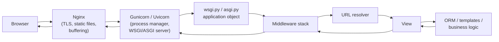

## Learning objectives

- Trace a request from the socket to your view and back, naming every Django layer it crosses.
- Explain WSGI vs ASGI and where Gunicorn/Uvicorn fit.
- Describe middleware's onion model and write correct custom middleware.
- Explain URL resolution, view calling conventions, and the response path.
- Answer the interview classic: "What happens when a request hits a Django app?"

## Prerequisites

Basic Django experience (you've built views and models once) and the Python course's [functions](/courses/python/functions-deep-dive) and [decorators](/courses/python/decorators) lessons — middleware is decorators at architecture scale.

## The big picture

Django is not a server. In production, an HTTP server process accepts connections and hands parsed requests to Django through a protocol:



- **WSGI** (Web Server Gateway Interface): the classic synchronous contract — `application(environ, start_response)`. One worker handles one request at a time; concurrency = processes × threads. Gunicorn is the standard WSGI server.
- **ASGI**: the async successor — `async application(scope, receive, send)` — enabling websockets and async views. Uvicorn/Daphne speak it. Django supports both; a mostly-sync Django app on WSGI is still a perfectly modern deployment.
- `runserver` is a development convenience (auto-reload, no tuning, single-threaded-ish) — never production.

`wsgi.py`/`asgi.py` expose the `application` object — the single entry point the server calls per request. Everything else in this lesson happens inside that call.

## Step by step through Django

### 1. Request object construction

Django parses the raw environ/scope into `HttpRequest`: `request.method`, `.path`, `.GET` (QueryDict of query params), `.POST` (form data), `.body` (raw bytes), `.headers`, `.FILES`, `.META`. Note `request.GET`/`.POST` are **QueryDicts** — multi-valued (`getlist`) and immutable. JSON APIs read `request.body` (or DRF's `request.data` — [DRF lesson](/courses/django/drf-apis)).

### 2. Middleware — the onion

`settings.MIDDLEWARE` is an ordered list. On the way **in**, requests pass top-to-bottom; on the way **out**, responses pass bottom-to-top. Each middleware wraps everything below it — exactly a decorator stack:

```python
# the modern middleware pattern: a closure factory
def timing_middleware(get_response):
    # one-time setup, at server start
    def middleware(request):
        start = time.perf_counter()
        response = get_response(request)     # everything deeper runs here
        response["X-Response-Time-Ms"] = str(
            round((time.perf_counter() - start) * 1000, 1)
        )
        return response
    return middleware
```

A middleware may **short-circuit** by returning a response without calling `get_response` (auth walls, rate limiting, maintenance mode) — deeper layers, including the view, never run.

The default stack, and why order matters:

| Middleware | Role | Ordering constraint |
|---|---|---|
| `SecurityMiddleware` | HTTPS redirect, HSTS, security headers | early — before anything answers |
| `SessionMiddleware` | loads `request.session` from the session store | before auth (auth reads the session) |
| `CommonMiddleware` | APPEND_SLASH redirects, disallowed hosts | — |
| `CsrfViewMiddleware` | validates CSRF tokens on unsafe methods | after session |
| `AuthenticationMiddleware` | attaches lazy `request.user` | **after** SessionMiddleware |
| `MessageMiddleware` | one-shot flash messages | after session/auth |

`request.user` is a **lazy** object — the DB query for the user runs only when something first touches it. Middleware also gets hooks beyond the call chain: `process_view` (after resolution, before the view), `process_exception` (view raised), `process_template_response`.

### 3. URL resolution

The resolver imports `ROOT_URLCONF` and matches `request.path` against `urlpatterns` top-down; first match wins:

```python
# project/urls.py
urlpatterns = [
    path("admin/", admin.site.urls),
    path("api/orders/", include("orders.urls")),   # delegation per app
]

# orders/urls.py
app_name = "orders"
urlpatterns = [
    path("", views.order_list, name="list"),
    path("<int:pk>/", views.order_detail, name="detail"),   # converter → kwarg
]
```

Path converters (`<int:pk>`, `<slug:slug>`, `<uuid:id>`) validate *and* convert — a non-numeric pk 404s before your view runs. Named routes + namespacing (`reverse("orders:detail", args=[42])`, ``) mean URLs are refactorable; hardcoding paths in templates/code is the anti-pattern.

No match → `Http404` → the 404 handler renders the error response.

### 4. The view

A view is any callable taking `HttpRequest` (+ URL kwargs) and returning `HttpResponse`:

```python
def order_detail(request, pk):
    order = get_object_or_404(Order, pk=pk, user=request.user)
    return JsonResponse({"id": order.pk, "status": order.status})
```

FBV vs CBV in one honest paragraph: **function-based views** are explicit and read top-to-bottom — best default for custom logic. **Class-based views** (`ListView`, `CreateView`, …) compress the standard CRUD patterns via inheritance and mixins — powerful, but the flow hides in the base classes (`as_view()` → `dispatch()` → `get()/post()` → template machinery). Rule of thumb: CBVs for cookie-cutter CRUD pages and DRF viewsets; FBVs when you'd override more than two CBV methods. Views should stay thin — orchestration, not business rules ([architecture discussion](/courses/django/models-and-the-orm)).

### 5. Response, exceptions, and the way out

The view's `HttpResponse` (subclasses: `JsonResponse`, `FileResponse`, `StreamingHttpResponse`, `redirect`, or a rendered template) travels back **up** the middleware stack (each layer may modify headers/content), through the WSGI/ASGI server, through Nginx, to the client.

Exceptions get a defined path: `Http404` → 404 handler; `PermissionDenied` → 403; `SuspiciousOperation` → 400; anything else → 500 with the debug page (`DEBUG=True`) or your `500.html` + an error report — and `process_exception` middleware may intercept first. This is the boundary-handler pattern from [the observability lesson](/courses/python/errors-logging-and-observability), built into the framework.

## Common mistakes

1. **Running `runserver` in production** — single point of slowness, no process management, DEBUG usually on. Gunicorn/Uvicorn + Nginx is the floor.
2. **Wrong middleware order** — auth before session (crash), or your logging middleware after `CommonMiddleware` missing redirects. Treat the list as dependency-ordered.
3. **Doing per-request work at import time** — module-level DB queries or client construction run once per *process* (often before setup) and go stale; do request work per request, expensive setup in `get_response`-factory scope.
4. **Fat views** — 200-line functions mixing parsing, business rules, and side effects; untestable without HTTP. Extract services.
5. **Blocking work in async views** — an `async def` view calling the sync ORM directly raises `SynchronousOnlyOperation`; use `sync_to_async`/async ORM methods, or just write a sync view.
6. **Trusting `request.META["REMOTE_ADDR"]` behind a proxy** — it's the proxy's IP; you need `X-Forwarded-For` handling (and to trust only your proxy).

## Best practices

- Per-app `urls.py` with `app_name` namespaces; always reverse by name.
- Middleware for genuinely global concerns only (auth, logging, request-id, security headers); anything route-specific belongs in decorators or the view.
- Attach a **request id** in your first middleware and log it everywhere ([observability lesson](/courses/python/errors-logging-and-observability)).
- Keep views ≤ ~30 lines: parse/authorize → call domain function → shape response.
- Know your deployment: sync views on WSGI unless you have real async needs (websockets, high-fanout I/O) — half-async Django is the worst of both.

## Performance & memory notes

- Each Gunicorn sync worker handles one request at a time: capacity ≈ workers × (1/avg latency). A 200ms average with 8 workers ≈ 40 req/s — this arithmetic is why slow queries are capacity incidents, not just UX issues.
- Middleware executes on **every** request — a 5ms DB call in middleware taxes the whole site; cache or lazy-load anything heavy there.
- `request.user` laziness means anonymous-path requests can skip the user query entirely — don't force it in middleware by logging `request.user` unconditionally.
- Streaming responses (`StreamingHttpResponse` over a [generator](/courses/python/iterators-and-generators)) keep memory flat for big exports — but hold the worker for the duration; big exports belong in [Celery](/courses/django/caching-celery-and-deployment) + object storage when possible.

## Production tips

- Nginx in front handles TLS, static/media files, slow-client buffering (protecting workers from drip-feed clients), and request size limits.
- Tune Gunicorn: `workers = 2 × cores + 1` starting point (sync), `--timeout` above your p99, `--max-requests` with jitter as a leak backstop.
- Health-check endpoint that touches DB and cache, wired to your load balancer — deploys then can't send traffic to broken processes.
- `ALLOWED_HOSTS`, `SECURE_*` settings, and `DEBUG=False` are the non-negotiable trio; Django's `manage.py check --deploy` audits them.

## Interview questions

1. **"Walk me through a request hitting Django."** — Nginx → WSGI/ASGI server → application object → middleware (down) → URL resolver → view → ORM/logic → response → middleware (up) → server → client. Name the layers crisply.
2. **"WSGI vs ASGI?"** — Sync callable-per-request vs async scope/receive/send; concurrency via processes/threads vs event loop; Django supports both.
3. **"How does middleware work and why does order matter?"** — Onion/decorator stack; each wraps deeper layers; session-before-auth dependency; short-circuiting.
4. **"FBV vs CBV?"** — Explicitness vs pattern reuse; explain `as_view()`/`dispatch()`; state your rule of thumb.
5. **"Where would you implement rate limiting?"** — Middleware (global) or view decorator (route-level), backed by cache/Redis counters; discuss short-circuit responses and 429.

## Summary

- Production Django = Nginx → Gunicorn/Uvicorn → the `application` object; `runserver` is dev-only.
- Request path: middleware down → resolver → view → response, middleware up; exceptions have their own well-defined path.
- Middleware is the decorator pattern at framework scale; order is a dependency graph.
- URL names/namespaces make routing refactorable; views stay thin; async only with intent.

## Exercises

**Easy**

1. Add `X-Request-Id` middleware (uuid4 per request, echoed in the response header) and log it from a view.
2. Create a two-app project where each app owns its `urls.py` with namespaces; render links via `` only.

**Medium**

3. Write maintenance-mode middleware: if a cache flag is set, short-circuit everything except `/admin/*` with a 503 + Retry-After. Toggle the flag from a management command.
4. Implement per-IP rate limiting middleware (N requests / minute, cache-backed, returning 429 with headers). Discuss its failure mode when the cache is down — and make it fail open.

**Hard**

5. Build request-logging middleware emitting one structured JSON line per request (method, path, status, duration, user id if authenticated, request id) — without forcing evaluation of lazy `request.user` for anonymous sessions (hint: check `request.session` keys or log after the response when the view already decided).

**Debugging exercise**

6. After a middleware refactor, every POST returns 403 CSRF errors, and `request.user` crashes with `'WSGIRequest' object has no attribute 'user'` on some paths. Diagnose from the stack:

```python
MIDDLEWARE = [
    "django.middleware.security.SecurityMiddleware",
    "django.contrib.auth.middleware.AuthenticationMiddleware",
    "app.middleware.timing_middleware",
    "django.contrib.sessions.middleware.SessionMiddleware",
    "django.middleware.csrf.CsrfViewMiddleware",
]
```

**Refactoring exercise**

7. Take a 150-line FBV that parses JSON, validates 8 fields, creates 3 related models, sends email, and returns JSON. Refactor into: thin view → validation (form/serializer) → `services.place_order()` domain function → response. List what became unit-testable without a request factory.

**Mini project**

Build "request analytics" for a small project: middleware records (path, method, status, duration) into a model via bulk buffered writes (flush every 50 records or 5s), a management command prints p50/p95 per endpoint, and an admin-only view renders the table. You'll touch middleware, ORM, commands, and admin wiring — the full lifecycle you just learned.

## Quiz

<details>
<summary>1. Which runs first on the way in — CsrfViewMiddleware or your middleware listed below it?</summary>
CsrfViewMiddleware — request phase runs top-to-bottom. (On the way out, yours runs first.)
</details>

<details>
<summary>2. What happens if middleware returns a response without calling <code>get_response</code>?</summary>
Short-circuit: deeper middleware and the view never run; the response climbs back up through the layers above it only.
</details>

<details>
<summary>3. Why must SessionMiddleware precede AuthenticationMiddleware?</summary>
Auth reads the session cookie's session data to identify the user; without the session attached first, <code>request.user</code> can't be built.
</details>

<details>
<summary>4. When does the DB query for <code>request.user</code> execute?</summary>
On first attribute access — it's a lazy object; untouched, it costs nothing.
</details>

<details>
<summary>5. Name the exception→status mappings Django gives you for free.</summary>
Http404→404, PermissionDenied→403, SuspiciousOperation→400, everything else→500 (debug page or 500 handler + error report).
</details>

## Further reading

- Django docs — "Middleware", "URL dispatcher", "Deploying Django"
- Gunicorn design docs (worker types); Uvicorn deployment docs
- PEP 3333 (WSGI), ASGI specification
