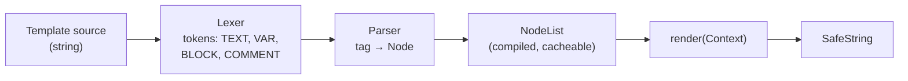

## Learning objectives

- Explain how the Django Template Language compiles and renders, and why it's deliberately limited.
- Use inheritance, inclusion, and composition to keep templates DRY without making them unreadable.
- Write correct custom tags and filters, including the ones that take context.
- Understand autoescaping, `safe`, and `mark_safe` well enough to never ship an XSS hole.
- Diagnose slow pages caused by templates: hidden queries, uncached loaders, fragment caching.

## Prerequisites

The [request lifecycle](/courses/django/request-lifecycle) (you know where rendering sits), [querysets](/courses/django/queryset-optimization) (templates trigger them), and Python [iterators and generators](/courses/python/iterators-and-generators).

## What DTL actually is

The Django Template Language is a **compiler plus an interpreter over a node tree**. `render()` does not `eval()` your template — it tokenizes, builds nodes, and renders them:



Two consequences matter in practice:

1. **Compilation is expensive; rendering is cheap.** The cached loader exists to compile once per process (see Performance).
2. **DTL is intentionally not Python.** No arbitrary expressions, no calling functions with arguments, no assignment (except ``). This is a design decision, not a limitation to fight: it pushes logic back into views, services, and model methods, where it can be tested. When you feel the need for real code in a template, that's the signal you're rendering the wrong context.

## Variable resolution — the four-step lookup

`{{ order.customer.name }}` resolves each dot in order, trying:

1. Dictionary lookup — `order["customer"]`
2. Attribute lookup — `order.customer`
3. Numeric index — `order[0]`
4. **Calling it** — if the result is callable, DTL calls it with **no arguments**

Step 4 is the one that surprises people: `{{ order.total }}` works whether `total` is a field, a property, or a method taking no args. It's also why `{{ user.delete }}` in a template is a live grenade — DTL would call it. Django's guard is `alters_data = True`, which model deletion methods set; honour it on your own destructive methods:

```python
class Order(models.Model):
    def cancel(self):
        ...
    cancel.alters_data = True     # DTL refuses to call this
```

A failed lookup renders as `TEMPLATE_STRING_IF_INVALID` (empty string by default) — silent, which is why a typo'd variable shows nothing rather than erroring. In dev, set it to something loud:

```python
# settings/dev.py — makes typos visible instead of blank
TEMPLATES[0]["OPTIONS"]["string_if_invalid"] = "‹MISSING: %s›"
```

## Inheritance, inclusion, and composition

Three tools, three different jobs:

| Tool | Direction | Use for |
|---|---|---|
| `` / `` | child fills parent's holes | page skeletons — one per layout |
| `` | parent pulls in a fragment | reusable partials (a card, a field) |
| `` | fragment that needs its own data prep | partials with logic |

```html
{# base.html — the only place <html> appears #}
<!doctype html>
<html lang="{{ LANGUAGE_CODE }}">
<head>
  <title>PyForge</title>
  
</head>
<body>
  
  <main id="main"></main>
  
</body>
</html>
```

```html
{# article_detail.html #}

{{ article.title }} — {{ block.super }}


  <article>
    <h1>{{ article.title }}</h1>
    {{ article.body_html }}
  </article>
  

```

Two details worth internalizing:

- **`` must be the first tag** in the file. Everything outside a `` in a child template is discarded — a frequent "why isn't my markup showing" moment.
- **`only`** on `` cuts the partial off from the parent context. Without it the include sees *everything*, and your partial quietly depends on a variable a different caller doesn't have. Use `with ... only` by default; it turns partials into functions with signatures.
- **`{{ block.super }}`** renders the parent's version of the block — how you append to rather than replace a `<head>` block.

## Custom tags and filters

Put them in `app/templatetags/<name>.py` (with an `__init__.py`), then ``.

```python
from django import template
from django.utils.html import format_html

register = template.Library()

@register.filter
def money(value, currency="UZS"):
    """{{ order.total|money:"USD" }} — filters take at most one argument."""
    return f"{value:,.2f} {currency}"

@register.simple_tag
def price_delta(new, old):
    """ — arbitrary args, returns a string."""
    pct = (new - old) / old * 100
    cls = "up" if pct > 0 else "down"
    # format_html escapes its ARGUMENTS while trusting the literal format string
    return format_html('<span class="{}">{:+.1f}%</span>', cls, pct)

@register.simple_tag(takes_context=True)
def active(context, url_name):
    """Highlight the current nav item — needs the request from context."""
    return "is-active" if context["request"].resolver_match.url_name == url_name else ""

@register.inclusion_tag("partials/lesson_card.html")
def lesson_card(lesson, *, compact=False):
    """Renders a template with a context this function computed."""
    return {"lesson": lesson, "compact": compact,
            "minutes": lesson.word_count // 200}
```

`takes_context=True` requires `"django.template.context_processors.request"` in `TEMPLATES["OPTIONS"]["context_processors"]` — it's in the default settings, but a hand-trimmed settings file often loses it.

**Context processors** inject variables into every template render. Powerful and easy to abuse:

```python
def feature_flags(request):
    # Runs on EVERY render. Must be cheap — cache anything DB-backed.
    return {"flags": cache.get_or_set("flags", load_flags, 60)}
```

An uncached query here is a query on every page of your site. That's the single most common self-inflicted performance wound in a Django codebase.

## Autoescaping and XSS

Django escapes `<`, `>`, `'`, `"`, and `&` in every `{{ variable }}` by default. This is why Django apps rarely have XSS — until someone disables it.

```html
{{ comment.body }}                 {# escaped — safe #}
{{ comment.body|safe }}            {# NOT escaped — trusts user input. XSS. #}
...   {# escaping off for a whole region #}
```

The rule: **`|safe` is only correct on strings your own code produced or sanitized.** For user-submitted rich text, sanitize server-side (with `nh3`/`bleach`) at write time, store the clean HTML, and mark that field safe:

```python
import nh3

class Comment(models.Model):
    body_raw = models.TextField()
    body_html = models.TextField(editable=False)

    def save(self, *args, **kwargs):
        self.body_html = nh3.clean(
            markdown(self.body_raw),
            tags={"p", "em", "strong", "code", "pre", "a", "ul", "ol", "li"},
            attributes={"a": {"href", "title", "rel"}},
        )
        super().save(*args, **kwargs)
```

In Python code, the distinction is:

| Function | Escapes | Use when |
|---|---|---|
| `escape(s)` | yes | you need an escaped string |
| `mark_safe(s)` | **no** — asserts "already safe" | you built the HTML yourself, no user data |
| `format_html(fmt, *a)` | escapes the args | building HTML with dynamic values — **the default choice** |

`mark_safe(f"<b>{user.name}</b>")` is XSS. `format_html("<b>{}</b>", user.name)` is not. The difference is exactly where the interpolation happens.

Two more escaping traps DTL can't help with:

- **Inside `<script>`**, HTML escaping is the wrong escaping. Use `{{ data|json_script:"payload" }}`, which writes a `<script type="application/json">` tag you read with `JSON.parse(document.getElementById("payload").textContent)`.
- **In an attribute without quotes** (`<a href={{ url }}>`), escaping doesn't save you — always quote attributes, and never let user input reach `href` without validating the scheme (`javascript:` is a URL).

## Common mistakes

1. **Querysets evaluated in templates** — `` inside a loop over articles is N+1 with no traceback pointing at it ([queryset lesson](/courses/django/queryset-optimization)).
2. **`` without `only`** — partials silently inherit context and break when reused elsewhere.
3. **Logic in templates** — nested `` five levels deep is a view that should have computed a flag.
4. **`|safe` on user content** — stored XSS.
5. **Uncached context processors** — one query per processor per render, site-wide.
6. **Markup outside `` in a child template** — silently dropped.
7. **Forgetting ``** in a POST form — 403 on submit ([security lesson](/courses/django/auth-and-security)).
8. **`` missing after refactoring** — `Invalid block tag` at runtime, in production, on the one page nobody tested.

## Best practices

- Views/services prepare data; templates arrange it. If a template needs a computation, add a model property or annotate the queryset.
- One `base.html`; layout variants extend it rather than duplicating `<head>`.
- Name partials `partials/_thing.html` and always pass `with ... only`.
- Prefer `` for dumb fragments and `inclusion_tag` the moment a fragment needs data prep.
- Use `format_html` everywhere you build HTML in Python; treat `mark_safe` as requiring a code-review comment explaining why it's safe.
- Turn on the cached loader in production and `string_if_invalid` in development.
- Annotate counts (`Count("comments")`) instead of calling `.count()` in a loop.

## Performance & memory notes

- **The cached loader** compiles each template once per process. Without it, every render re-reads and re-parses the file — measurable at hundreds of req/s. Note it's incompatible with `APP_DIRS` in the same entry:

```python
TEMPLATES = [{
    "BACKEND": "django.template.backends.django.DjangoTemplates",
    "DIRS": [BASE_DIR / "templates"],
    "OPTIONS": {
        "loaders": [("django.template.loaders.cached.Loader", [
            "django.template.loaders.filesystem.Loader",
            "django.template.loaders.app_directories.Loader",
        ])],
        "context_processors": [...],
    },
}]
```

  (Django enables the cached loader automatically when `DEBUG=False` and you haven't set `loaders` yourself — spelling it out makes it explicit and lets you keep `debug: False` templates in dev.)

- **Fragment caching** for expensive, shared sub-trees. The vary-on arguments are the cache key — get them wrong and users see each other's data:

```html


  

```

- **`` over a queryset** evaluates and caches the whole result list in memory. For a 100 000-row export, stream instead of rendering ([streaming responses](/courses/django/request-lifecycle)).
- **`{{ obj.method }}` calls the method on every render**, including inside loops — a property doing a query becomes N queries invisibly.
- Template rendering is CPU on the worker; a 300 ms render blocks a sync worker as thoroughly as a 300 ms query.

## Production tips

- `manage.py validate_templates` (from `django-extensions`) in CI catches missing `` and syntax errors before deploy — DTL errors are runtime-only otherwise.
- Set `string_if_invalid` only in dev; in production it can leak variable names into rendered output.
- Serve static assets through `ManifestStaticFilesStorage` so `` emits hashed, far-future-cacheable URLs.
- Add `` sparingly — the byte savings are irrelevant next to gzip; readability isn't.
- If you're rendering mostly JSON for a SPA, don't split the difference: pick DRF ([API lesson](/courses/django/drf-apis)) and keep templates for emails and admin.
- Email templates: render with an explicit `Context`, inline the CSS, and always send a `text/plain` alternative.

## Interview questions

1. **"Why can't you call a function with arguments in a Django template?"** — Deliberate design: templates are for presentation, so the language is restricted to force logic into Python. Contrast with Jinja2, which permits it — and explain the trade-off.
2. **"How does Django prevent XSS?"** — Autoescaping on every `{{ }}`; `|safe`/`mark_safe` opt out; `format_html` escapes arguments; `json_script` for embedding data in JS.
3. **"What does `` without `only` do wrong?"** — Leaks parent context in, creating hidden coupling; the partial breaks when a second caller lacks a variable.
4. **"Your page does 400 queries. The view has one `filter()`. Where are they?"** — Template-side lazy evaluation: `.all()` in loops, method calls, uncached context processors. Fix with `select_related`/`prefetch_related`/annotations.
5. **"When would you choose Jinja2 over DTL?"** — Heavy render-time computation, macro-based component systems, or a shared template dialect with another service; note Django supports both engines simultaneously.

## Summary

- DTL compiles to a node tree, then renders; templates are limited on purpose.
- Variable resolution tries dict → attribute → index → call, and swallows failures silently.
- `extends`/`block` for skeletons, `include ... only` for partials, `inclusion_tag` when a partial needs data.
- Autoescaping is the XSS defence; `format_html` in Python, sanitize rich text at write time, `json_script` for JS data.
- Most "slow template" problems are actually lazy queries and uncached context processors.

## Exercises

**Easy**

1. Build `base.html` with `title`/`content`/`scripts` blocks and two pages extending it; use `{{ block.super }}` to append to the title.
2. Write a `|duration` filter turning 3725 seconds into `1h 2m`, and a test for it.

**Medium**

3. Write `` as a `simple_tag(takes_context=True)` that emits an `<a>` with `aria-current="page"` when it matches the current route. Use `format_html`.
4. Add a `feature_flags` context processor backed by a 60-second cache, and prove with `assertNumQueries` that ten renders cost one query, not ten.

**Hard**

5. Take a product listing page doing 200+ queries (categories, tags, review counts, stock per variant) and get it to ≤5 using `select_related`, `prefetch_related`, `annotate`, and one `` fragment — without changing the rendered HTML. Write a test asserting the query count so it can't regress.

**Debugging exercise**

6. This renders nothing but the base layout, and the one comment that does appear shows raw `<b>` tags. Two bugs — find both:

```html

<h1>{{ article.title }}</h1>

  
    <p>{{ c.body_html|escape }}</p>
  

```

**Refactoring exercise**

7. Given a 300-line template with 6 levels of nested `` computing badge colours, discount tiers, and stock labels: move every decision into model properties or a `@dataclass` view-model, and reduce the template to markup plus loops. Note which decisions became unit-testable.

**Mini project**

Build a themable component library in DTL: `_button.html`, `_card.html`, `_field.html`, `_alert.html`, each an inclusion tag with a documented signature and sensible defaults, plus a live style-guide page rendering every variant. Add a CI check that fails if a template uses `|safe` outside an allowlist.

## Quiz

<details>
<summary>1. What does DTL do when <code>{{ obj.thing }}</code> resolves to a callable?</summary>
Calls it with no arguments and renders the result — which is why destructive methods must set <code>alters_data = True</code>.
</details>

<details>
<summary>2. Why is <code>mark_safe(f"&lt;b&gt;{name}&lt;/b&gt;")</code> dangerous but <code>format_html("&lt;b&gt;{}&lt;/b&gt;", name)</code> safe?</summary>
<code>mark_safe</code> marks the already-interpolated string as trusted, so <code>name</code> is never escaped. <code>format_html</code> escapes each argument and only trusts the literal format string.
</details>

<details>
<summary>3. What happens to HTML placed outside any <code></code> in a child template?</summary>
It's discarded. Only block contents are used when a template extends another.
</details>

<details>
<summary>4. Why does the cached template loader matter, and what's the catch?</summary>
It compiles each template once per process instead of per render. The catch: it can't be listed alongside <code>APP_DIRS: True</code> — you configure <code>loaders</code> explicitly instead — and edits need a process restart.
</details>

<details>
<summary>5. How do you safely pass a dict from a view into page JavaScript?</summary>
<code>{{ data|json_script:"id" }}</code>, then <code>JSON.parse(document.getElementById("id").textContent)</code>. HTML escaping alone is not sufficient inside a <code>&lt;script&gt;</code> context.
</details>

## Further reading

- Django docs — "The Django template language", "Custom template tags and filters", "Templates: security"
- Django source: `django/template/base.py` (`Lexer`, `Parser`, `Variable._resolve_lookup`)
- OWASP — "Cross Site Scripting Prevention Cheat Sheet" (context-specific escaping rules)
