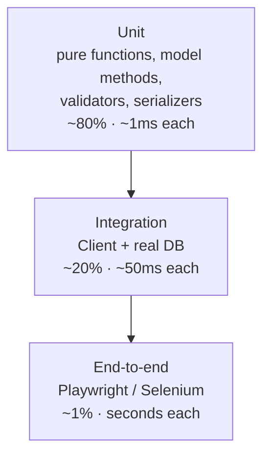

## Learning objectives

- Choose the right test type — unit, integration, or end-to-end — for each piece of Django code.
- Use `TestCase`, `TransactionTestCase`, and pytest-django fixtures and know what each costs.
- Build test data with factories instead of brittle JSON fixtures.
- Test views, forms, models, permissions, Celery tasks, and external HTTP calls.
- Keep a large suite fast: transactions, database reuse, parallelism, and query-count assertions.

## Prerequisites

Django [models](/courses/django/models-and-the-orm), [forms](/courses/django/forms-and-validation), [DRF](/courses/django/drf-apis), and Python [errors and observability](/courses/python/errors-logging-and-observability).

## The shape of a Django test suite

The pyramid, translated into Django vocabulary:



The practical rule: **the more of Django a test loads, the fewer of them you should write.** A validator test that needs no database runs in a millisecond and never flakes. A `LiveServerTestCase` test that drives a browser takes seconds and fails on timing. Both are useful; the ratio is what keeps a suite usable at 2 000 tests.

What actually deserves a test in a Django project:

| Code | Test type | Why |
|---|---|---|
| Validators, pure helpers | unit, no DB | fast, exhaustive edge cases |
| Model methods & properties | unit with DB | they encode business rules |
| Managers/querysets | integration | you're asserting SQL behaviour |
| Forms & serializers | unit with DB | the validation contract |
| Views | integration via `Client`/`APIClient` | status, permissions, side effects |
| Permissions & auth | integration | **the highest-value tests you will write** |
| Migrations | targeted | data migrations especially |
| Celery tasks | unit, called directly | the queue isn't what you're testing |

## `TestCase` and what makes it fast

```python
from django.test import TestCase

class OrderTests(TestCase):
    @classmethod
    def setUpTestData(cls):
        # Runs ONCE for the class, inside an outer atomic block.
        cls.user = User.objects.create_user("ali", password="pw")
        cls.product = Product.objects.create(name="Widget", price=100)

    def setUp(self):
        # Runs before EVERY test method. Keep it tiny.
        self.client.force_login(self.user)

    def test_checkout_creates_order(self):
        response = self.client.post("/checkout/", {"product": self.product.pk, "qty": 2})
        self.assertRedirects(response, "/orders/1/")
        order = Order.objects.get()
        self.assertEqual(order.total, 200)
```

The mechanism that makes this fast: **`TestCase` wraps every test method in a transaction and rolls it back afterwards.** No table truncation, no re-inserting fixtures. `setUpTestData` goes one better — it runs once per class inside an outer transaction, and each test gets a savepoint rollback.

The catch: objects assigned in `setUpTestData` are shared across test methods. Django wraps them so each test gets a fresh copy from the DB (since 3.2), but **in-memory mutations to non-model attributes still leak**. If a test mutates `cls.user.some_cached_thing`, the next test sees it. Treat `setUpTestData` state as read-only.

`TransactionTestCase` disables the wrapping transaction — necessary when your code under test uses transactions itself (`select_for_update`, `on_commit` hooks, or anything checking `transaction.atomic` behaviour). It's **an order of magnitude slower** because it truncates tables between tests. Reach for it only when a test genuinely fails under `TestCase`.

For `on_commit` hooks specifically, you don't need `TransactionTestCase` — use the context manager:

```python
def test_email_sent_after_commit(self):
    with self.captureOnCommitCallbacks(execute=True) as callbacks:
        services.place_order(self.user, self.product)
    self.assertEqual(len(callbacks), 1)
    self.assertEqual(len(mail.outbox), 1)
```

## pytest-django: the ergonomic option

Most teams end up here. Same database machinery, better assertions and fixtures.

```python
import pytest
from django.urls import reverse

pytestmark = pytest.mark.django_db          # module-wide DB access

def test_order_total(order_factory):
    order = order_factory(lines=3)
    assert order.total == sum(l.subtotal for l in order.lines.all())

@pytest.mark.parametrize("qty,expected", [(1, 100), (10, 900), (100, 8000)])
def test_bulk_discount(qty, expected, product):
    assert pricing.total_for(product, qty) == expected

def test_anonymous_cannot_see_orders(client):
    response = client.get(reverse("orders:list"))
    assert response.status_code == 302
    assert "/login/" in response["Location"]
```

Key fixtures: `client`, `admin_client`, `django_user_model`, `rf` (RequestFactory), `settings` (auto-restored overrides), `mailoutbox`, `django_assert_num_queries`.

`pytest.mark.django_db(transaction=True)` is the `TransactionTestCase` equivalent — same cost, same caveat.

## Factories, not fixtures

JSON fixtures (`loaddata`) rot: they encode primary keys, break on every schema change, and force every test to share one dataset. Factories build exactly what a test needs.

```python
import factory
from factory.django import DjangoModelFactory

class UserFactory(DjangoModelFactory):
    class Meta:
        model = User
        django_get_or_create = ["username"]

    username = factory.Sequence(lambda n: f"user{n}")     # unique per call
    email = factory.LazyAttribute(lambda o: f"{o.username}@example.com")
    is_active = True

class OrderFactory(DjangoModelFactory):
    class Meta:
        model = Order

    customer = factory.SubFactory(UserFactory)            # builds the FK too
    status = Order.Status.PENDING

    @factory.post_generation
    def lines(self, create, count, **kwargs):
        if not create or not count:
            return
        LineFactory.create_batch(count, order=self)
```

```python
order = OrderFactory(lines=3, status=Order.Status.PAID)   # intent is readable
```

The discipline that makes factories pay off: **each test states only the fields it cares about.** `OrderFactory(status=PAID)` says "this test is about paid orders" — everything else is noise the factory fills in. When a required field is added to the model, you fix one factory, not 200 tests.

## Testing views, permissions, and APIs

Permissions are where bugs are expensive, so test the matrix explicitly:

```python
@pytest.mark.parametrize("role,expected", [
    ("anonymous", 302), ("user", 403), ("staff", 200), ("owner", 200),
])
def test_order_detail_access(role, expected, client, order, make_user):
    if role != "anonymous":
        client.force_login(order.customer if role == "owner" else make_user(role=role))
    assert client.get(f"/orders/{order.pk}/").status_code == expected
```

For DRF, use `APIClient` and assert on parsed data, not rendered bytes:

```python
def test_create_article(api_client, author):
    api_client.force_authenticate(author)
    response = api_client.post("/api/articles/", {"title": "Hi", "body": "..."} , format="json")
    assert response.status_code == 201
    assert response.data["slug"] == "hi"
    assert Article.objects.filter(author=author).count() == 1

def test_cannot_set_author(api_client, author, other_user):
    """Regression test for mass assignment."""
    api_client.force_authenticate(author)
    response = api_client.post("/api/articles/",
                               {"title": "Hi", "body": "...", "author": other_user.pk},
                               format="json")
    assert Article.objects.get().author == author        # ignored, not honoured
```

Assert the **side effect**, not just the status code. A 201 that didn't write a row, or wrote it with the wrong owner, is exactly the bug you're trying to catch.

## Mocking: what to fake and what never to fake

**Never mock the ORM.** Mocked querysets test your mock, not your SQL. Use the test database — that's what it's for.

**Always fake the outside world**: third-party HTTP, payment gateways, email providers, S3, the clock.

```python
import responses          # or respx for httpx

@responses.activate
def test_payment_declined(order):
    responses.post("https://api.pay.example/charge",
                   json={"status": "declined", "reason": "insufficient_funds"},
                   status=402)
    with pytest.raises(PaymentDeclined) as exc:
        payments.charge(order)
    assert exc.value.reason == "insufficient_funds"
    order.refresh_from_db()
    assert order.status == Order.Status.PAYMENT_FAILED
```

For time, freeze it rather than sleeping:

```python
from freezegun import freeze_time

@freeze_time("2026-01-15 12:00:00")
def test_trial_expiry(subscription):
    assert subscription.days_remaining == 14
```

Django gives you seams for its own I/O: `mail.outbox` with the locmem email backend, `override_settings(CELERY_TASK_ALWAYS_EAGER=True)` for tasks, and `SimpleUploadedFile` plus a `tmp_path` `MEDIA_ROOT` for files.

Celery tasks are best tested as plain functions:

```python
def test_send_digest_task(user, mailoutbox):
    send_digest(user.pk)          # call the function directly — no broker involved
    assert len(mailoutbox) == 1
```

Test *that the view enqueues the task* separately, with a mock on `.delay`. Those are two different behaviours and two different tests.

## Common mistakes

1. **Mocking the ORM** — passes while the SQL is wrong.
2. **`TransactionTestCase` everywhere** — a 30-second suite becomes 10 minutes.
3. **Testing implementation instead of behaviour** — asserting a private method was called, so every refactor breaks the suite.
4. **Shared mutable state in `setUpTestData`** — order-dependent failures that vanish when you run the test alone.
5. **No permission tests** — the most costly production bugs are authorization bugs.
6. **Asserting on rendered HTML strings** — `assertContains(response, "<h1>Order 5</h1>")` breaks on whitespace. Assert on `response.context` or `response.data`.
7. **Hitting the real network** — flaky, slow, and occasionally it charges a real card. Block sockets in CI (`pytest-socket`).
8. **Chasing 100% coverage** — coverage measures lines executed, not assertions made. A test with no `assert` still counts.

## Best practices

- Name tests as sentences: `test_expired_coupon_is_rejected_at_checkout`. The failure output should read like a bug report.
- Arrange–Act–Assert, with blank lines between the three. One behaviour per test.
- Factories over fixtures; `setUpTestData` over `setUp`; direct function calls over HTTP when the HTTP layer isn't the subject.
- Add a **query-count assertion** to every list endpoint — it's how N+1 regressions get caught before users notice.
- Every bug fix starts with a failing test that reproduces it. That test is the permanent proof it stays fixed.
- Keep a `conftest.py` per app; keep fixtures small and composable.
- Run the suite in CI on every push with `--strict-markers`, `-W error::DeprecationWarning`, and a coverage floor that only ever goes up.

## Performance & memory notes

- `--reuse-db` (pytest-django) or `--keepdb` (Django) skips migration replay per run — often the single biggest win, cutting startup from 60 s to 2 s on a mature project.
- `--parallel` / `-n auto` splits across processes with a database per worker; ensure tests don't share filesystem paths or fixed ports.
- `setUpTestData` amortizes setup across a class — moving object creation there from `setUp` routinely halves a class's runtime.
- Use `--create-db` only when migrations changed; wire it to a CI cache key based on the migrations directory hash.
- Password hashing dominates user-heavy suites. Override it in test settings:

```python
PASSWORD_HASHERS = ["django.contrib.auth.hashers.MD5PasswordHasher"]   # test settings ONLY
```

- Prefer `Model(...)` (unsaved) or `build()` in factories when a test doesn't need persistence — no SQL at all.

```python
with django_assert_num_queries(3):
    client.get("/api/articles/")
```

## Production tips

- Run migrations forward **and** backward in CI; a migration that can't be reversed is a deploy that can't be rolled back.
- Add a smoke test that every URL in `urlpatterns` resolves and every management command's `--help` exits 0 — catches import errors that unit tests miss.
- Test with `DEBUG=False`: error pages, `ALLOWED_HOSTS`, and static file handling all behave differently.
- Use a separate settings module for tests (`DJANGO_SETTINGS_MODULE=config.settings.test`) that disables caching backends, uses locmem email, and points `MEDIA_ROOT` at a temp dir.
- Ship a `pytest.ini` with `--strict-markers` and `filterwarnings = error` so deprecations surface on your schedule, not Django's release day.
- Consider a nightly job that runs the suite against the *next* Django version — upgrades stop being projects.

## Interview questions

1. **"Why is `TestCase` faster than `TransactionTestCase`?"** — Transaction + rollback per test versus truncating tables and reloading; explain when you're forced into the slow one (`on_commit`, `select_for_update`, autocommit-dependent code).
2. **"How do you test code that calls a payment API?"** — Fake at the HTTP boundary (`responses`/`respx`), assert both the happy path and each failure mode's effect on your own state. Never call the real service.
3. **"Fixtures or factories?"** — Factories: fixtures couple to schema and PKs, share one dataset, and rot. Factories express per-test intent.
4. **"How do you stop N+1 regressions?"** — `assertNumQueries`/`django_assert_num_queries` around list endpoints, plus `django-debug-toolbar` locally and query logging in staging.
5. **"What does 90% coverage tell you?"** — That 90% of lines executed, not that behaviour is correct. Useful as a floor and as a map of untested modules; useless as a quality target.

## Summary

- Test type follows cost: many fast unit tests, fewer integration tests, very few browser tests.
- `TestCase` + `setUpTestData` is the fast default; `TransactionTestCase` only when transactions are the subject.
- Factories express per-test intent; fixtures rot.
- Mock the outside world, never the ORM; assert side effects, not just status codes.
- Permission matrices and query-count assertions are the highest-value tests in a Django codebase.

## Exercises

**Easy**

1. Write tests for a `slugify_unique()` helper covering: plain title, duplicate title, title of only punctuation, 300-character title.
2. Test that an anonymous GET to a login-required view redirects to `/login/` with the correct `?next=`.

**Medium**

3. Build `UserFactory`, `OrderFactory`, and `LineFactory` with `SubFactory` and `post_generation`, then rewrite three existing fixture-based tests to use them. Compare line counts.
4. Write the full permission matrix for an `Order` detail view: anonymous, other user, owner, staff, superuser — parametrized, five assertions, one test function.

**Hard**

5. Take a list endpoint that does 60 queries for 20 rows and: (a) write a failing `assertNumQueries(3)` test, (b) fix the view with `select_related`/`prefetch_related`/`annotate`, (c) confirm the test passes. Then add a second test proving the *response payload is unchanged* — refactoring safety.

**Debugging exercise**

6. This test passes alone and fails in the full suite. Explain why and fix it:

```python
class CouponTests(TestCase):
    @classmethod
    def setUpTestData(cls):
        cls.coupon = Coupon.objects.create(code="SAVE10", uses_left=1)

    def test_redeem(self):
        self.coupon.redeem()
        self.assertEqual(self.coupon.uses_left, 0)

    def test_redeem_twice_fails(self):
        self.coupon.redeem()
        with self.assertRaises(CouponExhausted):
            self.coupon.redeem()
```

**Refactoring exercise**

7. Given a 200-line test module with heavy `setUp`, JSON fixtures, and asserts on raw HTML: convert to factories, move shared objects to `setUpTestData`, and replace HTML assertions with `response.context` checks. Measure runtime before and after.

**Mini project**

Set up a complete testing pipeline for an existing Django project: pytest-django with `--reuse-db` and `-n auto`, factories for every model, a `conftest.py` fixture hierarchy, `responses` blocking all outbound HTTP, coverage with a ratcheting floor, migration round-trip checks, and a GitHub Actions workflow that runs it in under two minutes. Document how a new contributor writes their first test.

## Quiz

<details>
<summary>1. Why does <code>setUpTestData</code> beat <code>setUp</code> for shared objects?</summary>
It runs once per test class inside an outer transaction; each test rolls back to a savepoint. <code>setUp</code> re-creates everything per test method.
</details>

<details>
<summary>2. When are you forced to use <code>TransactionTestCase</code>?</summary>
When the code under test depends on real transaction behaviour — <code>select_for_update</code>, explicit commits, or database-level concurrency. For <code>on_commit</code> alone, <code>captureOnCommitCallbacks</code> is enough.
</details>

<details>
<summary>3. Why is mocking a queryset a bad idea?</summary>
Query correctness is the thing you're testing. A mock returns whatever you told it to and stays green while the real SQL filters the wrong rows.
</details>

<details>
<summary>4. How do you test a Celery task without a broker?</summary>
Call the task function directly. Separately test that the view calls <code>.delay()</code>, with <code>.delay</code> mocked — two behaviours, two tests.
</details>

<details>
<summary>5. What's wrong with <code>assertContains(response, "&lt;h1&gt;Welcome&lt;/h1&gt;")</code>?</summary>
It asserts on markup, so any template or whitespace change breaks it without any behaviour changing. Assert on <code>response.context</code>, <code>response.data</code>, or the database instead.
</details>

## Further reading

- Django docs — "Testing in Django", "Advanced testing topics"
- pytest-django documentation — fixtures and database configuration
- factory_boy documentation — `SubFactory`, `post_generation`, `Trait`
- Gerard Meszaros, *xUnit Test Patterns* — the vocabulary (fixture, stub, mock, fake) used above
