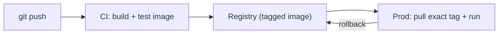

## Learning objectives

- Separate **development** and **production** container configs cleanly.
- Build images in **CI** and push to a **registry** with good tags.
- Understand the dev→prod delivery pipeline.
- Ship a capstone: a Dockerized FastAPI + Postgres + Nginx stack.

## Prerequisites

Every prior Docker lesson. This one ties them into a real delivery workflow.

## The core idea in one line

> Dev optimizes for **fast feedback** (hot reload, live code); prod optimizes for **safety and speed** (immutable images, hardened, tested) — one codebase, two configurations.

**Analogy — a rehearsal vs opening night.** Rehearsal (dev) is flexible: actors improvise, you stop and restart, scripts change live (bind-mounted code, hot reload). Opening night (prod) is locked: the exact rehearsed performance, no improvisation, everything hardened and timed (an immutable, tested image). Same play, deliberately different setup — you'd never run opening night like a rehearsal, or vice versa.

## Dev vs prod, side by side

| | Development | Production |
|---|---|---|
| Code | Bind-mounted (live edits) | Baked into the image (immutable) |
| Server | `--reload` / dev server | Gunicorn/Uvicorn workers |
| Image | Fat is fine | Multi-stage, slim, non-root |
| Secrets | `.env` file | Secrets manager |
| Restart | Manual | `unless-stopped` + healthchecks |
| Goal | Fast feedback | Reliability & security |

## Compose overrides — one stack, two modes

Compose merges a base file with an override. `compose.yaml` holds the shared definition; `compose.override.yaml` (auto-loaded) adds dev conveniences:

```yaml
# compose.yaml  (base — production-shaped)
services:
  web:
    build: .
    restart: unless-stopped
    environment:
      DATABASE_URL: postgresql://app:secret@db:5432/app
```

```yaml
# compose.override.yaml  (dev only — auto-merged by `docker compose up`)
services:
  web:
    build:
      target: dev
    volumes:
      - .:/app                 # live code
    command: ["uvicorn", "app.main:app", "--reload", "--host", "0.0.0.0"]
```

```bash
docker compose up                                   # dev (base + override)
docker compose -f compose.yaml up -d                # prod (base only, no override)
```

Dev gets hot reload and mounted code; prod runs the immutable image with workers — from the same base file.

## Building in CI and pushing to a registry

Production images should be built by **CI**, tagged, and pushed to a registry (Docker Hub, GHCR, ECR):

```bash
docker build -t registry.example.com/myapp:1.4.2 .   # semantic version tag
docker build -t registry.example.com/myapp:$GIT_SHA .# also tag with the commit
docker push registry.example.com/myapp:1.4.2
```

```yaml
# .github/workflows/build.yml (sketch)
- run: docker build -t ghcr.io/org/myapp:${{ github.sha }} .
- run: docker push ghcr.io/org/myapp:${{ github.sha }}
```

Tagging rules:
- **Never rely on `latest`** for deploys — pin an immutable tag (version or commit SHA) so you know exactly what's running and can roll back.
- Tag with both a semantic version and the git SHA for traceability.



## The production run

On the server (or orchestrator), pull the exact tag and run with the prod config:

```bash
docker compose -f compose.yaml pull
docker compose -f compose.yaml up -d
```

Immutable image + external state (volumes/DB) means deploys are just "pull new tag, restart," and rollbacks are "run the previous tag."

## Capstone: deploy a real stack

Build and deploy **FastAPI + Postgres + Nginx**, applying the whole course:

- **Multi-stage, slim, non-root** image for the API (optimization + security lessons).
- **Cache-friendly Dockerfile** and `.dockerignore` (images lesson).
- **Entrypoint** running migrations before serving (dockerizing lesson).
- **Compose**: API + Postgres (named volume, healthcheck) + Nginx (only public port) (compose + postgres/nginx lessons).
- **Healthchecks + restart policy + resource limits** (debugging lesson).
- **Dev override** for hot reload; **prod base** for the immutable run (this lesson).
- **CI build** pushing a SHA-tagged image to a registry.

```yaml
# compose.yaml (capstone, production-shaped)
services:
  nginx:
    image: nginx:1.27-alpine
    ports: ["80:80"]
    volumes: ["./nginx.conf:/etc/nginx/conf.d/default.conf:ro", "static:/static:ro"]
    depends_on: [web]
    restart: unless-stopped
  web:
    image: ghcr.io/org/myapp:${TAG:-latest}
    expose: ["8000"]
    environment:
      DATABASE_URL: postgresql://app:secret@db:5432/app
    depends_on:
      db: { condition: service_healthy }
    restart: unless-stopped
    deploy: { resources: { limits: { cpus: "1", memory: 512M } } }
  db:
    image: postgres:16
    environment: { POSTGRES_USER: app, POSTGRES_PASSWORD: secret, POSTGRES_DB: app }
    volumes: ["pgdata:/var/lib/postgresql/data"]
    healthcheck: { test: ["CMD-SHELL", "pg_isready -U app"], interval: 5s, retries: 5 }
    restart: unless-stopped
volumes: { pgdata: {}, static: {} }
```

## Common mistakes

1. **Same config for dev and prod** — either prod has hot-reload/dev-server (insecure) or dev is painfully slow.
2. **Deploying `latest`** — you can't tell what's running or roll back cleanly.
3. **Building images on the production host** — build in CI; ship artifacts.
4. **Baking secrets/config for one environment** — parameterize via env; one image, many environments.
5. **No rollback plan** — keep previous tags; deploy = pull tag, rollback = run old tag.

## Interview questions

1. **"How do you differ dev vs prod with Docker?"** — Same base image; dev mounts code + hot reload via a Compose override, prod runs the immutable image with real workers.
2. **"Why not deploy `latest`?"** — It's ambiguous and unrepeatable; pin a version/SHA tag for traceability and rollback.
3. **"Where should images be built?"** — In CI, then pushed to a registry; hosts pull the exact tag.
4. **"How do rollbacks work with immutable images?"** — Re-run the previous tag; state lives in volumes/DB, so app rollback is just an image swap.

## Summary

- One codebase, two configs: dev for fast feedback, prod for immutable safety — via Compose overrides.
- Build in CI, tag with version + SHA, push to a registry; never deploy `latest`.
- Deploy by pulling the exact tag; roll back by running the previous one.
- The capstone combines every lesson into a real FastAPI + Postgres + Nginx deployment.

## Exercises

**Easy**

1. Split a Compose setup into `compose.yaml` (prod-shaped) and `compose.override.yaml` (dev: mounted code + `--reload`). Run each.
2. Tag an image with both a version and a git SHA; explain why over `latest`.

**Intermediate**

3. Write a CI step (GitHub Actions or a shell script) that builds and pushes a SHA-tagged image.
4. Demonstrate a rollback: deploy tag A, deploy tag B, then redeploy tag A — with data intact via the volume.

**Advanced**

5. Parameterize the stack for three environments (dev/staging/prod) using env vars and override files, changing zero application code.

**Debugging**

6. Prod accidentally ran the dev override (hot-reload server). Explain the risk and how the base/override split prevents it.

**Mini project (capstone)**

Ship the full FastAPI + Postgres + Nginx stack: multi-stage non-root image, cache-friendly Dockerfile, migration entrypoint, healthchecked DB with a named volume, Nginx as the only public port, dev override for hot reload, and a CI job that builds and pushes a SHA-tagged image. Write a README with the architecture diagram, a deploy command, and a rollback command.

## Quiz

<details>
<summary>1. How does Compose apply dev-only settings automatically?</summary>
`compose.override.yaml` is auto-merged by `docker compose up`; run prod with only `-f compose.yaml`.
</details>

<details>
<summary>2. Why tag images with a version/SHA instead of `latest`?</summary>
Immutable, traceable deploys — you know exactly what's running and can roll back to a specific tag.
</details>

<details>
<summary>3. Where should production images be built?</summary>
In CI, then pushed to a registry; production hosts pull the exact tag.
</details>

<details>
<summary>4. With immutable images, how do you roll back?</summary>
Run the previous image tag; application state lives in volumes/DB, so it's just an image swap.
</details>

## Further reading

- Docker docs: Compose overrides, registries, CI integration
- Twelve-Factor App (config, build/release/run)
- You've completed the course — deploy your [AI capstone](/courses/ai-python/capstone-ai-assistant) with this stack!
