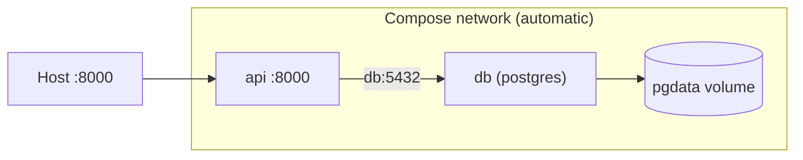

## Learning objectives

- Define a multi-container stack in one **`compose.yaml`**.
- Use `depends_on`, `environment`, `volumes`, and `healthcheck`.
- Run the everyday Compose workflow (`up`, `down`, `logs`, `exec`).
- Understand how Compose wires networking and naming for free.

## Prerequisites

[Volumes & Networks](/courses/docker-python/volumes-and-networks). Compose automates what you did by hand there.

## The core idea in one line

> **Docker Compose** describes your whole stack — app, database, cache, proxy — in one YAML file and starts it all with a single command, wiring networking and names automatically.

**Analogy — a stage crew from one script.** Running containers by hand is directing every actor, light, and prop yourself, live. Compose is a single script the whole crew follows: "API enters here, database is already on stage, they're connected, lights on port 8000." One `docker compose up` and the entire production runs, correctly, every time.

## A real Compose file

```yaml
# compose.yaml
services:
  api:
    build: .                         # build from local Dockerfile
    ports:
      - "8000:8000"                  # publish API to host
    environment:
      DATABASE_URL: postgresql://app:secret@db:5432/app   # 'db' = service name!
    depends_on:
      db:
        condition: service_healthy   # wait until db is actually ready
    volumes:
      - .:/app                       # bind mount for live dev

  db:
    image: postgres:16
    environment:
      POSTGRES_USER: app
      POSTGRES_PASSWORD: secret
      POSTGRES_DB: app
    volumes:
      - pgdata:/var/lib/postgresql/data    # named volume: persist data
    healthcheck:
      test: ["CMD-SHELL", "pg_isready -U app"]
      interval: 5s
      retries: 5

volumes:
  pgdata:                            # declare the named volume
```

## What Compose does for you

- Creates a **shared network** so `api` can reach `db` by service name (`db:5432`) — no manual `docker network create`.
- Names containers predictably (`project-api-1`).
- Manages **named volumes** and their lifecycle.
- Orders startup with `depends_on` (and waits for health with `condition: service_healthy`).



## The everyday workflow

```bash
docker compose up -d          # build (if needed) and start everything, detached
docker compose ps             # status of all services
docker compose logs -f api    # follow one service's logs
docker compose exec api bash  # shell into the api service
docker compose down           # stop and remove containers + network
docker compose down -v        # ...and delete named volumes (destroys data!)
docker compose up --build     # force a rebuild
```

`up`/`down` are your bread and butter. `down -v` wipes volumes — never run it on data you care about.

## `depends_on` and health

`depends_on` alone only waits for the container to *start*, not for the app inside to be *ready*. A database process can be up while Postgres is still initializing. Use a **healthcheck** + `condition: service_healthy` so your API doesn't crash trying to connect to a not-yet-ready database.

## Environment and secrets

```yaml
    env_file:
      - .env                  # load variables from a file (keep it in .gitignore!)
```

Keep secrets out of the committed YAML; use `.env` (gitignored) in dev and real secrets management in prod. Never commit passwords.

## Common mistakes

1. **`depends_on` without a healthcheck** — the API races the database and crashes on startup.
2. **`down -v` by habit** — deletes your database volume.
3. **Hardcoding secrets in `compose.yaml`** — use `.env`/secrets and gitignore it.
4. **Publishing every service's ports** — only the edge needs host ports; keep db/redis internal.
5. **Using `localhost` in the connection string** — use the **service name** (`db`), since each service is its own container.

## Performance & workflow notes

- Compose is for a **single host** (dev, small deployments); multi-host orchestration is Kubernetes/Swarm territory.
- Named volumes + healthchecks make `up` reproducible — the same stack, every time, on any machine.
- Bind-mounting code enables hot-reload dev; you'll split dev vs prod configs in a later lesson.

## Interview questions

1. **"What does Docker Compose solve?"** — Defining and running a multi-container stack from one file, with automatic networking, naming, and volumes.
2. **"How do services communicate in Compose?"** — By service name over the auto-created network (e.g. `db:5432`).
3. **"Why isn't `depends_on` enough?"** — It waits for start, not readiness; pair it with a healthcheck and `condition: service_healthy`.
4. **"What does `docker compose down -v` do?"** — Removes containers, network, **and named volumes** — deleting persisted data.

## Summary

- Compose declares the whole stack in `compose.yaml` and runs it with one command.
- It auto-creates the network (service-name DNS), names containers, and manages volumes.
- Use healthchecks with `depends_on` for correct startup ordering.
- Keep secrets in `.env`; publish only edge ports; beware `down -v`.

## Exercises

**Easy**

1. Write a Compose file with an `api` (built locally) and a `db` (postgres) and bring it up with `docker compose up`.
2. Follow the api logs and `exec` a shell into it.

**Intermediate**

3. Add a named volume for Postgres and prove data persists across `docker compose down` (without `-v`) and `up`.
4. Add a healthcheck to `db` and make `api` wait for `service_healthy`.

**Advanced**

5. Extend the stack with Redis; connect the api to both db and redis by service name, keeping their ports internal.

**Debugging**

6. The api crashes on startup with "connection refused" to the database, but the db container is running. Diagnose (readiness race) and fix with a healthcheck.

**Mini project**

Build a Compose stack for a FastAPI app + Postgres + Redis: named volume for the DB, healthchecks, `.env` for secrets, only the API port published. Provide `make up`/`make down` shortcuts and a README documenting the workflow.

## Quiz

<details>
<summary>1. How do you start a whole Compose stack?</summary>
`docker compose up -d` — builds if needed and starts all services detached.
</details>

<details>
<summary>2. How does the api reach the db in Compose?</summary>
By the service name on the auto-created network, e.g. `db:5432`.
</details>

<details>
<summary>3. Why add a healthcheck alongside `depends_on`?</summary>
`depends_on` waits for start, not readiness; a healthcheck + `service_healthy` waits until the dependency actually accepts connections.
</details>

<details>
<summary>4. What does `down -v` remove that `down` doesn't?</summary>
Named volumes — deleting persisted data. Use with care.
</details>

## Further reading

- Docker docs: Compose specification and CLI
- Next lesson: [Dockerizing FastAPI & Django](/courses/docker-python/dockerizing-fastapi-django)
