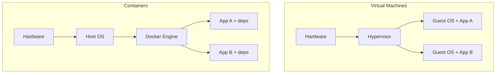
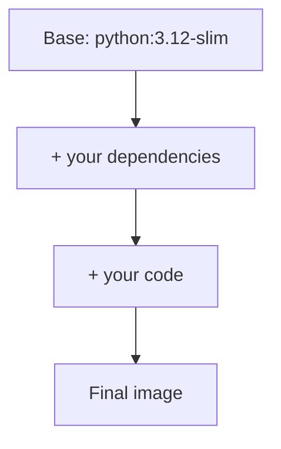

## Learning objectives

- Explain what a container is and how it differs from a virtual machine.
- Distinguish **images** from **containers** and understand the **layered** filesystem.
- Run, list, stop, and remove containers with the core CLI.
- Run your first Python container.

## Prerequisites

Comfortable running terminal commands and basic Python. Docker installed (Docker Desktop or Engine).

## The core idea in one line

> A **container** packages your app *and everything it needs to run* into an isolated process, so it behaves identically on your laptop, a colleague's machine, and production.

**Analogy — shipping containers.** Before standardized containers, cargo was loaded piece by piece — slow, and what worked on one ship broke on the next. The shipping container standardized the box: any crane, ship, or truck handles it identically, regardless of what's inside. Docker does this for software: your app + its dependencies go in a standard box that runs the same on any machine with Docker. "It works on my machine" dies here.

## Containers vs virtual machines



- A **VM** virtualizes hardware and runs a **full guest OS** per app — heavy (GBs, minutes to boot).
- A **container** shares the host kernel and isolates just the process — light (MBs, milliseconds to start).

| | VM | Container |
|---|---|---|
| Boots | Full OS (minutes) | Process (ms) |
| Size | GBs | MBs |
| Isolation | Strong (own kernel) | Process-level (shared kernel) |
| Density | Few per host | Many per host |

Containers give you most of the isolation at a fraction of the cost — which is why modern deployment is container-based.

## Images vs containers

This distinction trips up every beginner:

- An **image** is a read-only *template* — a snapshot of a filesystem + metadata (like a class, or a cake recipe).
- A **container** is a running *instance* of an image (like an object, or an actual cake). You can run many containers from one image.

```bash
docker pull python:3.12-slim     # download an image
docker run python:3.12-slim python -c "print('hi')"   # create+run a container from it
```

## Layers — the filesystem trick

Images are built from stacked, cached **layers**. Each instruction in a build adds a layer; layers are shared across images.



- Layers are **cached and reused** — if only your code changed, Docker rebuilds just that layer, not the dependencies.
- Layers are **shared** — ten images on the same base share that base on disk once.
- This makes builds fast and images space-efficient (a huge deal, explored in the optimization lesson).

## The essential CLI

```bash
docker run -d -p 8000:8000 --name web myimage   # run detached, map port
docker ps                     # running containers
docker ps -a                  # all, including stopped
docker logs web               # see its output
docker exec -it web bash      # shell inside a running container
docker stop web && docker rm web   # stop and remove
docker images                 # local images
docker rmi myimage            # remove an image
```

- `-d` detached (background), `-p host:container` publishes a port, `--name` names it.
- `docker exec -it ... bash` is your window into a running container — indispensable for debugging.

## Your first Python container

```bash
# Run a Python REPL in a throwaway container
docker run -it --rm python:3.12-slim python

# Run a one-off script from the current directory
docker run --rm -v "$PWD:/app" -w /app python:3.12-slim python script.py
```

`--rm` auto-removes the container when it exits; `-v` mounts your code; `-w` sets the working directory. You just ran Python without installing it on your host.

## Common mistakes

1. **Confusing image and container** — you `run` an image to get a container; you can have many containers from one image.
2. **Forgetting `-p`** — the app runs but you can't reach it from the host.
3. **Leaving stopped containers/images around** — they eat disk; `docker system prune` cleans up.
4. **Expecting data to persist** — a removed container loses its writable layer (volumes fix this — later lesson).
5. **`docker run` when you meant `docker exec`** — `run` starts a *new* container; `exec` enters a running one.

## Performance & resource notes

- Containers start in milliseconds and add negligible CPU overhead vs running the process directly.
- Shared layers mean disk usage is far lower than the sum of image sizes.
- Each container is a process; hundreds can run on one host (unlike VMs).

## Interview questions

1. **"Container vs VM?"** — Containers share the host kernel and isolate a process (light, fast); VMs virtualize hardware with a full guest OS (heavy).
2. **"Image vs container?"** — Image is a read-only template; a container is a running instance of it. One image → many containers.
3. **"What are layers?"** — Stacked, cached, shareable filesystem diffs; unchanged layers are reused, making builds fast and images compact.
4. **"How do you debug a running container?"** — `docker logs` for output and `docker exec -it <name> bash` for a shell inside it.

## Summary

- Containers package app + dependencies into a light, portable, isolated process — the shipping-container idea for software.
- They share the host kernel (unlike VMs), so they're fast and dense.
- An image is a template; a container is a running instance; images are built from cached, shared layers.
- The core CLI (`run`, `ps`, `logs`, `exec`, `stop`, `rm`) is your daily toolkit.

## Exercises

**Easy**

1. Run `python:3.12-slim`, print the Python version, and let the container auto-remove with `--rm`.
2. Run an `nginx` container detached with `-p 8080:80` and open it in a browser.

**Intermediate**

3. Start a detached container, view its logs, `exec` into it with a shell, then stop and remove it.
4. List all containers (including stopped) and all local images; then prune stopped containers.

**Advanced**

5. Explain, using layers, why rebuilding after changing one line of code is fast but changing the base image is slow.

**Debugging**

6. A teammate says "the container runs but the website won't load." Given they used `docker run -d myimage` with no `-p`, diagnose and fix.

**Mini project**

Use only the CLI (no Dockerfile yet): run a Python container, mount a local script with `-v`, execute it, then run an interactive session and install a package inside — observing that the change vanishes when the container is removed. Write down what persisted and what didn't, and why.

## Quiz

<details>
<summary>1. Do containers include a full guest OS?</summary>
No — they share the host kernel and isolate only the process, unlike VMs.
</details>

<details>
<summary>2. What's the difference between an image and a container?</summary>
An image is a read-only template; a container is a running instance created from it.
</details>

<details>
<summary>3. Why are Docker builds often fast?</summary>
Layers are cached and reused — unchanged layers (like installed dependencies) aren't rebuilt.
</details>

<details>
<summary>4. How do you get a shell inside a running container?</summary>
`docker exec -it <name> bash` (or `sh`).
</details>

## Further reading

- Docker docs: "Get Started", the CLI reference
- Next lesson: [Images & the Dockerfile](/courses/docker-python/images-and-dockerfile)
