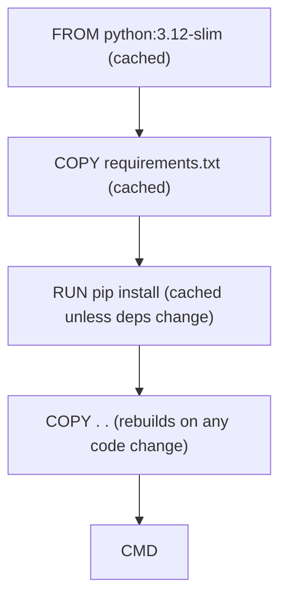

## Learning objectives

- Write a clean **Dockerfile** for a Python app.
- Understand every important instruction (`FROM`, `RUN`, `COPY`, `CMD`…).
- Exploit the **build cache** with correct instruction ordering.
- Choose a base image and use **.dockerignore**.

## Prerequisites

[Docker Fundamentals](/courses/docker-python/docker-fundamentals). You can run containers; now you'll build your own images.

## The core idea in one line

> A **Dockerfile** is a recipe: each instruction adds a cached layer, and the order of instructions decides how fast your rebuilds are.

**Analogy — a recipe card.** A Dockerfile is a recipe read top to bottom: start with a base (a pre-made cake mix = `FROM`), add ingredients (`RUN pip install`), pour in your batter (`COPY` your code), and set the oven instruction for serving (`CMD`). And like a smart cook, you prep the slow, rarely-changing parts first so you don't redo them every time you tweak the frosting.

## A first Dockerfile

```dockerfile
FROM python:3.12-slim              # base image
WORKDIR /app                       # set + create working directory
COPY requirements.txt .            # copy deps manifest first (cache!)
RUN pip install --no-cache-dir -r requirements.txt
COPY . .                           # copy the rest of the code
EXPOSE 8000                        # document the port (informational)
CMD ["python", "app.py"]           # default command when the container runs
```

Build and run it:

```bash
docker build -t myapp .            # build image tagged 'myapp' from current dir
docker run --rm -p 8000:8000 myapp
```

## The instructions that matter

| Instruction | Purpose |
|---|---|
| `FROM` | Base image to build on |
| `WORKDIR` | Set (and create) the working directory |
| `COPY` / `ADD` | Copy files in (`COPY` unless you need `ADD`'s URL/tar features) |
| `RUN` | Execute a command at **build** time (installs, etc.) — creates a layer |
| `ENV` | Set environment variables |
| `EXPOSE` | Document a port (doesn't publish it — `-p` does) |
| `CMD` | Default command at **run** time (one per file; overridable) |
| `ENTRYPOINT` | Fixed executable; args from `CMD`/CLI appended |

`RUN` vs `CMD` is a classic confusion: **`RUN` happens while building the image; `CMD` happens when you start a container.**

## The build cache — order for speed

Docker caches each layer and reuses it until an instruction (or its inputs) changes; **everything after a changed layer is rebuilt.** So put stable things early, volatile things late:

```dockerfile
# GOOD — deps cached across code changes
COPY requirements.txt .
RUN pip install --no-cache-dir -r requirements.txt   # rebuilds only when deps change
COPY . .                                              # code changes don't bust deps

# BAD — any code change reinstalls all dependencies (slow!)
COPY . .
RUN pip install --no-cache-dir -r requirements.txt
```



This single ordering trick turns minute-long rebuilds into seconds. It's the most important Dockerfile skill.

## Choosing a base image

| Base | Size | Notes |
|---|---|---|
| `python:3.12` | ~1 GB | Full toolchain; rarely needed |
| `python:3.12-slim` | ~150 MB | **The sensible default** for most apps |
| `python:3.12-alpine` | ~50 MB | Tiny, but musl libc can break wheels & slow pip builds |

Start with **slim**. Alpine is tempting for size but its different C library (`musl`) often forces slow source builds of packages that ship prebuilt wheels for glibc — a common footgun.

## .dockerignore

Keep junk out of the build context (and image): it speeds builds and avoids leaking secrets.

```gitignore
# .dockerignore
__pycache__/
*.pyc
.git
.env
venv/
node_modules/
```

Without this, `COPY . .` drags your `.git`, virtualenv, and possibly a `.env` full of secrets into the image. Always add one.

## Common mistakes

1. **`COPY . .` before installing deps** — busts the cache on every code change.
2. **No `.dockerignore`** — bloated context, leaked `.env`, slow builds.
3. **Alpine by reflex** — broken/slow builds for packages without musl wheels.
4. **`RUN pip install` without `--no-cache-dir`** — extra megabytes of pip cache in the image.
5. **Multiple `CMD`s** — only the last takes effect; confusion ensues.

## Performance & size

- Correct layer ordering is the biggest build-speed lever.
- `--no-cache-dir` and slim bases keep images lean; combine `RUN` steps to reduce layer count where sensible.
- The build *context* (everything in the directory) is sent to the daemon — `.dockerignore` shrinks it.

## Interview questions

1. **"`RUN` vs `CMD`?"** — `RUN` executes at build time (creates layers); `CMD` sets the default command at container start.
2. **"Why copy `requirements.txt` before the code?"** — So the dependency-install layer stays cached across code changes, making rebuilds fast.
3. **"slim vs alpine?"** — slim (glibc) is the safe default; alpine is smaller but musl can break/slow package installs.
4. **"What does `.dockerignore` do?"** — Excludes files from the build context/image — faster builds and no leaked secrets.

## Summary

- A Dockerfile is layered instructions; `FROM`, `WORKDIR`, `COPY`, `RUN`, `CMD` are the core.
- Order for cache: stable deps first, volatile code last.
- Prefer `python:3.12-slim`; be wary of alpine's musl surprises.
- Always add a `.dockerignore`.

## Exercises

**Easy**

1. Write a Dockerfile for a one-file Python script and build+run it.
2. Add a `.dockerignore` excluding `__pycache__`, `.git`, and `.env`; rebuild and note the faster context upload.

**Intermediate**

3. Reorder a "bad" Dockerfile (code copied before deps) into the cache-friendly order; time both rebuilds after a code change.
4. Add `ENV` and `EXPOSE`, and switch `CMD` from shell form to exec form (`["python","app.py"]`); explain the difference.

**Advanced**

5. Compare image sizes for the same app on `python:3.12`, `-slim`, and `-alpine`; note build time and any package failures on alpine.

**Debugging**

6. A colleague's rebuilds are slow: every code change reinstalls all dependencies. Given their Dockerfile does `COPY . .` then `RUN pip install`, diagnose and fix.

**Mini project**

Dockerize a small Flask/FastAPI "hello" app: cache-friendly Dockerfile, slim base, `.dockerignore`, `EXPOSE`, and a proper `CMD`. Build it, run it, and confirm a one-line code change rebuilds in seconds thanks to caching.

## Quiz

<details>
<summary>1. Which instruction runs when the container starts, not when it builds?</summary>
`CMD` (and/or `ENTRYPOINT`) — `RUN` runs at build time.
</details>

<details>
<summary>2. Why copy requirements before the app code?</summary>
To keep the dependency-install layer cached across code changes, so rebuilds are fast.
</details>

<details>
<summary>3. What's the sensible default base for Python apps?</summary>
`python:3.12-slim` — small but glibc-based, avoiding alpine's musl build issues.
</details>

<details>
<summary>4. What belongs in `.dockerignore`?</summary>
Build junk and secrets: `__pycache__`, `.git`, `.env`, virtualenvs — to shrink context and avoid leaks.
</details>

## Further reading

- Docker docs: Dockerfile reference, "Best practices for writing Dockerfiles"
- Next lesson: [Volumes & Networks](/courses/docker-python/volumes-and-networks)
