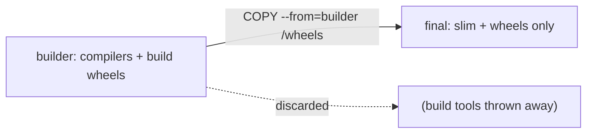

## Learning objectives

- Shrink images dramatically with **multi-stage builds**.
- Order layers and use BuildKit cache mounts for fast builds.
- Understand what actually bloats a Python image and how to trim it.
- Measure image size and build time so optimization is data-driven.

## Prerequisites

[Images & the Dockerfile](/courses/docker-python/images-and-dockerfile).

## The core idea in one line

> A **multi-stage build** uses a heavy "builder" image to compile/install, then copies only the finished artifacts into a tiny final image — you ship the cake, not the whole kitchen.

**Analogy — cooking then plating.** You need a messy kitchen full of tools and raw ingredients to *make* the dish (the builder stage: compilers, build tools, caches). But you don't serve the customer the kitchen — you plate just the finished dish on a clean plate (the final stage). Multi-stage builds throw away the kitchen and ship only the plate, so the image is a fraction of the size.

## The problem: build tools bloat the image

Installing many Python packages needs compilers and headers (`gcc`, `build-essential`) that your app doesn't need at *runtime* — but they linger in a single-stage image, adding hundreds of MB.

## The multi-stage solution

```dockerfile
# ---- Stage 1: builder (has compilers) ----
FROM python:3.12-slim AS builder
WORKDIR /app
RUN pip install --no-cache-dir --upgrade pip
COPY requirements.txt .
# Build wheels into a directory
RUN pip wheel --no-cache-dir --wheel-dir /wheels -r requirements.txt

# ---- Stage 2: final (slim, no build tools) ----
FROM python:3.12-slim
WORKDIR /app
COPY --from=builder /wheels /wheels                 # copy just the built wheels
RUN pip install --no-cache-dir /wheels/*            # install from wheels, no compiler
COPY . .
EXPOSE 8000
CMD ["gunicorn", "app.main:app", "-k", "uvicorn.workers.UvicornWorker", "-b", "0.0.0.0:8000"]
```

The final image contains your app + installed packages, but **none** of the build toolchain. Same functionality, far smaller.



## Layer ordering (recap, applied)

Cache still matters within each stage: copy `requirements.txt` and install **before** copying code, so dependency layers stay cached across code changes.

## BuildKit cache mounts

Modern Docker (BuildKit) can cache the pip download cache *between builds* without baking it into the image:

```dockerfile
# syntax=docker/dockerfile:1
RUN --mount=type=cache,target=/root/.cache/pip \
    pip install -r requirements.txt
```

The cache persists across builds (faster) but isn't stored in the image (smaller). Best of both.

## What bloats a Python image — and the fixes

| Bloat | Fix |
|---|---|
| Build tools (`gcc`, headers) | Multi-stage; keep them in the builder only |
| pip download cache | `--no-cache-dir` and/or BuildKit cache mount |
| Fat base image | Use `-slim` (or distroless for extreme cases) |
| `.git`, venv, `__pycache__` | `.dockerignore` |
| Copying everything then deleting | Never added = smaller; deletes don't shrink prior layers |

> [!WARNING]
> Deleting files in a *later* layer doesn't shrink earlier layers — the bytes still live in the image history. Avoid adding them in the first place (multi-stage, `.dockerignore`), don't add-then-`rm`.

## Measuring — optimize with data

```bash
docker images myapp             # see the size
docker history myapp            # per-layer sizes — find the bloat
docker build -t myapp .         # note build time
```

`docker history` shows which layer is huge — optimize *that* one. Guessing wastes effort; measure before and after every change.

## Common mistakes

1. **Single-stage with build tools** — hundreds of wasted MB.
2. **`add-then-rm` to "clean up"** — earlier layers still carry the bytes.
3. **Alpine to save size, then fighting musl build failures** — slim + multi-stage is usually smaller *and* smoother.
4. **No `.dockerignore`** — context bloat and accidental secrets.
5. **Over-optimizing a rarely-built image** — spend effort where it pays.

## Performance & size

- Multi-stage routinely turns a ~1 GB image into ~150–250 MB — faster pulls, deploys, and cold starts.
- Smaller images reduce attack surface (fewer packages = fewer CVEs) — a security win too.
- BuildKit cache mounts cut rebuild times without inflating the image.

## Interview questions

1. **"What is a multi-stage build?"** — A Dockerfile with multiple `FROM` stages; a builder compiles/installs and the final stage copies only the artifacts, excluding build tools.
2. **"Why doesn't deleting files reduce image size?"** — Layers are immutable; a delete in a later layer leaves the bytes in earlier layers' history.
3. **"How do you find what's bloating an image?"** — `docker history` (per-layer sizes) and `docker images` (total).
4. **"Multi-stage vs alpine for size?"** — Multi-stage on slim is usually smaller and avoids alpine's musl build problems.

## Summary

- Multi-stage builds ship artifacts, not the build toolchain — dramatically smaller images.
- Keep layer order cache-friendly; use BuildKit cache mounts for fast, lean builds.
- Bloat comes from build tools, caches, fat bases, and stray files — prevent, don't delete.
- Measure with `docker history`; optimize the layer that's actually large.

## Exercises

**Easy**

1. Convert a single-stage Dockerfile to two stages (builder + final); compare `docker images` sizes.
2. Run `docker history` on an image and identify the largest layer.

**Intermediate**

3. Add a `.dockerignore` and re-measure the build context and image size.
4. Add a BuildKit pip cache mount and time a rebuild vs without it.

**Advanced**

5. Take an app needing `gcc`-compiled packages; produce a final image under 250 MB using multi-stage and wheels. Document the before/after sizes.

**Debugging**

6. Someone "cleaned up" by adding then `rm`-ing a 300 MB dataset in the same Dockerfile, but the image is still huge. Explain why and how to actually fix it.

**Mini project**

Optimize a real app image end to end: start from a naive single-stage build, then apply multi-stage, slim base, `.dockerignore`, `--no-cache-dir`, and BuildKit cache. Produce a table of size and build-time at each step and explain each win.

## Quiz

<details>
<summary>1. What does a multi-stage build let you exclude from the final image?</summary>
The build toolchain (compilers, headers, caches) — only the finished artifacts are copied over.
</details>

<details>
<summary>2. Does `rm`-ing a file in a later layer shrink the image?</summary>
No — earlier layers still contain the bytes. Avoid adding it in the first place.
</details>

<details>
<summary>3. How do you see per-layer sizes?</summary>
`docker history <image>`.
</details>

<details>
<summary>4. Why is a smaller image also more secure?</summary>
Fewer installed packages mean fewer known vulnerabilities (smaller attack surface).
</details>

## Further reading

- Docker docs: multi-stage builds, BuildKit, `docker history`
- Distroless images (for extreme minimization)
- Next lesson: [Security & Container Best Practices](/courses/docker-python/security-and-best-practices)
