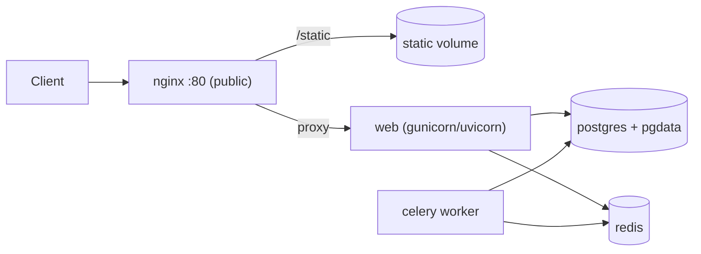

## Learning objectives

- Run **PostgreSQL** in Docker with persistence and health.
- Add **Redis** for caching and as a Celery broker.
- Put **Nginx** in front as a reverse proxy for static files and TLS termination.
- Assemble a realistic multi-service stack.

## Prerequisites

[Dockerizing FastAPI & Django](/courses/docker-python/dockerizing-fastapi-django) and [Docker Compose](/courses/docker-python/docker-compose).

## The core idea in one line

> Real apps are a **team of containers**: your app, a database (Postgres), a cache/broker (Redis), and a reverse proxy (Nginx) — each doing one job, wired together by Compose.

**Analogy — a restaurant's departments.** Your app is the chef. Postgres is the pantry (durable storage of everything). Redis is the counter of ready-made items (fast, temporary — recompute if lost). Nginx is the host at the door: greeting guests (clients), handing out menus (static files), and directing traffic to the kitchen. Each department specializes; the restaurant works because they coordinate.

## PostgreSQL — durable storage

```yaml
  db:
    image: postgres:16
    environment:
      POSTGRES_USER: app
      POSTGRES_PASSWORD: secret          # use secrets/.env in real life
      POSTGRES_DB: app
    volumes:
      - pgdata:/var/lib/postgresql/data  # ← persistence (named volume)
    healthcheck:
      test: ["CMD-SHELL", "pg_isready -U app"]
      interval: 5s
      retries: 5
    # no ports: — keep the DB internal, not exposed to the host
```

The **named volume** is non-negotiable — without it, every `docker compose down` wipes your database. Keep the DB **off the host network** (no `ports:`); only the app needs it.

## Redis — cache and broker

Redis is an in-memory store: extremely fast, but data is transient by design. Two common roles:

```yaml
  redis:
    image: redis:7-alpine
    # optional persistence:
    command: ["redis-server", "--appendonly", "yes"]
    volumes:
      - redisdata:/data
```

- **Cache** — store computed results/pages to avoid recomputation (`redis://redis:6379/0`).
- **Broker** — hold the queue of background jobs for Celery/RQ workers.

Because it's a cache, treat Redis data as **losable**: your app must still work (slower) if Redis is empty.

## A Celery worker (background jobs)

```yaml
  worker:
    build: .
    command: ["celery", "-A", "myproject", "worker", "-l", "info"]
    environment:
      CELERY_BROKER_URL: redis://redis:6379/0
    depends_on: [redis, db]
```

The **same image** runs as a different process (worker instead of web) — one build, multiple roles. That's an idiomatic Compose pattern.

## Nginx — the reverse proxy

Nginx sits in front of your app to serve static files efficiently, terminate TLS, buffer slow clients, and load-balance:

```nginx
# nginx.conf
upstream app { server web:8000; }        # 'web' = the app service name
server {
    listen 80;
    location /static/ { alias /static/; }  # serve static files directly (fast)
    location / {
        proxy_pass http://app;             # everything else → the app
        proxy_set_header Host $host;
        proxy_set_header X-Forwarded-For $proxy_add_x_forwarded_for;
    }
}
```

```yaml
  nginx:
    image: nginx:1.27-alpine
    ports: ["80:80"]                       # ← the ONLY public port
    volumes:
      - ./nginx.conf:/etc/nginx/conf.d/default.conf:ro
      - static:/static:ro
    depends_on: [web]
```

## The full picture



Only Nginx publishes a port; everything else talks over the internal network by name. This is a production-shaped topology.

## Common mistakes

1. **No volume on Postgres** — data lost on `down`.
2. **Publishing db/redis ports** to the host — unnecessary exposure; keep them internal.
3. **App serving static files** instead of Nginx — slow and wasteful; let Nginx serve `/static`.
4. **Assuming Redis is durable** — design for cache loss; don't store the only copy of anything there.
5. **Hardcoding hostnames as IPs** — use service names (`db`, `redis`, `web`).

## Performance & reliability

- Nginx serving static assets offloads your Python workers to do real work.
- Redis caching can cut database load dramatically — but add TTLs so stale data expires.
- Postgres needs its volume backed up; a volume is durable, but not a backup.

## Interview questions

1. **"Why put Nginx in front of the app?"** — Efficient static serving, TLS termination, buffering slow clients, and load balancing — freeing app workers.
2. **"What are Redis's two common roles here?"** — A cache (fast results) and a message broker (job queue for Celery).
3. **"Which containers should publish host ports?"** — Only the edge (Nginx); db/redis/app stay internal.
4. **"How does the Celery worker share code with the web app?"** — Same image, different `command` — one build, multiple roles.

## Summary

- A realistic stack is app + Postgres (durable, volume) + Redis (cache/broker, transient) + Nginx (public proxy).
- Persist the database with a named volume; keep it and Redis internal.
- Nginx serves static files and proxies the rest; it's the only public port.
- Reuse one image for web and worker roles.

## Exercises

**Easy**

1. Add a Postgres service with a named volume and a healthcheck; connect your app by service name.
2. Add Redis and cache a computed value in your app, reading it back on the next request.

**Intermediate**

3. Add an Nginx service that proxies to your app and serves a `/static/` directory from a shared volume.
4. Add a Celery worker using the same image as the web service but a different `command`.

**Advanced**

5. Assemble the full app + db + redis + worker + nginx stack; expose only port 80; verify internal-only db/redis and end-to-end request flow.

**Debugging**

6. Static files 404 through Nginx but the app works. Given the `location /static/` alias and volume mount, find the misconfiguration.

**Mini project**

Build a production-shaped Compose stack: Django/FastAPI + Postgres (volume, healthcheck) + Redis (cache + Celery broker) + a Celery worker + Nginx (static + proxy, only public port). Load a page that uses the cache and a background job, and document the topology with a diagram.

## Quiz

<details>
<summary>1. Why must Postgres have a named volume?</summary>
Otherwise its data lives in the container's writable layer and is destroyed on removal/`down`.
</details>

<details>
<summary>2. Should Redis be treated as durable storage?</summary>
No — it's a cache/broker; design so the app still works (slower) if Redis data is lost.
</details>

<details>
<summary>3. Which service is the only one that publishes a host port?</summary>
Nginx (the reverse proxy); db, redis, and the app stay on the internal network.
</details>

<details>
<summary>4. How does a Celery worker reuse the web app's code?</summary>
It runs the same image with a different `command` (celery worker) — one build, multiple roles.
</details>

## Further reading

- Official Postgres, Redis, and Nginx image docs
- Celery deployment guide
- Next lesson: [Multi-Stage Builds & Optimization](/courses/docker-python/multi-stage-and-optimization)
