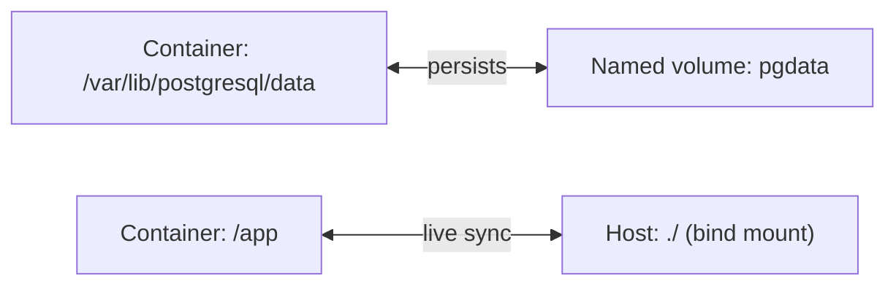

## Learning objectives

- Explain why containers are **ephemeral** and how **volumes** persist data.
- Distinguish **named volumes** from **bind mounts**.
- Connect containers with Docker **networks** and container DNS.
- Publish ports correctly and know when *not* to.

## Prerequisites

[Images & the Dockerfile](/courses/docker-python/images-and-dockerfile).

## The core idea in one line

> Container filesystems vanish when the container is removed — **volumes** keep data alive, and **networks** let containers find and talk to each other by name.

**Analogy — a hotel room vs your own storage unit.** A container is a hotel room: comfortable, but anything you leave there is gone at checkout (container removal). A **volume** is a storage unit you rent separately and can attach to any room — your stuff survives checkouts and even moving hotels. A **network** is the hotel's internal phone system: rooms call each other by name ("connect me to the database room") without knowing physical addresses.

## Why containers are ephemeral

A container's writable layer is deleted when the container is removed. Write a database file inside a container, `docker rm` it, and the data is gone:

```bash
docker run --name db postgres:16      # writes data inside the container
docker rm -f db                        # data destroyed — never do this to real data
```

This is by design: containers should be **disposable and stateless**. State lives in volumes.

## Volumes: named vs bind mounts

```bash
# Named volume — Docker manages it; ideal for databases in production
docker run -v pgdata:/var/lib/postgresql/data postgres:16

# Bind mount — maps a host directory into the container; ideal for dev (live code)
docker run -v "$PWD:/app" -w /app python:3.12-slim python app.py
```

| | Named volume | Bind mount |
|---|---|---|
| Location | Managed by Docker | A path you choose on the host |
| Best for | **Production data** (DBs) | **Dev** (live-editing code) |
| Portability | High | Tied to host paths |
| Performance | Optimized | Fine; can be slower on some OSes |



> [!TIP]
> Rule of thumb: **named volumes for data that must persist** (databases), **bind mounts for source code you're editing** during development so changes appear instantly without rebuilding.

## Networking and container DNS

By default, containers on the same **user-defined bridge network** can reach each other **by container name**:

```bash
docker network create appnet
docker run -d --name db --network appnet postgres:16
docker run -d --name api --network appnet myapi   # can connect to host "db"!
```

Inside `api`, the database URL is `postgresql://user:pass@db:5432/mydb` — Docker's built-in DNS resolves `db` to the right container. **You connect by service name, not IP.** (Docker Compose, next lesson, sets this up automatically.)

## Publishing ports

`-p host:container` exposes a container port to the *host*:

```bash
docker run -d -p 8000:8000 myapi     # host:8000 → container:8000
```

- Only publish what the **outside world** needs (usually just the web tier / reverse proxy).
- Containers talking to each other over the internal network do **not** need published ports — the database should *not* be reachable from the host in production.

## Common mistakes

1. **Storing DB data in the container** — lost on `rm`; use a named volume.
2. **Publishing the database port to the host** in prod — a security exposure; keep it internal.
3. **Connecting via `localhost` between containers** — `localhost` is the container itself; use the other container's **name**.
4. **Bind-mounting over installed deps** — mounting your host dir can hide files baked into the image (e.g. `node_modules`); mount narrowly.
5. **Using the default bridge and expecting name resolution** — DNS-by-name needs a **user-defined** network (or Compose).

## Performance & data safety

- Named volumes are the safe home for stateful services; back them up like any database.
- Bind mounts can be slower for large I/O on macOS/Windows (filesystem translation) — fine for code, less so for heavy DB writes.
- Internal networks reduce attack surface: fewer published ports = fewer ways in.

## Interview questions

1. **"Why do containers lose data?"** — The writable layer is deleted with the container; persistence requires volumes.
2. **"Named volume vs bind mount?"** — Named volumes are Docker-managed (best for prod data); bind mounts map a host path (best for live dev code).
3. **"How do two containers communicate?"** — On a shared user-defined network, by container/service name via Docker's DNS.
4. **"Should the database port be published?"** — No, not to the host in production; keep it on the internal network.

## Summary

- Containers are ephemeral; volumes persist data across removals and rebuilds.
- Named volumes suit production data; bind mounts suit live-editing dev code.
- Containers on a user-defined network reach each other by name via built-in DNS.
- Publish only the ports the outside world needs; keep databases internal.

## Exercises

**Easy**

1. Run Postgres with a named volume, insert a row, remove the container, re-run with the same volume, and confirm the row survived.
2. Bind-mount the current directory into a Python container and edit a file on the host — see the change reflected inside.

**Intermediate**

3. Create a user-defined network, run `db` and `api` on it, and connect from `api` to `db` by name (no IPs).
4. Show that removing a container *without* a volume loses its data, and *with* a volume keeps it.

**Advanced**

5. Design the volume + network layout for a web app + Postgres + Redis: which get volumes, which ports are published, what stays internal. Justify each.

**Debugging**

6. An app container can't reach the database at `localhost:5432` even though both run. Explain why `localhost` is wrong and give the fix.

**Mini project**

Run a two-container setup by hand (no Compose yet): a Python API and a Postgres database on a shared network, with a named volume for the DB. Connect the API to the DB by name, publish only the API port, and verify data persists across a DB container restart.

## Quiz

<details>
<summary>1. What happens to data written inside a container when it's removed?</summary>
It's deleted with the writable layer — use a volume to persist it.
</details>

<details>
<summary>2. Which volume type is best for live-editing code in development?</summary>
A bind mount — it maps a host directory so edits appear instantly in the container.
</details>

<details>
<summary>3. How does one container reach another?</summary>
By the other's container/service name on a shared user-defined network (Docker DNS resolves it).
</details>

<details>
<summary>4. Should you publish the database port to the host in production?</summary>
No — keep it on the internal network; only publish what the outside world needs.
</details>

## Further reading

- Docker docs: Volumes, Networking
- Next lesson: [Docker Compose](/courses/docker-python/docker-compose)
