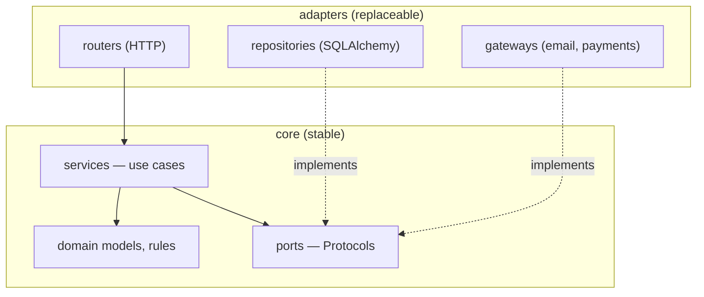

## Learning objectives

- Structure a FastAPI service in clean layers and defend the dependency rule in review.
- Test the full pyramid: unit (pure services), integration (real DB), API (in-process ASGI) — fast enough to run always.
- Containerize properly and deploy with workers, health checks, and graceful shutdown.
- Recite and apply a production-readiness checklist.
- Discuss microservices vs monolith with the scars-included nuance interviewers look for.

## Prerequisites

Everything in this course — this lesson assembles [ASGI](/courses/fastapi/asgi-and-starlette), [Pydantic](/courses/fastapi/pydantic-deep-dive), [DI](/courses/fastapi/dependency-injection), [SQLAlchemy](/courses/fastapi/sqlalchemy-async-and-alembic), and [auth](/courses/fastapi/auth-jwt-oauth2) into one shippable whole.

## Clean architecture, sized for reality

The idea behind every diagram named "clean/hexagonal/onion": **dependencies point inward** — domain logic knows nothing about HTTP, SQL, or vendors; the outer layers adapt:



Concretely, per layer:

- **Routers**: translate HTTP ↔ domain — parse ([Pydantic In-models](/courses/fastapi/pydantic-deep-dive)), authorize ([auth deps](/courses/fastapi/auth-jwt-oauth2)), call one service method, shape the response (Out-models). Ten lines each, no logic.
- **Services (use cases)**: the business — `PlaceOrder`, `CancelSubscription`; plain classes/functions taking their collaborators via constructor ([wired by DI](/courses/fastapi/dependency-injection)). *No FastAPI, no SQLAlchemy imports* — this is the layer you unit-test exhaustively and keep when frameworks change.
- **Ports**: `Protocol`s ([typing lesson](/courses/python/typing-and-generics)) naming what the core needs — `OrderRepo`, `PaymentGateway`, `EventSink`.
- **Adapters**: SQLAlchemy repositories, Stripe clients, SMTP senders — each implements a port; each replaceable (and fake-able) alone.

Domain exceptions (`InsufficientStock`, `AlreadyCancelled` — [exception design](/courses/python/errors-logging-and-observability)) cross layers upward and are mapped to HTTP in **one** exception handler — services never know about status codes.

Honest sizing guidance: a 5-endpoint service doesn't need four folders of ceremony — but it *does* need the two load-bearing rules even at small scale: **logic out of routers** and **vendor calls behind an interface**. Grow the rest when the code asks for it. And prefer a **modular monolith** (clean modules, one deployable) until team size, independent scaling, or genuinely separate domains force services apart — a distributed system's costs (network failure modes, tracing, versioned contracts, deploy orchestration) are paid in operations, forever ([DDD's bounded contexts](https://martinfowler.com/bliki/BoundedContext.html) are the right seam-finding tool when you do split).

## Testing: the pyramid, executable

```python
# 1) UNIT — pure service + fakes; milliseconds, hundreds of them
class FakeOrderRepo:
    def __init__(self): self.saved = []
    async def add(self, order): self.saved.append(order); return order
    async def stock_for(self, sku): return 5

async def test_place_order_decrements_stock():
    svc = OrderService(FakeOrderRepo(), FakeEvents())
    order = await svc.place(user, draft(qty=2))
    assert order.status == "placed"

async def test_rejects_oversell():
    with pytest.raises(InsufficientStock):
        await OrderService(FakeOrderRepo(), FakeEvents()).place(user, draft(qty=9))
```

```python
# 2) INTEGRATION — real Postgres (Docker), rollback-per-test
@pytest.fixture
async def session(pg_engine):
    async with pg_engine.connect() as conn:
        tx = await conn.begin()
        async with AsyncSession(bind=conn) as s:
            yield s
        await tx.rollback()                    # every test starts clean

# 3) API — in-process ASGI, overridden graph
@pytest.fixture
async def client(session):
    app.dependency_overrides[get_session] = lambda: session
    app.dependency_overrides[get_current_user] = lambda: fake_user()
    async with AsyncClient(transport=ASGITransport(app=app),
                           base_url="http://test") as c:
        yield c
    app.dependency_overrides.clear()

async def test_place_order_endpoint(client):
    r = await client.post("/api/v1/orders", json={"sku": "A1", "qty": 2})
    assert r.status_code == 201
    assert r.json()["status"] == "placed"
```

The proportions matter: **many** unit tests (business rules, edge cases — possible *because* services are framework-free), **some** integration tests (repository queries against real Postgres — [sqlite proves nothing](/courses/fastapi/sqlalchemy-async-and-alembic)), **few but meaningful** API tests (the contract: status codes, shapes, auth matrix — via [dependency overrides](/courses/fastapi/dependency-injection), no server, no mocking framework). Add: `pytest.ini` with `asyncio_mode = auto`, factories (factory-boy or hand-rolled builders) over fixture soup, and a query-count assertion on the hottest endpoint ([N+1 regression guard](/courses/django/queryset-optimization)).

## Shipping it

```dockerfile
FROM python:3.13-slim AS builder
WORKDIR /app
COPY requirements.txt .
RUN pip install --no-cache-dir --prefix=/install -r requirements.txt

FROM python:3.13-slim
ENV PYTHONUNBUFFERED=1 PYTHONDONTWRITEBYTECODE=1
WORKDIR /app
COPY --from=builder /install /usr/local
COPY app/ app/
COPY alembic.ini .
COPY migrations/ migrations/
RUN useradd -m appuser
USER appuser
EXPOSE 8000
CMD ["uvicorn", "app.main:app", "--host", "0.0.0.0", "--port", "8000",
     "--workers", "4", "--timeout-graceful-shutdown", "20"]
```

Deployment mechanics, each earning its place:

- **Workers ≈ cores** for async apps ([one loop per process](/courses/fastapi/asgi-and-starlette)); scale beyond a box by replicas behind a load balancer — stateless by construction (state lives in Postgres/Redis; [the same statelessness toll as Django's](/courses/django/caching-celery-and-deployment)).
- **Migrations as a release step** (`alembic upgrade head`) gated before new code takes traffic; each migration rolling-deploy-compatible ([the rules](/courses/fastapi/sqlalchemy-async-and-alembic)).
- **Health endpoints**: `/healthz` (process alive, no dependencies) for liveness; `/readyz` (DB ping, pool sane) for traffic-gating readiness — conflating them turns a DB blip into a restart storm.
- **Graceful shutdown**: SIGTERM → stop accepting → drain in-flight within the grace window → lifespan cleanup closes pools ([or leak connections every deploy](/courses/fastapi/asgi-and-starlette)).
- Proxy/ingress in front for TLS and buffering; non-root user; pinned dependencies (lockfile); image scanned in CI.

**The production-readiness checklist** — recite it: settings validated at startup ([BaseSettings](/courses/fastapi/pydantic-deep-dive)); JSON logs with request-ids ([observability](/courses/python/errors-logging-and-observability)); error tracker wired; metrics (RED: rate/errors/duration per route) + event-loop lag; timeouts on every outbound call; rate limits on auth ([auth lesson](/courses/fastapi/auth-jwt-oauth2)); pool math done ([sizing](/courses/fastapi/sqlalchemy-async-and-alembic)); CI = lint + typecheck ([mypy strict](/courses/python/typing-and-generics)) + tests + migration-check; rollback rehearsed; backups restore-tested.

## Common mistakes

1. **Logic in routers** — untestable without HTTP, duplicated across endpoints; the first smell reviewers check.
2. **Services importing SQLAlchemy/FastAPI** — the dependency rule broken; now nothing is testable without infrastructure.
3. **Mock-everything tests** asserting call sequences — they pass while the system is broken and break while it works; fake at ports, assert on *outcomes*.
4. **sqlite-only test suites** for a Postgres app; suites needing a running server (slow, flaky) instead of ASGITransport.
5. **`latest` tags, root containers, unpinned deps** — un-reproducible, un-auditable images.
6. **Liveness checks that ping the DB** — dependency outage → restart storm → worse outage.
7. **Premature microservices** — a distributed monolith with network calls where function calls were; the most expensive architecture mistake a mid-level engineer can champion.

## Best practices

- The two-question review filter: *"Could this service run under a CLI instead of HTTP?"* (layering) and *"Could this test run without Docker?"* (unit-ability). Both should usually be yes.
- One `deps.py` composition root; adapters chosen by settings (real vs fake gateways for staging).
- Contract artifacts in CI: OpenAPI snapshot diff ([schema as reviewed artifact](/courses/fastapi/pydantic-deep-dive)); versioned API paths from day one.
- Feature branches deploy to ephemeral environments (compose/k8s namespace) — reviewable behavior, not just reviewable code.
- Track four golden signals per route from day one; p99 and error-rate SLOs before you need them.

## Performance & memory notes

- Capacity of an async worker = concurrency × (1 − CPU share); measure with load tests (locust/k6) before launch, not after ([capacity arithmetic](/courses/django/caching-celery-and-deployment) transfers).
- Container memory = workers × (interpreter + app + pool buffers); set limits with headroom — the OOM killer's SIGKILL skips your graceful shutdown entirely.
- Rollback-per-test integration suites keep test DBs fast (no re-migrate per test); parallelize pytest with per-worker databases (`pytest-xdist`).
- Startup time matters operationally: heavy imports slow deploys/scale-up ([import-cost lesson](/courses/python/python-execution-model)); lazy-load the rarely-used heavy stuff.

## Production tips

- Deploy = migrate → start new replicas → readiness-gate → shift traffic → drain old; automate it once, reuse forever.
- Keep a `make bootstrap` that brings up compose + migrations + seed data in one command — onboarding time is a health metric of your architecture.
- Postmortems attach to layers: parse errors → schemas; business bugs → services (unit-testable = fixable-with-confidence); slow queries → repositories; timeouts → gateway adapters. If a bug's home is ambiguous, the layering leaks.
- When you *do* split services: contracts first (OpenAPI/protobuf), consumer-driven contract tests, correlation ids everywhere, and an explicit compatibility policy — the [monolith checklist](/courses/django/caching-celery-and-deployment) still applies to each piece.

## Interview questions

1. **"Structure a production FastAPI service."** — Routers/schemas → services (framework-free) → ports (Protocols) → adapters (repos/gateways), DI as composition root, exception mapping at the boundary; justify with testability and replaceability.
2. **"What's the dependency rule and what does violating it cost?"** — Dependencies point inward; violations couple business rules to infrastructure — tests need Docker, vendor swaps become rewrites.
3. **"Design the test strategy."** — Pyramid with fakes-at-ports units, real-Postgres rollback integration, ASGI-in-process API tests with overrides; what each layer catches that others can't.
4. **"Liveness vs readiness?"** — Restart-me vs route-to-me; DB checks belong only in readiness; the restart-storm failure mode.
5. **"Monolith vs microservices for a 6-person startup?"** — Modular monolith, clean seams, split on team/scaling/domain pressure with contracts and tracing budgeted; name the distributed-system taxes.

## Summary

- Layers with inward-pointing dependencies make the framework, database, and vendors replaceable — and, more practically, make business logic unit-testable at millisecond speed.
- The pyramid: many pure unit tests, real-DB integration tests, few in-process API contract tests — dependency overrides, not mocking frameworks.
- Ship as slim non-root images, workers ≈ cores, migrations gated, liveness ≠ readiness, graceful shutdown through lifespan.
- The readiness checklist and the golden signals are the difference between "it deployed" and "it's production."

## Exercises

**Easy**

1. Take the notes API from the [DI lesson](/courses/fastapi/dependency-injection) and enforce the two rules: extract any router logic into services; put its one external call behind a Protocol. Add three unit tests that need no Docker.
2. Add `/healthz` and `/readyz` (DB ping with 1s timeout) and demonstrate their different behavior with the DB container stopped.

**Medium**

3. Build the three-layer test suite for the notes API: 8 unit (service rules incl. domain exceptions), 3 integration (repo queries, rollback fixture), 3 API (auth matrix + contract shape). Total runtime target: <10s.
4. Write the multi-stage Dockerfile + compose (app, Postgres, migration step) and a `make bootstrap`; verify a teammate-simulation: fresh clone → running app in ≤3 commands.

**Hard**

5. Add an OpenAPI snapshot test (dump `app.openapi()`, diff against committed JSON) and a CI pipeline file (lint → mypy → tests vs real Postgres → migration check → image build). Break the contract deliberately and watch the right stage fail.

**Debugging exercise**

6. This service's deploys drop requests, its tests need prod credentials, and a Stripe outage restarts every pod. Map each symptom to the architectural cause:

```python
# routers/orders.py
@router.post("/orders")
async def place(draft: dict):                     # no schema
    stripe.Charge.create(**draft["payment"])      # vendor call in router
    db = create_async_engine(os.environ["PROD_DB"])   # engine per request, prod URL hardcoded
    ...
# k8s: livenessProbe hits /health which calls stripe.Balance.retrieve()
# CMD ["python", "main.py"]  (no signal handling, no graceful drain)
```

**Refactoring exercise**

7. Given a 900-line `main.py` (routes+SQL+Stripe+email inline), produce the refactor *plan* as a dependency-ordered checklist (what moves first and why tests must exist before each move), then execute the first two steps: schemas extracted, one service with ports carved out, behavior pinned by API tests written beforehand.

**Mini project**

The capstone: build "shipfast-notes" — the notes+sharing domain, full clean layering, JWT auth ([auth lesson](/courses/fastapi/auth-jwt-oauth2)), async SQLAlchemy + three Alembic revisions, the complete test pyramid, Dockerfile + compose, health endpoints, JSON logging with request-ids, OpenAPI snapshot in CI, and a one-page RUNBOOK.md (deploy steps, rollback, dashboards, known failure modes). This artifact is a portfolio piece: it demonstrates every competency in this course in one repo.

## Quiz

<details>
<summary>1. Why must services not import FastAPI or SQLAlchemy?</summary>
The dependency rule: the core depends only on its own ports. That's what makes business logic unit-testable in milliseconds and infrastructure swappable without touching rules.
</details>

<details>
<summary>2. Fakes vs mocks — the practical difference?</summary>
Fakes are working implementations of a port (in-memory repo) — tests assert outcomes. Mocks assert interactions (was X called with Y) — brittle, coupled to implementation. Prefer fakes at ports.
</details>

<details>
<summary>3. Why does the integration-test fixture wrap each test in a rolled-back transaction?</summary>
Isolation at near-zero cost: every test sees a clean DB without re-creating schema or truncating tables — the suite stays fast enough to run on every save.
</details>

<details>
<summary>4. What goes wrong when liveness probes check the database?</summary>
A DB outage makes the orchestrator kill healthy app processes — a restart storm amplifying the incident. Liveness = process health only; readiness gates traffic.
</details>

<details>
<summary>5. Name three taxes you start paying the day you split into microservices.</summary>
Network failure modes on every former function call (timeouts/retries/partial failure), versioned contracts + compatibility management, and distributed observability (tracing, correlation) — plus deploy orchestration across services.
</details>

## Further reading

- "Architecture Patterns with Python" (Percival & Gregory) — free online; the Python clean-architecture book
- The Twelve-Factor App; Google SRE book (SLOs, golden signals)
- FastAPI docs — Testing, Deployment sections; pytest-asyncio docs
