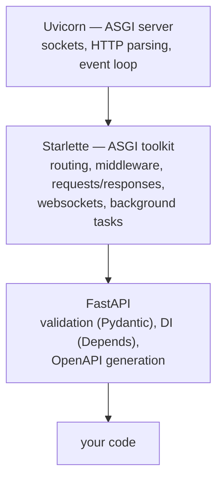

## Learning objectives

- Explain the ASGI protocol (scope/receive/send) and place Uvicorn, Starlette, and FastAPI in their exact layers.
- Know what happens to `def` vs `async def` routes — and choose correctly every time.
- Use lifespan, middleware, and background tasks with an understanding of their Starlette underpinnings.
- Structure a FastAPI project beyond `main.py`.
- Answer "what is FastAPI, really?" at interview depth.

## Prerequisites

[asyncio fundamentals](/courses/python/asyncio-fundamentals) — non-negotiable; this lesson assumes the event-loop model. The [WSGI discussion](/courses/django/request-lifecycle) is useful contrast.

## The stack, honestly labeled

FastAPI is a thin, brilliant layer over two other projects:



- **ASGI** is the contract making this composable: an application is `async def app(scope, receive, send)`. `scope` = connection metadata (type http/websocket, path, method, headers); `receive`/`send` = async channels for event messages (`http.request` body chunks in; `http.response.start` + `http.response.body` out). That's the whole protocol — WSGI's `application(environ, start_response)` redesigned for the event loop, streaming, and long-lived connections (websockets impossible under WSGI's one-shot model).
- **Uvicorn** owns the socket and the event loop, parses HTTP, and calls your app with scope/receive/send. One process = one loop; production runs several processes ([why](/courses/python/concurrency-gil-threads-processes)).
- **Starlette** turns raw ASGI into usable objects: `Request`, `Response`, routing, middleware, `BackgroundTasks`, websockets, TestClient. A FastAPI app *is* a Starlette app (subclass) — every Starlette feature is available and the docs assume you know it.
- **FastAPI adds exactly three things**: request/response **validation** from type hints (Pydantic — [next lesson](/courses/fastapi/pydantic-deep-dive)), **dependency injection** (`Depends` — [the DI lesson](/courses/fastapi/dependency-injection)), and **automatic OpenAPI** (Swagger/Redoc) generated from both. Understanding this layering means you debug at the right altitude: 404s and middleware order are Starlette questions; 422s are Pydantic; startup wiring is FastAPI DI.

## A request walks in

```python
from fastapi import FastAPI

app = FastAPI()

@app.get("/items/{item_id}")
async def read_item(item_id: int, q: str | None = None):
    return {"item_id": item_id, "q": q}
```

Uvicorn accepts the connection → builds scope → the app's middleware stack runs (outermost first — same onion as [Django's](/courses/django/request-lifecycle)) → Starlette's router matches path+method → FastAPI inspects the endpoint's signature: `item_id: int` (path param — validated/converted, non-int → 422), `q: str | None` (query param, optional). The return dict is serialized to JSON. Every piece of that signature also becomes OpenAPI documentation at `/docs` — the "types are the single source of truth" design is FastAPI's core idea.

### `def` vs `async def` routes — the decision that matters most

- **`async def` route** → runs **on the event loop**. Must never block: only `await`-based I/O inside ([the cardinal sin](/courses/python/asyncio-fundamentals)). One blocking call here stalls *every* request in the process.
- **`def` (sync) route** → FastAPI runs it **in a threadpool** (via AnyIO). Blocking is fine; the loop stays free. The threadpool defaults to 40 threads — that's your sync-route concurrency ceiling per process.

Decision rule: async libraries throughout (httpx, asyncpg/SQLAlchemy-async, redis.asyncio) → `async def`. Any blocking dependency (classic ORM, heavy CPU-ish work, a sync SDK) → plain `def`, and let the threadpool absorb it. The catastrophic middle: `async def` calling blocking code — worse than either honest option. Mixed apps are fine route-by-route; just never lie about a route's nature.

## Application lifecycle and shared resources

Connections pools and clients must be created once per process, not per request:

```python
from contextlib import asynccontextmanager

@asynccontextmanager
async def lifespan(app: FastAPI):
    app.state.http = httpx.AsyncClient(timeout=10)      # startup
    app.state.db = create_async_engine(settings.db_url)
    yield                                               # app serves requests
    await app.state.http.aclose()                       # graceful shutdown
    await app.state.db.dispose()

app = FastAPI(lifespan=lifespan)
```

`lifespan` is the ASGI lifespan protocol surfaced as a context manager — the correct home for pools, ML models, schedulers. Access via `request.app.state` or (better) through dependencies ([DI lesson](/courses/fastapi/dependency-injection)).

**Middleware** (Starlette): `@app.middleware("http")` for quick request/response hooks (timing, request-id), or ASGI-level middleware classes for the serious stuff (CORSMiddleware, GZipMiddleware); order is an onion, outermost added last.

**BackgroundTasks** — post-response work in the same process:

```python
@app.post("/signup")
async def signup(user: UserIn, background: BackgroundTasks):
    account = await create_account(user)
    background.add_task(send_welcome_email, account.email)   # runs AFTER response
    return {"id": account.id}
```

Honest scoping: fire-and-forget conveniences (emails, cache warms) only. They die with the process, don't retry, and occupy your workers — anything valuable or heavy belongs in a real queue (Celery/arq — the [same reasoning as Django's](/courses/django/caching-celery-and-deployment)).

## Project structure beyond main.py

```text
app/
├── main.py            # create_app(), lifespan, middleware, router includes
├── core/              # settings, security, logging setup
├── api/
│   ├── deps.py        # shared dependencies
│   └── routers/       # one APIRouter per resource: users.py, orders.py
├── models/            # SQLAlchemy models
├── schemas/           # Pydantic models
├── services/          # business logic (framework-free)
└── repositories/      # data access
```

`APIRouter` is the modularization tool — per-resource files with shared prefix/tags/dependencies, included into the app:

```python
router = APIRouter(prefix="/orders", tags=["orders"])
app.include_router(router, prefix="/api/v1")
```

The layering discipline (routers thin → services own logic → repositories own SQL) is the subject of the [architecture lesson](/courses/fastapi/architecture-testing-deployment); start folders this way even when small — main.py-only apps calcify fast.

## Common mistakes

1. **Blocking calls in `async def` routes** — `requests.get`, sync DB drivers, `time.sleep`, bcrypt. The #1 FastAPI production incident; symptoms: unrelated endpoints time out together.
2. **Per-request clients/engines** — `httpx.AsyncClient()` in a route body leaks connections and destroys throughput; lifespan + DI.
3. **CPU-heavy work in routes of either kind** — async blocks the loop, sync exhausts 40 threads; offload to a process pool or task queue.
4. **Treating BackgroundTasks as a job queue** — lost on restart, no retries; queue for anything that matters.
5. **Ignoring the layer**: reimplementing Starlette features (static files, websockets, middleware) badly because "FastAPI doesn't have it" — it does, one layer down.
6. **Running `uvicorn` single-process in production** and wondering why one core is hot ([scale with workers](/courses/fastapi/architecture-testing-deployment)).

## Best practices

- Pick a per-route honesty rule: `async def` ⇔ all-await inside; `def` ⇔ blocking allowed. Enforce in review.
- All shared resources through lifespan + `app.state` + dependencies; nothing global-mutable at module level.
- Request-id middleware first, CORS configured explicitly, GZip for JSON APIs — the standard middleware trio.
- Version the API path (`/api/v1`) at the include-router boundary from day one.
- Use `TestClient`/`httpx.AsyncClient(transport=ASGITransport(app))` — in-process ASGI testing needs no server ([testing lesson](/courses/fastapi/architecture-testing-deployment)).

## Performance & memory notes

- The async stack's win is **concurrency under I/O wait**, not raw speed: a single Uvicorn process comfortably holds thousands of concurrent slow-I/O requests where sync workers would need thousands of threads. Pure-CPU JSON crunching gains nothing.
- Each process ≈ full interpreter + app memory; workers × footprint budgets your box. The threadpool (40) bounds sync-route concurrency — raise deliberately (`anyio` settings) or go async where it matters.
- `orjson`-based responses (`ORJSONResponse` as default_response_class) measurably cut serialization time for big payloads.
- Streaming large responses (`StreamingResponse` over an async generator) keeps memory flat — the [generator pipelines](/courses/python/iterators-and-generators) pattern over HTTP.

## Production tips

- Deploy: `uvicorn --workers N` or gunicorn with `uvicorn.workers.UvicornWorker`; N ≈ cores for async apps. Nginx/ingress in front for TLS and buffering.
- Graceful shutdown matters for async: in-flight requests get a drain window (`--timeout-graceful-shutdown`); lifespan's post-`yield` code is your cleanup hook — close pools there or leak connections at every deploy.
- Health endpoints: `/healthz` cheap-liveness vs `/readyz` checking pool/DB — wire readiness into the load balancer.
- Watch **event-loop lag** (heartbeat metric) — it's the smoking gun for hidden blocking calls; also per-route latency histograms, not averages.

## Interview questions

1. **"What is ASGI and why did WSGI need replacing?"** — Async callable + scope/receive/send message channels; enables concurrency-per-process, streaming, websockets; WSGI's sync one-shot model can't express them.
2. **"What exactly does FastAPI add to Starlette?"** — Validation from type hints (Pydantic), DI (`Depends`), OpenAPI generation; everything else is Starlette.
3. **"What happens to a sync route in FastAPI?"** — Threadpool execution off the loop; loop stays responsive; ~40-thread default ceiling; contrast with the async-route contract.
4. **"Why is one blocking call so catastrophic in async apps?"** — One loop runs all requests; blocking it freezes the process's entire concurrency; symptoms and detection (loop lag).
5. **"Where do connection pools live in a FastAPI app?"** — Lifespan-created, app.state-held, dependency-injected; per-request creation is the anti-pattern and why.

## Summary

- The stack is Uvicorn (server/loop) → Starlette (toolkit) → FastAPI (validation + DI + OpenAPI) — debug at the right layer.
- ASGI = async app(scope, receive, send); that shape is what makes streaming, websockets, and massive I/O concurrency possible.
- Route honesty: `async def` never blocks; `def` gets a threadpool; CPU work leaves the process.
- Lifespan owns shared resources; routers structure the app; BackgroundTasks is a convenience, not a queue.

## Exercises

**Easy**

1. Write a raw ASGI app (no frameworks — just the callable) returning "hello" — then run it with Uvicorn. You now know what all frameworks compile down to.
2. Build a two-router FastAPI app (`/api/v1/users`, `/api/v1/notes`) with tags, and explore what `/docs` generated from your signatures.

**Medium**

3. Add timing + request-id middleware and a lifespan-managed `httpx.AsyncClient`; expose `/proxy?url=` fetching through the shared client. Verify the client is created once (log in lifespan).
4. Demonstrate the blocking catastrophe: an `async def` route with `time.sleep(2)` vs a `def` route with the same — hit each with 10 concurrent requests and record both timelines.

**Hard**

5. Build an SSE endpoint (`StreamingResponse`, `text/event-stream`) emitting a counter every second, with client-disconnect detection (`request.is_disconnected`) and clean generator shutdown — then a `/ws` websocket echo with a per-connection counter. Both are Starlette muscles.

**Debugging exercise**

6. Under load, this app's p99 explodes and health checks flap, though CPU is ~15%. Find all three causes:

```python
@app.get("/report")
async def report():
    conn = psycopg2.connect(DSN)              # sync driver, per-request
    rows = conn.cursor().execute(BIG_SQL)     # blocks the loop
    return {"data": crunch(rows)}             # heavy CPU on the loop

@app.post("/avatar")
async def avatar(file: UploadFile):
    img = resize_sync(await file.read())      # CPU on the loop
    return {"ok": True}
```

**Refactoring exercise**

7. Refactor a 400-line `main.py` (routes, models, helpers, startup all mixed) into the reference structure: routers/services/schemas/core + lifespan. Nothing may change behaviorally — prove it by writing three TestClient tests *before* refactoring.

**Mini project**

Build a "URL health dashboard" API: `POST /targets` registers URLs; a lifespan-started asyncio task pings all targets every 30s (bounded concurrency — [Semaphore](/courses/python/asyncio-fundamentals)) storing status in app.state; `GET /targets` returns current status; `GET /stream` SSEs live updates; graceful shutdown cancels the poller cleanly. Everything from this lesson in one small app.

## Quiz

<details>
<summary>1. Which layer matches routes to handlers — FastAPI, Starlette, or Uvicorn?</summary>
Starlette — its router does path matching; FastAPI wraps endpoints with validation/DI and feeds route metadata to OpenAPI.
</details>

<details>
<summary>2. Two requests hit an <code>async def</code> route that awaits a 1s DB call. Total wall time on one worker?</summary>
~1s — both coroutines wait concurrently on the loop. (Sync route + 2 threadpool threads: also ~1s; sync + 1 worker thread available: ~2s.)
</details>

<details>
<summary>3. When does a BackgroundTask run, and what happens to it if the process is killed?</summary>
After the response is sent, in the same process; it's gone on crash/restart — no persistence, no retry.
</details>

<details>
<summary>4. Why must <code>httpx.AsyncClient</code> be shared, not per-request?</summary>
It owns a connection pool — per-request instances mean constant TCP/TLS setup, socket churn, and eventual port exhaustion.
</details>

<details>
<summary>5. Name the exact mechanism FastAPI uses to keep sync routes from blocking the loop.</summary>
It detects non-coroutine endpoints and executes them via AnyIO's threadpool (<code>run_in_threadpool</code>), awaiting the thread's result on the loop.
</details>

## Further reading

- ASGI spec (it's short); Starlette docs (read them fully — most "FastAPI" questions are answered there)
- FastAPI docs — "Async", "Lifespan", "Bigger Applications"
- Uvicorn deployment docs
