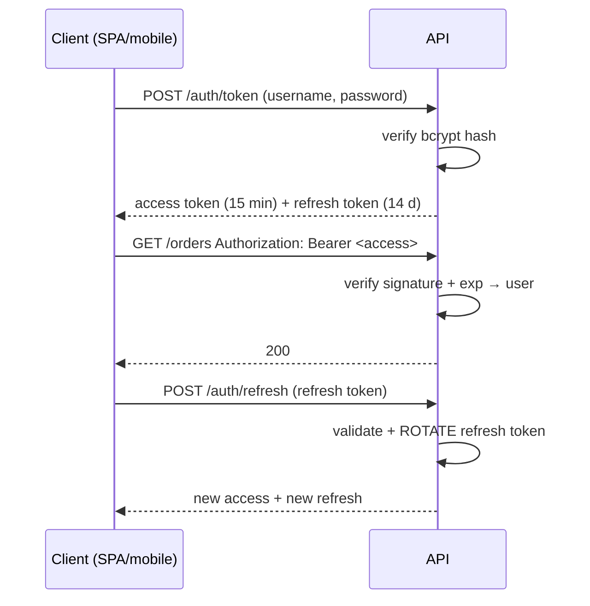

## Learning objectives

- Explain the OAuth2 password flow as FastAPI implements it, and where full OAuth2/OIDC differs.
- Read a JWT's anatomy and articulate what signatures do and don't protect.
- Implement the complete stack: bcrypt hashing, access + refresh tokens with rotation, `get_current_user`, RBAC.
- Make the revocation tradeoff consciously and defend your choice.
- Avoid the auth bugs that fail pen tests: algorithm confusion, long-lived tokens, token leakage paths.

## Prerequisites

[Dependency Injection](/courses/fastapi/dependency-injection) (the auth chain is a dependency graph) and the [Django security lesson](/courses/django/auth-and-security) (password hashing, session-vs-token tradeoffs — assumed known here).

## The flow

FastAPI's `OAuth2PasswordBearer` implements the OAuth2 *password grant* shape — your own frontend exchanging credentials for tokens at your own API (full OAuth2's authorization-code flow with third parties, and OIDC on top, share the token concepts you learn here):



## JWT anatomy — and what a signature means

A JWT is three base64url segments: `header.payload.signature`:

```json
// header                          // payload (claims)
{"alg": "HS256", "typ": "JWT"}     {"sub": "42", "exp": 1735689600,
                                    "iat": 1735688700, "type": "access",
                                    "roles": ["user"]}
```

The signature is `HMAC-SHA256(header + "." + payload, SECRET_KEY)` (HS256, shared-secret) or an RSA/ECDSA signature (RS256 — verify with a public key; the choice when other services must verify tokens they cannot mint). Three facts that must be reflexes:

1. **Signed ≠ encrypted.** Anyone can base64-decode the payload — no secrets in claims, ever. The signature only proves *integrity* (issued by the key-holder, unmodified).
2. **Verification is local and stateless** — a signature check + expiry check, no DB. That's the entire point: horizontal scale and cross-service auth without a shared session store ([contrast with sessions](/courses/django/auth-and-security)).
3. **Statelessness cuts both ways**: a token is valid until `exp` *no matter what* — logout, password change, or ban does not un-sign it. Every JWT design must answer "how do we revoke?" (below).

## The implementation core

```python
from passlib.context import CryptContext
import jwt   # PyJWT

pwd = CryptContext(schemes=["bcrypt"])
oauth2_scheme = OAuth2PasswordBearer(tokenUrl="/auth/token")

def make_token(sub: str, ttl: timedelta, type_: str, roles: list[str]) -> str:
    now = datetime.now(timezone.utc)
    return jwt.encode(
        {"sub": sub, "iat": now, "exp": now + ttl, "type": type_,
         "roles": roles, "jti": uuid4().hex},
        settings.secret_key.get_secret_value(), algorithm="HS256")

@router.post("/auth/token")
async def login(form: Annotated[OAuth2PasswordRequestForm, Depends()],
                session: SessionDep):
    user = await get_user_by_email(session, form.username)
    if not user or not pwd.verify(form.password, user.password_hash):
        raise HTTPException(401, "Incorrect email or password")   # one message
    return {
        "access_token": make_token(str(user.id), timedelta(minutes=15),
                                   "access", user.roles),
        "refresh_token": await issue_refresh(session, user),      # stored+rotated
        "token_type": "bearer",
    }

async def get_current_user(token: Annotated[str, Depends(oauth2_scheme)],
                           session: SessionDep) -> User:
    try:
        payload = jwt.decode(token, settings.secret_key.get_secret_value(),
                             algorithms=["HS256"])                # pin the alg!
    except jwt.ExpiredSignatureError:
        raise HTTPException(401, "Token expired",
                            headers={"WWW-Authenticate": "Bearer"})
    except jwt.InvalidTokenError:
        raise HTTPException(401, "Invalid token")
    if payload.get("type") != "access":
        raise HTTPException(401, "Wrong token type")              # refresh ≠ access
    user = await get_user(session, int(payload["sub"]))
    if user is None or not user.is_active:
        raise HTTPException(401, "User inactive")
    return user
```

Decisions embedded there:

- **bcrypt via passlib** — slow, salted, per-user ([why, in depth](/courses/django/auth-and-security)); ~100–300ms by design, so run it off the event loop in async apps (`await asyncio.to_thread(pwd.verify, ...)` — [the blocking rule](/courses/python/asyncio-fundamentals)) and rate-limit the login route.
- **One error message** for wrong-user and wrong-password (no account enumeration); same for timing where practical.
- **`algorithms=["HS256"]` pinned** at decode — never accept the header's word for it. The historical `alg: none` and RS256→HS256 confusion attacks both begin with trusting attacker-controlled headers.
- **`type` claim** separates refresh from access tokens — otherwise a refresh token works as a 14-day access token.
- The **DB fetch of the user** makes bans/deactivation effective within one request (a deliberate step back from pure statelessness; see revocation).
- RBAC on top is the [dependency-factory pattern](/courses/fastapi/dependency-injection) reading `user.roles` (authoritative source: DB via the fetch, with token roles as a hint) — `require_role("admin")` raising 403, attached per-route or per-router.

## Refresh tokens and the revocation tradeoff

Short access tokens (5–15 min) bound the damage of a leak; refresh tokens (days–weeks) restore UX. Because refresh tokens are long-lived and powerful, treat them as **server-state**, unlike access tokens: store (a hash of) each issued refresh token; on use, verify it exists, **rotate** (invalidate it, issue a new one), and if a *rotated-out* token is ever presented — that's replay: an attacker or the user's stale client; revoke the whole family and force re-login.

The revocation options, honestly:

| Strategy | Cost | Revocation latency |
|---|---|---|
| Pure stateless (exp only) | zero | up to full access-token TTL |
| Short access + stored refresh (rotation) | 1 DB row per session; check on refresh only | ≤ access TTL (≈15 min) |
| Denylist checked per request (jti in Redis) | 1 cache hit per request | immediate |
| Sessions instead of JWT | session store per request | immediate |

The industry default is the second row — and note the irony worth saying in interviews: once you store refresh tokens and fetch users per request, you've re-introduced state; JWT's value narrows to *access-token statelessness between refreshes* and cross-service verification. That's still valuable — but "JWT because stateless" without this nuance is a red flag answer.

**Transport & storage:** tokens go in the `Authorization: Bearer` header — never URL params (logs), and if cookies are chosen instead (httpOnly, Secure, SameeSite), you've re-entered [CSRF territory](/courses/django/auth-and-security). For SPAs: access token in memory, refresh in an httpOnly cookie scoped to the refresh path is the balanced pattern; localStorage tokens are readable by any XSS.

## Common mistakes

1. **Secrets or PII in claims** — payloads are public; `sub`, roles, expiry, jti — nothing more.
2. **Long-lived access tokens** (24h+) with no revocation story — a stolen token is a day of impersonation.
3. **Unpinned algorithms / trusting the header** — the classic JWT CVE class.
4. **No `type` discrimination** — refresh tokens usable as access tokens.
5. **Non-rotated refresh tokens** — a leaked one is a permanent credential; rotation + replay detection is the fix.
6. **bcrypt on the event loop** — every login freezes the process for ~200ms ([the cardinal sin](/courses/python/asyncio-fundamentals)).
7. **Tokens in URLs, localStorage, or logs**; missing rate limits on `/auth/*` (credential stuffing).
8. **Rolling your own crypto/format** — PyJWT/jose + the boring flow above; novelty in auth is where incidents come from.

## Best practices

- TTLs: access 5–15 min, refresh 7–30 days with rotation + family-replay revocation; clock-skew leeway of ~30s at decode.
- Key management: `SecretStr` settings ([Pydantic lesson](/courses/fastapi/pydantic-deep-dive)), rotation plan with `kid` headers, RS256 when other services verify.
- Log auth events (login success/fail, refresh replay, role denials) with request-ids ([observability](/courses/python/errors-logging-and-observability)); alert on refresh-replay and login-failure spikes.
- Test the matrix as code: expired/garbage/wrong-type/wrong-alg tokens, inactive users, role denials — each a two-line test via [dependency overrides](/courses/fastapi/dependency-injection) plus real-token integration tests.
- Password reset = single-use, expiring, hashed-at-rest tokens + enumeration-safe responses; 2FA for privileged accounts.

## Performance & memory notes

- HS256 verify ≈ microseconds — auth adds ~nothing to request latency; RS256 verify is ~10× HS256 but still sub-ms.
- The per-request user fetch is the real cost — cache user records briefly (30–60s) if it shows up in profiles, accepting that as your ban-latency.
- bcrypt cost factor 12 ≈ 250ms of CPU: logins are your most expensive routes; thread-offload + rate-limit + never in a hot loop (tests: cost 4).
- Token size rides on every request (~300–800 bytes of header) — keep claims lean; role *lists* beat permission *matrices* in the token.

## Production tips

- Put `WWW-Authenticate: Bearer` on 401s (spec compliance; clients and tooling rely on it).
- Refresh endpoint gets its own aggressive rate limit and anomaly logging — it's the crown-jewel route.
- Web-facing deployments: consider binding refresh cookies to a device identifier and surfacing "active sessions" to users (the stored-refresh table gives you this for free).
- When integrating third-party login later (Google/OIDC), you keep this exact machinery — their flow replaces only the password check; tokens, refresh, RBAC stay yours.

## Interview questions

1. **"Walk through JWT auth end-to-end."** — Login → bcrypt verify → signed access+refresh → Bearer header → local verification per request → refresh rotation. Name TTLs and why.
2. **"What does the signature protect against, and not?"** — Tampering/forgery; not reading (base64), not leakage, not revocation.
3. **"How do you log a user out with JWTs?"** — The tradeoff table: short TTL + revoked refresh (default), jti denylist (immediate), sessions (compare honestly).
4. **"HS256 vs RS256?"** — Shared secret (one trust domain) vs keypair (many verifiers, private minting); pin algorithms either way.
5. **"Why rotate refresh tokens?"** — Leak containment + replay *detection* (a used-again old token proves compromise → kill the family).

## Summary

- OAuth2 password flow: credentials once → short signed access token + stored rotating refresh token.
- JWTs are readable, signed, stateless-until-exp claims; pin algorithms, discriminate token types, keep claims lean and public-safe.
- Revocation is a chosen tradeoff — defend yours; the default is short access TTL + refresh rotation with replay detection.
- bcrypt off the loop, auth routes rate-limited, the failure matrix tested, secrets managed — auth is boring engineering done exactly right.

## Exercises

**Easy**

1. Implement `make_token`/`decode_token` with type + jti claims and unit tests: valid, expired (freeze time), tampered payload, wrong algorithm.
2. Decode a real token's payload with plain base64 (no library) to internalize "signed ≠ encrypted".

**Medium**

3. Build the full login + `get_current_user` + `require_role` chain against your [DI lesson](/courses/fastapi/dependency-injection) session; test the 401/403 matrix with both fake-user overrides and real tokens.
4. Add refresh with rotation: a `refresh_tokens` table (hash, user, family, expires), the rotate-on-use endpoint, and a replay test (old token after rotation → 401 + family revoked).

**Hard**

5. Implement key rotation: tokens carry `kid`; the app verifies against a keyring of current+previous keys and mints only with current; write the test simulating a rotation with in-flight tokens surviving until expiry.

**Debugging exercise**

6. A pen test filed four findings on this. Name each:

```python
@router.post("/auth/token")
async def login(u: str, p: str, session: SessionDep):     # GET-able? also: no rate limit
    user = await by_email(session, u)
    if not user:
        raise HTTPException(401, "No such account")        # enumeration
    if user.password_hash != hashlib.md5(p.encode()).hexdigest():  # fast unsalted hash
        raise HTTPException(401, "Wrong password")
    return {"access_token": jwt.encode(
        {"sub": u, "email": user.email, "is_admin": user.is_admin},
        SECRET)}                                           # no exp; PII+authz claim client could keep forever
```

**Refactoring exercise**

7. Migrate a service using 24-hour access tokens (no refresh) to 15-min access + rotating refresh without logging anyone out mid-deploy: describe (and stub) the two-phase rollout — issue refresh tokens alongside old-style tokens first, then shorten access TTLs once clients update.

**Mini project**

Build an auth microservice: register (validators + enumeration-safe), login, refresh-with-rotation, logout (revoke family), `/me`, admin-only user list (RBAC), rate limiting on `/auth/*`, structured auth-event logging, and a test suite covering the full failure matrix. Wire it in front of your notes API from the [DI lesson](/courses/fastapi/dependency-injection) as a second service verifying the same HS256 tokens — then explain what switching that pair to RS256 would buy.

## Quiz

<details>
<summary>1. Where may the server look when verifying an access token, in the pure stateless model?</summary>
Only at the token: signature against its key + claims (exp, type). No storage. That locality is the scaling property — and the revocation weakness.
</details>

<details>
<summary>2. Why must the decode call pin <code>algorithms=["HS256"]</code>?</summary>
The header is attacker-controlled; historic attacks downgraded to <code>none</code> or swapped RS256→HS256 (verifying with the <em>public</em> key as HMAC secret). The server dictates acceptable algorithms.
</details>

<details>
<summary>3. An old refresh token is presented after rotation already used it. What does that mean and what do you do?</summary>
Replay — two parties hold the same family (theft or a very stale client). Revoke the entire token family, force re-authentication, log and alert.
</details>

<details>
<summary>4. Why fetch the user from the DB in <code>get_current_user</code> when the token already has <code>sub</code> and roles?</summary>
Freshness: bans, deactivation, and role changes take effect now instead of at token expiry — a deliberate trade of one query for revocation latency.
</details>

<details>
<summary>5. Access token in localStorage vs in memory + refresh in httpOnly cookie — the tradeoff?</summary>
localStorage survives reloads but is readable by any XSS; memory+cookie limits XSS token theft (cookie unreadable by JS) at the cost of CSRF care on the refresh route and re-auth on reload.
</details>

## Further reading

- RFC 7519 (JWT), RFC 6749 (OAuth2), OAuth 2.0 Security Best Current Practice (the BCP — read it)
- FastAPI docs — Security section (all pages)
- OWASP cheat sheets: Authentication, JSON Web Token, Password Storage
