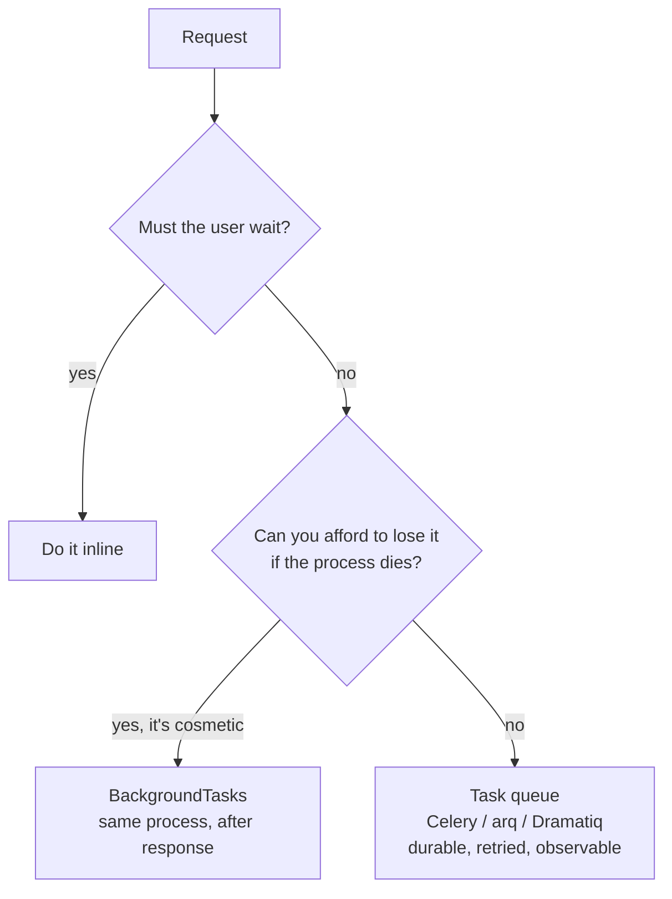

## Learning objectives

- Choose correctly between `BackgroundTasks`, a task queue, and a scheduled job.
- Design tasks that survive retries: idempotency, at-least-once delivery, and poison messages.
- Run Celery or arq alongside FastAPI without blocking the event loop.
- Handle the transactional outbox problem — the bug where the email is sent but the row was rolled back.
- Operate workers: concurrency, timeouts, dead-letter queues, and graceful shutdown.

## Prerequisites

[Dependency injection](/courses/fastapi/dependency-injection), [SQLAlchemy async](/courses/fastapi/sqlalchemy-async-and-alembic), and Python [asyncio fundamentals](/courses/python/asyncio-fundamentals).

## Three tools, three guarantees



**`BackgroundTasks`** runs *in the same process, after the response is sent*:

```python
@app.post("/signup", status_code=201)
async def signup(data: SignupIn, tasks: BackgroundTasks, db: AsyncSession = Depends(get_db)):
    user = await users.create(db, data)
    tasks.add_task(log_signup_metric, user.id)     # fire-and-forget, best effort
    return {"id": user.id}
```

Its honest properties: no broker to run, no serialization, and **no durability whatsoever**. A deploy, a crash, or an OOM kill loses the task silently. It also consumes the same worker capacity — a 30-second background task ties up the process that should be serving requests.

Use it for: cache warming, metrics, a cleanup that doesn't matter if skipped.
Never use it for: emails users expect, payments, anything a user would file a ticket about.

**A task queue** gives durability, retries, scheduling, concurrency control, and visibility — at the cost of a broker (Redis/RabbitMQ), separate worker processes, and serialization constraints.

## Celery with FastAPI

Celery is sync-first, which is fine — workers aren't serving HTTP.

```python
# worker/app.py
celery_app = Celery("api", broker=settings.broker_url, backend=settings.result_url)
celery_app.conf.update(
    task_acks_late=True,             # ack AFTER completion, so a crash re-delivers
    task_reject_on_worker_lost=True,
    worker_prefetch_multiplier=1,    # don't hoard messages into one worker
    task_time_limit=300,             # hard kill
    task_soft_time_limit=270,        # SoftTimeLimitExceeded — chance to clean up
    task_serializer="json",          # never pickle: RCE if the broker is compromised
    accept_content=["json"],
    result_expires=3600,
)

@celery_app.task(
    bind=True, max_retries=5,
    autoretry_for=(httpx.TransportError, TimeoutError),
    retry_backoff=True, retry_backoff_max=600, retry_jitter=True,
)
def send_invoice_email(self, invoice_id: str) -> None:
    invoice = repo.get_invoice(invoice_id)     # pass IDs, not objects
    if invoice.email_sent_at:                  # idempotency guard
        return
    mailer.send(invoice.customer_email, render_invoice(invoice))
    repo.mark_email_sent(invoice_id, timezone.now())
```

Four settings carry most of the reliability:

- **`acks_late=True`** — the message is acknowledged after the task finishes, so a worker crash re-delivers it. This makes delivery **at-least-once**, which is why the idempotency guard above is mandatory rather than optional.
- **`prefetch_multiplier=1`** — otherwise a worker grabs a batch of messages and holds them while busy; one slow task delays a dozen others that another idle worker could have run.
- **`retry_backoff` + `retry_jitter`** — exponential backoff without jitter means every failed task retries in lockstep and hammers the recovering dependency. Jitter spreads them.
- **`soft_time_limit` below `time_limit`** — the soft limit raises a catchable exception so you can release locks and log context before the hard kill.

Calling from FastAPI is non-blocking (it's just a Redis publish), but it is *sync I/O* on an async endpoint. At low volume it's tolerable; at high volume, offload it:

```python
await run_in_threadpool(send_invoice_email.delay, str(invoice.id))
```

## arq: the async-native alternative

If your codebase is async end to end, arq avoids the impedance mismatch entirely:

```python
async def send_invoice_email(ctx: dict, invoice_id: str) -> None:
    async with ctx["db"]() as session:
        invoice = await repo.get_invoice(session, invoice_id)
        if invoice.email_sent_at:
            return
        await mailer.send(invoice.customer_email, render_invoice(invoice))
        await repo.mark_email_sent(session, invoice_id)

class WorkerSettings:
    functions = [send_invoice_email]
    cron_jobs = [cron(nightly_rollup, hour=3, minute=0)]
    max_tries = 5
    job_timeout = 300
    on_startup = startup      # build the engine/pool once per worker
    on_shutdown = shutdown

# enqueue from an endpoint — genuinely awaitable
await request.app.state.redis.enqueue_job("send_invoice_email", str(invoice.id))
```

The trade-off: arq is small and async-native; Celery has a far larger ecosystem (Flower, beat, routing, chords, mature Kubernetes recipes). Pick arq for a new all-async service, Celery when you need the ecosystem or already have it.

## Idempotency, and why you can't skip it

Every durable queue delivers **at least once**. Network partitions, worker crashes after the side effect but before the ack, and manual re-queues all cause duplicates. A task that isn't idempotent will eventually charge a card twice.

Three patterns, in increasing strength:

```python
# 1. State check — simplest, has a race window between check and act
if invoice.email_sent_at:
    return

# 2. Idempotency key at the external service — best when supported
stripe.Charge.create(..., idempotency_key=f"invoice-{invoice.id}")

# 3. Database uniqueness — the durable local guarantee
try:
    async with session.begin():
        session.add(TaskRun(key=f"send_invoice:{invoice_id}"))   # UNIQUE constraint
except IntegrityError:
    return          # already ran (or is running) — nothing to do
```

Design tasks to be **replayable**: pass identifiers, re-read current state, and make the effect conditional on that state. A task whose payload contains the data to write is a task that will write stale data after a retry.

## The transactional outbox

This is the single most common correctness bug in queue-backed services:

```python
async def place_order(session, user, cart):
    async with session.begin():
        order = await repo.create_order(session, user, cart)
        send_confirmation.delay(str(order.id))     # BUG
    return order
```

The task is enqueued *inside* the transaction. If the commit fails, the email still goes out — for an order that doesn't exist. Reverse it and you get the opposite bug: commit succeeds, the process dies before enqueueing, and the user never hears back.

Two correct answers:

**After-commit hook** — good enough for most systems:

```python
@event.listens_for(session.sync_session, "after_commit")
def _enqueue(sess):
    for order_id in getattr(sess, "_pending_emails", []):
        send_confirmation.delay(order_id)
```

**Transactional outbox** — when losing the message is unacceptable:

```python
async with session.begin():
    order = await repo.create_order(session, user, cart)
    session.add(Outbox(topic="order.created",
                       payload={"order_id": str(order.id)}))   # same transaction
# A relay process polls Outbox and publishes, marking rows sent.
```

Now the message and the row commit atomically. The relay may publish twice (crash between publish and mark), which is fine — your consumers are idempotent, because you read the previous section.

## Operating workers

**Graceful shutdown.** On `SIGTERM`, workers should stop accepting new messages and finish in-flight ones. Set the Kubernetes `terminationGracePeriodSeconds` above your longest task, or every deploy kills work mid-flight.

**Dead-letter queue.** After `max_retries`, a task must go somewhere visible — not vanish:

```python
@celery_app.task(bind=True, max_retries=3)
def process(self, payload_id):
    try:
        do_work(payload_id)
    except Exception as exc:
        if self.request.retries >= self.max_retries:
            dead_letter.delay(payload_id, repr(exc))    # park it for a human
            logger.error("task_dead_lettered", extra={"payload_id": payload_id})
            return
        raise self.retry(exc=exc)
```

**Queue routing.** One queue for everything means a flood of thumbnail jobs delays password resets. Split by latency class:

```python
task_routes = {
    "tasks.send_*":      {"queue": "interactive"},   # user-visible, low latency
    "tasks.generate_*":  {"queue": "bulk"},          # heavy, can wait
}
```

Run separate worker deployments per queue so you can scale and set concurrency independently.

**Concurrency sizing:** I/O-bound tasks → `--concurrency` well above core count (or `--pool=gevent`); CPU-bound → concurrency ≈ cores, since Python processes don't share a core productively.

**Scheduled work:** Celery beat or arq cron. Run exactly **one** scheduler instance — two beats mean every periodic task fires twice. Use a leader lock if your platform can't guarantee a singleton.

## Common mistakes

1. **`BackgroundTasks` for anything that matters** — silently lost on deploy.
2. **Passing ORM objects as task arguments** — serialization failures, or stale data written after a retry. Pass ids.
3. **Enqueueing inside a transaction** — the task runs for a row that was rolled back.
4. **Non-idempotent tasks** — at-least-once delivery guarantees you'll eventually double-charge.
5. **`acks_early` (the default)** — a crashed worker loses the message entirely.
6. **Retry without jitter** — synchronized retry storms take down the dependency that was recovering.
7. **`pickle` serializer** — anyone who can write to your broker gets remote code execution.
8. **One queue for all workloads** — head-of-line blocking; the important task waits behind 10 000 thumbnails.
9. **No dead-letter path** — failures disappear and nobody notices for a month.
10. **Two beat schedulers** — every cron job runs twice.

## Best practices

- Tasks take primitive ids, re-read state, and are safe to run twice.
- Enqueue after commit, or use an outbox when the message must not be lost.
- Set `acks_late`, `prefetch_multiplier=1`, both time limits, and JSON serialization on day one.
- Separate queues by latency class; separate worker deployments per queue.
- Every task has a timeout, a bounded retry policy with jitter, and a dead-letter destination.
- Propagate the request id into the task payload and set it on the worker so logs correlate ([observability lesson](/courses/fastapi/middleware-and-observability)).
- Test tasks as plain functions; test enqueueing separately with a mocked `.delay`.
- Keep task modules import-light — a worker importing your whole app starts slowly and pins memory.

## Performance & memory notes

- A Celery worker forks N child processes, each a full Python interpreter with your imports: 150–400 MB each is typical. `--concurrency=16` on a 2 GB box will OOM.
- `--max-tasks-per-child=1000` recycles workers, capping leaks in native dependencies (image libraries especially).
- Result backends cost real storage. If nobody reads the result, set `ignore_result=True` — otherwise Redis fills with results nobody fetches.
- Large payloads through the broker are an anti-pattern: put the blob in object storage and pass a key. Brokers are not file servers.
- Prefetch is throughput vs fairness: high prefetch maximizes throughput for uniform short tasks, ruins latency for mixed workloads.
- Queue depth is your key metric — a growing backlog means arrival rate exceeds service rate, and no amount of retrying fixes it. Alert on depth and oldest-message age.

## Production tips

- Monitor: queue depth per queue, oldest message age, task duration p95, failure rate, retry rate, worker count. Oldest-message-age is the one that best predicts user complaints.
- Set `terminationGracePeriodSeconds` > `task_time_limit` so deploys drain rather than kill.
- Broker choice: Redis is simpler and usually sufficient; RabbitMQ gives real routing, per-message TTL, and native DLQ. Pick Redis unless you need those.
- Redis as a broker must have `maxmemory-policy noeviction` — with an eviction policy, Redis will silently delete your queued tasks under pressure.
- Run a canary periodic task that enqueues and asserts round-trip time; it catches a wedged worker faster than any dashboard.
- Version task signatures. During a rolling deploy old workers receive new payloads — add fields, never repurpose or remove them in the same release.

## Interview questions

1. **"`BackgroundTasks` vs Celery?"** — Same-process best-effort with no durability vs a durable broker-backed queue with retries, scheduling, and observability. Pick by whether losing the work is acceptable.
2. **"Why must tasks be idempotent?"** — Queues deliver at-least-once; crashes after a side effect but before the ack cause re-delivery.
3. **"You enqueue an email inside a DB transaction that later rolls back. What happens and how do you fix it?"** — The email is sent for a nonexistent row. Fix with an after-commit hook, or a transactional outbox when the message can't be lost.
4. **"What does `acks_late` change?"** — Ack after completion instead of on receipt: crashes re-deliver instead of losing work, at the cost of possible duplicates.
5. **"Your queue is backing up. Walk me through it."** — Check arrival vs service rate, task duration p95, worker count and concurrency, whether one slow task type is blocking a shared queue, prefetch settings, and whether retries are amplifying the load.

## Summary

- `BackgroundTasks` = best effort, same process; a queue = durable, retried, observable.
- At-least-once delivery makes idempotency a requirement, not a nicety.
- Never enqueue inside a transaction — after-commit hook or outbox.
- Configure `acks_late`, prefetch, time limits, JSON, backoff with jitter, and a dead-letter path up front.
- Queue depth and oldest-message age are the metrics that predict user pain.

## Exercises

**Easy**

1. Add a `BackgroundTasks` call that warms a cache after a response, then kill the process mid-task and confirm the loss.
2. Convert that task to Celery/arq with `max_retries=3` and exponential backoff, and observe the retry timings in the logs.

**Medium**

3. Make a `charge_customer` task idempotent three different ways (state check, provider idempotency key, DB unique constraint) and write a test that runs it twice for each.
4. Split tasks into `interactive` and `bulk` queues with separate workers, then flood `bulk` with 10 000 jobs and prove `interactive` latency is unaffected.

**Hard**

5. Implement a transactional outbox: an `Outbox` table written in the same transaction as the business row, a relay process publishing and marking rows sent, at-least-once semantics, and a test that kills the relay between publish and mark to prove the consumer's idempotency handles the duplicate.

**Debugging exercise**

6. Users report duplicate confirmation emails during deploys, and occasional emails for orders that don't exist. Find both bugs:

```python
@app.post("/orders")
async def create_order(data: OrderIn, db: AsyncSession = Depends(get_db)):
    async with db.begin():
        order = Order(**data.model_dump())
        db.add(order)
        await db.flush()
        send_confirmation.delay(order.id)
    return {"id": order.id}

@celery_app.task
def send_confirmation(order_id):
    order = repo.get(order_id)
    mailer.send(order.email, "Thanks!")
```

**Refactoring exercise**

7. A task takes a fully serialized `Order` dict, writes every field, and has no retry policy. Convert it to take an id, re-read state, guard idempotency, add bounded retries with jitter, and dead-letter on exhaustion. List each failure mode you closed.

**Mini project**

Build a document-processing pipeline: upload → queue → OCR → index → notify, with separate queues per stage, idempotent stages keyed by document hash, an outbox for the notification, a dead-letter queue with a staff replay endpoint, Prometheus metrics for depth and duration, graceful shutdown, and a load test showing behaviour at 10× normal arrival rate. Document where it degrades first and why.

## Quiz

<details>
<summary>1. What guarantee does <code>BackgroundTasks</code> give?</summary>
None beyond best effort in the current process — a crash, deploy, or OOM loses the task with no record.
</details>

<details>
<summary>2. Why pass ids instead of objects to tasks?</summary>
Objects serialize poorly and go stale: a retry minutes later would write data captured before other changes. An id forces the task to re-read current state.
</details>

<details>
<summary>3. What does <code>worker_prefetch_multiplier=1</code> prevent?</summary>
Head-of-line blocking — a worker hoarding messages it can't process yet while other workers sit idle.
</details>

<details>
<summary>4. Why is retry jitter necessary?</summary>
Without it, all failed tasks retry at the same instants, producing synchronized thundering-herd load that re-breaks the recovering dependency.
</details>

<details>
<summary>5. What problem does the transactional outbox solve?</summary>
The atomicity gap between committing a row and publishing a message: writing both in one transaction means you can never have one without the other.
</details>

## Further reading

- Celery docs — "Tasks", "Optimizing", "Routing Tasks"; arq docs for the async-native path
- Chris Richardson, *microservices.io* — "Transactional Outbox" and "Idempotent Consumer" patterns
- AWS Builders' Library — "Timeouts, retries, and backoff with jitter"
