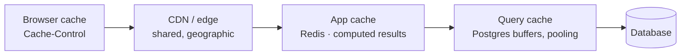

## Learning objectives

- Pick the right cache layer: HTTP, CDN, application, or query.
- Design cache keys and invalidation you can reason about six months later.
- Avoid stampedes, staleness bugs, and cross-tenant leaks.
- Implement rate limiting with the right algorithm and the correct response headers.
- Apply backpressure so overload degrades gracefully instead of collapsing.

## Prerequisites

[Dependency injection](/courses/fastapi/dependency-injection), [SQLAlchemy async](/courses/fastapi/sqlalchemy-async-and-alembic), and [middleware and observability](/courses/fastapi/middleware-and-observability).

## The cache hierarchy



The rule of thumb: **cache as close to the client as the data's sensitivity allows.** A response served from the browser costs you nothing; the same response computed in Python costs a worker slot. But a private response cached at a CDN is a data breach, so correctness constrains how far out you can push.

| Layer | Latency | Invalidation | Good for |
|---|---|---|---|
| Browser | 0 | expiry only — you can't reach it | static assets, immutable data |
| CDN | ~10 ms | purge API | public pages, images, API GETs with no user context |
| Redis | ~1 ms | explicit, precise | computed results, sessions, counters |
| Query/pool | ~0.1 ms | automatic | reducing DB round-trips |

## HTTP caching and ETags

The cheapest cache is the one where you send no body at all:

```python
@app.get("/api/articles/{slug}")
async def get_article(slug: str, request: Request, db: AsyncSession = Depends(get_db)):
    article = await repo.get_by_slug(db, slug)
    if article is None:
        raise HTTPException(404)

    etag = f'W/"{article.id}-{article.updated_at.timestamp()}"'
    if request.headers.get("if-none-match") == etag:
        return Response(status_code=304)          # no body — bandwidth saved

    return JSONResponse(
        article_schema.model_validate(article).model_dump(mode="json"),
        headers={
            "ETag": etag,
            # public: CDN may store it. 60s fresh, then serve stale up to 5m
            # while revalidating in the background.
            "Cache-Control": "public, max-age=60, stale-while-revalidate=300",
            "Vary": "Accept-Encoding, Accept-Language",
        },
    )
```

Three directives worth knowing precisely:

- **`private`** — browser only, never a shared cache. **This is the default you want for anything user-specific.** Getting it wrong means user A's CDN-cached response is served to user B.
- **`stale-while-revalidate`** — serve the stale copy immediately, refresh in the background. Nearly free latency and stampede protection.
- **`Vary`** — tells caches which request headers change the response. Forget `Vary: Authorization` on a user-specific response and shared caches will mix users together.

Only `GET`/`HEAD` are cacheable. If a mutation must invalidate a CDN entry, call the purge API after the write.

## Application caching in Redis

```python
async def cached(key: str, ttl: int, loader: Callable[[], Awaitable[T]]) -> T:
    raw = await redis.get(key)
    if raw is not None:
        return orjson.loads(raw)
    value = await loader()
    await redis.set(key, orjson.dumps(value), ex=ttl)
    return value

@app.get("/api/leaderboard")
async def leaderboard(period: str = "week"):
    return await cached(
        key=f"leaderboard:v2:{period}",          # v2 = schema version
        ttl=300,
        loader=lambda: compute_leaderboard(period),
    )
```

**Key design is the whole game.** A key must encode every input the value depends on:

```
{namespace}:{version}:{tenant}:{entity}:{id}:{variant}
leaderboard:v2:acme:week
user:v3:acme:4821:profile
```

- **Version segment** — bump it and every old entry is orphaned instantly. This is how you deploy a shape change without a migration or a flush.
- **Tenant segment** — the defence against the worst cache bug there is: serving one customer's data to another. Never build a key from user input without a tenant/user prefix.
- **Never** put unbounded user input directly in a key; hash it (`hashlib.sha256(query.encode()).hexdigest()[:16]`) to cap length and avoid injection of `:` separators.

### The stampede

When a hot key expires, every concurrent request misses and recomputes simultaneously. A 200 ms query becomes 500 concurrent 200 ms queries, the database saturates, latency climbs, more requests pile in.

A lock plus early recomputation fixes it:

```python
async def cached_locked(key: str, ttl: int, loader, lock_ttl: int = 30):
    raw = await redis.get(key)
    if raw is not None:
        return orjson.loads(raw)

    # Only one caller wins the lock and recomputes.
    if await redis.set(f"lock:{key}", "1", nx=True, ex=lock_ttl):
        try:
            value = await loader()
            await redis.set(key, orjson.dumps(value), ex=ttl)
            return value
        finally:
            await redis.delete(f"lock:{key}")

    # Losers wait briefly for the winner, then fall back to computing.
    for _ in range(20):
        await asyncio.sleep(0.05)
        raw = await redis.get(key)
        if raw is not None:
            return orjson.loads(raw)
    return await loader()
```

Better still, combine it with **stale-while-revalidate at the app layer**: store `{value, expires_at}` with a Redis TTL well beyond `expires_at`, serve the stale value instantly when past `expires_at`, and refresh in a background task. Users never wait for a cache miss.

Also add **jitter to TTLs** (`ttl + random.randint(0, ttl // 10)`). Keys created together — say, warmed at deploy — otherwise expire together, creating a synchronized stampede across many keys at once.

### Invalidation

Two strategies, and you should be explicit about which one each cache uses:

- **TTL only** — accept staleness up to the TTL. Simplest and correct for most read models. Choose the TTL from how stale the data may be, not from a habit of `300`.
- **Write-through invalidation** — delete the key on every write path:

```python
async def update_article(db, article_id, data):
    article = await repo.update(db, article_id, data)
    await redis.delete(f"article:v3:{article.tenant_id}:{article.slug}")
    return article
```

The failure mode of the second is a write path you forgot. Keep invalidation next to the write in a repository method, never scattered across endpoints — and prefer TTL for anything where you can't guarantee you found every writer.

Avoid `KEYS pattern*` to bulk-invalidate — it blocks Redis while scanning the entire keyspace. Use a version key instead:

```python
version = await redis.incr(f"ver:articles:{tenant_id}")   # O(1) mass invalidation
key = f"article:v3:{tenant_id}:{version}:{slug}"
```

## Rate limiting

Rate limiting protects capacity and stops abuse. The algorithm choice matters more than people expect:

| Algorithm | Behaviour | Cost | Verdict |
|---|---|---|---|
| **Fixed window** | counter per minute | 1 op | simple, but allows a 2× burst at the boundary |
| **Sliding window log** | timestamps in a sorted set | O(log n), memory per request | precise, expensive |
| **Sliding window counter** | weighted blend of two windows | 2 ops | good accuracy/cost balance |
| **Token bucket** | refills at a rate, allows bursts | 1 script | **the usual right answer** |

Token bucket in one atomic Lua script:

```python
BUCKET = """
local key, rate, burst, now, cost = KEYS[1], tonumber(ARGV[1]), tonumber(ARGV[2]),
                                    tonumber(ARGV[3]), tonumber(ARGV[4])
local b = redis.call('HMGET', key, 'tokens', 'ts')
local tokens = tonumber(b[1]) or burst
local ts = tonumber(b[2]) or now
tokens = math.min(burst, tokens + (now - ts) * rate)   -- refill by elapsed time
if tokens < cost then
  redis.call('HSET', key, 'tokens', tokens, 'ts', now)
  redis.call('EXPIRE', key, math.ceil(burst / rate) * 2)
  return {0, tokens}
end
tokens = tokens - cost
redis.call('HSET', key, 'tokens', tokens, 'ts', now)
redis.call('EXPIRE', key, math.ceil(burst / rate) * 2)
return {1, tokens}
"""

async def rate_limit(request: Request, user: User = Depends(current_user)):
    key = f"rl:{user.id}" if user else f"rl:ip:{client_ip(request)}"
    allowed, remaining = await redis.eval(BUCKET, 1, key, 10, 100, time.time(), 1)
    if not allowed:
        raise HTTPException(429, "Rate limit exceeded",
                            headers={"Retry-After": "1",
                                     "RateLimit-Limit": "100",
                                     "RateLimit-Remaining": "0"})
    request.state.rate_remaining = int(remaining)
```

The atomicity matters: `GET` then `SET` from Python is a race, and under concurrency the limit leaks badly. A Lua script runs atomically inside Redis.

Details that separate a usable limiter from an infuriating one:

- **Always send `Retry-After`** on a 429. Without it, well-behaved clients guess — usually by retrying immediately.
- **Send `RateLimit-*` headers on success too**, so clients can self-pace instead of discovering the wall.
- **Key by user, not IP, for authenticated traffic.** IP limits punish everyone behind one NAT — an entire office, or a whole mobile carrier.
- **Get the IP right behind a proxy**: `request.client.host` is your load balancer. Parse `X-Forwarded-For` from the right position and only trust it from known proxies, or an attacker just spoofs the header.
- **Different limits per endpoint class.** Login and password reset need strict per-account limits (credential stuffing); a read endpoint can be generous.
- **Fail open, with a ceiling.** If Redis is down, rejecting all traffic converts a cache outage into a total outage. Log loudly, allow the request, and have a global concurrency limit as the backstop.

## Backpressure

Rate limiting handles *individual* abuse; backpressure handles *aggregate* overload. When the system is saturated, shed load early rather than accepting work you can't finish:

```python
SEMAPHORE = asyncio.Semaphore(200)      # max concurrent in-flight requests

@app.middleware("http")
async def limit_concurrency(request: Request, call_next):
    if SEMAPHORE.locked() and SEMAPHORE._value <= 0:
        return JSONResponse({"detail": "Server busy"}, status_code=503,
                            headers={"Retry-After": "2"})
    async with SEMAPHORE:
        return await call_next(request)
```

The insight: a request that will time out anyway is worse than a fast 503 — it consumes a DB connection, a worker slot, and memory, and then delivers nothing. Fast rejection keeps the system responsive for the requests it *can* serve. Pair it with client timeouts shorter than your server's, so nobody waits on a doomed request.

## Common mistakes

1. **`public` cache headers on user-specific responses** — a CDN serves one user's data to another. The worst bug in this lesson.
2. **Missing `Vary: Authorization`** — same outcome via a different route.
3. **Cache keys without a tenant/user segment** — cross-tenant leaks.
4. **No stampede protection on hot keys** — expiry becomes a self-inflicted DDoS.
5. **Uniform TTLs** — synchronized expiry across thousands of keys.
6. **`KEYS *` for invalidation** — blocks Redis, degrading everything.
7. **Non-atomic rate limit check** — the limit leaks under concurrency.
8. **IP-based limits on authenticated endpoints** — punishes shared NATs.
9. **429 without `Retry-After`** — clients retry immediately and amplify the overload.
10. **Rate limiter fails closed** — a Redis blip becomes a full outage.
11. **Caching a permission check** — the user is removed from a team and keeps access for the TTL.

## Best practices

- Decide `public` vs `private` per endpoint, deliberately, and default to `private`.
- Namespace + version + tenant in every key; hash any user-supplied portion.
- TTL jitter everywhere; lock or stale-while-revalidate on hot keys.
- Keep invalidation inside repository write methods, not spread across endpoints.
- Never cache authorization decisions; cache the data, check permissions per request.
- Token bucket, atomic via Lua, keyed by identity, with standard headers.
- Fail open on limiter errors, backed by a concurrency cap.
- Instrument hit ratio, miss latency, evictions, and 429 rate — an unmeasured cache is a guess.

## Performance & memory notes

- **Hit ratio is the metric.** Below ~80% on a read-heavy endpoint, the cache adds a round-trip and complexity for little gain — the TTL or key design is wrong.
- Serialization is often the real cost: `orjson` is roughly 3–5× faster than stdlib `json`, and it matters at thousands of ops/sec. Never `pickle` into a shared cache — it's an RCE vector.
- Set Redis `maxmemory` and `maxmemory-policy allkeys-lru` for a cache instance. Without a policy Redis returns errors when full; with `noeviction` on a cache instance, your cache becomes a fragile database.
- **Separate Redis instances for cache and for queues/sessions.** A cache eviction storm must never drop queued jobs or log everyone out.
- Compress values above ~10 KB (`zstd`); network and memory both improve. Below that, compression costs more than it saves.
- Pipeline or `MGET` batched reads — 50 sequential `GET`s at 1 ms each is 50 ms of pure latency.
- Local in-process caches (`cachetools.TTLCache`) beat Redis for tiny, hot, non-user-specific data (feature flags, config) — nanoseconds instead of a network hop. Just accept per-process staleness.

## Production tips

- Put a CDN in front of public GETs and let `stale-while-revalidate` absorb origin restarts.
- Warm critical caches on deploy, staggered with jitter, so the first user after a rollout isn't the one paying for every cold key.
- Alert on hit-ratio drops — a sudden fall usually means a key-shape change shipped and every entry became garbage.
- Include the app version in the cache namespace so a rollback never reads the new version's data shape.
- Expose the limiter's state in logs (`rate_remaining`) so support can answer "why am I getting 429s".
- Load-test with the cache **disabled** to learn your true origin capacity — that's what you'll be running on the day Redis fails.
- Document each cache in a table: key pattern, TTL, invalidation trigger, owner. This document prevents the "why is this stale" incident.

## Interview questions

1. **"`private` vs `public` in `Cache-Control`?"** — `public` allows shared caches (CDN/proxy) to store it; using it on user-specific data leaks between users. `private` restricts to the browser.
2. **"What's a cache stampede and how do you prevent it?"** — Concurrent misses on an expired hot key all recompute; prevent with a recompute lock, stale-while-revalidate, TTL jitter, and pre-warming.
3. **"Design a rate limiter for a public API."** — Token bucket in Redis via an atomic Lua script, keyed by API key, per-endpoint-class limits, `RateLimit-*` and `Retry-After` headers, fail open with a concurrency backstop.
4. **"Why is a fixed window a poor choice?"** — Boundary bursting: a client can send the full limit at the end of one window and again at the start of the next, delivering 2× the intended rate in an instant.
5. **"How do you invalidate a cache safely?"** — Prefer TTL where staleness is acceptable; write-through deletion inside repository methods where it isn't; version-key bumps for mass invalidation; never `KEYS *`.

## Summary

- Cache as close to the client as sensitivity allows; `private` is the safe default.
- Keys carry namespace, version, tenant, and identity — that's what prevents leaks and enables cheap invalidation.
- Stampedes, uniform TTLs, and `KEYS *` are the three self-inflicted outages.
- Token bucket, atomic in Redis, keyed by identity, with `Retry-After` — and fail open.
- Backpressure turns overload into fast, honest 503s instead of a slow collapse.

## Exercises

**Easy**

1. Add `ETag` + `304` handling to a detail endpoint and verify with `curl -H 'If-None-Match: ...'` that the body isn't re-sent.
2. Wrap an expensive endpoint in a Redis cache with a versioned, tenant-scoped key and measure p95 before and after.

**Medium**

3. Implement the token-bucket Lua limiter, then prove with 100 concurrent requests that a naive Python `GET`/`SET` version leaks over the limit while the Lua one doesn't.
4. Add TTL jitter and a recompute lock; simulate 200 concurrent requests on a just-expired key and count the loader invocations before and after.

**Hard**

5. Build a full caching layer for a product API: CDN-cacheable public GETs with `stale-while-revalidate`, private per-user endpoints, Redis-cached aggregates with write-through invalidation in repository methods, version-key mass invalidation, hit-ratio metrics, and a load test showing origin QPS with and without the cache. Then deliberately ship a schema change and demonstrate the version bump handling it with zero stale reads.

**Debugging exercise**

6. Users occasionally see another user's dashboard. Find every bug:

```python
@app.get("/api/dashboard")
async def dashboard(user: User = Depends(current_user)):
    data = await cached("dashboard", 300, lambda: build_dashboard(user))
    return JSONResponse(data, headers={"Cache-Control": "public, max-age=300"})
```

**Refactoring exercise**

7. A service caches permission checks for 10 minutes to "reduce load". Explain the security impact, refactor to cache the underlying data instead of the decision, and show the query count is still acceptable.

**Mini project**

Build a public API with a complete traffic-management layer: tiered rate limits (free/pro/enterprise) via token bucket, standard headers, a CDN-friendly caching strategy per endpoint, Redis caching with stampede protection and versioned keys, concurrency-based backpressure returning 503 with `Retry-After`, and a Grafana dashboard showing hit ratio, 429 rate, and shed load. Load-test to 3× capacity and document exactly how it degrades.

## Quiz

<details>
<summary>1. Why is <code>Cache-Control: public</code> dangerous on an authenticated endpoint?</summary>
Shared caches (CDN, corporate proxy) may store and replay the response to a different user. Use <code>private</code>, and <code>Vary: Authorization</code> where a shared cache is involved at all.
</details>

<details>
<summary>2. What causes a cache stampede?</summary>
A hot key expiring while many requests are in flight — all miss, all recompute simultaneously, and the origin is hit with concurrent copies of one expensive query.
</details>

<details>
<summary>3. Why must a rate-limit check be atomic?</summary>
Read-then-write from Python interleaves under concurrency: many requests read the same count and all conclude they're under the limit, so the effective rate far exceeds the configured one.
</details>

<details>
<summary>4. Why avoid <code>KEYS prefix*</code> in production?</summary>
It scans the entire keyspace and blocks Redis's single thread — every other client stalls. Use a version key bump, or <code>SCAN</code> if you must iterate.
</details>

<details>
<summary>5. Should a rate limiter fail open or closed when Redis is unreachable?</summary>
Open, with loud alerting and a concurrency-limit backstop. Failing closed converts a dependency blip into a total outage.
</details>

## Further reading

- MDN — "HTTP caching", `Cache-Control`, `Vary`, and conditional requests
- IETF `RateLimit` header fields draft — the standard `RateLimit-*` semantics
- Redis docs — eviction policies, Lua scripting, and `SCAN` vs `KEYS`
- AWS Builders' Library — "Using load shedding to avoid overload"
