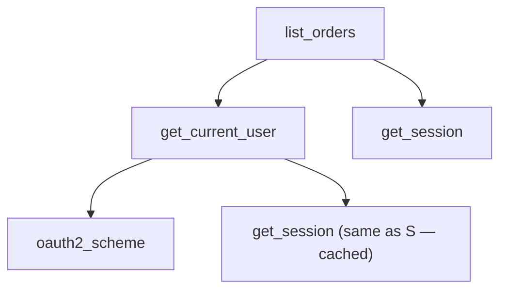

## Learning objectives

- Explain what `Depends` actually does: per-request dependency graph resolution with caching.
- Use yield-dependencies for resources (sessions, transactions) and know their exact cleanup timing.
- Compose sub-dependencies for auth chains, pagination, and tenancy.
- Structure routers → services → repositories with DI as the wiring.
- Override dependencies in tests — the payoff that makes the whole pattern worth it.

## Prerequisites

[ASGI & app structure](/courses/fastapi/asgi-and-starlette); the [DI concept](/courses/python/typing-and-generics) from the typing lesson (Protocols at boundaries) and [closures/decorators](/courses/python/decorators) for the mechanics.

## What `Depends` is

Dependency injection means a component **receives** its collaborators instead of constructing them. FastAPI builds this into the request cycle: any parameter defaulting to `Depends(fn)` tells FastAPI — *before calling the endpoint, call `fn` (resolving its own dependencies recursively) and pass the result in*:

```python
async def get_session() -> AsyncIterator[AsyncSession]:
    async with SessionFactory() as session:
        yield session                       # ← resource dependency (see below)

async def get_current_user(
    token: Annotated[str, Depends(oauth2_scheme)],
    session: Annotated[AsyncSession, Depends(get_session)],
) -> User:
    payload = decode_jwt(token)             # 401 on failure
    return await load_user(session, payload["sub"])

@router.get("/orders")
async def list_orders(
    user: Annotated[User, Depends(get_current_user)],
    session: Annotated[AsyncSession, Depends(get_session)],
):
    return await OrderRepo(session).for_user(user.id)
```

FastAPI resolves this as a **graph, not a list**:



Rules of the resolver:

1. **Per-request cache**: each distinct dependency runs **once per request**, even if required by five parameters across the chain — `get_session` above yields one session shared by the endpoint and the auth check. (`Depends(fn, use_cache=False)` opts out.)
2. Dependencies can be `async def` or `def` (sync ones run in the threadpool — same [honesty rule](/courses/fastapi/asgi-and-starlette) as routes).
3. Dependencies can themselves declare params (query/header/path) — they're extracted, validated, and **documented in OpenAPI** exactly like endpoint params. A pagination dependency puts `limit`/`offset` into every route that uses it, docs included.
4. Raising `HTTPException` inside a dependency short-circuits the request — auth guards are just dependencies that raise 401/403.
5. `Annotated[T, Depends(fn)]` aliases make graphs readable and DRY:

```python
SessionDep = Annotated[AsyncSession, Depends(get_session)]
CurrentUser = Annotated[User, Depends(get_current_user)]
AdminUser  = Annotated[User, Depends(require_role("admin"))]
```

Note `require_role("admin")` — a **dependency factory**: a function returning a dependency, closing over its configuration ([closures](/courses/python/closures-and-legb) earning rent):

```python
def require_role(role: str):
    async def checker(user: CurrentUser) -> User:
        if role not in user.roles:
            raise HTTPException(403, "insufficient role")
        return user
    return checker
```

Router- and app-level attachment runs guards without needing their value: `APIRouter(dependencies=[Depends(require_role("admin"))])` protects every route in the router — the choke-point pattern ([scoping analogy in DRF](/courses/django/drf-apis)).

## Yield dependencies: resources with lifetimes

A dependency containing `yield` is a context manager for the request ([generator mechanics](/courses/python/iterators-and-generators)):

```python
async def get_tx_session() -> AsyncIterator[AsyncSession]:
    async with SessionFactory() as session:
        async with session.begin():         # transaction per request
            yield session                   # endpoint runs here
        # commit on success, rollback on exception — then close
```

Execution order: code before `yield` runs before the endpoint; the endpoint (and downstream dependencies) run; code after `yield` runs **after the response is sent** (for cleanup) — with exceptions from the endpoint propagating *through* the yield, so `try/finally` and context managers behave exactly as in any generator. This is where sessions close, transactions commit/roll back, locks release, and per-request metric timers stop. Stack them: a `get_session` yields the session, a `get_uow` depends on it and yields a unit-of-work — composition of lifetimes for free.

## DI as architecture: routers → services → repositories

The graph pattern scales into the standard layering:

```python
class OrderRepo:                              # data access only
    def __init__(self, session: AsyncSession): self.session = session
    async def for_user(self, uid: int) -> list[Order]: ...

class OrderService:                           # business rules only
    def __init__(self, repo: OrderRepo, events: EventSink):
        self.repo, self.events = repo, events
    async def place(self, user: User, draft: OrderCreate) -> Order: ...

def get_order_service(session: SessionDep) -> OrderService:
    return OrderService(OrderRepo(session), KafkaSink.instance())

@router.post("/orders", response_model=OrderOut)
async def place_order(draft: OrderCreate, user: CurrentUser,
                      svc: Annotated[OrderService, Depends(get_order_service)]):
    return await svc.place(user, draft)       # route = parse + authz + delegate
```

The route is a translator (HTTP ↔ domain); the service is framework-free Python testable without HTTP; the repository owns SQL. `Depends` is merely the **wiring layer** — note the service and repo classes know nothing about FastAPI. Type the seams as Protocols (`EventSink`, `Storage` — [typing lesson](/courses/python/typing-and-generics)) and implementations become swappable by construction. Full architectural treatment: [the clean architecture lesson](/courses/fastapi/architecture-testing-deployment).

### The payoff: testing by override

```python
app.dependency_overrides[get_session] = get_test_session       # sqlite/tx-rollback
app.dependency_overrides[get_current_user] = lambda: fake_user # skip real auth
```

`dependency_overrides` swaps any node of the graph for the whole test client — no monkeypatching, no mock patch-paths, no network. Auth-matrix tests inject users of each role; DB tests inject rollback sessions; third-party gateways get fakes. This one dict is the practical reason DI-first FastAPI codebases are dramatically easier to test than import-your-collaborators codebases. (Remember to clear overrides between tests — an autouse fixture.)

## Common mistakes

1. **Importing collaborators directly in routes** (`from db import engine` used inline) — untestable, un-overridable; if a route touches a resource, inject it.
2. **Heavy work in dependencies used app-wide** — a dependency runs per request per use; a 50ms lookup in a router-level dependency taxes every route ([middleware lesson's same warning](/courses/django/request-lifecycle)).
3. **Creating engines/clients inside dependencies** — dependencies wire *per-request* views of *process-level* resources; the pool itself lives in [lifespan](/courses/fastapi/asgi-and-starlette).
4. **Expecting fresh instances despite the cache** — two `Depends(get_session)` in one request are the same session; if you truly need two, `use_cache=False` (rare, deliberate).
5. **Business logic in dependencies** — they're for *acquisition and guards*; a dependency that "also updates last_seen and sends analytics" hides writes in the wiring.
6. **Cleanup-after-yield ordering surprises** — code after yield runs post-response; don't put "must happen before the client sees the response" logic there (that belongs in the endpoint/service).
7. **Forgetting to reset `dependency_overrides`** — cross-test contamination that fails mysteriously in full-suite runs only.

## Best practices

- Central `api/deps.py` exporting `Annotated` aliases (`SessionDep`, `CurrentUser`, `Pagination`) — routes read like prose, graphs stay discoverable.
- Guards as dependencies (raise), resources as yield-dependencies (cleanup), config via `Depends(get_settings)` ([lru_cache settings](/courses/fastapi/pydantic-deep-dive)) — three shapes, used consistently.
- Keep dependencies shallow and fast; deep graphs are fine, slow nodes are not.
- Factories for parameterized guards (`require_role`, `rate_limit(times, per)`); router-level attachment for whole-resource policies.
- One transaction boundary per request by default (tx-session dependency); services assume they're inside it.

## Performance & memory notes

- Resolution overhead is small (µs-scale dict-driven calls) but per-request × per-node — a 15-node graph on a 5k-rps service is measurable; keep node bodies trivial.
- The per-request cache means expensive nodes (user load) run once regardless of fan-in — design chains to *rely* on that rather than passing values manually.
- Sub-dependency signatures are inspected **once at startup** (FastAPI builds the graph ahead of time) — graph shape costs import time, not request time.
- Yield-dependency cleanup holds resources until after the response: a session held during a slow streaming response is a pool slot occupied — for long streams, acquire/release inside the generator instead.

## Production tips

- Auth chain as dependencies (`oauth2_scheme → decode → load_user → require_role`) gives you *per-route* security documented in OpenAPI automatically — and one place to add token-revocation checks later ([auth lesson](/courses/fastapi/auth-jwt-oauth2)).
- Rate limiting, tenancy resolution (`X-Tenant-Id` header → tenant object), and feature flags all fit the dependency-factory shape — resist inventing new mechanisms.
- Emit a metric from your session dependency (acquire time, pool wait) — pool exhaustion shows up here first.
- In incident debugging, the dependency graph *is* the request's setup story — keep it explicit (no hidden globals) and a new engineer can trace any route in minutes.

## Interview questions

1. **"How does FastAPI's DI work mechanically?"** — Signature inspection at startup builds a graph; per request, nodes resolve in dependency order with a per-request cache; results injected as parameters.
2. **"What are yield dependencies for?"** — Request-scoped resources with cleanup: sessions, transactions, locks; pre-yield = setup, post-yield = teardown after response, exceptions propagate through.
3. **"Why DI over importing a global session?"** — Testability (overrides), explicit contracts, per-request lifecycle management, swappable implementations (Protocols).
4. **"Where do auth checks live and why?"** — Dependencies raising 401/403; composable (role factories), router-attachable, OpenAPI-documented; contrast with middleware (global, no route context) and decorators.
5. **"How do you test a route that needs a DB and an admin user?"** — `dependency_overrides` for session (rollback/test DB) and user (fake admin); no patching; auth matrix by swapping the user override.

## Summary

- `Depends` = declarative per-request graph resolution with caching; parameters of dependencies are validated and documented like route params.
- Three dependency shapes: guards (raise), resources (yield + cleanup after response), config/factories (closures over parameters).
- DI is the wiring of routers → services → repositories; keep domain classes framework-free and seams Protocol-typed.
- `dependency_overrides` is the payoff: whole-graph test substitution with zero patching.

## Exercises

**Easy**

1. Build a `Pagination` dependency (`limit` ≤100, `offset` ≥0) returning a dataclass; use it in two routes; verify both document the params in `/docs`.
2. Write `require_header(name)` — a dependency factory 400-ing when a header is missing; attach at router level.

**Medium**

3. Implement the session → current_user → require_role chain against a fake user store; test the 401/403/200 matrix using overrides only.
4. Add a yield-dependency `request_timer` that logs route name + duration after the response, and prove (with a slow route) that its cleanup runs post-response.

**Hard**

5. Build a tenancy layer: `get_tenant` (header → Tenant, 404 unknown), a `TenantScopedSession` yield-dependency that sets a session-level filter (or schema), and a repo using it — then a test proving tenant A can never read tenant B's rows even with a buggy service query.

**Debugging exercise**

6. This code commits twice, sometimes closes a session other routes are still using, and its test suite passes alone but fails together. Diagnose all three:

```python
session_holder = {}

async def get_session():
    if "s" not in session_holder:                 # module-level "cache"
        session_holder["s"] = SessionFactory()
    return session_holder["s"]                    # shared across requests!

@router.post("/pay")
async def pay(s: Annotated[AsyncSession, Depends(get_session)],
              s2: Annotated[AsyncSession, Depends(get_session, use_cache=False)]):
    await charge(s); await s.commit()
    await audit(s2); await s2.commit()
    await s.close()

# tests: app.dependency_overrides[get_session] = ...   (never cleared)
```

**Refactoring exercise**

7. Refactor a route that inlines: token decode, user query, permission if-else, raw SQL, and Slack notification (80 lines) — into deps (`CurrentUser`, `AdminUser`), a repository, a service with a `Notifier` Protocol, and a 6-line route. Write the fake-notifier test that was impossible before.

**Mini project**

Build a small "notes with sharing" API using the full pattern: deps.py aliases; auth chain with role factory; per-request transaction session; `NoteRepo`/`NoteService`; a `ShareService` depending on both the repo and an `EmailSink` Protocol; router-level auth; tests covering the role matrix and transactional rollback on service failure — all via overrides, zero patching.

## Quiz

<details>
<summary>1. A request's endpoint and two of its dependencies each declare <code>Depends(get_session)</code>. How many sessions?</summary>
One — per-request caching returns the same yielded session to all three; cleanup runs once.
</details>

<details>
<summary>2. When exactly does code after a dependency's <code>yield</code> run?</summary>
After the response has been sent (or on exception, with the exception propagating through the yield point) — teardown, not pre-response logic.
</details>

<details>
<summary>3. Why are dependency factories closures rather than classes with <code>__call__</code>?</summary>
They can be either — closures are the idiomatic light form (<a href="/courses/python/closures-and-legb">one behavior + config</a>); class-based versions add state/introspection when needed.
</details>

<details>
<summary>4. What does attaching <code>dependencies=[Depends(guard)]</code> at the router level change vs a parameter?</summary>
The guard runs for every route in the router but its return value isn't injected — pure gatekeeping at a choke point.
</details>

<details>
<summary>5. Why is <code>dependency_overrides</code> superior to <code>unittest.mock.patch</code> for FastAPI tests?</summary>
It swaps the graph node at the framework seam — no import-path coupling, works regardless of where the dependency is used, and composes (override several nodes at once) without nesting context managers.
</details>

## Further reading

- FastAPI docs — the whole "Dependencies" section (including classes-as-dependencies and yield details)
- Testing docs — dependency overrides
- "Architecture Patterns with Python" (Percival & Gregory) — repository/service/UoW chapters
