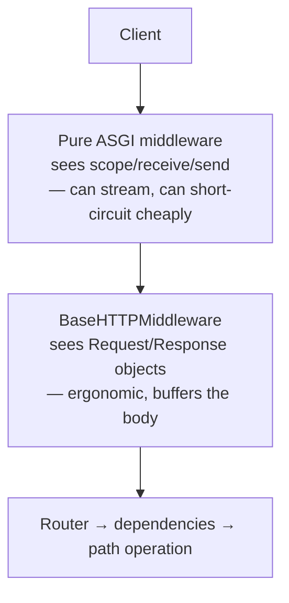

## Learning objectives

- Write ASGI and HTTP middleware in FastAPI and know which to reach for.
- Propagate a request id through logs, downstream calls, and error reports.
- Emit structured logs that a machine can query, not prose a human must grep.
- Instrument with OpenTelemetry traces and Prometheus metrics without drowning in cardinality.
- Choose what to measure: the four signals that actually predict incidents.

## Prerequisites

[ASGI and Starlette](/courses/fastapi/asgi-and-starlette), [dependency injection](/courses/fastapi/dependency-injection), and Python [errors, logging, and observability](/courses/python/errors-logging-and-observability).

## Two kinds of middleware

FastAPI inherits Starlette's middleware, and there are two layers with different powers:



**`BaseHTTPMiddleware`** is the friendly one:

```python
@app.middleware("http")
async def add_timing(request: Request, call_next):
    start = time.perf_counter()
    response = await call_next(request)
    response.headers["X-Duration-Ms"] = f"{(time.perf_counter() - start) * 1000:.1f}"
    return response
```

It's convenient, but it wraps the response in a queue-backed stream, which means: **it breaks true streaming responses** (the client waits for the whole body), it adds a task per request, and exceptions inside it surface with confusing tracebacks. Fine for headers and timing; wrong for anything on the hot path of a streaming endpoint.

**Pure ASGI middleware** avoids all of that:

```python
class RequestIDMiddleware:
    def __init__(self, app: ASGIApp) -> None:
        self.app = app

    async def __call__(self, scope: Scope, receive: Receive, send: Send) -> None:
        if scope["type"] != "http":
            await self.app(scope, receive, send)
            return

        headers = Headers(scope=scope)
        rid = headers.get("x-request-id") or uuid4().hex
        token = request_id_var.set(rid)          # ContextVar — visible everywhere below

        async def send_with_id(message: Message) -> None:
            if message["type"] == "http.response.start":
                message["headers"].append((b"x-request-id", rid.encode()))
            await send(message)

        try:
            await self.app(scope, receive, send_with_id)
        finally:
            request_id_var.reset(token)

app.add_middleware(RequestIDMiddleware)
```

`ContextVar` is the right tool here: it's per-task, so concurrent requests never see each other's id — unlike a module global, which would interleave chaotically under async.

**Order matters and it's counter-intuitive:** middleware added *last* runs *first*. Add them outermost-concern-first in your head, then reverse — or just add them in this order and read it bottom-up:

```python
app.add_middleware(GZipMiddleware, minimum_size=1000)   # runs 3rd
app.add_middleware(CORSMiddleware, allow_origins=[...]) # runs 2nd
app.add_middleware(RequestIDMiddleware)                 # runs 1st — id exists for everything
```

## Structured logging

Human-readable log lines are unqueryable. Emit JSON with stable field names, and attach the request id automatically:

```python
class ContextFilter(logging.Filter):
    def filter(self, record: logging.LogRecord) -> bool:
        record.request_id = request_id_var.get("-")
        record.user_id = user_id_var.get("-")
        return True

# structlog is the ergonomic path, but stdlib + python-json-logger is enough:
handler = logging.StreamHandler()
handler.setFormatter(jsonlogger.JsonFormatter(
    "%(asctime)s %(levelname)s %(name)s %(message)s %(request_id)s %(user_id)s"))
handler.addFilter(ContextFilter())
logging.basicConfig(handlers=[handler], level=logging.INFO)
```

Then one access log line per request, emitted from middleware where you know the outcome:

```python
logger.info("request", extra={
    "method": request.method,
    "path": request.scope["route"].path if "route" in request.scope else request.url.path,
    "status": response.status_code,
    "duration_ms": round(duration * 1000, 1),
})
```

Note `route.path` — the **template** (`/orders/{id}`), not the concrete URL (`/orders/8412`). Logging concrete paths makes every request unique and destroys your ability to aggregate. The same rule is critical for metrics, where it also blows up cardinality.

Rules that pay off later:

- **Never log secrets or PII**: tokens, passwords, full card numbers, national ids. Add a redacting filter; assume logs will be shared with a vendor.
- **Log at boundaries** — request in/out, external call in/out, task start/finish. Not every line of business logic.
- **`logger.exception()` inside `except`** to capture the traceback; `logger.error()` alone discards it.
- **Keep the event name stable and put variables in fields**: `logger.info("payment_failed", extra={"reason": ...})`, not `f"Payment failed because {reason}"`.

## Propagating context downstream

A request id is only useful if it crosses service boundaries:

```python
class TracedClient(httpx.AsyncClient):
    async def request(self, *args, **kwargs):
        headers = kwargs.setdefault("headers", {})
        headers["X-Request-ID"] = request_id_var.get("-")
        return await super().request(*args, **kwargs)
```

And into background work — Celery/arq tasks should carry the id in their payload, then set the ContextVar on the worker side. Without that, an error in a task is an orphan you can't tie to the user action that caused it.

## Tracing with OpenTelemetry

Logs tell you what happened in one service. Traces tell you where the 3 seconds went across five.

```python
from opentelemetry.instrumentation.fastapi import FastAPIInstrumentor
from opentelemetry.instrumentation.httpx import HTTPXClientInstrumentor
from opentelemetry.instrumentation.sqlalchemy import SQLAlchemyInstrumentor

FastAPIInstrumentor.instrument_app(app, excluded_urls="/health,/metrics")
HTTPXClientInstrumentor().instrument()
SQLAlchemyInstrumentor().instrument(engine=engine.sync_engine)
```

That auto-instrumentation gives you a span per request, per outbound HTTP call, and per query — usually enough to find the problem. Add manual spans only around meaningful business operations:

```python
tracer = trace.get_tracer(__name__)

async def place_order(user: User, cart: Cart) -> Order:
    with tracer.start_as_current_span("place_order") as span:
        span.set_attribute("cart.items", len(cart.items))
        span.set_attribute("user.tier", user.tier)      # low cardinality: tier, not user id
        order = await repo.create(...)
        span.set_attribute("order.id", str(order.id))
        return order
```

Sample in production (`TraceIdRatioBased(0.05)`) — 100% tracing on a busy service costs more than the service. Sample *tail*-based if your backend supports it, so you keep the slow and failed traces and drop the boring ones.

## Metrics without a cardinality explosion

```python
REQUESTS = Counter("http_requests_total", "Requests",
                   ["method", "route", "status"])
LATENCY = Histogram("http_request_duration_seconds", "Latency",
                    ["method", "route"],
                    buckets=(.005, .01, .025, .05, .1, .25, .5, 1, 2.5, 5, 10))
IN_FLIGHT = Gauge("http_requests_in_flight", "Concurrent requests")
```

The one rule that matters: **labels must be low-cardinality.** `route` (template) is fine — a few hundred values. `path`, `user_id`, `order_id`, or `email` are not: each unique value creates a new time series, and a million series will take down your Prometheus before it takes down your app. Put high-cardinality identifiers in *logs and traces*, never in metric labels.

What to actually watch (the RED method for request-driven services):

| Signal | Metric | Alert on |
|---|---|---|
| **Rate** | requests/sec by route | sudden drop (upstream broken) |
| **Errors** | 5xx ratio | > 1% over 5 min |
| **Duration** | p95/p99 latency by route | p99 above your SLO |
| **Saturation** | in-flight, pool usage, queue depth | > 80% of capacity |

Alert on **symptoms users feel** (error rate, latency), not causes (CPU 90% is fine if latency is fine). And keep `/health` and `/metrics` out of the histograms, or your p99 will look great while users suffer.

```python
@app.get("/health", include_in_schema=False)
async def health(db: AsyncSession = Depends(get_db)):
    await db.execute(text("SELECT 1"))          # liveness that means something
    return {"status": "ok", "version": settings.git_sha}
```

Separate **liveness** (is the process alive — restart if not) from **readiness** (can it serve — take it out of the load balancer if not). A DB-checking liveness probe causes a restart loop when the database blips; that's the classic self-inflicted outage.

## Common mistakes

1. **`BaseHTTPMiddleware` on streaming endpoints** — buffers the whole body, killing SSE and large downloads.
2. **High-cardinality metric labels** — `path` with ids, or `user_id`. Kills the metrics backend.
3. **Module-global request state** instead of `ContextVar` — data leaks between concurrent requests.
4. **Logging concrete paths** — aggregation becomes impossible.
5. **100% trace sampling in production** — cost and overhead with no extra insight.
6. **Secrets in logs** — the leak you discover during an audit.
7. **`logger.error()` in an `except` block** — traceback lost.
8. **Liveness probe that checks the database** — restart storm during a DB hiccup.
9. **Alerting on CPU/memory** instead of user-visible symptoms — pager fatigue, missed real incidents.

## Best practices

- One request id, generated at the edge or accepted from the proxy, propagated to logs, traces, downstream calls, background tasks, and the error response body.
- Pure ASGI middleware for anything on the hot path; `BaseHTTPMiddleware` for convenience code only.
- JSON logs with stable event names and variables in fields.
- Instrument automatically first (FastAPI + httpx + SQLAlchemy); add manual spans only for business operations.
- Metric labels: `method`, `route`, `status`. That's usually the complete list.
- Return the request id in error responses — support tickets become one-query investigations.
- Test observability: assert that a failing request logs an error with the request id present.

## Performance & memory notes

- `BaseHTTPMiddleware` adds an `anyio` task and a memory stream per request — roughly 5–10% overhead at high RPS, plus the streaming breakage.
- Logging is synchronous I/O. On a busy service, use `QueueHandler` + `QueueListener` so the event loop never blocks on a slow log sink.
- Histograms cost memory per bucket per label combination: 10 buckets × 20 routes × 4 methods × 5 statuses = 4 000 series. Tune buckets to your actual SLO; delete the ones you never read.
- OpenTelemetry batch export (`BatchSpanProcessor`) is essential — the simple processor exports per span, adding latency to every request.
- `ContextVar` lookups are cheap (dict access); don't cache them into globals "for speed".
- Exclude `/health` and `/metrics` from tracing and metrics; on a Kubernetes cluster they're often the majority of your request volume.

## Production tips

- Ship logs as JSON to stdout and let the platform (Docker, Kubernetes, systemd) handle transport — no file rotation logic in your app.
- Set `uvicorn --access-log false` and emit your own access log with the request id; the default one has no context.
- Correlate the three pillars: log lines carry `trace_id`, traces carry `request_id`, error reports (Sentry) carry both. Clicking between them is the whole point.
- Add a `/debug/config` endpoint (staff-only) dumping non-secret settings and the git SHA — resolves "which version is actually deployed" instantly.
- Budget: retain full logs ~14 days, sampled traces ~7, metrics ~13 months. Metrics are cheap and answer "was this normal last quarter".
- Run a game day: break the database, watch which alert fires first, and fix the ones that didn't.

## Interview questions

1. **"ASGI middleware vs `BaseHTTPMiddleware`?"** — The former sees raw scope/receive/send and preserves streaming; the latter offers `Request`/`Response` ergonomics but buffers the body and adds a task.
2. **"How do you trace one user's request across five services?"** — Generate/accept a request id at the edge, put it in a `ContextVar`, log it, forward it as a header, and use W3C `traceparent` with OpenTelemetry for real distributed traces.
3. **"Why is `user_id` a bad metric label?"** — Cardinality: one time series per user. Identifiers belong in logs and trace attributes.
4. **"What do you alert on?"** — Symptoms: error rate, latency percentiles, saturation, and request rate anomalies — tied to an SLO. Not raw CPU.
5. **"Why must middleware order be considered carefully?"** — Later `add_middleware` calls wrap earlier ones, so the request id middleware must be added last to be outermost — otherwise CORS or GZip errors have no id.

## Summary

- Two middleware layers: raw ASGI (fast, streaming-safe) and `BaseHTTPMiddleware` (ergonomic, buffering).
- `ContextVar` carries per-request context safely under concurrency; module globals do not.
- Structured JSON logs with route templates and stable event names are queryable; prose isn't.
- Auto-instrument for traces, sample in production, and keep metric labels low-cardinality.
- Alert on user-visible symptoms; separate liveness from readiness.

## Exercises

**Easy**

1. Write pure ASGI middleware adding `X-Request-ID` (accepting an inbound one if present) and verify it appears on both success and error responses.
2. Configure JSON logging with a filter injecting `request_id`, and log one line per request with method, route template, status, and duration.

**Medium**

3. Add Prometheus `Counter`, `Histogram`, and `Gauge` with `method`/`route`/`status` labels, exclude `/health` and `/metrics`, and confirm the route template — not the concrete path — is used.
4. Propagate the request id into an httpx client and an arq/Celery task, then prove with logs that one id spans web → worker → downstream call.

**Hard**

5. Instrument a three-service call chain with OpenTelemetry (FastAPI + httpx + SQLAlchemy), export to a local Jaeger, add manual spans around two business operations, enable 10% sampling, and find an artificially introduced N+1 purely from the trace waterfall.

**Debugging exercise**

6. This middleware leaks ids between concurrent requests and breaks the streaming download endpoint. Explain both failures:

```python
CURRENT_ID = None

@app.middleware("http")
async def add_id(request: Request, call_next):
    global CURRENT_ID
    CURRENT_ID = uuid4().hex
    response = await call_next(request)
    response.headers["X-Request-ID"] = CURRENT_ID
    return response
```

**Refactoring exercise**

7. Take a service logging `print(f"user {email} did {action}")` throughout, and convert it to structured logging with request ids, redacted PII, stable event names, and a single access log line. Show a query you can now run that was impossible before.

**Mini project**

Build a complete observability stack for a FastAPI service: request-id propagation end to end, JSON logs to stdout, Prometheus metrics with a Grafana dashboard showing RED signals, OpenTelemetry traces to Jaeger with 10% sampling, Sentry with the request id attached, separate liveness/readiness probes, and three alert rules tied to an explicit SLO. Then break something on purpose and document how fast each layer led you to the cause.

## Quiz

<details>
<summary>1. Why does <code>BaseHTTPMiddleware</code> break streaming responses?</summary>
It consumes the response through a memory stream to hand you a <code>Response</code> object, so the body is buffered and the client sees nothing until it completes.
</details>

<details>
<summary>2. Why <code>ContextVar</code> rather than a global for the request id?</summary>
<code>ContextVar</code> is per-task, so concurrent coroutines each see their own value. A global is shared, and under async the interleaving corrupts it.
</details>

<details>
<summary>3. Which middleware runs first — the one added first or last?</summary>
The one added <em>last</em> is outermost and runs first on the way in (and last on the way out).
</details>

<details>
<summary>4. Why log <code>/orders/{id}</code> instead of <code>/orders/8412</code>?</summary>
The template lets you aggregate by endpoint. Concrete paths make every request unique — and as a metric label they create unbounded cardinality.
</details>

<details>
<summary>5. Why shouldn't a liveness probe check the database?</summary>
Liveness failure restarts the process. A DB blip would then restart every replica simultaneously, turning a brief dependency issue into a full outage. Database checks belong in readiness.
</details>

## Further reading

- Starlette docs — "Middleware" (and the `BaseHTTPMiddleware` caveats)
- OpenTelemetry Python docs — auto-instrumentation, sampling, context propagation
- Google SRE Book — chapters on monitoring distributed systems and choosing SLOs
- Prometheus docs — "Naming" and "Instrumentation best practices" (cardinality)
