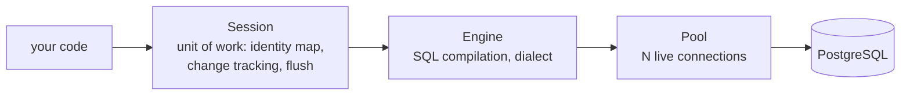

## Learning objectives

- Explain SQLAlchemy 2.0's architecture: engine, pool, session, unit of work — sync and async.
- Define models declaratively (typed, 2.0 style) and write select/insert/update in the 2.0 query API.
- Manage sessions per request correctly, avoid async lazy-loading landmines, and eager-load like the ORM intends.
- Run Alembic properly: autogenerate honestly reviewed, and production-safe migration patterns.
- Size and monitor connection pools.

## Prerequisites

[Dependency Injection](/courses/fastapi/dependency-injection) (session-per-request) and the Django ORM pair ([models](/courses/django/models-and-the-orm), [optimization](/courses/django/queryset-optimization)) — concepts transfer; philosophies differ.

## Architecture: what each piece owns



- **Engine** — one per process, created at [lifespan](/courses/fastapi/asgi-and-starlette): `create_async_engine(url, pool_size=10, max_overflow=5)`. It owns the **pool**: opening a Postgres connection costs a TCP+auth round trip and server memory; the pool amortizes it and caps concurrency.
- **Session** — short-lived **unit of work**: it tracks loaded objects (identity map: one Python object per row per session), records your changes, and **flushes** them as SQL at commit (or before queries that need consistency). Django hides this machinery ([active-record style](/courses/django/models-and-the-orm)); SQLAlchemy hands it to you — more control, more responsibility.
- Django comparison in one line: Django ORM = simpler, model-centric, implicit; SQLAlchemy = explicit sessions/transactions, more SQL power (CTEs, window functions, composability), and the async story is first-class.

## Models and queries, 2.0 style

```python
from sqlalchemy.orm import DeclarativeBase, Mapped, mapped_column, relationship

class Base(DeclarativeBase): ...

class User(Base):
    __tablename__ = "users"
    id: Mapped[int] = mapped_column(primary_key=True)
    email: Mapped[str] = mapped_column(String(255), unique=True, index=True)
    created_at: Mapped[datetime] = mapped_column(server_default=func.now())
    orders: Mapped[list["Order"]] = relationship(back_populates="user")

class Order(Base):
    __tablename__ = "orders"
    id: Mapped[int] = mapped_column(primary_key=True)
    user_id: Mapped[int] = mapped_column(ForeignKey("users.id"), index=True)
    total: Mapped[int]                    # minor units — no float money
    status: Mapped[str] = mapped_column(String(20), default="pending")
    user: Mapped[User] = relationship(back_populates="orders")
```

`Mapped[...]`/`mapped_column` is the typed modern declarative form — annotations drive nullability (`Mapped[str | None]`), and your [type checker](/courses/python/typing-and-generics) sees model attributes properly.

Queries are constructed, then executed by the session:

```python
from sqlalchemy import select, update, func

stmt = (select(Order)
        .join(Order.user)
        .where(User.email == email, Order.status == "paid")
        .order_by(Order.id.desc())
        .limit(20))
orders = (await session.execute(stmt)).scalars().all()

count_by_status = await session.execute(
    select(Order.status, func.count()).group_by(Order.status))

await session.execute(
    update(Order).where(Order.id == oid).values(status="shipped"))
```

`execute` returns a `Result` of rows; `.scalars()` unwraps single-entity rows; `.scalar_one()`/`.scalar_one_or_none()` for singletons. Writes via the unit of work: `session.add(obj)` registers, **flush** emits SQL, **commit** flushes + commits + (by default) expires cached attributes. The session-per-request shape from the [DI lesson](/courses/fastapi/dependency-injection):

```python
SessionFactory = async_sessionmaker(engine, expire_on_commit=False)

async def get_session() -> AsyncIterator[AsyncSession]:
    async with SessionFactory() as session:
        async with session.begin():       # one transaction per request
            yield session                 # commit/rollback automatic
```

`expire_on_commit=False` matters in async APIs: with expiration on, touching attributes after commit triggers refresh queries — which in async raises instead ([next section](#the-async-lazy-loading-landmine)).

## The async lazy-loading landmine

In sync SQLAlchemy, `order.user` on an unloaded relationship silently emits SQL — the [N+1 problem](/courses/django/queryset-optimization) Django users know. In **async**, implicit I/O during attribute access is impossible (no `await`!) — you get `MissingGreenlet` errors instead of silent N+1. Async SQLAlchemy thus *forces* the discipline Django only recommends: **declare your loading**:

| Strategy | SQL shape | Use for |
|---|---|---|
| `selectinload(Order.user)` | second `IN` query | to-many, and default choice generally |
| `joinedload(Order.user)` | LEFT JOIN in one query | to-one |
| `raiseload("*")` | error on any lazy access | enforcing discipline app-wide |

```python
stmt = (select(User)
        .options(selectinload(User.orders).selectinload(Order.lines))
        .where(User.id == uid))
```

Set `lazy="raise"` (or `raiseload("*")` in a base query) in async apps — every forgotten eager-load becomes a loud test failure instead of a production mystery. Repositories are the natural home for these query+loading recipes ([DI lesson](/courses/fastapi/dependency-injection) layering), keeping routes free of ORM detail and Pydantic's `from_attributes` happy ([three-schema discipline](/courses/fastapi/pydantic-deep-dive)).

## Alembic: schema as versioned code

Alembic tracks schema revisions the way git tracks source ([same philosophy as Django migrations](/courses/django/models-and-the-orm), different tooling):

```bash
alembic init migrations                 # once; point env.py at Base.metadata + your URL
alembic revision --autogenerate -m "add orders table"
alembic upgrade head                    # apply
alembic downgrade -1                    # revert one
```

Working truths:

- **Autogenerate is a draft, not a decision.** It diffs metadata vs DB and writes a candidate — it misses renames (sees drop+add: data loss!), server defaults, and some constraint subtleties. **Read every generated file** like the code it is.
- Each revision has `upgrade()`/`downgrade()` and a `down_revision` pointer — a linked list; branches happen when two developers generate in parallel (`alembic merge` heals them; CI should run `alembic upgrade head` against a scratch DB to catch conflicts early).
- **Production-safety patterns** (identical reasoning to the [Django migration rules](/courses/django/models-and-the-orm)): additive columns nullable-first, backfill in batches, then tighten; index creation `postgresql_concurrently=True` (with `op.get_bind().execution_options(isolation_level="AUTOCOMMIT")` context); never edit an applied revision; every migration backward-compatible with the previous app version for rolling deploys.
- Data migrations: use `op.execute` with plain SQL or a lightweight table reflection — never import live models (they describe the future, not this revision's schema).

## Common mistakes

1. **Engine or sessions at module import** — engines belong in lifespan; sessions per request; a global session shared across requests is corruption + "another operation is in progress" errors on asyncpg.
2. **Missing eager loads** — `MissingGreenlet` in async, silent N+1 in sync; fix at the repository query, not by sprinkling `expire_on_commit` hacks.
3. **Serializing ORM objects after the session closed** (with expiration on) — detached-instance refresh errors; shape into Pydantic models inside the session scope.
4. **Long transactions** — holding the request transaction across an external HTTP call keeps locks + a pool connection hostage ([same rule as Django's atomic](/courses/django/queryset-optimization)); do slow I/O outside the transaction.
5. **Trusting autogenerate blindly** — the rename-as-drop data-loss classic.
6. **Pool math ignored** — 8 workers × pool 10 + overflow 5 = 120 potential connections vs Postgres `max_connections=100`: connection storms at deploy. Budget: workers × (pool+overflow) < DB limit − headroom (or add pgbouncer).
7. **Float money / naive datetimes in columns** — integers in minor units; timezone-aware `DateTime(timezone=True)`; enforced in review.

## Best practices

- Repository layer owns statements + loading options; services own transactions' *semantics* (what must be atomic); the DI session dependency owns their *mechanics*.
- One transaction per request as default; explicit `session.begin_nested()` (savepoints) for partial-failure sections.
- `raiseload` discipline in async apps; `assertNumQueries`-style tests via `sqlalchemy` event listeners or query counters in CI for hot endpoints.
- Name constraints/indexes explicitly (naming_convention on metadata) — Alembic diffs become deterministic across environments.
- Keep Alembic revisions small and single-purpose; `alembic upgrade head` in CI against a real Postgres (not sqlite) because DDL dialects differ.

## Performance & memory notes

- The identity map means a session accumulates every loaded object until closed — batch jobs iterating millions of rows must use `stream_results`/`yield_per` and periodic `session.expunge_all()`, or work in id-windowed chunks ([iterator patterns](/courses/python/iterators-and-generators)).
- `selectinload` costs one extra round trip per relation but stays linear; `joinedload` on to-many multiplies rows (JSON-size blowup) — match strategy to cardinality.
- Compiled statement caching (2.0 does this automatically) makes repeated statement shapes cheap — dynamic per-call SQL strings defeat it.
- `asyncpg` is measurably the fastest Postgres driver; combined with pool pre-ping and sane sizes, driver overhead is rarely your bottleneck — the queries are ([EXPLAIN literacy](/courses/django/queryset-optimization) transfers verbatim).

## Production tips

- `pool_pre_ping=True` (dead-connection detection after DB restarts/failovers), `pool_recycle=3600` behind NAT/proxies that silently kill idle TCP.
- Monitor `pool.checkedout()` / wait times (SQLAlchemy pool events) — pool exhaustion presents as latency cliffs; alert before saturation.
- pgbouncer (transaction mode) when many app processes share one Postgres — but transaction-mode pooling breaks session-level features (advisory locks, LISTEN, prepared statements config for asyncpg) — know the tradeoffs before flipping it on.
- Run `alembic upgrade head` as a deploy step gated before new code serves traffic; keep a rehearsed `downgrade` path for the last revision, and backups for everything else.

## Interview questions

1. **"Explain the unit of work pattern."** — Session tracks loaded/changed objects (identity map), computes minimal SQL at flush, commits atomically; contrast with active-record's save-per-object.
2. **"Why does lazy loading fail in async SQLAlchemy, and why is that good?"** — Attribute access can't await; implicit I/O becomes an explicit error, forcing declared eager loading — the N+1 class becomes unshippable.
3. **"Size a connection pool for 6 uvicorn workers against max_connections=100."** — Budget: 6 × (pool+overflow) + migrations/cron/psql headroom < 100; e.g. pool 10 + overflow 2 → 72, leaving room; mention pgbouncer at higher scale.
4. **"What does autogenerate get wrong?"** — Renames (drop+add), server defaults, some type/constraint changes; review + manual `op.alter_column` for renames.
5. **"Where do transactions begin and end in your API?"** — Session-per-request dependency opens one; services define atomic semantics; slow external I/O excluded; savepoints for partial sections.

## Summary

- Engine (process, pool) → Session (request, unit of work) → statements (2.0 select/update) — each layer has one owner in your code.
- Async turns lazy-loading sins into loud errors: declare loading (`selectinload`/`joinedload`), enforce with `raiseload`, house recipes in repositories.
- Alembic = schema version control: autogenerate drafts, humans review, production patterns (nullable-first, concurrent indexes, rolling-compatible) apply everywhere.
- Pool math and transaction scope are operational correctness, not tuning trivia.

## Exercises

**Easy**

1. Define `User`/`Order` (typed declarative), create the schema via an initial Alembic revision, insert with a session, and query paid orders with the 2.0 API.
2. Trigger `MissingGreenlet` deliberately (async lazy access), then fix with `selectinload`; keep both snippets as a before/after note.

**Medium**

3. Build `OrderRepo` with `for_user(uid)` (orders + lines eager), `stats()` (group-by aggregation), and `mark_shipped(ids)` (bulk update returning rowcount); wire through the DI session and test with a rollback-per-test session.
4. Write three Alembic revisions on a seeded table: add nullable column → batched backfill (`op.execute` in chunks) → set non-null + index (concurrently). Verify `downgrade` works for each.

**Hard**

5. Implement inventory checkout with `SELECT ... FOR UPDATE` (`with_for_update()`), a concurrent test (two sessions racing for the last unit), and the alternative conditional-update version; compare with the [Django exercise](/courses/django/queryset-optimization) you did.

**Debugging exercise**

6. This endpoint 500s intermittently with "another operation is in progress", leaks connections under load, and sometimes returns stale totals. Find all three:

```python
engine = create_async_engine(URL)
session = AsyncSession(engine)                 # module-level, shared

@router.get("/total/{uid}")
async def total(uid: int):
    orders = (await session.execute(
        select(Order).where(Order.user_id == uid))).scalars().all()
    await notify_analytics(uid)                # HTTP call mid-"transaction"
    return {"total": sum(o.total for o in orders)}
    # session never closed/committed anywhere
```

**Refactoring exercise**

7. Refactor a service that passes raw sessions everywhere and inlines 15 ad-hoc queries into: repository methods with named loading recipes, `raiseload` base, and a transaction boundary at the request dependency. Count queries on the hottest endpoint before/after.

**Mini project**

Build a "warehouse" mini-backend: products/stock/movements schema via three reviewed Alembic revisions; repos with eager-loading recipes; a `transfer_stock` service that's transactional and race-safe (locking test included); a streaming CSV export using `yield_per` with flat memory; pool metrics logged at lifespan shutdown. Postgres in Docker; CI job running migrations + tests against it.

## Quiz

<details>
<summary>1. What is the identity map, concretely?</summary>
A per-session dict (table, pk) → instance: loading the same row twice yields the same Python object, so in-session changes are consistent and unified at flush.
</details>

<details>
<summary>2. When does the session actually send your <code>session.add(obj)</code> to the DB?</summary>
At flush — before a query that needs it (autoflush) or at commit — as part of the unit of work's computed statement batch.
</details>

<details>
<summary>3. <code>joinedload</code> on a to-many relation of 50 children — what happens to the result set?</summary>
The parent row repeats 50× in the JOIN; SQLAlchemy dedupes objects, but transfer/parse cost is real — use <code>selectinload</code> for to-many.
</details>

<details>
<summary>4. Why must slow external calls leave the transaction?</summary>
The transaction holds row locks and a pool connection for its duration — an 800ms HTTP call inside it serializes contended writes and starves the pool.
</details>

<details>
<summary>5. Why does CI need real Postgres for Alembic, not sqlite?</summary>
DDL differs by dialect (ALTER support, concurrent indexes, types) — sqlite green proves nothing about the statements production will run.
</details>

## Further reading

- SQLAlchemy 2.0 docs — Unified Tutorial, then ORM "Session Basics" and "Relationship Loading Techniques"
- Alembic docs — Tutorial + "Operations" reference; cookbook on batch/online migrations
- asyncpg + SQLAlchemy async docs page
