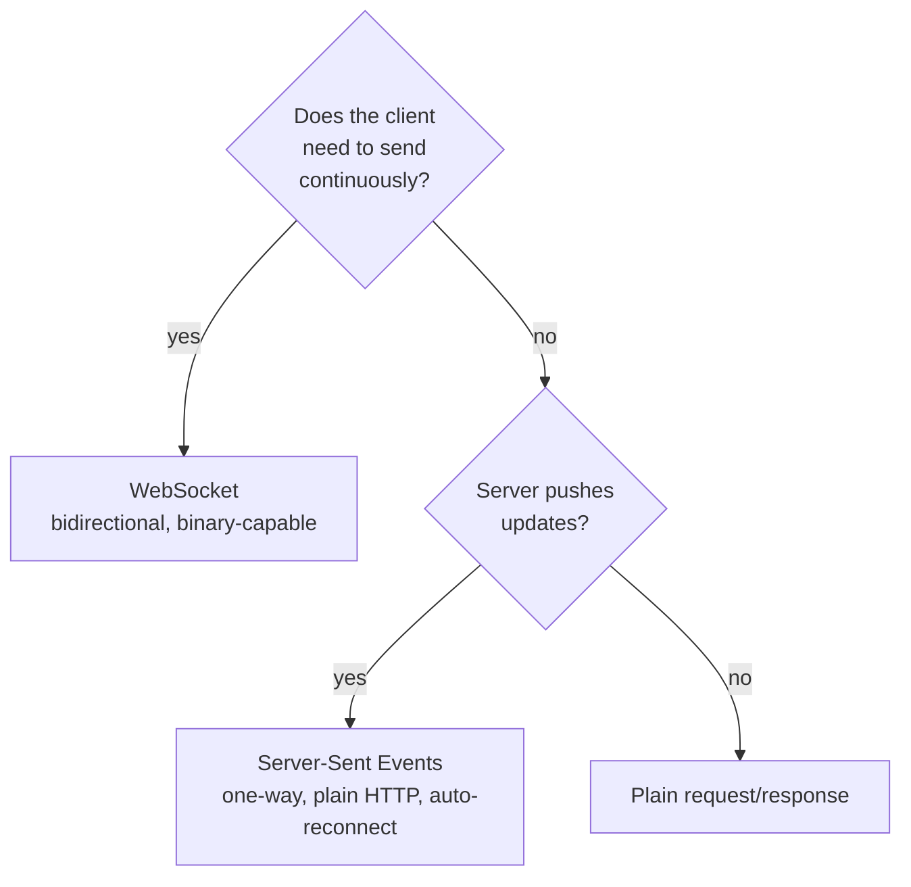

## Learning objectives

- Implement WebSocket endpoints in FastAPI with correct lifecycle and error handling.
- Choose between WebSockets, Server-Sent Events, and long polling on the merits.
- Scale real-time features across processes with a Redis pub/sub layer.
- Stream large responses and file uploads without loading them into memory.
- Handle the operational realities: reconnects, heartbeats, backpressure, and deploys.

## Prerequisites

[ASGI and Starlette](/courses/fastapi/asgi-and-starlette), Python [asyncio fundamentals](/courses/python/asyncio-fundamentals), and [caching and rate limiting](/courses/fastapi/caching-and-rate-limiting).

## Choosing the transport



| | WebSocket | SSE | Long polling |
|---|---|---|---|
| Direction | bidirectional | server → client | client-initiated |
| Protocol | upgrade from HTTP | plain HTTP | plain HTTP |
| Auto-reconnect | you build it | **built into the browser** | trivially |
| Proxy/CDN friendliness | needs config | works nearly everywhere | works everywhere |
| Binary | yes | no (text only) | yes |
| Cost per client | one held connection | one held connection | repeated requests |

The honest default: **if the server only pushes, use SSE.** The browser's `EventSource` handles reconnection and `Last-Event-ID` resume for free, it rides ordinary HTTP through every proxy, and it's a fraction of the code. Reach for WebSockets when the client also streams — chat, collaborative editing, live cursors, games.

## WebSockets in FastAPI

```python
@app.websocket("/ws/rooms/{room_id}")
async def room_socket(websocket: WebSocket, room_id: str,
                      token: str = Query(...)):
    # Authorize BEFORE accepting. Browsers can't set headers on a WS handshake,
    # so a query token or a cookie is the practical option — keep the token short-lived.
    user = await authenticate_ws(token)
    if user is None or not await can_join(user, room_id):
        await websocket.close(code=4403, reason="Forbidden")
        return

    await websocket.accept()
    await hub.subscribe(room_id, websocket)
    try:
        await websocket.send_json({"type": "hello", "room": room_id})
        while True:
            msg = await websocket.receive_json()
            if not await limiter.allow(f"ws:{user.id}", rate=5, burst=20):
                await websocket.send_json({"type": "error", "code": "rate_limited"})
                continue
            text = (msg.get("text") or "").strip()[:2000]      # always bound input
            if text:
                stored = await repo.add_message(room_id, user.id, text)
                await hub.publish(room_id, {"type": "message", "id": stored.id,
                                            "text": text, "author": user.username})
    except WebSocketDisconnect:
        pass                                    # normal client close — not an error
    except Exception:
        logger.exception("ws_error", extra={"room": room_id, "user": user.id})
        await websocket.close(code=1011)
    finally:
        await hub.unsubscribe(room_id, websocket)   # ALWAYS runs
```

The load-bearing details:

- **Authorize before `accept()`.** Accepting and then checking means an unauthorized client already has a connection — and your unsubscribe path now has to handle a state it never entered.
- **`WebSocketDisconnect` is normal.** Clients close tabs. Catching it separately keeps your error rate meaningful.
- **`finally` for cleanup.** Miss this and every disconnect leaks an entry in your hub — a slow memory leak that only appears in production after a week.
- **Bound every input.** Message size, rate, and the number of connections per user. A WebSocket is an open socket into your process; treat client input as hostile.
- **Close codes matter**: 1000 normal, 1011 server error, 4000–4999 yours. Use application codes so the client can decide whether reconnecting makes sense — reconnecting after "Forbidden" is a loop.

## Scaling past one process

An in-memory `dict` of connections works perfectly on your laptop and breaks the instant you run two workers: a message published by process A never reaches sockets held by process B.

```python
class Hub:
    """Local sockets + a Redis pub/sub fan-out across processes."""

    def __init__(self, redis: Redis) -> None:
        self.redis = redis
        self.local: dict[str, set[WebSocket]] = defaultdict(set)
        self._pubsub: PubSub | None = None

    async def start(self) -> None:
        self._pubsub = self.redis.pubsub()
        await self._pubsub.psubscribe("room:*")
        asyncio.create_task(self._reader())        # one reader task per process

    async def _reader(self) -> None:
        async for message in self._pubsub.listen():
            if message["type"] != "pmessage":
                continue
            room = message["channel"].decode().split(":", 1)[1]
            payload = orjson.loads(message["data"])
            await self._deliver_local(room, payload)

    async def _deliver_local(self, room: str, payload: dict) -> None:
        dead = []
        for ws in list(self.local.get(room, ())):
            try:
                await ws.send_json(payload)
            except (WebSocketDisconnect, RuntimeError):
                dead.append(ws)
            except Exception:
                dead.append(ws)
        for ws in dead:                            # prune failures immediately
            self.local[room].discard(ws)

    async def publish(self, room: str, payload: dict) -> None:
        await self.redis.publish(f"room:{room}", orjson.dumps(payload))

    async def subscribe(self, room: str, ws: WebSocket) -> None:
        self.local[room].add(ws)

    async def unsubscribe(self, room: str, ws: WebSocket) -> None:
        self.local[room].discard(ws)
        if not self.local[room]:
            del self.local[room]                   # don't leak empty rooms
```

Note what Redis pub/sub does **not** give you: persistence. A message published while a client is reconnecting is gone forever. If clients must not miss messages, persist them and let the client resume:

```python
# Client sends its last seen id on connect; the server replays the gap.
async def on_connect(ws, room_id, last_seen_id: int | None):
    if last_seen_id is not None:
        for msg in await repo.messages_after(room_id, last_seen_id, limit=500):
            await ws.send_json(msg)
```

Redis Streams (`XADD`/`XREAD`) give you pub/sub *and* a replayable log in one primitive — worth the extra complexity when missed messages are unacceptable.

## Server-Sent Events

Less code, fewer failure modes:

```python
async def event_stream(request: Request, user: User) -> AsyncIterator[str]:
    queue = await hub.subscribe_sse(user.id)
    try:
        while True:
            if await request.is_disconnected():        # client went away
                break
            try:
                event = await asyncio.wait_for(queue.get(), timeout=15)
                yield f"id: {event['id']}\nevent: {event['type']}\n" \
                      f"data: {orjson.dumps(event).decode()}\n\n"
            except asyncio.TimeoutError:
                yield ": keepalive\n\n"                # comment frame; keeps proxies happy
    finally:
        await hub.unsubscribe_sse(user.id, queue)

@app.get("/api/events")
async def events(request: Request, user: User = Depends(current_user)):
    return StreamingResponse(
        event_stream(request, user),
        media_type="text/event-stream",
        headers={"Cache-Control": "no-cache",
                 "X-Accel-Buffering": "no",            # tell Nginx not to buffer
                 "Connection": "keep-alive"},
    )
```

The three things that break SSE in production, all fixed above: **proxy buffering** (`X-Accel-Buffering: no` plus `proxy_buffering off`), **idle timeouts** (the keepalive comment every 15 s), and **leaked subscriptions** (the `finally` plus the `is_disconnected` check).

The client side is genuinely trivial, and resume is free:

```javascript
const es = new EventSource("/api/events");
es.addEventListener("message", (e) => render(JSON.parse(e.data)));
// Browser auto-reconnects and sends Last-Event-ID from the `id:` field.
```

## Streaming HTTP bodies

Same underlying mechanism, different use: never build a large response in memory.

```python
@app.get("/api/export.csv")
async def export_csv(db: AsyncSession = Depends(get_db)):
    async def rows() -> AsyncIterator[bytes]:
        yield b"id,email,created_at\n"
        # server-side cursor: constant memory regardless of table size
        result = await db.stream(select(User).execution_options(yield_per=1000))
        async for user in result.scalars():
            yield f"{user.id},{user.email},{user.created_at.isoformat()}\n".encode()

    return StreamingResponse(rows(), media_type="text/csv", headers={
        "Content-Disposition": 'attachment; filename="users.csv"'})
```

Uploads deserve the same treatment — `await file.read()` on a 2 GB upload is an OOM kill:

```python
@app.post("/api/uploads")
async def upload(file: UploadFile):
    digest = hashlib.sha256()
    size = 0
    with tempfile.NamedTemporaryFile(delete=False) as tmp:
        while chunk := await file.read(1024 * 1024):      # 1 MB at a time
            size += len(chunk)
            if size > MAX_UPLOAD:
                raise HTTPException(413, "File too large")
            digest.update(chunk)
            tmp.write(chunk)
    return {"sha256": digest.hexdigest(), "size": size}
```

Validate the size *as you stream*, not after — otherwise the DoS already happened. And cap it at the proxy too (`client_max_body_size`), so a hostile 10 GB upload never reaches Python.

For LLM-style token streaming, the same `StreamingResponse` with SSE framing is the standard shape — and `X-Accel-Buffering: no` is again what makes tokens appear one at a time rather than all at once at the end.

## Common mistakes

1. **`accept()` before authorizing** — unauthenticated clients hold connections.
2. **No `finally` cleanup** — leaked hub entries; memory grows until restart.
3. **In-memory connection registry with multiple workers** — messages reach only the process that received them.
4. **Treating `WebSocketDisconnect` as an error** — error dashboards full of users closing tabs.
5. **No heartbeat** — proxies silently drop idle connections at 60 s and clients think they're still connected.
6. **Unbounded input** — no message size cap, no rate limit, no per-user connection cap.
7. **Buffering proxies with SSE** — nothing arrives until the stream ends, which for an infinite stream is never.
8. **`await file.read()` on large uploads** — the whole file in RAM.
9. **Blocking calls inside a socket handler** — stalls the event loop and every other connection in that process ([async lesson](/courses/python/asyncio-fundamentals)).
10. **Assuming pub/sub is durable** — messages sent during a reconnect are simply lost.

## Best practices

- Prefer SSE for one-way push; take WebSockets only when the client streams too.
- Authorize before accept; use short-lived tokens, since browsers can't set handshake headers.
- Application-level heartbeat every ~30 s in both directions; treat a missed heartbeat as a dead connection.
- Client reconnect with exponential backoff **and jitter**, plus resume-from-last-id.
- Every connection cleans up in `finally`; every room prunes when empty.
- Cap message size, message rate, and connections per user.
- Redis pub/sub for fan-out; a persisted log (or Redis Streams) when messages must not be missed.
- Stream every response and upload whose size scales with data — always constant memory.

## Performance & memory notes

- Budget roughly 20–60 KB per WebSocket connection (buffers, task, framework objects). 10 000 connections ≈ 200–600 MB — measure yours rather than trusting the estimate.
- One ASGI process = one event loop = one core. Real-time capacity scales by adding processes, and each needs its own pub/sub subscription.
- `send_json` to a slow client applies backpressure and can block your fan-out loop. Use per-connection bounded queues and **drop or disconnect** slow consumers rather than letting one client stall a room.
- Fan-out is O(connections) per message. A 10 000-member room broadcasting at 10 msg/s is 100 000 sends/sec — shard rooms or aggregate updates (send diffs at 10 Hz rather than every change).
- `orjson` over stdlib `json` matters here: serialization runs once per message per connection.
- Streaming responses hold a DB cursor open for the duration. Long exports pin a connection — use a separate pool or hand the job to a worker that writes to object storage.
- `BaseHTTPMiddleware` buffers response bodies and **breaks streaming entirely**; use pure ASGI middleware on streaming paths ([middleware lesson](/courses/fastapi/middleware-and-observability)).

## Production tips

- Nginx needs `proxy_http_version 1.1`, `proxy_set_header Upgrade $http_upgrade`, `Connection "upgrade"`, `proxy_buffering off`, and a `proxy_read_timeout` comfortably above your heartbeat.
- Load balancers: enable stickiness or ensure any process can serve any client (it can, if state lives in Redis — design for that).
- Every deploy drops every connection. Stagger rollouts, and make clients reconnect with jitter so 10 000 browsers don't reconnect in the same 200 ms and take down the fresh process.
- Monitor: open connections per process, messages/sec, fan-out latency, reconnect rate, and dropped-slow-consumer count. A reconnect-rate spike is usually the first sign of a proxy timeout misconfiguration.
- Set a maximum connection lifetime (say 4 hours) and close politely with a code that means "reconnect" — it bounds leaks and rebalances connections after a scale-up.
- Test with the network against you: `tc netem` for latency and packet loss, and a proxy that kills idle connections. Real-time bugs only appear on bad networks.

## Interview questions

1. **"WebSocket or SSE?"** — SSE for one-way push: plain HTTP, free auto-reconnect and resume, proxy-friendly. WebSocket when the client streams too or you need binary frames.
2. **"How do you scale WebSockets across processes?"** — Move fan-out to a shared bus (Redis pub/sub or Streams); each process keeps only its local sockets and subscribes to the bus.
3. **"Why authorize before `accept()`?"** — Accepting establishes the connection; checking afterwards means an unauthorized peer already holds resources and your cleanup paths must handle a half-valid state.
4. **"Your SSE endpoint delivers nothing until it ends. Why?"** — A buffering proxy. Disable buffering (`X-Accel-Buffering: no`, `proxy_buffering off`) and send periodic keepalive comments.
5. **"How do you export a million rows?"** — `StreamingResponse` over a server-side cursor with `yield_per`, or better: a background job writing to object storage and a signed download URL, so no request is held open for minutes.

## Summary

- SSE is the right default for server push; WebSockets when communication is genuinely two-way.
- Authorize first, clean up in `finally`, bound every input, heartbeat both ways.
- In-memory registries don't survive a second worker — fan out through Redis.
- Pub/sub isn't durable; persist and resume from a last-seen id when messages matter.
- Stream large responses and uploads in chunks; validate size while streaming, and cap at the proxy.

## Exercises

**Easy**

1. Build a WebSocket echo endpoint with query-token auth, a 1 000-character message cap, and correct `WebSocketDisconnect` handling.
2. Build an SSE endpoint pushing the server time every second, with keepalive comments and `X-Accel-Buffering: no`. Confirm it survives an Nginx proxy.

**Medium**

3. Implement a `Hub` with Redis pub/sub, run two Uvicorn processes behind one proxy, and prove a message sent to process A reaches a client connected to process B.
4. Add heartbeats both directions plus client reconnect with exponential backoff and jitter; kill the server and show clients recover without a thundering herd.

**Hard**

5. Build a collaborative cursor feature: 50 clients in one room, position updates at 30 Hz, server-side aggregation to 10 Hz diffs, per-connection bounded queues that drop slow consumers, resume-from-last-id after reconnect, and a load test reporting memory per connection and p99 fan-out latency.

**Debugging exercise**

6. This works on one worker, leaks memory, and floods the error dashboard. Find four bugs:

```python
rooms: dict[str, list[WebSocket]] = {}

@app.websocket("/ws/{room}")
async def ws(websocket: WebSocket, room: str):
    await websocket.accept()
    rooms.setdefault(room, []).append(websocket)
    while True:
        data = await websocket.receive_text()
        for peer in rooms[room]:
            await peer.send_text(data)
```

**Refactoring exercise**

7. An endpoint builds a 400 MB CSV with `"".join(rows)` and returns it. Convert it to a streaming response over a server-side cursor, measure peak RSS before and after, then argue when it should become a background job instead.

**Mini project**

Build a live support-chat backend: rooms with authorization, presence, typing indicators, message persistence with resume-from-id, Redis pub/sub fan-out across three processes, per-user rate limits and connection caps, heartbeats, graceful deploy handling with jittered client reconnect, and a dashboard for connections, fan-out latency, and reconnect rate. Load-test 2 000 concurrent connections and document where it degrades first.

## Quiz

<details>
<summary>1. Why does SSE need no reconnect code?</summary>
The browser's <code>EventSource</code> reconnects automatically and resends <code>Last-Event-ID</code>, so the server can replay from where the client left off.
</details>

<details>
<summary>2. What breaks when you keep connections in a module-level dict and run four workers?</summary>
Each process only knows its own sockets, so a broadcast reaches roughly a quarter of the room. Fan-out must go through a shared bus.
</details>

<details>
<summary>3. Why send periodic keepalives on a long-lived stream?</summary>
Proxies and load balancers close idle connections (often at 60 s). A comment frame or ping keeps the connection alive and detects dead peers.
</details>

<details>
<summary>4. What's wrong with <code>content = await file.read()</code> for uploads?</summary>
It loads the entire file into memory — a large upload OOM-kills the worker. Read in chunks and enforce the size limit as you go.
</details>

<details>
<summary>5. Is Redis pub/sub durable?</summary>
No. Messages published while a subscriber is disconnected are lost. Persist messages (or use Redis Streams) and resume from a last-seen id when delivery matters.
</details>

## Further reading

- FastAPI docs — "WebSockets"; Starlette docs — `StreamingResponse`, `WebSocket`
- MDN — "Using server-sent events", `EventSource` reconnection semantics
- RFC 6455 (WebSocket protocol) — close codes and framing
- Redis docs — Pub/Sub versus Streams, and when each is appropriate
