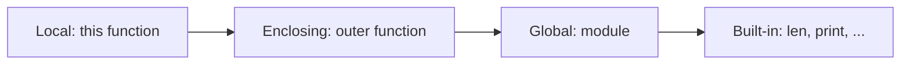

## Learning objectives

- Master positional, keyword, default, `*args`, and `**kwargs` parameters.
- Avoid the **mutable default argument** trap.
- Use argument **unpacking** to pass and collect arguments cleanly.
- Explain how Python resolves names with **LEGB** scope.

## Prerequisites

You can already write and call basic functions and use lists/dicts. This lesson turns "I can write a function" into "I understand exactly how arguments and scope work."

## The core idea in one line

> A function call is Python **matching the arguments you pass to the parameters you defined**, then running the body in a fresh local namespace.

**Analogy — a coffee order.** Parameters are the fields on the order form (size, milk, extra shot). Positional arguments are filling them top-to-bottom in order; keyword arguments are writing the field name explicitly ("milk: oat"). Defaults are the barista's assumptions when you don't specify. `*args`/`**kwargs` are "and anything else you want to add." Get the matching rules right and a whole category of bugs disappears.

## The parameter toolbox

```python
def order(size, milk="whole", *extras, sugar=0, **notes):
    ...
```

- `size` — **positional-or-keyword**, required.
- `milk="whole"` — has a **default**, so it's optional.
- `*extras` — collects **extra positional** args into a tuple.
- `sugar=0` — after `*extras`, it's **keyword-only** (must be named).
- `**notes` — collects **extra keyword** args into a dict.

```python
order("large", "oat", "cinnamon", "foam", sugar=2, decaf=True)
# size="large", milk="oat", extras=("cinnamon","foam"), sugar=2, notes={"decaf": True}
```

### Positional-only and keyword-only markers

```python
def f(a, b, /, c, *, d):   #  / = positional-only before it;  * = keyword-only after it
    ...
f(1, 2, 3, d=4)            # a,b positional-only; c either; d keyword-only
```

`/` and `*` let you design clean, future-proof signatures — callers can't depend on parameter names you might rename (before `/`), and important options must be named (after `*`).

## The mutable default argument trap

```python
def add_item(item, basket=[]):     # ⚠️ default list created ONCE, at def time
    basket.append(item)
    return basket

add_item("a")     # ['a']
add_item("b")     # ['a', 'b']  ← surprise! same list reused
```

The default value is evaluated **once**, when the function is defined — not per call. A mutable default is shared across every call. The fix is the canonical Python idiom:

```python
def add_item(item, basket=None):
    if basket is None:
        basket = []            # fresh list each call
    basket.append(item)
    return basket
```

> [!WARNING]
> This is one of the most common Python interview questions *and* a real production bug. Never use `[]`, `{}`, or any mutable object as a default. Use `None` and create it inside.

## Unpacking arguments

The `*` and `**` operators also work at the **call site** to spread iterables/dicts into arguments:

```python
def point(x, y, z): ...
coords = (1, 2, 3)
point(*coords)                 # spreads tuple → point(1, 2, 3)

opts = {"x": 1, "y": 2, "z": 3}
point(**opts)                  # spreads dict → point(x=1, y=2, z=3)
```

This is how wrappers and decorators forward arbitrary arguments: `def wrapper(*args, **kwargs): return fn(*args, **kwargs)`.

## Scope: LEGB

When you use a name, Python searches four scopes in order:



```python
x = "global"
def outer():
    x = "enclosing"
    def inner():
        # reading x finds 'enclosing' (E) — the nearest scope that has it
        print(x)
    inner()
```

- Assigning to a name makes it **local** by default — even if a global with that name exists.
- Use `global` to rebind a module-level name, `nonlocal` to rebind an enclosing one (both are rare and usually a smell).

```python
count = 0
def bump():
    global count       # without this, `count += 1` raises UnboundLocalError
    count += 1
```

## Common mistakes

1. **Mutable defaults** — shared state across calls (the trap above).
2. **`UnboundLocalError`** — assigning to a name you also read from an outer scope, without `global`/`nonlocal`.
3. **Passing positionally what should be keyword** — brittle when signatures change; use keyword args for options.
4. **Overusing `**kwargs`** — hides the real interface; be explicit where you can.

## Performance & memory

- Positional argument matching is slightly faster than keyword, but the difference is negligible — prioritize clarity.
- Default values live on the function object (`fn.__defaults__`); a mutable default persists for the process lifetime.
- Each call creates a new local namespace (a dict-like frame); deeply recursive calls cost stack frames.

## Interview questions

1. **"What happens with `def f(x=[])`?"** — The list is created once at definition and shared across calls — a classic bug; use `None`.
2. **"Difference between `*args` and `**kwargs`?"** — `*args` collects extra positional args (tuple); `**kwargs` collects extra keyword args (dict).
3. **"Explain LEGB."** — Name resolution order: Local, Enclosing, Global, Built-in.
4. **"When do you need `global`/`nonlocal`?"** — To *rebind* (assign to) a name in an outer scope from within a function.

## Summary

- Parameters can be positional-or-keyword, default, `*args`, keyword-only, or `**kwargs`; `/` and `*` shape the contract.
- Never use mutable defaults — use `None` and build inside.
- `*`/`**` unpack at the call site, powering generic wrappers.
- Names resolve by LEGB; assignment makes a name local unless you declare `global`/`nonlocal`.

## Exercises

**Easy**

1. Write `greet(name, greeting="Hello", *, punctuation="!")` and call it three ways.
2. Fix a function that uses `data={}` as a default so each call starts fresh.

**Intermediate**

3. Write `merge(**dicts)`-style function that accepts any number of keyword args and returns them sorted by key.
4. Write `call_with(fn, args, kwargs)` that invokes `fn(*args, **kwargs)`; test it on `print`.

**Advanced**

5. Design a `configure(*, timeout, retries, backoff=2)` signature that forbids positional misuse, and explain why keyword-only is right here.

**Debugging**

6. Explain and fix:
```python
def counter(n, seen=set()):
    seen.add(n); return len(seen)
```
Why does the count keep growing across calls?

**Mini project**

Build a tiny `dispatch` utility: register handler functions by name, then call `dispatch("name", *args, **kwargs)` that forwards arguments to the matching handler. Handle unknown names gracefully.

## Quiz

<details>
<summary>1. When is a default argument value created?</summary>
Once, at function-definition time — not on each call. That's why mutable defaults are shared.
</details>

<details>
<summary>2. What does `**kwargs` collect?</summary>
Extra keyword arguments, into a dict.
</details>

<details>
<summary>3. Why might reading a variable raise UnboundLocalError?</summary>
Because you also assign to it in the function, making it local; the read happens before assignment. Use `global`/`nonlocal` to rebind an outer name.
</details>

<details>
<summary>4. What does `f(*seq)` do?</summary>
Unpacks `seq` into positional arguments at the call site.
</details>

## Further reading

- Python docs: "More on Defining Functions"; PEP 570 (positional-only), PEP 3102 (keyword-only)
- Next lesson: [Closures & Decorators](/courses/python-foundations/closures-and-decorators)
