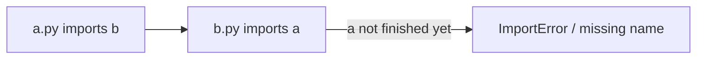

## Learning objectives

- Explain what `import` actually does and how Python finds modules.
- Structure a **package** with `__init__.py` and clean imports.
- Use absolute vs relative imports correctly and avoid **circular imports**.
- Understand `__name__ == "__main__"` and module-level execution.

## Prerequisites

[Functions & Scope](/courses/python-foundations/functions-arguments-scope). You've written scripts; now you'll organize them into real projects.

## The core idea in one line

> A **module** is a `.py` file; a **package** is a folder of modules. `import` **runs a module once**, caches it, and binds names into your namespace.

**Analogy — a library and its books.** A module is a book; a package is a shelf of related books; your project is the whole library. `import` is checking a book out: the first person to request it takes it off the shelf and reads it cover to cover (the module runs top to bottom, once); everyone after gets the same already-read copy from the desk (the cache), instantly.

## What `import` really does

```python
import math          # 1) find math  2) run it once  3) bind name `math`
math.sqrt(9)

from math import sqrt      # bind just `sqrt`
from math import pi as PI  # bind under a new name
```

Under the hood, on first import Python:
1. searches `sys.path` (current dir, installed packages, stdlib) for the module,
2. **executes the module top to bottom** (so top-level code runs),
3. stores the result in `sys.modules` so later imports are a cache hit — **the module body runs only once per process.**

```python
import sys
sys.modules["math"]     # the cached module object
```

## Packages and `__init__.py`

```
myapp/
├── __init__.py         # marks myapp as a package; runs on first import of myapp
├── models.py
├── services/
│   ├── __init__.py
│   └── email.py
└── main.py
```

```python
from myapp.models import User            # absolute import (preferred)
from myapp.services.email import send
```

`__init__.py` runs when the package is first imported. Keep it light — often just re-exporting a clean public API:

```python
# myapp/__init__.py
from .models import User
from .services.email import send
__all__ = ["User", "send"]    # what `from myapp import *` exposes
```

## Absolute vs relative imports

```python
# Inside myapp/services/email.py
from myapp.models import User     # absolute — clear, works from anywhere
from ..models import User         # relative — . = current pkg, .. = parent
```

Prefer **absolute imports** for clarity; use relative imports for tight intra-package references. Relative imports only work *inside a package* (run as a module), not in a script executed directly.

## `__name__ == "__main__"`

Every module has a `__name__`. When imported, it's the module's name; when run directly (`python main.py`), it's `"__main__"`:

```python
def main():
    print("running")

if __name__ == "__main__":
    main()        # runs only when executed directly, NOT when imported
```

This lets a file be **both** an importable module and a runnable script — the standard entry-point idiom.

## Circular imports

If `a.py` imports `b` and `b.py` imports `a`, the second import hits a half-initialized module:



Fixes, in order of preference:
1. **Restructure** — move the shared piece into a third module both import.
2. **Import inside the function** where it's used (deferred import), not at module top.
3. **Import the module, not the name** (`import a` then `a.thing`) so binding happens later.

## Common mistakes

1. **`from module import *`** — pollutes the namespace and hides origins; import explicit names.
2. **Heavy work at module top level** — runs on import, slowing startup and causing surprises.
3. **Circular imports** from tangled dependencies — restructure.
4. **Relative import in a directly-run script** — fails; run as a module (`python -m pkg.script`) or use absolute imports.
5. **Shadowing stdlib** — naming a file `random.py` or `queue.py` breaks imports mysteriously.

## Performance & memory

- Modules are cached, so repeated imports are free — but top-level code runs once and its cost is paid at startup.
- Deferred (in-function) imports speed startup for rarely-used heavy dependencies.
- `sys.modules` keeps every imported module alive for the process lifetime.

## Interview questions

1. **"What happens on `import x`?"** — Find, execute once (top-level runs), cache in `sys.modules`, bind the name; later imports are cache hits.
2. **"Absolute vs relative imports?"** — Absolute names the full path (clear, preferred); relative uses `.`/`..` within a package.
3. **"What is `if __name__ == '__main__'` for?"** — Run code only when the file is executed directly, not when imported.
4. **"How do you fix a circular import?"** — Restructure shared code out, defer the import into a function, or import the module rather than the name.

## Summary

- Modules are files, packages are folders with `__init__.py`; `import` runs a module once and caches it.
- Prefer absolute imports; use `__all__` to define a clean public API.
- `__name__ == "__main__"` makes a file both importable and runnable.
- Break circular imports by restructuring or deferring.

## Exercises

**Easy**

1. Create a package `shapes/` with `circle.py` and `square.py`, and import both from `main.py`.
2. Add an `if __name__ == "__main__":` block that runs a demo only when the file is executed directly.

**Intermediate**

3. Use `__init__.py` and `__all__` to expose a clean public API for your package; test `from shapes import *`.
4. Reproduce a circular import between two modules, then fix it by moving shared code into a third.

**Advanced**

5. Show that a module's top-level code runs only once by adding a print at module top and importing it from two places.

**Debugging**

6. A colleague named a file `email.py` next to code that does `import email` (stdlib). Explain the failure and the fix.

**Mini project**

Turn a single 300-line script into a proper package: `cli.py` entry point, `core/` package with focused modules, absolute imports, a clean `__init__.py` public API, and a `python -m yourpkg` runnable entry point.

## Quiz

<details>
<summary>1. How many times does a module's top-level code run per process?</summary>
Once — subsequent imports are served from the `sys.modules` cache.
</details>

<details>
<summary>2. Which import style is generally preferred and why?</summary>
Absolute imports — they clearly state the full path and work regardless of where the file is used.
</details>

<details>
<summary>3. What is `__all__`?</summary>
A list defining the public names exported by `from package import *`.
</details>

<details>
<summary>4. Name one way to break a circular import.</summary>
Move shared code to a third module, or defer the import into the function that uses it.
</details>

## Further reading

- Python docs: Modules, Packages, `importlib`
- "Python Application Layouts" — packaging structure guides
- Next lesson: [Error Handling Done Right](/courses/python-foundations/error-handling)
