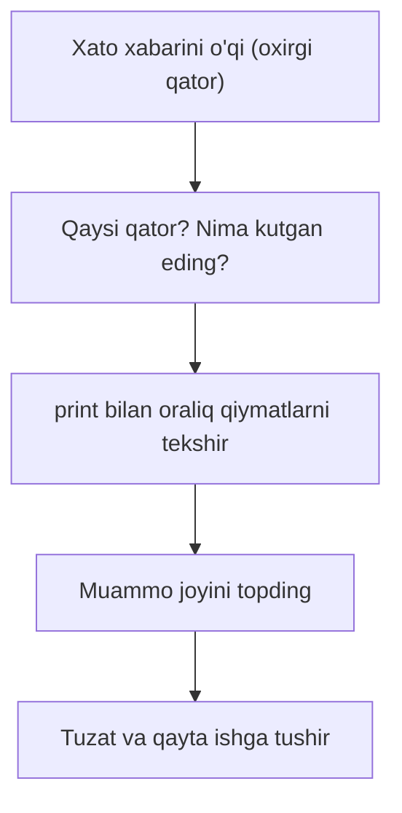

## Bu darsda nimalarni o‘rganamiz

- Xato xabarini (traceback) o‘qishni.
- `print` va breakpoint bilan xato topishni.
- Eng ko‘p uchraydigan xato turlari va sabablari.
- Toza, o‘qiladigan kod yozish odatlari.

## Oldindan nima bilish kerak

Kursning aksariyat darslari. Ayniqsa [Xatoliklar](/courses/python-noldan/xatoliklar-va-fayllar) va [Funksiyalar](/courses/python-noldan/funksiyalar).

## Asosiy g‘oya — bir jumlada

> **Debugging** — kodni tuzatish emas, avval **xato qayerdaligini topish**. Xato xabari sizning dushmaningiz emas — u aynan qayerda va nima buzilganini aytadi.

**Hayotiy o‘xshatish — shifokor.** Shifokor darrov dori bermaydi — avval kasallikni **aniqlaydi** (savol, tekshiruv). Debugging ham shunday: “nega ishlamayapti?” deb taxmin qilmang — xato xabarini o‘qib, `print` bilan “tekshiruv” qilib, sababни **aniqlang**, keyin tuzating.

## Traceback — xato xabarini o‘qish

Kod xato bersa, Python **traceback** chiqaradi. U qo‘rqinchli ko‘rinsa ham — juda foydali:

```python
def bolish(a, b):
    return a / b

print(bolish(10, 0))
```

```
Traceback (most recent call last):
  File "main.py", line 4, in <module>
    print(bolish(10, 0))
  File "main.py", line 2, in bolish
    return a / b
ZeroDivisionError: division by zero
```

Qanday o‘qiladi:
- **Pastdan yuqoriga** o‘qing. **Eng oxirgi qator** — xato turi va sababi: `ZeroDivisionError: division by zero`.
- Yuqoridagi qatorlar — xato **qayerdan kelib chiqqani** (qaysi fayl, qaysi qator).
- `line 2, in bolish` — xato aynan 2-qatorda, `bolish` funksiyasida.

> [!TIP]
> Traceback’ning **eng oxirgi qatorini** o‘qing — u 90% hollarda muammoni aytadi. Xato turini (masalan `NameError`) internetdan qidirsangiz, sababini darrov topasiz.

## Eng ko‘p uchraydigan xatolar

| Xato | Sababi |
|---|---|
| `SyntaxError` | Yozuv xatosi (qavs, `:` yetishmaydi) |
| `NameError` | Aniqlanmagan o‘zgaruvchi/funksiya (imlo xatosi?) |
| `TypeError` | Noto‘g‘ri tur (`"5" + 5`) |
| `ValueError` | To‘g‘ri tur, noto‘g‘ri qiymat (`int("salom")`) |
| `IndexError` | Ro‘yxatda yo‘q indeks |
| `KeyError` | Lug‘atda yo‘q kalit |
| `IndentationError` | Noto‘g‘ri bo‘shliq (indentatsiya) |

Bu ro‘yxatni bilsangiz, xatolarning ko‘pini bir qarashda tushunasiz.

## `print` bilan debugging — eng oddiy usul

Kod noto‘g‘ri natija bersa, oraliq qiymatlarni chiqaring:

```python
def ortacha(sonlar):
    yigindi = sum(sonlar)
    print("yigindi:", yigindi)          # tekshiramiz
    print("nechta:", len(sonlar))       # tekshiramiz
    return yigindi / len(sonlar)

ortacha([10, 20, 30])
```

“Bu yergача qiymat to‘g‘rimi?” deb bosqichma-bosqich tekshirasiz. Muammo qayerda “buzilishini” topasiz. Oddiy, lekin juda kuchli usul.

## `breakpoint()` — dasturni to‘xtatib tekshirish

Python’da tayyor debugger bor:

```python
def hisobla(x):
    natija = x * 2
    breakpoint()          # shu yerda dastur to'xtaydi
    return natija + 5
```

`breakpoint()` da dastur to‘xtaydi va siz o‘zgaruvchilarni tekshirishingiz mumkin (`natija` yozib Enter). Chiqish uchun `c` (continue) yoki `q` (quit). VS Code’da esa qator yoniga bosib “breakpoint” qo‘yasiz — grafik va qulayroq.

## Toza kod odatlari

Ishlaydigan kod yetarli emas — u **o‘qiladigan** ham bo‘lishi kerak (6 oydan keyin o‘zingiz o‘qiysiz!):

1. **Ma’noli nomlar** — `x`, `data`, `temp` emas; `foydalanuvchi_yoshi`, `xaridlar_royxati`.
2. **Kichik funksiyalar** — bitta funksiya bitta ish qilsin. “va” bilan tasvirlansa — ikkiga bo‘ling.
3. **Izohlar “nima uchun” ni tushuntirsin** — “nima” ni kod aytadi:
   ```python
   soliq = narx * 0.12    # 12% QQS qo'shamiz  ← nega 0.12 ekanini aytadi
   ```
4. **Takrorlanmang (DRY)** — bir xil kod uch joyda bo‘lsa, funksiyaga chiqaring.
5. **Chuqur ichma-ichlikdan qoching** — erta `return` yoki `continue` bilan tekislang.

```python
# Yomon:
def tekshir(yosh):
    if yosh > 0:
        if yosh < 150:
            return "to'g'ri"

# Yaxshi (tekis, o'qiladi):
def tekshir(yosh):
    if yosh <= 0 or yosh >= 150:
        return "noto'g'ri"
    return "to'g'ri"
```

## Debugging’ga yondashuv (bosqichlar)



## Keng tarqalgan xatolar (yondashuvda)

1. **Traceback’ni o‘qimasdan tuzatishga urinish** — u aynan javobni beradi, o‘qing.
2. **Bir vaqtda ko‘p narsani o‘zgartirish** — bittadan o‘zgartiring, aks holda nima yordam berganini bilmaysiz.
3. **“Ishladi, sababini bilmayman” bilan qanoatlanish** — nega ishlaganini tushuning, aks holda qayta buziladi.
4. **Xatodan qo‘rqish** — xato — o‘rganish. Har bir xatoni tushunsangiz, kuchayasiz.

## Xulosa

- Traceback’ni pastdan yuqoriga o‘qing; oxirgi qator — xato turi va sababi.
- Eng ko‘p xato turlarini biling (`NameError`, `TypeError`, `KeyError`...).
- `print` va `breakpoint()` bilan oraliq qiymatlarni tekshirib, muammoni **aniqlang**.
- Toza kod: ma’noli nomlar, kichik funksiyalar, “nima uchun” izohlar, DRY.

## Mashqlar

**Oson**

1. Ataylab xato yozing (masalan `print(nomavjud)`) va traceback’ning oxirgi qatorini o‘qib, sababini ayting.
2. Berilgan tracebackdagi xato turi va qatorini aniqlang.

**O‘rtacha**

3. Noto‘g‘ri natija beruvchi funksiyaga `print` qo‘yib, muammo qayerdaligini toping va tuzating.
4. Chuqur ichma-ich `if` larni erta `return` bilan tekislang.

**Fikrlash**

5. Nega “ma’noli nomlar” debugging’ni osonlashtiradi? Misol bilan tushuntiring.

**Xatoni top**

6. Bu kodda qanday xato turi chiqadi va nega? Tuzating:
```python
yosh = {"Ali": 20}
print(yosh["Vali"])
```

**Mini loyiha**

Sizga “buzuq” kichik dastur beriladi (masalan o‘rtacha hisoblovchi, lekin noto‘g‘ri natija beradi yoki qulaydi). Traceback va `print` yordamida kamida 3 ta xatoni toping va tuzating, so‘ng kodni toza qoidalar bo‘yicha qayta yozing (ma’noli nomlar, kichik funksiyalar).

## Test

<details>
<summary>1. Traceback’ning qaysi qatori eng muhim?</summary>
Eng oxirgisi — xato turi va sababini aytadi.
</details>

<details>
<summary>2. `NameError` odatda nimadan kelib chiqadi?</summary>
Aniqlanmagan yoki imlosi noto‘g‘ri yozilgan o‘zgaruvchi/funksiya nomidan.
</details>

<details>
<summary>3. `print` bilan debugging qanday yordam beradi?</summary>
Oraliq qiymatlarni ko‘rsatib, kod qayerda "buzilishini" aniqlashga yordam beradi.
</details>

<details>
<summary>4. Toza kodning bitta muhim qoidasini ayting.</summary>
Ma’noli nomlar (yoki: kichik funksiyalar / DRY / "nima uchun" izohlar).
</details>

## Keyingi dars

[Mashinaviy o‘qitish (ML) ga kirish](/courses/python-noldan/ml-kirish) — sun’iy intellekt dunyosiga birinchi qadam.
