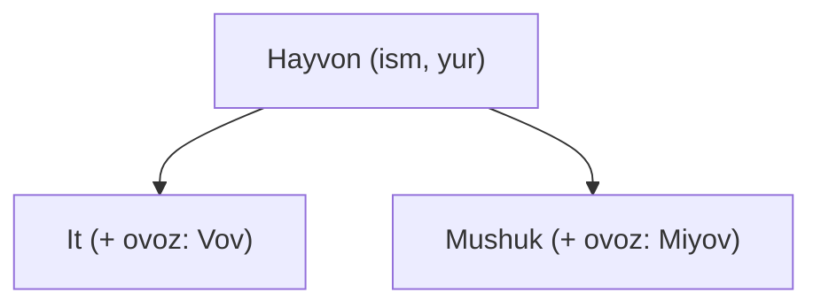

## Bu darsda nimalarni o‘rganamiz

- Meros (inheritance) — bitta klassni boshqasidan qayta ishlatish.
- `super()` — ota-klassga murojaat qilish.
- `__str__` — obyektni chiroyli chop etish.
- Inkapsulyatsiya — ma’lumotni himoyalash haqida oddiy tushuncha.

## Oldindan nima bilish kerak

[Klasslarga kirish (OOP)](/courses/python-noldan/oop-va-keyingi-qadamlar). Klass, obyekt, `__init__` va metodlar bilan tanish bo‘lishingiz kerak.

## Asosiy g‘oya — bir jumlada

> **Meros** — bir klass boshqasining barcha imkoniyatlarini “meros qilib olishi” va ustiga o‘zinikini qo‘shishi.

**Hayotiy o‘xshatish — oila.** Bola ota-onasidan ko‘p narsani meros oladi (familiya, tashqi ko‘rinish), lekin o‘zining ham xususiyatlari bor. Dasturlashda ham: `Talaba` klassi umumiy `Odam` klassidan “ism, yosh” ni meros oladi va ustiga o‘zining “universitet” ini qo‘shadi. Bir xil kodni qayta yozmaysiz.

## Muammo: takror kod

```python
class It:
    def __init__(self, ism):
        self.ism = ism
    def yur(self):
        print(f"{self.ism} yurmoqda")

class Mushuk:
    def __init__(self, ism):    # xuddi shu kod takrorlandi!
        self.ism = ism
    def yur(self):
        print(f"{self.ism} yurmoqda")
```

`ism` va `yur` ikki joyda takrorlanyapti. Meros bu takrorni yo‘qotadi.

## Meros bilan yechim

```python
class Hayvon:                       # umumiy (ota) klass
    def __init__(self, ism):
        self.ism = ism
    def yur(self):
        print(f"{self.ism} yurmoqda")

class It(Hayvon):                   # Hayvon dan meros oladi
    def ovoz(self):
        print(f"{self.ism}: Vov-vov!")

class Mushuk(Hayvon):              # u ham meros oladi
    def ovoz(self):
        print(f"{self.ism}: Miyov!")

kuchuk = It("Bobik")
kuchuk.yur()      # Bobik yurmoqda   (Hayvon dan meros)
kuchuk.ovoz()     # Bobik: Vov-vov!  (o'zining metodi)
```

- `class It(Hayvon):` — “It, Hayvon dan meros oladi” degani.
- `It` da `__init__` va `yur` yozilmagan, lekin ular **ishlaydi** — chunki `Hayvon` dan olindi.
- Har bir bola o‘zining `ovoz` metodini qo‘shadi.



## `super()` — ota-klassni chaqirish

Bola klass o‘zining `__init__` ini qo‘shsa, ota `__init__` ni ham chaqirishi kerak:

```python
class Talaba(Hayvon):     # (misol uchun; odatda Odam dan meros olardik)
    def __init__(self, ism, universitet):
        super().__init__(ism)       # ota klassning __init__ ini chaqiradi (ism ni o'rnatadi)
        self.universitet = universitet   # o'zining qo'shimchasi

t = Talaba("Ali", "TATU")
print(t.ism, t.universitet)   # Ali TATU
```

`super().__init__(ism)` — “ota klass, `ism` ni sen o‘rnat” degani. Shundan keyin o‘zimizning `universitet` ni qo‘shamiz.

## `__str__` — obyektni chiroyli chiqarish

Oddiy obyektni `print` qilsangiz, tushunarsiz narsa chiqadi:

```python
class Talaba:
    def __init__(self, ism):
        self.ism = ism

print(Talaba("Ali"))    # <__main__.Talaba object at 0x7f...>  ← foydasiz!
```

`__str__` metodini qo‘shsak, chiroyli chiqadi:

```python
class Talaba:
    def __init__(self, ism, yosh):
        self.ism = ism
        self.yosh = yosh
    def __str__(self):
        return f"Talaba: {self.ism}, {self.yosh} yosh"

print(Talaba("Ali", 20))    # Talaba: Ali, 20 yosh  ← ajoyib!
```

`__str__` — bu “dunder metod” (ikki pastki chiziqli). U obyekt `print` qilinganda nima chiqishini belgilaydi.

## Inkapsulyatsiya — oddiy tushuncha

Ba’zi ma’lumotlarni “tashqaridan bevosita o‘zgartirmaslik kerak” deb belgilaymiz. Python’da odat sifatida `_` bilan boshlaymiz:

```python
class Hisob:
    def __init__(self):
        self._balans = 0            # "ichki" ma'lumot (odat bo'yicha tegmaslik)
    def qoshish(self, miqdor):
        if miqdor > 0:              # nazorat orqali o'zgartirish
            self._balans += miqdor
```

Ya’ni `_balans` ni to‘g‘ridan-to‘g‘ri o‘zgartirish o‘rniga, `qoshish` metodi orqali (tekshiruv bilan) o‘zgartiramiz. Bu xatolardan himoya qiladi.

## Keng tarqalgan xatolar

1. **`super().__init__()` ni unutish** — bola `__init__` yozsa, ota atributlari o‘rnatilmay qoladi.
2. **Meros yo‘nalishini chalkashtirish** — `class It(Hayvon)`: It — bola, Hayvon — ota (umumiy).
3. **`__str__` da `return` o‘rniga `print`** — `__str__` matn **qaytarishi** kerak.
4. **Hamma narsani meros bilan yechishga urinish** — ba’zan oddiy funksiya yetarli; merosni faqat haqiqiy “X — bu Y turi” bo‘lganda ishlating.

## Xulosa

- Meros (`class Bola(Ota)`) takror kodni yo‘qotadi: bola ota imkoniyatlarini oladi va o‘zinikini qo‘shadi.
- `super().__init__(...)` bilan ota klassning konstruktorini chaqirasiz.
- `__str__` obyektni chiroyli `print` qilishga imkon beradi.
- `_` bilan “ichki” ma’lumotni belgilab, uni metodlar orqali xavfsiz o‘zgartirasiz.

## Mashqlar

**Oson**

1. `Hayvon` (ism, yur) klassidan `Qush` klassini meros qiling va unga `ucha()` metodini qo‘shing.
2. Biror klassga `__str__` qo‘shing va `print(obyekt)` chiroyli chiqishini ko‘ring.

**O‘rtacha**

3. `Odam` (ism, yosh) klassidan `Ishchi` (qo‘shimcha: `maosh`) klassini yarating; `super()` dan foydalaning.
4. `Shakl` ota klassidan `Kvadrat` va `Doira` klasslarini meros qiling; har biriga `yuza()` metodini yozing.

**Fikrlash**

5. Meros qachon foydali, qachon ortiqcha? Hayotiy misol bilan tushuntiring.

**Xatoni top**

6. Nega `t.ism` xato beradi? Tuzating:
```python
class Odam:
    def __init__(self, ism):
        self.ism = ism
class Ishchi(Odam):
    def __init__(self, ism, maosh):
        self.maosh = maosh
t = Ishchi("Ali", 500)
print(t.ism)
```

**Mini loyiha**

Kichik “hayvonot bog‘i”: `Hayvon` ota klassi (ism, `ovoz()`), undan `It`, `Mushuk`, `Sigir` klasslari. Ularni ro‘yxatga solib, `for` bilan har birining ovozini chiqaring (polymorphism — har biri o‘zicha ovoz beradi). `__str__` ham qo‘shing.

## Test

<details>
<summary>1. `class It(Hayvon):` nimani anglatadi?</summary>
It klassi Hayvon klassidan meros oladi — uning atribut va metodlarini oladi.
</details>

<details>
<summary>2. `super().__init__(...)` nima qiladi?</summary>
Ota (bazaviy) klassning konstruktorini chaqiradi, ota atributlarini o‘rnatadi.
</details>

<details>
<summary>3. `__str__` nima uchun?</summary>
Obyekt <code>print</code> qilinganda chiroyli, tushunarli matn chiqishini belgilaydi (matn qaytaradi).
</details>

<details>
<summary>4. `_balans` dagi pastki chiziq nimani bildiradi?</summary>
Bu "ichki" ma’lumot — odat bo‘yicha tashqaridan bevosita tegmaslik, metodlar orqali o‘zgartirish kerak.
</details>

## Keyingi dars

[List comprehension va lambda](/courses/python-noldan/comprehension-lambda) — kodni yanada ixcham yozamiz.
