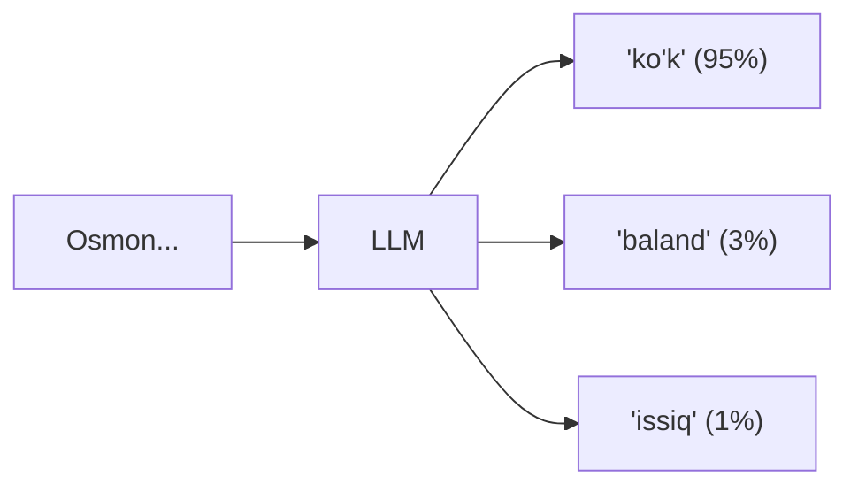
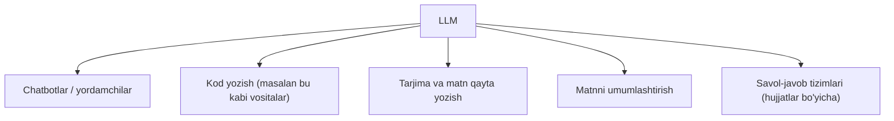

## Bu darsda nimalarni o‘rganamiz

- LLM (katta til modeli) nima.
- Token va “keyingi so‘zni bashorat qilish” g‘oyasi.
- Nega LLM ba’zan noto‘g‘ri (to‘qib chiqarilgan) javob beradi.
- LLM qayerda ishlatiladi va cheklovlari.

## Oldindan nima bilish kerak

[Mashinaviy o‘qitish (ML) ga kirish](/courses/python-noldan/ml-kirish). LLM — ML ning maxsus, kuchli turi.

## Asosiy g‘oya — bir jumlada

> **LLM (Large Language Model)** — juda ko‘p matnda o‘qitilgan model bo‘lib, u **keyingi so‘zni bashorat qilish** orqali ishlaydi. ChatGPT, Claude, Gemini — hammasi LLM.

**Hayotiy o‘xshatish — juda kuchli avtomatik to‘ldirish.** Telefoningiz klaviaturasi siz yozayotgan gapning keyingi so‘zini taxmin qiladi (“Men bugun... ishga”). LLM ham xuddi shuni qiladi, lekin butun kitoblardan o‘rgangani uchun taxminlari ajoyib aniq. “Savolga javob berish”, “kod yozish” — hammasi shu bitta ishdan (keyingi so‘zni topish) kelib chiqadi.

## LLM qanday ishlaydi?

LLM matnni **token**larga bo‘ladi. Token — so‘z yoki so‘z bo‘lagi:

```
"Men Python o'rganyapman"  →  ["Men", " Python", " o'rgan", "yapman"]
```

So‘ng model **har bir keyingi tokenni** bashorat qiladi:



“Osmon...” dan keyin “ko‘k” kelishi ehtimoli yuqori. Model shu tokenni tanlaydi, keyin “Osmon ko‘k...” dan keyingisini bashorat qiladi — va shunday davom etadi. Butun javob **bittalab token** shaklida tug‘iladi.

> [!NOTE]
> LLM “o‘ylamaydi” yoki “bilmaydi” — u shunchaki keyingi eng ehtimolli tokenni tanlaydi. Ajablanarlisi — shu oddiy jarayon savol-javob, tarjima va kod yozishga yetarli darajada kuchli.

## Nega LLM “to‘qib chiqaradi” (hallucination)?

LLM **haqiqatni emas, ehtimolli matnni** ishlab chiqaradi. Agar ishonarli ko‘rinadigan, lekin **noto‘g‘ri** javob naqshga mos kelsa — u shuni yozadi, xuddi haqiqatdek.

Misol: mavjud bo‘lmagan kitob nomini so‘rasangiz, u ishonch bilan “kitob” nomini o‘ylab topishi mumkin — chunki bu til jihatidan ishonarli ko‘rinadi.

Shuning uchun:
- LLM javobini, ayniqsa faktlar va raqamlarni, **tekshiring**.
- Muhim ishlarda unga **manba** bering (masalan hujjatni) va “faqat shundan javob ber” deng.
- U hisob-kitobda ham xato qilishi mumkin — kalkulyator emas.

## Kontekst oynasi — model “xotirasi”

LLM bir vaqtda faqat ma’lum miqdordagi tokenni “ko‘ra” oladi — bu **kontekst oynasi**. Suhbat tarixi, savolingiz va javob — hammasi shu oynaga sig‘ishi kerak. Oyna to‘lsa, eng eski qismlar “unutiladi”.

## LLM qayerda ishlatiladi?



## LLM cheklovlari

1. **Bilim muzlagan** — model faqat o‘qitilgan vaqtgacha biladi; kechagi yangilikni bilmaydi.
2. **To‘qib chiqarishi mumkin** — ishonch bilan noto‘g‘ri gapiradi.
3. **Sizning shaxsiy ma’lumotingizni bilmaydi** — kompaniyangiz hujjatlarini bermasangiz.
4. **Har bir so‘rov pul turadi** (API orqali) va sekinroq bo‘lishi mumkin.

Bu cheklovlarni yechish (masalan hujjat berish — RAG, agentlar) — alohida **AI muhandisligi** sohasi. Bu platformadagi [Python bilan AI Muhandisligi](/courses/ai-python/modern-ai-landscape) kursi aynan shu haqda.

## Keng tarqalgan noto‘g‘ri tushunchalar

1. **“LLM hamma narsani biladi.”** — Yo‘q — u o‘qitilgan matndagi naqshni biladi, faktlarni tekshirmaydi.
2. **“U internetdan qidiradi.”** — Odatda yo‘q (maxsus ulanmasa); xotiradagi naqshdan javob beradi.
3. **“Javobi doim to‘g‘ri.”** — Yo‘q — tekshirish shart, ayniqsa faktlar.
4. **“LLM = butun sun’iy intellekt.”** — LLM — AI ning bir turi (matn bilan ishlaydigan).

## Xulosa

- LLM — ko‘p matnda o‘qitilgan model; **keyingi tokenni bashorat qilish** orqali ishlaydi.
- Matn tokenlarga bo‘linadi; javob bittalab token shaklida tug‘iladi.
- LLM ehtimolli matn yaratadi — shuning uchun “to‘qib chiqaradi”; javobni tekshiring.
- U kuchli, lekin cheklangan (muzlagan bilim, xatolar, xarajat) — AI muhandisligi shu cheklovlarni yechadi.

## Mashqlar

**Oson**

1. O‘z so‘zingiz bilan “LLM keyingi tokenni bashorat qiladi” degan gapni tushuntiring.
2. Bir jumla yozing va uni taxminan tokenlarga bo‘ling.

**O‘rtacha**

3. LLM “to‘qib chiqarishi” nima ekanini va uni kamaytirishning 2 usulini yozing.
4. LLM ishlatilishi mumkin bo‘lgan 3 ta real vazifa va 1 ta ishlatmaslik kerak bo‘lgan vazifa (masalan aniq hisob-kitob) yozing.

**Fikrlash**

5. Nega LLM javobini, ayniqsa faktlarni, tekshirish kerak? Real xavfli misol keltiring.

**Amaliy (ixtiyoriy)**

6. ChatGPT yoki shunga o‘xshash vositaga bilib turib mavjud bo‘lmagan narsa haqida savol bering va javobini tanqidiy baholang — u to‘g‘rimi yoki “to‘qib chiqarilgan”mi?

**Mini loyiha (fikrlash)**

“Kompaniya hujjatlari bo‘yicha javob beradigan chatbot” qanday ishlashi kerak? LLM o‘zi kompaniyangiz hujjatlarini bilmasligi muammosini qanday hal qilasiz? (Maslahat: modelga hujjatni berish g‘oyasi.) Bir sahifada tushuntiring.

## Test

<details>
<summary>1. LLM asosan nima qiladi?</summary>
Keyingi tokenni (so‘z bo‘lagini) bashorat qiladi va shu tarzda matn hosil qiladi.
</details>

<details>
<summary>2. Token nima?</summary>
Matnning bo‘lagi — so‘z yoki so‘z qismi; LLM matnni tokenlarda ko‘radi.
</details>

<details>
<summary>3. Nega LLM to‘qib chiqaradi?</summary>
U haqiqatni emas, ehtimolli (ishonarli ko‘rinadigan) matnni yaratadi — u noto‘g‘ri bo‘lishi mumkin.
</details>

<details>
<summary>4. LLM sizning shaxsiy hujjatlaringizni biladimi?</summary>
Yo‘q — bermасangiz bilmaydi; ularni berish (RAG) alohida usul.
</details>

## Keyingi dars

[Python bilan AI: birinchi amaliy qadam](/courses/python-noldan/python-ai-birinchi-qadam) — AI’ni kodda ishlatamiz.
