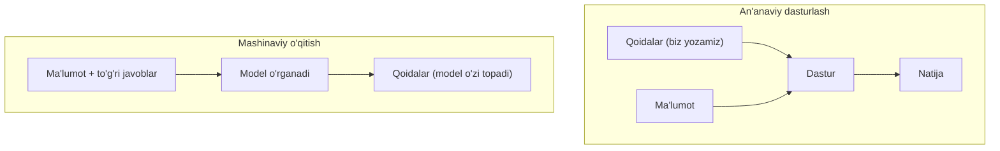
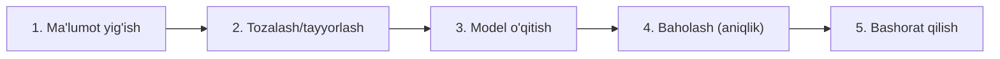

## Bu darsda nimalarni o‘rganamiz

- Mashinaviy o‘qitish (ML) aslida nima.
- An’anaviy dasturlash va ML farqi.
- ML ning asosiy turlari.
- Python’da ML qanday amalga oshadi (umumiy tasavvur).

## Oldindan nima bilish kerak

Kursning asoslari — o‘zgaruvchilar, ro‘yxatlar, funksiyalar. Matematika **shart emas** — bu sodda kirish darsi.

## Asosiy g‘oya — bir jumlada

> **Mashinaviy o‘qitish (Machine Learning)** — kompyuterга qoidalarni yozib bermasdan, **misollardan o‘zi qoida topishni** o‘rgatish.

**Hayotiy o‘xshatish — bolaga mushukni tanitish.** Bolaga “mushuk — bu mo‘ylovli, ikki quloqli, miyovlaydigan hayvon” deb ta’rif bermaysiz. Unga **ko‘p mushuk rasmini** ko‘rsatasiz: “bu mushuk, bu ham mushuk...”. Bir muddatdan keyin bola yangi, ilgari ko‘rmagan mushukni ham taniydi. ML ham shunday: kompyuterga ko‘p misol berasiz, u naqshni **o‘zi** topadi.

## An’anaviy dasturlash vs ML

Hozirgacha shunday yozdik: **qoidalarni biz beramiz**, kompyuter bajaradi.

```python
# An'anaviy: qoidani biz yozamiz
def spam_mi(xat):
    if "yutuq" in xat or "bepul pul" in xat:
        return True
    return False
```

Lekin spam so‘zlari doim o‘zgaradi — barcha qoidani qo‘lda yozib bo‘lmaydi. ML boshqacha ishlaydi:



Ya’ni ML’da biz **ma’lumot va to‘g‘ri javoblarni** beramiz, model esa qoidani o‘zi topadi. Keyin u yangi ma’lumotga bashorat qiladi.

## ML ning asosiy turlari

### 1. Nazorat ostida o‘qitish (Supervised)

Modelga **misollar + to‘g‘ri javoblar** beriladi. Eng ko‘p uchraydigan tur.

- **Klassifikatsiya** — turkumga ajratish: xat spam mi/yo‘q mi, rasm mushuk mi/it mi.
- **Regressiya** — son bashorat qilish: uy narxi, ertangi harorat.

Misol: 1000 ta uy (maydoni, xonalar soni) va ularning narxlari → model “maydon oshsa narx oshadi” degan naqshni o‘rganadi va yangi uy narxini bashorat qiladi.

### 2. Nazoratsiz o‘qitish (Unsupervised)

To‘g‘ri javoblar **berilmaydi** — model ma’lumotdagi guruhlarni o‘zi topadi.

- **Klasterlash** — o‘xshashlarni guruhlash: mijozlarni xatti-harakati bo‘yicha guruhlarga bo‘lish.

### 3. Mustahkamlab o‘qitish (Reinforcement)

Model **sinov-xato** orqali o‘rganadi, to‘g‘ri harakat uchun “mukofot” oladi — o‘yin o‘ynaydigan yoki robot boshqaradigan AI shunday o‘rganadi.

## ML jarayoni (bosqichlar)



Amaliy ish ko‘pincha **ma’lumotni tayyorlash** (1-2 bosqich) bilan o‘tadi — model o‘qitish esa nisbatan oson. “Yomon ma’lumot → yomon model” degan qoida bor.

## Python’da ML — umumiy ko‘rinish

ML’ni noldan yozmaysiz — tayyor kutubxonalar bor:

- **scikit-learn** — klassik ML uchun eng ommabop (boshlash uchun ideal).
- **pandas** — ma’lumotni tayyorlash va tahlil.
- **TensorFlow / PyTorch** — chuqur o‘rganish (neyron tarmoqlar).

Juda soddalashtirilgan misol (scikit-learn):

```python
from sklearn.linear_model import LinearRegression

# Ma'lumot: uy maydoni (kv.m) va narxi (ming $)
maydonlar = [[50], [80], [120], [150]]
narxlar = [100, 150, 220, 280]

model = LinearRegression()
model.fit(maydonlar, narxlar)        # o'qitish (naqshni topish)

# Yangi uy narxini bashorat qilish:
print(model.predict([[100]]))        # ~185 (ming $) atrofida
```

`.fit()` — o‘qitish (misollardan naqsh topish), `.predict()` — bashorat qilish. Bu — ML’ning yuragi.

> [!NOTE]
> Bu juda soddalashtirilgan misol. Haqiqiy ML ko‘proq ma’lumot, tozalash va baholash talab qiladi. Lekin g‘oya aynan shu: **o‘qit (fit), keyin bashorat qil (predict)**.

## Keng tarqalgan noto‘g‘ri tushunchalar

1. **“ML — sehr.”** — Yo‘q, u statistika va naqsh topish. U ko‘rmagan narsani bilmaydi.
2. **“Ko‘p matematika kerak.”** — Boshlash uchun kutubxonalar hammasini qiladi; chuqur ketganda matematika foydali.
3. **“Model doim to‘g‘ri.”** — Yo‘q, u xato qiladi; “aniqlik” (accuracy) o‘lchanadi.
4. **“ML = sun’iy intellekt = ChatGPT.”** — ML — AI ning bir qismi; ChatGPT esa maxsus tur (LLM — keyingi darsda).

## Xulosa

- ML — qoidalarni yozib bermay, misollardan naqsh **o‘zi o‘rganishi**.
- An’anaviy dastur: qoidalar biz beramiz. ML: ma’lumotdan model qoida topadi.
- Asosiy turlar: nazorat ostida (klassifikatsiya/regressiya), nazoratsiz (klasterlash), mustahkamlab.
- Python’da scikit-learn/pandas bilan: `fit` (o‘qit) → `predict` (bashorat).

## Mashqlar

**Oson**

1. Atrofingizdan 3 ta ML ishlatiladigan misol yozing (masalan tavsiyalar, yuzni tanish).
2. Quyidagilar klassifikatsiya mi yoki regressiya: (a) ertangi harorat, (b) xat spam mi, (c) uy narxi?

**O‘rtacha**

3. “Nazorat ostida” va “nazoratsiz” o‘qitish farqini o‘z so‘zingiz bilan, hayotiy misol bilan tushuntiring.
4. ML jarayonining 5 bosqichini bir loyihaga (masalan “talaba imtihondan o‘tadimi” bashorati) tatbiq eting.

**Fikrlash**

5. Nega “yomon ma’lumot → yomon model”? Misol bilan tushuntiring.

**Amaliy (ixtiyoriy)**

6. Agar imkoni bo‘lsa: `pip install scikit-learn` qilib, yuqoridagi `LinearRegression` misolini ishga tushiring va boshqa maydon uchun narx bashorat qiling.

**Mini loyiha (fikrlash)**

“Film tavsiya tizimi” ni qanday qurgan bo‘lardingiz? Qanday ma’lumot yig‘asiz, qaysi ML turi kerak, model nimani bashorat qiladi — bir sahifada rejasini yozing (kod shart emas).

## Test

<details>
<summary>1. ML an’anaviy dasturlashdan nimasi bilan farq qiladi?</summary>
An’anaviyda qoidalarni biz yozamiz; ML’da model ma’lumotdan (misollardan) qoidani o‘zi topadi.
</details>

<details>
<summary>2. Klassifikatsiya va regressiya farqi?</summary>
Klassifikatsiya — turkumga ajratish (spam/spam emas); regressiya — son bashorat qilish (narx, harorat).
</details>

<details>
<summary>3. `.fit()` va `.predict()` nima qiladi?</summary>
<code>fit</code> — misollardan o‘qitadi (naqsh topadi); <code>predict</code> — yangi ma’lumotga bashorat qiladi.
</details>

<details>
<summary>4. ML — sehrmi?</summary>
Yo‘q — bu naqsh topish va statistika; u ko‘rmagan narsani bilmaydi va xato qilishi mumkin.
</details>

## Keyingi dars

[LLM va ChatGPT qanday ishlaydi](/courses/python-noldan/llm-kirish) — zamonaviy AI’ning yuragi.
