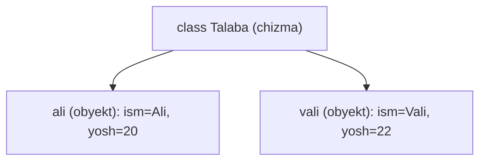
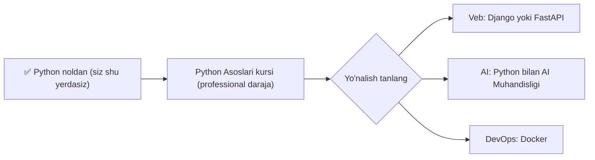

## Bu darsda nimalarni o‘rganamiz

- Klass va obyekt nima (oddiy misolda).
- O‘z tipingizni yaratish: `class`, `__init__`, metodlar.
- 0 → Advanced yo‘l xaritasi: bundan keyin nima o‘rganish.
- Yakuniy loyiha g‘oyalari.

## Oldindan nima bilish kerak

Ushbu kursning barcha oldingi darslari — ayniqsa [Funksiyalar](/courses/python-noldan/funksiyalar) va [Lug‘atlar](/courses/python-noldan/lugat-tuple-set).

## Asosiy g‘oya — bir jumlada

> **OOP (obyektga yo‘naltirilgan dasturlash)** — ma’lumot va u bilan bog‘liq harakatlarni bitta “narsa” (obyekt) ichida jamlash. **Klass** — bu narsaning chizmasi, **obyekt** — o‘sha chizma bo‘yicha yasalgan haqiqiy narsa.

**Hayotiy o‘xshatish — uy chizmasi.** Klass — bu uyning chizmasi (rejasi): unda nima bo‘lishi kerakligi yozilgan. Obyekt — o‘sha chizma bo‘yicha qurilgan **haqiqiy uy**. Bitta chizmadan (klass) ko‘p uy (obyekt) qurish mumkin — har biri o‘ziga xos (rangi, manzili boshqa), lekin tuzilishi bir xil.

## Nega OOP kerak?

Tasavvur qiling, ko‘p talaba ma’lumotini saqlaysiz. Har biri uchun ism, yosh va baholar bor. Alohida o‘zgaruvchilar chalkash bo‘ladi. OOP bilan “Talaba” degan **o‘z tipingizni** yaratasiz:

```python
class Talaba:
    def __init__(self, ism, yosh):
        self.ism = ism        # obyektning xususiyati (atribut)
        self.yosh = yosh

    def tanishtir(self):      # obyektning harakati (metod)
        return f"Men {self.ism}, {self.yosh} yoshdaman"

# Obyekt yaratamiz (chizmadan uy quramiz):
ali = Talaba("Ali", 20)
vali = Talaba("Vali", 22)

print(ali.ism)              # Ali
print(ali.tanishtir())      # Men Ali, 20 yoshdaman
print(vali.tanishtir())     # Men Vali, 22 yoshdaman
```

## Qismlarni tushunamiz

- **`class Talaba:`** — yangi tip (chizma) e’lon qilamiz. Nomi katta harf bilan boshlanadi.
- **`__init__`** — “konstruktor”: obyekt yaratilganda avtomatik ishlaydi. Boshlang‘ich qiymatlarni o‘rnatadi.
- **`self`** — “shu obyektning o‘zi”. `self.ism` — “shu obyektning ismi”. Har bir metodning birinchi parametri `self` bo‘ladi.
- **atribut** — obyektning ma’lumoti (`ali.ism`).
- **metod** — obyektning funksiyasi (`ali.tanishtir()`).



## Ko‘proq real misol

```python
class BankHisobi:
    def __init__(self, egasi, balans=0):
        self.egasi = egasi
        self.balans = balans

    def pul_qoshish(self, miqdor):
        self.balans += miqdor
        return f"{miqdor} qo'shildi. Balans: {self.balans}"

    def pul_yechish(self, miqdor):
        if miqdor > self.balans:
            return "Mablag' yetarli emas!"
        self.balans -= miqdor
        return f"{miqdor} yechildi. Balans: {self.balans}"

hisob = BankHisobi("Ali", 1000)
print(hisob.pul_qoshish(500))    # 500 qo'shildi. Balans: 1500
print(hisob.pul_yechish(2000))   # Mablag' yetarli emas!
print(hisob.pul_yechish(300))    # 300 yechildi. Balans: 1200
```

Ma’lumot (`balans`) va u bilan ishlaydigan harakatlar (`pul_qoshish`, `pul_yechish`) — hammasi bitta obyekt ichida. Bu OOP’ning kuchi.

> [!NOTE]
> OOP — katta mavzu. Bu yerda faqat **asosini** ko‘rdik. Meros (inheritance), ko‘p shakllilik (polymorphism) va boshqalarni keyingi kurslarda chuqur o‘rganasiz. Hozircha “klass = chizma, obyekt = haqiqiy narsa” tushunchasi yetarli.

## Tabriklaymiz — kursni tugatdingiz! 🎉

Siz noldan boshlab quyidagilarni o‘rgandingiz:

- O‘zgaruvchilar, turlar, operatorlar
- Shartlar (`if/elif/else`) va sikllar (`for/while`)
- Ro‘yxat, lug‘at, tuple, set
- Satrlar bilan ishlash
- Funksiyalar
- Modullar va kutubxonalar
- Xatoliklar va fayllar
- OOP asoslari

Bu — jiddiy poydevor. Endi haqiqiy dasturlar yoza olasiz!

## 0 → Advanced yo‘l xaritasi



Tavsiya etilgan keyingi qadamlar shu platformada:

1. **[Python Asoslari](/courses/python-foundations/functions-arguments-scope)** — closure, dekoratorlar, generatorlar, typing, testlash. Bu kurs sizni “boshlovchi”dan “professional”ga olib chiqadi.
2. So‘ng yo‘nalish tanlang:
   - **Veb**: [Django](/courses/django/models-and-the-orm) yoki [FastAPI](/courses/fastapi/pydantic-deep-dive)
   - **Sun’iy intellekt**: [Python bilan AI Muhandisligi](/courses/ai-python/modern-ai-landscape)
   - **Joylashtirish**: [Docker](/courses/docker-python/docker-fundamentals)

## Qanday davom etish kerak (maslahatlar)

- **Har kuni ozdan yozing** — 30 daqiqa kod, kitob o‘qishdan afzal.
- **Kichik loyihalar quring** — kalkulyator, to-do, o‘yin. Amaliyot eng yaxshi ustoz.
- **Xatolardan qo‘rqmang** — har bir xato o‘rganish imkoniyati.
- **Kodni o‘zingiz yozing** — nusxa ko‘chirmang, yozib tushuning.

## Xulosa

- Klass — obyektning chizmasi; obyekt — o‘sha chizmadan yasalgan haqiqiy narsa.
- `__init__` boshlang‘ich qiymatlarni o‘rnatadi; `self` — obyektning o‘zi.
- Atribut — ma’lumot, metod — harakat; ikkalasi obyekt ichida jamlanadi.
- Endi Python Asoslari kursiga o‘ting va o‘z yo‘nalishingizni tanlang.

## Mashqlar

**Oson**

1. `It` klassini yozing: `ism` va `zot` atributlari, hamda `vovullash()` metodi bo‘lsin. Ikkita it yarating.
2. `Doira` klassini yozing: `radius` atributi va `yuza()` metodi (`3.14 * radius * radius`) bo‘lsin.

**O‘rtacha**

3. `Mashina` klassini yozing: `marka`, `tezlik` atributlari; `tezlashtir(miqdor)` va `sekinlash(miqdor)` metodlari (tezlik manfiy bo‘lmasin).
4. `BankHisobi` misolini kengaytiring: har bir amaliyotni tarixga (`list`) yozib boring va `tarix()` metodi bilan chiqaring.

**Fikrlash**

5. “Klass” va “obyekt” farqini o‘z so‘zingiz bilan, hayotiy misol bilan tushuntiring.

**Xatoni top**

6. Nega bu xato beradi? Tuzating:
```python
class Talaba:
    def __init__(ism):
        self.ism = ism
```

**Yakuniy loyiha (tanlang)**

Kursda o‘rganganingizni birlashtiruvchi bitta to‘liq dastur yozing:
- **Kutubxona tizimi**: `Kitob` va `Kutubxona` klasslari; kitob qo‘shish, izlash, olib turish; ma’lumotni faylga saqlash.
- **Xarajatlar hisobchisi**: xarajat qo‘shish (nom, miqdor, sana), oylik jami hisoblash, faylga saqlash, `try/except` bilan himoya.
- **Viktorina o‘yini**: savollar lug‘atda, foydalanuvchi javob beradi, ball yuritiladi, natija faylga yoziladi.

Har birida: funksiyalar/klasslar, sikllar, shartlar, fayllar va xatoliklarni ishlatishga harakat qiling.

## Test

<details>
<summary>1. Klass va obyekt farqi nima?</summary>
Klass — chizma (reja); obyekt — o‘sha chizmadan yasalgan haqiqiy nusxa. Bir klassdan ko‘p obyekt yasaladi.
</details>

<details>
<summary>2. `__init__` nima uchun?</summary>
Obyekt yaratilganda avtomatik ishlaydi va boshlang‘ich atributlarni o‘rnatadi (konstruktor).
</details>

<details>
<summary>3. `self` nimani anglatadi?</summary>
"Shu obyektning o‘zi" — atribut va metodlar shu orqali obyektga bog‘lanadi.
</details>

<details>
<summary>4. Bundan keyin nimani o‘rganish tavsiya etiladi?</summary>
Python Asoslari kursi, so‘ng yo‘nalishga qarab Django/FastAPI, AI yoki Docker.
</details>

## Tabriklaymiz!

Siz Python’ni noldan o‘rgandingiz. Endi **[Python Asoslari](/courses/python-foundations/functions-arguments-scope)** kursiga o‘ting va professional darajaga chiqing. Omad! 🚀
