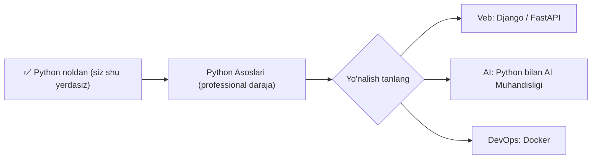

## Bu darsda nimalarni o‘rganamiz

- Python’dan AI modelini qanday chaqirishni (g‘oyasi).
- API kalit nima va uni xavfsiz saqlash.
- Oddiy AI chaqiruvi misoli.
- Kursni yakunlash: 0 → Advanced yo‘l xaritasi va yakuniy loyiha.

## Oldindan nima bilish kerak

[LLM va ChatGPT qanday ishlaydi](/courses/python-noldan/llm-kirish), [API va requests](/courses/python-noldan/api-va-requests), [Virtual muhit](/courses/python-noldan/virtual-muhit-loyiha).

## Asosiy g‘oya — bir jumlada

> AI modelini o‘zingiz qurmaysiz — uni **API orqali chaqirasiz**. Siz matn (prompt) yuborasiz, model javob qaytaradi — xuddi API dan ma’lumot olgandek.

**Hayosiy o‘xshatish — taksi chaqirish.** Mashina ishlab chiqarish uchun zavod qurmaysiz — ilova orqali taksi chaqirasiz, u sizni manzilga olib boradi. AI ham shunday: ulkan modelni o‘zingiz o‘qitmaysiz — OpenAI/Anthropic/Google’ning tayyor modelini API bilan “chaqirasiz” va natijani olasiz.

## Umumiy tuzilma

```mermaid
flowchart LR
    P["Sizning Python dasturingiz"] -->|prompt (matn)| A["AI API (OpenAI/Claude/Gemini)"]
    A -->|javob (matn)| P
```

Bu — o‘tgan darsdagi API chaqiruviga juda o‘xshaydi: so‘rov yuborasiz, JSON javob olasiz. Farqi — javobni AI model yaratadi.

## API kalit

AI API’lari sizni tanishi (va hisob-kitob qilishi) uchun **API kalit** talab qiladi. Uni provayder saytidan olasiz va `.env` da saqlaysiz:

```
# .env fayli (git'ga qo'shilmaydi!)
OPENAI_API_KEY=sk-xxxxxxxx
```

```python
import os
from dotenv import load_dotenv    # pip install python-dotenv

load_dotenv()
kalit = os.getenv("OPENAI_API_KEY")
```

> [!WARNING]
> API kalit — pul bilan bog‘liq! Uni kodga yozmang, git’ga qo‘ymang, hech kimga bermang. Sizib chiqsa, boshqalar sizning hisobingizdan foydalanib, hisobingizga xarajat yozadi. Doim `.env` + `.gitignore`.

## Oddiy AI chaqiruvi (OpenAI misolida)

```python
# pip install openai
from openai import OpenAI

client = OpenAI()      # OPENAI_API_KEY ni muhitdan avtomatik oladi

javob = client.chat.completions.create(
    model="gpt-4o-mini",
    messages=[
        {"role": "system", "content": "Sen foydali yordamchisan."},
        {"role": "user", "content": "Python nima ekanini bir jumlada tushuntir."}
    ]
)

print(javob.choices[0].message.content)
```

Qismlarni tushunamiz:
- `messages` — suhbat: `system` (modelga ko‘rsatma) va `user` (sizning savolingiz).
- `model` — qaysi AI modelini ishlatish.
- `javob.choices[0].message.content` — modelning matn javobi.

Bu — AI ilovasining eng oddiy “salom dunyo”si. Chatbot, matn umumlashtiruvchi, tarjimon — hammasi shu asosga quriladi.

> [!NOTE]
> Bu yerda faqat **g‘oyani** ko‘rsatdik. Haqiqiy AI ilovalari prompt muhandisligi, xotira, hujjatlardan javob berish (RAG), agentlar va xavfsizlikni o‘z ichiga oladi. Bularning barchasi bu platformadagi [Python bilan AI Muhandisligi](/courses/ai-python/modern-ai-landscape) kursida chuqur o‘rgatiladi.

## Xavfsizlik va xarajat

- **Kalit** — `.env` da, hech qachon kodda.
- **Har so‘rov pul turadi** — token soniga qarab. Uzun promptlar va javoblar qimmatroq.
- **Javobni tekshiring** — model xato qilishi mumkin (o‘tgan darsda ko‘rdik).

## 🎉 Tabriklaymiz — kursni tugatdingiz!

Siz **mutlaqo noldan** boshlab quyidagilarni o‘rgandingiz:

- Python asoslari: o‘zgaruvchilar, shartlar, sikllar
- Ma’lumot tuzilmalari: ro‘yxat, lug‘at, tuple, set, satr
- Funksiyalar, modullar, virtual muhit
- Xatoliklar, fayllar (JSON/CSV)
- Klasslar va OOP (meros bilan)
- Comprehension, lambda, debugging, toza kod
- API’lar va AI/ML’ga kirish

Bu — jiddiy poydevor. Endi haqiqiy loyihalar qura olasiz!

## 0 → Advanced yo‘l xaritasi



Tavsiya etilgan keyingi qadamlar (shu platformada):

1. **[Python Asoslari](/courses/python-foundations/functions-arguments-scope)** — closure, dekoratorlar, generatorlar, typing, testlash. “Boshlovchi”dan “professional”ga.
2. So‘ng yo‘nalish tanlang:
   - **Veb**: [Django](/courses/django/models-and-the-orm) yoki [FastAPI](/courses/fastapi/pydantic-deep-dive)
   - **Sun’iy intellekt**: [Python bilan AI Muhandisligi](/courses/ai-python/modern-ai-landscape)
   - **Joylashtirish**: [Docker](/courses/docker-python/docker-fundamentals)

## Qanday davom etish (maslahatlar)

- **Har kuni ozdan yozing** — 30 daqiqa amaliyot kitob o‘qishdan afzal.
- **Loyihalar quring** — kalkulyator, to-do, chatbot. Amaliyot eng yaxshi ustoz.
- **Xatolardan qo‘rqmang** — har bir xato — o‘rganish.

## Xulosa

- AI modelini API orqali chaqirasiz: prompt yuborasiz, javob olasiz.
- API kalit — `.env` da, xavfsiz; har so‘rov pul turadi.
- Oddiy chaqiruv: `messages` (system + user) → model javobi.
- Kursni tugatdingiz — endi Python Asoslari va tanlagan yo‘nalishingizga o‘ting.

## Mashqlar

**Oson**

1. AI chaqiruvida `system` va `user` xabarlari farqini o‘z so‘zingiz bilan tushuntiring.
2. Nega API kalit `.env` da saqlanadi? Bir jumlada yozing.

**O‘rtacha**

3. (G‘oya) Oddiy “savol-javob” dasturi rejasini yozing: foydalanuvchidan savol olib, AI’ga yuborib, javobni chiqaradi.
4. AI ilovasida xarajatni kamaytirishning 2 usulini o‘ylab toping (maslahat: promptni qisqartirish).

**Fikrlash**

5. Nega AI modelini o‘zingiz qurmaysiz? API orqali chaqirishning afzalligi nimada?

**Amaliy (ixtiyoriy)**

6. Agar API kalitingiz bo‘lsa: `pip install openai python-dotenv` qilib, yuqoridagi misolni ishga tushiring va o‘z savolingizni bering.

**Yakuniy loyiha (tanlang)**

Kursda o‘rganganingizni birlashtiruvchi loyiha:
- **AI yordamchi (CLI)**: terminalда savol beriladi, AI javob qaytaradi; suhbat tarixini faylga saqlaydi (`.env`, `try/except`, funksiyalar).
- **Ma’lumot tahlilchi**: CSV faylni o‘qib, statistikani hisoblaydi va (ixtiyoriy) AI’dan xulosa so‘raydi.
- **Aqlli to-do**: vazifalar JSON’da saqlanadi, AI vazifalarni muhimlik bo‘yicha tartiblashni taklif qiladi.

Har birida: funksiyalar/klasslar, fayllar, xatoliklar, virtual muhit va (imkoni bo‘lsa) API ishlatishga harakat qiling.

## Test

<details>
<summary>1. AI modelini o‘zingiz o‘qitasizmi?</summary>
Yo‘q — tayyor modelni API orqali chaqirasiz (prompt yuborib, javob olasiz).
</details>

<details>
<summary>2. `system` xabari nima uchun?</summary>
Modelga umumiy ko‘rsatma/rol berish uchun (masalan "sen foydali yordamchisan").
</details>

<details>
<summary>3. API kalit qayerda saqlanadi?</summary>
<code>.env</code> faylida — kodga yozilmaydi, git’ga qo‘shilmaydi.
</details>

<details>
<summary>4. Bundan keyin nimani o‘rganish tavsiya etiladi?</summary>
Python Asoslari kursi, so‘ng yo‘nalishga qarab Django/FastAPI, AI Muhandisligi yoki Docker.
</details>

## Tabriklaymiz! 🚀

Siz Python’ni noldan o‘rgandingiz va AI’ga birinchi qadamni qo‘ydingiz. Endi **[Python Asoslari](/courses/python-foundations/functions-arguments-scope)** kursiga o‘ting va professional darajaga chiqing. Omad tilaymiz!
