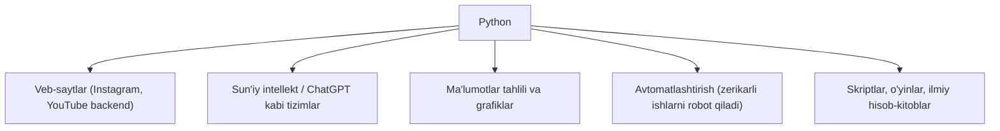
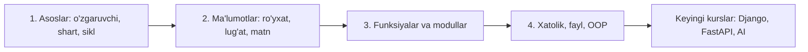

## Bu darsda nimalarni o‘rganamiz

- Dasturlash aslida nima ekanini oddiy tilda tushunamiz.
- Python nima uchun boshlash uchun eng qulay til ekanini bilamiz.
- Python qayerlarda ishlatilishini ko‘ramiz.
- O‘rganish yo‘lini (0 → Advanced) tasavvur qilamiz.

## Oldindan nima bilish kerak

**Hech narsa.** Bu dars mutlaqo noldan boshlaydi. Kompyuterda fayl ochish va yozishni bilsangiz — yetarli.

## Asosiy g‘oya — bir jumlada

> Dasturlash — bu kompyuterga **aniq ko‘rsatmalar** berish san’ati. Python esa shu ko‘rsatmalarni yozishning eng oson va tushunarli tillaridan biri.

**Hayotiy o‘xshatish — retsept.** Tasavvur qiling, siz oshpazga osh tayyorlashni o‘rgatyapsiz. Unga qadamma-qadam aytishingiz kerak: “guruchni yuv, sabzini to‘g‘ra, yog‘ni qizdir...”. Oshpaz aqlli, lekin **o‘zi o‘ylab topmaydi** — faqat aytganingizni bajaradi. Kompyuter ham xuddi shunday: juda tez, lekin faqat siz aniq aytgan ishni qiladi. Dasturlash — bu kompyuterga “retsept” yozib berish.

## Dasturlash nima?

Kompyuter — juda tez, lekin “ahmoq” yordamchi. U soniyada millionlab amal bajaradi, ammo o‘zi hech narsa o‘ylab topmaydi. Siz unga **dastur** (ya’ni ko‘rsatmalar ro‘yxati) yozib berasiz, u esa ularni ketma-ket bajaradi.

Masalan, oddiy dastur shunday ko‘rinishi mumkin:

```
1. Foydalanuvchidan ismini so‘ra
2. "Salom, " so‘ziga uning ismini qo‘shib chiqar
```

Python’da bu atigi ikki qatorda yoziladi (buni keyingi darslarda o‘rganamiz). Ko‘rasizmi — g‘oya oddiy: **muammoni kichik qadamlarga bo‘lib, har birini kompyuterga aytish.**

## Nega aynan Python?

Ko‘p dasturlash tillari bor (Java, C++, JavaScript...). Lekin Python boshlovchilar uchun eng yaxshi tanlov, chunki:

| Sabab | Ma’nosi |
|---|---|
| **Oson o‘qiladi** | Kodi deyarli oddiy ingliz tiliga o‘xshaydi |
| **Kam yoziladi** | Boshqa tillarda 10 qator kerak bo‘lgan ish Python’da 2 qatorda |
| **Katta jamiyat** | Har qanday savolga internetdan javob topasiz |
| **Hamma joyda** | Veb, sun’iy intellekt, ma’lumot tahlili, avtomatlashtirish |

Boshqa tilda “Salom, dunyo!” yozish murakkab bo‘lsa, Python’da bu bitta qator:

```python
print("Salom, dunyo!")
```

`print` — bu “ekranga chiqar” degani. Qavs ichidagi qo‘shtirnoq orasidagi matn esa chiqadigan xabar. Tamom!

## Python qayerda ishlatiladi?



Ya’ni Python’ni o‘rgansangiz, keyin veb dasturchi ham, AI muhandisi ham, ma’lumot tahlilchisi ham bo‘lishingiz mumkin. Shuning uchun u **eng ko‘p o‘rganiladigan** birinchi til.

## Keng tarqalgan noto‘g‘ri tushunchalar

1. **“Dasturlash uchun matematikani zo‘r bilish kerak.”** — Yo‘q. Oddiy qo‘shish-ayirish yetarli. Ko‘proq mantiq va sabr kerak.
2. **“Men yosh emasman / kech qoldim.”** — Har qanday yoshda boshlash mumkin. Sabr muhim, yosh emas.
3. **“Hamma kodni yod olish kerak.”** — Yo‘q. Hech kim hammasini yod olmaydi; kerak bo‘lganda qidiriladi. Muhimi — **tushunish**.
4. **“Bir kunda o‘rganib bo‘laman.”** — Yo‘q, bu jarayon. Lekin har kuni ozdan mashq qilsangiz, tez o‘sasiz.

## O‘rganish yo‘li: 0 → Advanced

Bu kurs sizni quyidagi yo‘l bilan olib boradi:



Har bir dars oldingisiga tayanadi. Shoshilmang — **har bir misolni o‘zingiz yozib ko‘ring.** Kodni o‘qish va uni o‘zi yozish — bu ikki xil ko‘nikma.

## Xulosa

- Dasturlash — kompyuterga aniq, qadamma-qadam ko‘rsatma berish.
- Python — eng oson va eng ko‘p ishlatiladigan boshlang‘ich til.
- Matematik daho bo‘lish shart emas; mantiq va sabr yetarli.
- Bu kurs sizni noldan boshlab, keyingi jiddiy mavzularga tayyorlaydi.

## Mashqlar

**Oson**

1. O‘zingizga: “Nega Python o‘rganmoqchiman?” degan savolga 2-3 jumlada javob yozing. (Maqsad bo‘lsa, sabr osonroq keladi.)
2. Kundalik hayotingizdan “retsept” (qadamma-qadam ko‘rsatma) ga o‘xshaydigan bitta ishni yozing (masalan: “choy damlash”). Uni 4-5 qadamga bo‘ling.

**O‘rtacha**

3. Atrofingizdagi 3 ta ilova yoki saytni yozing va ularning qaysi qismi “dastur” bajarayotganini taxmin qiling (masalan: “like” bosilganda son oshishi).

**Fikrlash**

4. Nega kompyuter “o‘zi o‘ylab topmaydi” deyapmiz? Agar dasturda bitta qadamni tushirib qoldirsangiz nima bo‘ladi, deb o‘ylaysiz?

## Test (o‘zingizni tekshiring)

<details>
<summary>1. Dastur nima?</summary>
Kompyuter ketma-ket bajaradigan aniq ko‘rsatmalar (qadamlar) ro‘yxati.
</details>

<details>
<summary>2. Nega Python boshlovchilar uchun qulay?</summary>
Kodi oson o‘qiladi, kam yoziladi, katta jamiyati bor va ko‘p sohada ishlatiladi.
</details>

<details>
<summary>3. Dasturlash uchun oliy matematika shartmi?</summary>
Yo‘q — oddiy hisob va mantiqiy fikrlash yetarli.
</details>

<details>
<summary>4. `print("Salom")` nima qiladi?</summary>
Ekranga "Salom" so‘zini chiqaradi.
</details>

## Keyingi dars

[Python o‘rnatish va birinchi dastur](/courses/python-noldan/ornatish-birinchi-dastur) — endi amalda yozamiz!
