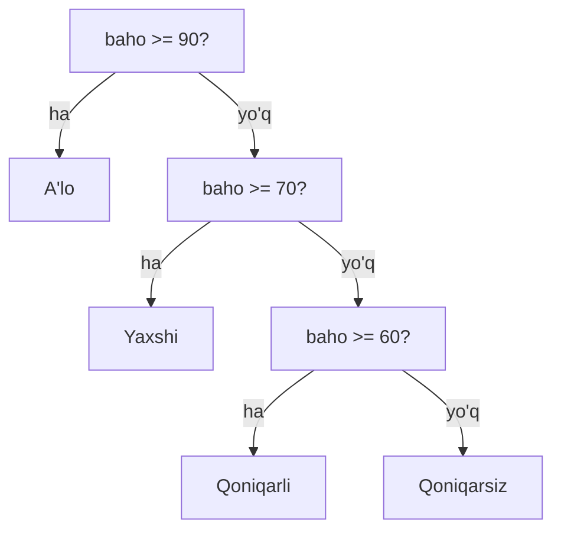

## Bu darsda nimalarni o‘rganamiz

- Dasturga qaror qabul qilishni o‘rgatamiz: `if`, `elif`, `else`.
- Taqqoslash operatorlari (`==`, `>`, `<` ...).
- Mantiqiy operatorlar (`and`, `or`, `not`).
- Indentatsiya (bo‘sh joy) nega muhimligini tushunamiz.

## Oldindan nima bilish kerak

[O‘zgaruvchilar va ma’lumot turlari](/courses/python-noldan/ozgaruvchilar-va-turlar).

## Asosiy g‘oya — bir jumlada

> **Shartli operator** dasturga “**agar** shu rost bo‘lsa — buni qil, **aks holda** — boshqasini qil” deyishga imkon beradi.

**Hayotiy o‘xshatish — soyabon.** Ertalab derazaga qaraysiz: **agar** yomg‘ir yog‘ayotgan bo‘lsa — soyabon olasiz, **aks holda** — olmaysiz. Miyangiz doim shunday shartlar bilan qaror qabul qiladi. Dastur ham `if` orqali xuddi shunday qaror qabul qiladi.

## Birinchi `if`

```python
yosh = 20
if yosh >= 18:
    print("Siz kattasiz")
    print("Kirishga ruxsat")
```

- `if` — “agar”. Undan keyin **shart** yoziladi, oxirida **ikki nuqta `:`**.
- Keyingi qatorlar **ichkariga surilgan** (indentatsiya) — bu “agar shart rost bo‘lsa, mana shularni qil” degani.

Agar `yosh` 18 dan kichik bo‘lsa, ichkaridagi qatorlar **bajarilmaydi**.

## `else` — aks holda

```python
yosh = 15
if yosh >= 18:
    print("Kirishga ruxsat")
else:
    print("Kechirasiz, 18 dan katta bo'lishingiz kerak")
```

`else` — “aks holda”. Shart **noto‘g‘ri** bo‘lganda ishlaydi. `else` ga shart yozilmaydi, faqat `:`.

## `elif` — bir nechta variant

Ko‘p variant bo‘lsa, `elif` (“aks holda agar”) ishlatiladi:

```python
baho = 75
if baho >= 90:
    print("A'lo")
elif baho >= 70:
    print("Yaxshi")
elif baho >= 60:
    print("Qoniqarli")
else:
    print("Qoniqarsiz")
```

Python **yuqoridan pastga** tekshiradi va **birinchi rost** bo‘lgan shartni bajarib, qolganlarini tashlab ketadi. `baho = 75` bo‘lsa → “Yaxshi” chiqadi.



## Taqqoslash operatorlari

| Operator | Ma’nosi | Misol |
|---|---|---|
| `==` | teng | `yosh == 18` |
| `!=` | teng emas | `ism != "Ali"` |
| `>` | katta | `narx > 100` |
| `<` | kichik | `soat < 12` |
| `>=` | katta yoki teng | `yosh >= 18` |
| `<=` | kichik yoki teng | `ball <= 50` |

> [!WARNING]
> `=` va `==` ni chalkashtirmang! `=` — qiymat **solib qo‘yadi** (`yosh = 18`). `==` — **taqqoslaydi** (`yosh == 18`). Bu eng ko‘p uchraydigan boshlang‘ich xato.

## Mantiqiy operatorlar: `and`, `or`, `not`

Bir nechta shartni birlashtirish uchun:

```python
yosh = 25
haydovchilik_guvohnomasi = True

if yosh >= 18 and haydovchilik_guvohnomasi:
    print("Mashina haydashi mumkin")
```

- `and` — **ikkalasi ham** rost bo‘lishi kerak.
- `or` — **kamida bittasi** rost bo‘lsa yetadi.
- `not` — shartni **teskari** qiladi (`not True` → `False`).

```python
kun = "shanba"
if kun == "shanba" or kun == "yakshanba":
    print("Dam olish kuni!")
```

## Indentatsiya (bo‘sh joy) — Python’da MUHIM

Ko‘p tillarda kod bloklari `{ }` bilan belgilanadi. Python’da esa **bo‘sh joy (odatda 4 ta)** bilan:

```python
if yosh >= 18:
    print("Bu if ichida")      # 4 ta bo'sh joy → if ga tegishli
print("Bu if dan tashqarida")  # bo'sh joysiz → doim ishlaydi
```

> [!IMPORTANT]
> Indentatsiya noto‘g‘ri bo‘lsa, `IndentationError` xatosi chiqadi. VS Code’da **Tab** tugmasi 4 bo‘sh joy qo‘yadi — undan foydalaning va aralashtirmang (goh tab, goh probel qilmang).

## Shartlarni ichma-ich yozish

Shart ichida yana shart bo‘lishi mumkin:

```python
yosh = 20
bilet = True
if yosh >= 18:
    if bilet:
        print("Kinoga kirishingiz mumkin")
    else:
        print("Avval bilet oling")
```

Lekin ko‘p ichma-ich shartlar kodni chalkashtiradi — ko‘pincha `and` bilan soddalashtirish mumkin.

## Keng tarqalgan xatolar

1. **`=` va `==` chalkashligi** — shartda doim `==`.
2. **Ikki nuqta `:` ni unutish** — `if x > 5` xato; `if x > 5:` to‘g‘ri.
3. **Indentatsiya xatosi** — `if` dan keyingi qator surilishi shart.
4. **`input` ni son bilan taqqoslash** — `input` matn qaytaradi; `int()` qiling: `if int(javob) > 5:`.
5. **Ortiqcha `elif` o‘rniga bir nechta `if`** — mustaqil `if` lar hammasini tekshiradi; `elif` esa faqat birini tanlaydi.

## Xulosa

- `if` shart rost bo‘lsa kodni bajaradi; `else` — aks holda; `elif` — qo‘shimcha variantlar.
- Taqqoslash: `==`, `!=`, `>`, `<`, `>=`, `<=`. Birlashtirish: `and`, `or`, `not`.
- `=` solib qo‘yadi, `==` taqqoslaydi.
- Indentatsiya (4 bo‘sh joy) — Python’da blok chegarasi; e’tibor bilan yozing.

## Mashqlar

**Oson**

1. Foydalanuvchidan yosh so‘rang; agar 18+ bo‘lsa “Kattasiz”, aks holda “Kichiksiz” chiqaring.
2. Bir son so‘rang; u musbat, manfiy yoki nol ekanini `if/elif/else` bilan aniqlang.

**O‘rtacha**

3. Baho (0–100) so‘rang va A’lo/Yaxshi/Qoniqarli/Qoniqarsiz chiqaring.
4. Foydalanuvchidan son so‘rang va u **juft** yoki **toq** ekanini aniqlang (`% 2` dan foydalaning).

**Fikrlash**

5. `and` va `or` farqini o‘z so‘zingiz bilan, hayotiy misol bilan tushuntiring.

**Xatoni top**

6. Bu kodda 2 ta xato bor, toping:
```python
yosh = input("Yosh: ")
if yosh = 18
print("Aynan 18")
```

**Mini loyiha**

Oddiy “kirish nazorati”: parol so‘rang. Agar parol `"maxfiy123"` bo‘lsa “Xush kelibsiz”, aks holda “Noto‘g‘ri parol” chiqaring. Qo‘shimcha: foydalanuvchi nomini ham so‘rab, faqat nom `"admin"` **va** parol to‘g‘ri bo‘lgandagina kirishga ruxsat bering (`and`).

## Test

<details>
<summary>1. `if` shartdan keyin nima qo‘yiladi?</summary>
Ikki nuqta <code>:</code>, keyingi qator esa ichkariga suriladi (indentatsiya).
</details>

<details>
<summary>2. `elif` nima uchun kerak?</summary>
Bir nechta variantni ketma-ket tekshirish uchun — birinchi rost bo‘lgani bajariladi.
</details>

<details>
<summary>3. `and` va `or` farqi?</summary>
<code>and</code> — ikkala shart ham rost bo‘lishi kerak; <code>or</code> — kamida bittasi rost bo‘lsa yetadi.
</details>

<details>
<summary>4. Shartda `=` yozib qo‘ysangiz nima bo‘ladi?</summary>
Xato (yoki noto‘g‘ri xatti-harakat) — taqqoslash uchun <code>==</code> ishlatilishi kerak.
</details>

## Keyingi dars

[Sikllar (for va while)](/courses/python-noldan/sikllar) — takrorlanadigan ishlarni avtomatlashtiramiz.
