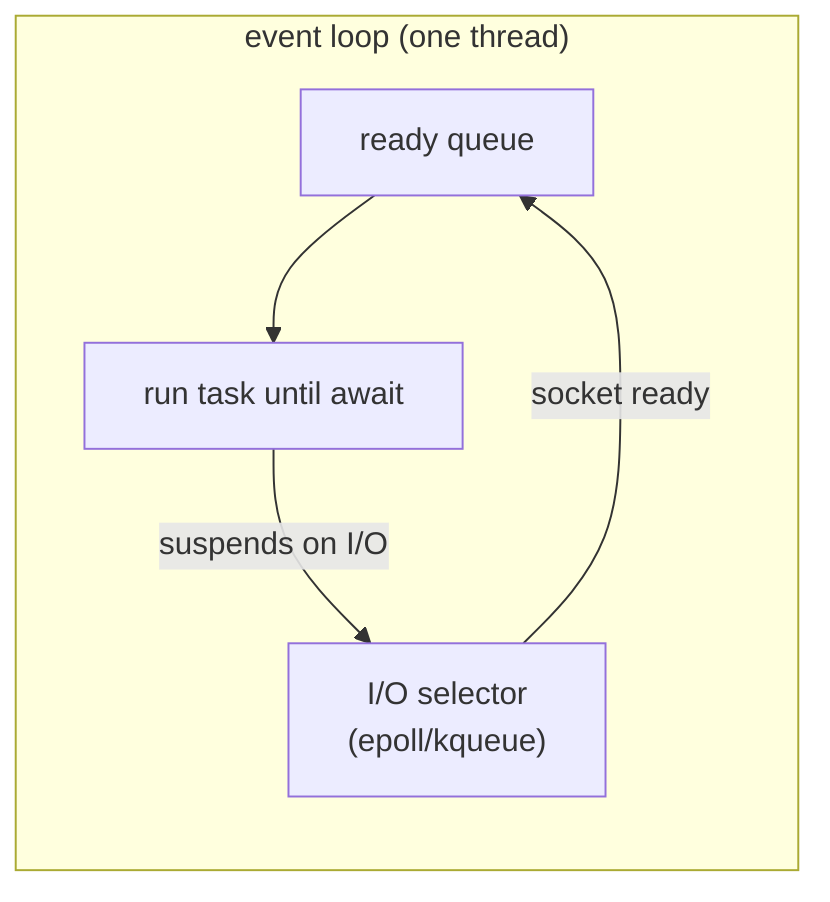

## Learning objectives

- Explain what the event loop does, mechanically — and what `await` compiles to conceptually.
- Write correct async code: coroutines, tasks, `gather`, timeouts, cancellation.
- Identify the cardinal sin (blocking the loop) instantly, and know all the standard fixes.
- Choose between sequential awaits and concurrent tasks deliberately.
- Explain async's relationship to generators, threads, and the GIL in interviews.

## Prerequisites

[Iterators and Generators](/courses/python/iterators-and-generators) — coroutines are evolved generators, and the suspended-frame model transfers directly.

## The problem async solves

A typical API request spends ~5ms of CPU and ~200ms waiting: database, cache, downstream HTTP. A synchronous worker sits idle during those waits — serving one request per worker at a time. The classic fix is more workers (processes/threads); the async fix is **one thread that never waits**: when a request's I/O starts, the thread switches to another request, returning when the I/O completes.

This is **cooperative multitasking**: tasks *volunteer* to yield control at `await` points. Contrast with threads (preemptive — the OS interrupts anywhere, hence locks everywhere):

| | Threads | asyncio |
|---|---|---|
| Switching | preemptive, anywhere | cooperative, only at `await` |
| Race conditions | between any two instructions | only across `await` boundaries |
| Cost per unit | ~8MB stack, OS scheduling | ~KBs per task; cheap to have 10,000 |
| Blocking call | blocks one thread | **blocks everything** |
| Best for | I/O concurrency, legacy blocking libs | massive I/O concurrency |

## Coroutines, the event loop, and tasks

```python
import asyncio

async def fetch_user(uid: int) -> dict:
    await asyncio.sleep(0.2)            # stand-in for real I/O
    return {"id": uid}

async def main():
    user = await fetch_user(1)          # sequential: run, wait, resume
    print(user)

asyncio.run(main())                     # creates the loop, runs, cleans up
```

Facts to hold on to:

1. **Calling `fetch_user(1)` runs nothing** — it returns a coroutine object (exactly like calling a generator function). Only `await`ing it (or wrapping in a task) executes it. A never-awaited coroutine is a bug; Python warns `RuntimeWarning: coroutine ... was never awaited`.
2. **`await` means:** run this until it suspends; while it's suspended on I/O, the event loop may run *other* tasks; resume me here with the result. It marks every place your function can be paused — which is also every place shared state can change under you.
3. **The event loop** is a single-threaded scheduler: it keeps a ready queue of callbacks/tasks and an I/O selector (epoll/kqueue/IOCP). Loop: run ready tasks until each hits `await` on pending I/O → ask the OS "which sockets are ready?" → move newly-ready tasks to the queue → repeat.



### Sequential vs concurrent — the decision that matters

```python
# Sequential: 3 × 200ms = 600ms
a = await fetch_user(1)
b = await fetch_user(2)
c = await fetch_user(3)

# Concurrent: max(200ms) = 200ms
a, b, c = await asyncio.gather(fetch_user(1), fetch_user(2), fetch_user(3))
```

`await` alone gives you *no* concurrency — it's just non-blocking sequencing. Concurrency starts when multiple coroutines are **scheduled together**:

- `asyncio.gather(*coros)` — run all, collect results in order; by default the first exception cancels nothing (others keep running) but propagates; `return_exceptions=True` collects errors as values.
- `asyncio.create_task(coro)` — schedule now, await later ("fire, then join"). **Keep a reference** — the loop holds tasks weakly, and a garbage-collected task dies mid-flight.
- **TaskGroup (3.11+, the modern default):**

```python
async with asyncio.TaskGroup() as tg:
    t1 = tg.create_task(fetch_user(1))
    t2 = tg.create_task(fetch_user(2))
# on exit: all complete; if one fails, siblings are CANCELLED and an
# ExceptionGroup propagates — structured concurrency, no leaked tasks
```

### Timeouts and cancellation

```python
try:
    async with asyncio.timeout(2.0):          # 3.11+
        data = await slow_call()
except TimeoutError:
    data = fallback()
```

Cancellation works by raising `CancelledError` **inside the task at its current await point**. Two rules: cleanup with `try/finally` (or async context managers) so cancellation doesn't leak connections; and if you catch `CancelledError` for cleanup, **re-raise it** — swallowing it makes tasks uncancellable and breaks timeouts and TaskGroups.

### The cardinal sin: blocking the loop

One thread runs everything. Any *synchronous* blocking call — `time.sleep`, `requests.get`, a heavy CPU loop, a sync DB driver — freezes **every** task and connection in the process:

```python
async def handler():
    data = requests.get(url)      # ☠ the whole service stalls here
```

Fixes, in order of preference:

1. **Async-native libraries**: `httpx`/`aiohttp`, `asyncpg`, `redis.asyncio`, `aiofiles`, `asyncio.sleep`.
2. **Push blocking work to a thread**: `await asyncio.to_thread(blocking_fn, arg)` — the loop stays free; the GIL is released during the blocking I/O.
3. **CPU-heavy work → process pool** (`loop.run_in_executor(ProcessPoolExecutor(), fn)`) — threads don't help against the GIL for pure-Python CPU work ([next lesson](/courses/python/concurrency-gil-threads-processes)).

Symptom of a blocked loop in production: latency spikes across *unrelated* endpoints, health checks timing out while CPU is low. Debug flags: `asyncio.run(main(), debug=True)` logs slow callbacks (>100ms).

## Async generators and context managers

The protocols carry over with `a`-prefixes: `async for` iterates `__aiter__`/`__anext__` (async generators: `async def` + `yield`); `async with` drives `__aenter__`/`__aexit__` — used by locks, connections, transactions:

```python
async def stream_rows(query):            # async generator
    async with pool.acquire() as conn:
        async for row in conn.cursor(query):
            yield transform(row)
```

For coordination, asyncio mirrors threading's kit: `asyncio.Lock` (protect state across awaits), `Semaphore` (**concurrency limiting — the most-used one**), `Event`, `Queue` (producer/consumer with backpressure):

```python
sem = asyncio.Semaphore(10)              # at most 10 in-flight
async def bounded_fetch(url):
    async with sem:
        return await client.get(url)
results = await asyncio.gather(*(bounded_fetch(u) for u in urls))
```

## Common mistakes

1. **Forgetting `await`** — you get a coroutine object instead of a result; `if get_flag():` is then always truthy. Watch for the RuntimeWarning.
2. **Sequential awaits where work is independent** — async code with zero concurrency; use gather/TaskGroup.
3. **Blocking calls in async code** — the cardinal sin; includes innocent-looking ones (`open().read()`, `json.dump` of 500MB, `bcrypt.hashpw`).
4. **Fire-and-forget without a reference** — `asyncio.create_task(cleanup())` alone can be GC'd; store it or use a TaskGroup.
5. **Swallowing `CancelledError`** — breaks timeouts, shutdown, and TaskGroups.
6. **Unbounded `gather` fan-out** — 10,000 simultaneous requests is a self-inflicted DDoS; bound with a Semaphore.
7. **Mixing sync and async carelessly** — calling `asyncio.run()` inside a running loop (`RuntimeError`), or making an async chain to wrap purely-sync work (pointless overhead).

## Best practices

- Prefer **TaskGroup + timeout context managers** (3.11+) over raw gather/wait_for — structured concurrency cleans up after itself.
- Async all the way down on hot paths: one sync driver in the middle nullifies the model.
- Design **cancellation-safe** coroutines: resource acquisition in `async with`, cleanup in `finally`.
- Bound all fan-out (semaphores) and all queues (maxsize) — unbounded concurrency and unbounded buffering are both outages in waiting.
- Instrument: task counts, loop lag (schedule a heartbeat and measure drift) — loop lag is *the* async health metric.

## Performance & memory notes

- A Task costs low-single-digit KBs vs ~8MB default thread stack; 10k concurrent tasks is routine, 10k threads is not.
- Context switches at `await` are function-call-scale (no syscall, no kernel scheduler) — orders cheaper than thread switches.
- Async adds overhead per operation vs plain sync calls — for *CPU-bound* or low-concurrency work, sync is simpler *and* faster. Async wins when concurrent waiting dominates.
- The loop is still one core. Total async throughput caps at one CPU of Python work; scale cores with multiple processes (uvicorn workers), not threads.

## Production tips

- Under uvicorn/FastAPI you're already inside the loop — never `asyncio.run` in handlers; never block ([FastAPI lesson](/courses/fastapi/asgi-and-starlette) covers how frameworks offload sync routes).
- Set timeouts on **every** external await (HTTP, DB, queue) — a missing timeout plus a stuck upstream equals a slow leak of hung tasks.
- Graceful shutdown: stop accepting, cancel outstanding tasks, await them with a deadline, then close pools — TaskGroups make this composable.
- Log exceptions from background tasks via `task.add_done_callback` or rely on TaskGroup propagation; silent task deaths are a classic production mystery.

## Interview questions

1. **"How does the event loop work?"** — Single-threaded scheduler: ready queue + OS I/O selector; tasks run until `await` on pending I/O; selector readiness re-queues them.
2. **"What happens if you call an async function without await?"** — Nothing runs; you hold a coroutine object; warning on GC. Explain generator ancestry for depth.
3. **"async vs threads?"** — Cooperative vs preemptive; task cost and switch cost; blocking semantics; both are concurrency-not-parallelism under the GIL.
4. **"When does async make an app slower?"** — CPU-bound work, low concurrency, sync libraries wrapped in async, per-operation overhead without wait-overlap to amortize it.
5. **"How do you run blocking code from async?"** — `asyncio.to_thread` / executors; process pool for CPU-bound; explain why the loop must not block.

## Summary

- async = cooperative multitasking on one thread; `await` marks suspension points; the loop multiplexes waits through the OS selector.
- Concurrency requires *scheduling together* (gather/TaskGroup), not just `await`.
- Never block the loop; offload with `to_thread`; bound concurrency with semaphores; timeout everything; treat cancellation as a first-class path.
- Tasks are cheap, structured concurrency (3.11+) keeps them accounted for, and loop lag is the metric that tells you the truth.

## Exercises

**Easy**

1. Write two coroutines printing with different delays; run them sequentially, then with `gather`; measure both with `time.perf_counter`.
2. Demonstrate the forgotten-await bug and the exact warning it produces.

**Medium**

3. Fetch 20 URLs (simulate with `asyncio.sleep(random())`) with a Semaphore(5); log start/end times and verify ≤5 overlap.
4. Implement `retry_async(coro_fn, attempts, base_delay)` with exponential backoff — reuse your decorator knowledge, async edition.

**Hard**

5. Build a producer/consumer pipeline: N producers → bounded `asyncio.Queue(100)` → M consumers, clean shutdown via `None` sentinels or `Queue.join` + cancellation, all under a TaskGroup. Prove no task leaks with `asyncio.all_tasks()`.

**Debugging exercise**

6. This endpoint makes the whole service freeze for seconds at a time under load. Find all three problems:

```python
async def report(request):
    rows = db.execute_sync(BIG_QUERY)         # 1: blocks the loop
    result = [heavy_transform(r) for r in rows]   # 2: CPU hogs the loop
    asyncio.create_task(audit_log(request))       # 3: unreferenced task
    return result
```

**Refactoring exercise**

7. Refactor a sequential scraper (`for url in urls: data.append(await fetch(url))`) into bounded-concurrent form with TaskGroup + Semaphore, preserving input order in the output.

**Mini project**

Build an async health-check monitor: read a list of (name, url, interval); one task per target pings on its interval with a 2s timeout; a reporter task prints a status table every 5s from shared state (guarded appropriately); SIGINT triggers graceful shutdown with all tasks cancelled and awaited. Bonus: track and print loop lag.

## Quiz

<details>
<summary>1. What executes when you write <code>t = asyncio.create_task(f())</code> — and when?</summary>
<code>f()</code> creates the coroutine immediately (no body runs); the task is scheduled to start at the next loop iteration — it may begin before you ever await <code>t</code>.
</details>

<details>
<summary>2. Why is a race condition still possible in single-threaded async code?</summary>
State can change across any <code>await</code> — read-check-modify sequences spanning an await interleave with other tasks. Locks (or avoiding awaits inside critical sections) fix it.
</details>

<details>
<summary>3. <code>gather</code> vs <code>TaskGroup</code> on failure?</summary>
gather (default): first exception propagates, siblings keep running unsupervised. TaskGroup: siblings are cancelled, everything is awaited, ExceptionGroup raised — no leaks.
</details>

<details>
<summary>4. Does <code>await asyncio.to_thread(requests.get, url)</code> block the loop?</summary>
No — the blocking call runs in a worker thread (GIL released during socket waits); the coroutine suspends until it finishes.
</details>

<details>
<summary>5. Your async service maxes one CPU core. How do you scale it?</summary>
Multiple processes (e.g. uvicorn --workers N / gunicorn) behind a load balancer — the loop model is per-process; threads don't add Python CPU under the GIL.
</details>

## Further reading

- asyncio docs — "Coroutines and Tasks", "Streams", "Developing with asyncio"
- PEP 492 (async/await), PEP 654 (ExceptionGroups)
- Łukasz Langa's "import asyncio" video series
