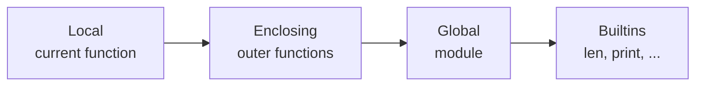
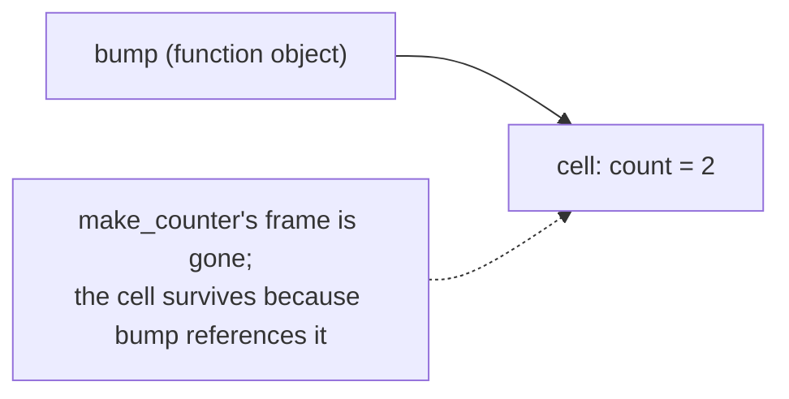

## Learning objectives

- Walk the LEGB rule mentally for any piece of code and predict which binding wins.
- Explain why assignment makes a name local *for the whole function* and how that causes `UnboundLocalError`.
- Describe how closures work mechanically — cell objects, `__closure__` — not just "inner functions remember things".
- Use `nonlocal` and `global` correctly (and know why you should rarely need them).
- Defuse the late-binding loop trap in interviews and code review.

## Prerequisites

[Functions Deep Dive](/courses/python/functions-deep-dive) and [names & references](/courses/python/variables-objects-references).

## LEGB: how a name is found

When Python evaluates a name, it searches four scopes in order and stops at the first hit:



```python
x = "global"

def outer():
    x = "enclosing"
    def inner():
        x = "local"
        print(x)        # local
    inner()
```

Remove the local assignment → prints "enclosing". Remove that too → "global". Shadow `len = 5` at module level and every call to `len()` in that module breaks — builtins are just the *last* dict searched.

**Two critical details:**

1. **Scope is determined at compile time, per function.** The compiler scans the whole function body; if a name is *assigned anywhere* in it (including `+=`, `for x in`, `import x`, `with ... as x`), that name is local *everywhere in the function* — even on lines before the assignment.

```python
counter = 0

def bump():
    print(counter)       # UnboundLocalError!
    counter = counter + 1
```

The assignment on line 2 makes `counter` local to `bump`; line 1 then reads a local that has no value yet. This is *the* scoping gotcha, and it's a compile-time fact — check `bump.__code__.co_varnames`.

2. **Only functions (and classes, comprehensions, lambdas) create scopes.** `if`, `for`, `while`, `try` do **not** — a name bound inside an `if` block is function- or module-level. (Class bodies are a special scope that *doesn't* participate in the enclosing lookup for methods — which is why methods say `self.attr`, not `attr`.)

### `global` and `nonlocal`

- `global name` — inside a function, "assignments to `name` target the module namespace".
- `nonlocal name` — "assignments target the nearest enclosing function's binding" (the name must already exist there).

```python
def make_counter():
    count = 0
    def bump():
        nonlocal count      # rebind the enclosing binding
        count += 1
        return count
    return bump
```

Reading outer names never needs a declaration — only **rebinding** does. And mutating a mutable object (`items.append(x)`) is not rebinding, so it needs no declaration either; that asymmetry confuses many people.

Treat `global` as a code smell in application code: module-level mutable state shared implicitly is hard to test and thread-unsafe. Prefer passing state explicitly or using a class.

## Closures: functions that carry an environment

A **closure** is a function that references variables from an enclosing scope after that scope has exited. Mechanically: the compiler notices `count` is shared between `make_counter` and `bump`, allocates a **cell object** for it, and both scopes read/write through the cell. The inner function's `__closure__` holds the cells:

```python
c = make_counter()
c()                                  # 1
c()                                  # 2
c.__closure__[0].cell_contents       # 2 — the live captured variable
```



Key insight: **closures capture variables, not values.** The cell is shared and mutable; whatever the variable holds *when the closure runs* is what it sees.

### The late-binding loop trap

```python
callbacks = [lambda: i for i in range(3)]
[cb() for cb in callbacks]        # [2, 2, 2]  — not [0, 1, 2]
```

All three lambdas close over the *same* `i` cell; by the time any runs, the loop has finished and `i` is 2. Fixes:

```python
callbacks = [lambda i=i: i for i in range(3)]          # default: evaluated NOW
# or
from functools import partial
callbacks = [partial(lambda x: x, i) for i in range(3)]
# or: a factory function that takes i as a parameter and returns the lambda
```

This bites for real in GUI button handlers, route registration loops, and task scheduling — anywhere you build callables in a loop.

### What closures are for

- **Function factories** — `make_validator(pattern)` returning a configured checker.
- **Decorators** — the wrapper closes over the wrapped function ([next lesson](/courses/python/decorators)).
- **Callbacks with context** — bundling data with behavior without a class.
- **Lightweight encapsulation** — `make_counter`'s `count` is inaccessible except through the returned API.

Rule of thumb: one behavior + a bit of state → closure; multiple behaviors sharing state → class. And `functools.partial` beats a hand-written closure when all you're doing is pre-filling arguments.

## Common mistakes

1. **Read-then-assign** in one function → `UnboundLocalError` (see `bump` above). Fix: `global`/`nonlocal`, or better, restructure to avoid shared rebinding.
2. **Loop-variable capture** (above). Any lambda in a loop should make you pause.
3. **Expecting `for`/`if` blocks to scope names.** The loop variable leaks: after `for i in range(3): pass`, `i == 2`. (Comprehension variables, by contrast, *don't* leak — comprehensions run in their own scope since Python 3.)
4. **Using `global` as a shortcut for return values** — makes functions order-dependent and untestable.
5. **Shadowing builtins** (`list`, `id`, `type`, `dict` as variable names) — legal, silently breaks later lines, and linters catch it; let them.
6. **Assuming closures snapshot.** They don't; if you need a snapshot, bind it explicitly (default argument or `partial`).

## Best practices

- Keep functions' free variables few and obvious; a closure that captures five mutable things is a class in denial.
- Prefer **parameters over enclosing-scope reads** for anything that changes — explicit inputs are testable.
- Use `nonlocal` sparingly and only in tight, obviously-paired factory functions (counters, accumulators, memoizers).
- Module constants in UPPER_CASE are the *good* use of global scope: written once, read everywhere.

## Performance & memory notes

- Locals are the fastest name access (`LOAD_FAST`, array slot); closure variables use `LOAD_DEREF` (one indirection through the cell); globals use a dict lookup (`LOAD_GLOBAL`); builtins are two dict lookups (global miss → builtins). In genuinely hot loops, hoisting `local_len = len` is a real (if last-resort) optimization.
- A closure keeps every captured object alive as long as the function lives — a closure stored in a global registry that captured a big DataFrame is a memory leak with extra steps. Capture what you need (`n = len(df)`), not the whole object.
- Cells add one small allocation per captured variable per factory call — irrelevant except when constructing millions of closures.

## Production tips

- Late-binding bugs in production commonly appear in **route/handler registration loops** ("every webhook calls the last handler") — code-review any `for` that defines or lambdas a callable.
- Module-level mutable state + closures is a classic source of test pollution: state leaks between tests. Fixture-scoped factories or dependency injection solve it.
- When debugging "where does this function get that value?!", inspect `fn.__closure__`, `fn.__globals__`, and `fn.__code__.co_freevars` — the runtime will tell you exactly.

## Interview questions

1. **"Explain LEGB."** — Local → Enclosing → Global → Builtins, first hit wins; scope of a name is fixed at compile time per function.
2. **"Why does reading a variable before `+=` in a function raise `UnboundLocalError`?"** — Any assignment anywhere makes the name local for the whole body; the read then hits an unbound local slot.
3. **"What is a closure, mechanically?"** — A function whose code references free variables held in shared cell objects that outlive the defining frame (`__closure__`).
4. **"What prints, and why: lambdas over a loop variable?"** — The trap; explain shared-cell capture and the default-argument fix.
5. **"`global` vs `nonlocal`?"** — Rebinding target: module namespace vs nearest enclosing function; neither is needed for reads or in-place mutation.

## Summary

- Name lookup walks Local → Enclosing → Global → Builtins; *where* a name lives is decided at compile time by whether the function assigns it.
- Closures share **cells** — live variables, not snapshots; hence the loop trap and its default-argument fix.
- `nonlocal`/`global` exist for rebinding through scopes; needing them often signals a class or explicit parameter would be cleaner.
- Access speed: local > closure > global > builtin; closures pin captured objects in memory.

## Exercises

**Easy**

1. Predict output before running: a module-level `x = 1`, a function that prints `x`, then one that assigns `x = 2` and prints, then one that does `global x; x = 3`. Check `x` after each call.
2. Write `make_multiplier(k)` and produce `double`, `triple`; inspect `double.__closure__[0].cell_contents`.

**Medium**

3. Implement `memoize_last()` — a factory returning a function wrapper that caches only the most recent (args → result) pair using `nonlocal`.
4. Reproduce the loop trap with three "greeting" lambdas over a list of names, then fix it three ways: default argument, `functools.partial`, and a factory function.

**Hard**

5. Write `make_rate_limiter(calls, per_seconds)` returning a `allow() -> bool` closure implementing a sliding window with a `deque` — no classes allowed. Then rewrite as a class and compare readability honestly.

**Debugging exercise**

6. Why does every button print "Save"? Fix without classes:

```python
actions = {}
for label in ["Open", "Save"]:
    def handler():
        print(label)
    actions[label] = handler
```

**Refactoring exercise**

7. This module uses `global` for a counter and a cache dict, mutated from four functions. Refactor into a small class (or closure-based factory) with explicit state, and list what became testable.

**Mini project**

Build an event bus in ~40 lines using only closures: `bus = make_bus()` returns `subscribe(topic, fn)`, `publish(topic, payload)`, `unsubscribe(token)`. Tokens are closures too. Write tests proving handlers registered in a loop fire with the right topic (i.e., you dodged the trap).

## Quiz

<details>
<summary>1. Which statements make a name local: <code>x += 1</code>, <code>for x in ...</code>, <code>with open(f) as x</code>, <code>print(x)</code>?</summary>
The first three — all are binding operations. <code>print(x)</code> is only a read and doesn't affect scope.
</details>

<details>
<summary>2. Does <code>items.append(1)</code> on an enclosing-scope list require <code>nonlocal</code>?</summary>
No — it's mutation through a read, not a rebinding. Only <code>items = ...</code> would.
</details>

<details>
<summary>3. What does <code>fn.__closure__</code> contain for a non-closure function?</summary>
<code>None</code>. For closures: a tuple of cell objects, aligned with <code>fn.__code__.co_freevars</code>.
</details>

<details>
<summary>4. After <code>squares = [x*x for x in range(5)]</code>, what is <code>x</code> at module level?</summary>
Whatever it was before (or undefined) — comprehensions have their own scope in Python 3 and don't leak the loop variable.
</details>

<details>
<summary>5. Rank access cost: builtin, local, global, closure variable.</summary>
local (fastest, array slot) &lt; closure (cell deref) &lt; global (dict lookup) &lt; builtin (two dict lookups).
</details>

## Further reading

- Python Language Reference — "Naming and binding"
- PEP 3104 (`nonlocal`)
- `dis` output for LOAD_FAST / LOAD_DEREF / LOAD_GLOBAL — see it yourself
