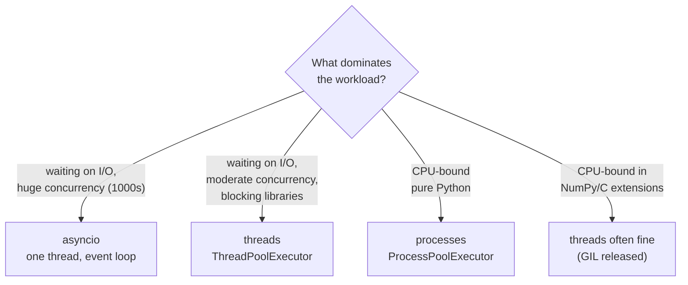

## Learning objectives

- Explain precisely what the GIL locks, why it exists, and what it does and doesn't prevent.
- Choose correctly between threads, processes, and asyncio for a given workload — with a decision framework.
- Use `concurrent.futures` executors idiomatically, and know the costs of multiprocessing.
- Identify and fix race conditions with locks, queues, and atomic designs.
- Discuss free-threaded Python (3.13+) and `ProcessPoolExecutor` pitfalls credibly in interviews.

## Prerequisites

[asyncio fundamentals](/courses/python/asyncio-fundamentals) and the [execution model](/courses/python/python-execution-model) — the GIL lives in the evaluation loop.

## The GIL, precisely

The **Global Interpreter Lock** is a mutex in CPython that allows **only one thread at a time to execute Python bytecode**. It exists because CPython's memory management (reference counting on every object) is not thread-safe; wrapping every refcount update in fine-grained locks was historically slower than one big lock.

What this means — and doesn't:

- **Python threads are real OS threads.** The OS schedules them across cores; they just take turns holding the GIL for bytecode (a thread is forced to release it every 5ms by default — `sys.getswitchinterval()`).
- **CPU-bound pure-Python code does not parallelize with threads.** Two threads summing numbers run *slower* than one (GIL handoff overhead), on any number of cores.
- **The GIL is released during blocking I/O** — socket reads, file I/O, `time.sleep`, DB driver waits. Ten threads waiting on ten HTTP responses genuinely wait in parallel. This is why threads work fine for I/O concurrency.
- **C extensions can release it** for CPU work too: NumPy, hashing, compression, many DB drivers do — so "threads never help CPU work" is false when your CPU work happens inside such libraries.
- **The GIL does not make your code thread-safe.** It makes single *bytecode instructions* atomic-ish; your logic isn't:

```python
counter = 0
def bump():
    global counter
    for _ in range(100_000):
        counter += 1          # LOAD, ADD, STORE — three ops; interleavable

# run in 8 threads → result is far less than 800,000
```

`counter += 1` is a read-modify-write across multiple bytecodes; a preemption between them loses updates. Any shared mutable state still needs locks (`threading.Lock`), atomic designs, or queues.

**Free-threaded Python:** since 3.13, CPython ships an optional no-GIL build (PEP 703) using biased reference counting and per-object locks; 3.14 continues stabilizing it. It trades single-thread speed for real thread parallelism and is still opt-in. For now, design for the GIL world; watch that space.

## The three models



| | Threads | Processes | asyncio |
|---|---|---|---|
| Parallel CPU (pure Python) | ✗ (GIL) | ✓ | ✗ |
| Parallel I/O waits | ✓ | ✓ (overkill) | ✓ |
| Memory | shared (races!) | isolated (copies) | shared, single thread |
| Unit cost | ~MBs, OS-scheduled | process + IPC + pickle | ~KBs |
| Data passing | free (shared refs) | **pickled through pipes** | free |
| Crash isolation | none | good | none |

### Threads and executors

Modern code uses `concurrent.futures`, not raw `threading.Thread`:

```python
from concurrent.futures import ThreadPoolExecutor, as_completed

def fetch(url: str) -> tuple[str, int]:
    resp = requests.get(url, timeout=5)      # GIL released while waiting
    return url, resp.status_code

with ThreadPoolExecutor(max_workers=16) as pool:
    futures = {pool.submit(fetch, u): u for u in urls}
    for fut in as_completed(futures):
        try:
            url, status = fut.result()       # re-raises worker exceptions here
        except Exception as exc:
            log.warning("failed %s: %s", futures[fut], exc)
```

Points: the context manager joins all workers; exceptions surface at `.result()` (silently lost if you never call it); `pool.map` preserves input order while `as_completed` yields by finish time; sizing I/O pools is empirical (start ~2–4× the concurrency your downstream tolerates — not CPU count).

Coordination kit when threads share state: `Lock` (mutual exclusion; use `with lock:`), `RLock`, `Event`, `Semaphore`, and — often best — **don't share: pass messages** through `queue.Queue`, which is thread-safe and gives backpressure via `maxsize`.

### Processes

```python
from concurrent.futures import ProcessPoolExecutor

def simulate(seed: int) -> float:            # must be a top-level function!
    ...  # heavy pure-Python math
    return score

if __name__ == "__main__":                   # mandatory guard (spawn re-imports!)
    with ProcessPoolExecutor() as pool:      # default: os.cpu_count() workers
        scores = list(pool.map(simulate, range(32), chunksize=4))
```

Each worker is a **separate interpreter with separate memory**: true multi-core parallelism, at real costs:

- **Startup**: `spawn` (default on Windows/macOS; default everywhere in 3.14) starts a fresh interpreter and re-imports your module per worker — hence the `__main__` guard, or you fork-bomb yourself.
- **Every argument and result is pickled** through a pipe. Lambdas, closures, open connections, and most ORM objects don't pickle; huge arrays cost serialization time that can exceed the compute you saved. Pass small descriptions ("filename, offset"), not big data; or use `multiprocessing.shared_memory` for numeric arrays.
- **`chunksize` matters**: `pool.map` with tiny tasks drowns in IPC; batching 10–100 tasks per round-trip often changes a slowdown into a speedup.
- No shared state: design as map-reduce (workers return results; the parent aggregates), not as shared-dict mutation.

## Common mistakes

1. **Threads for pure-Python CPU work** — slower than serial; the most common concurrency mistake in Python.
2. **Unsynchronized shared mutation** — `counter += 1`, `dict[k] += v`, check-then-act (`if key not in d: d[key] = ...`) across threads.
3. **Missing `if __name__ == "__main__"`** with process pools — recursive spawn crash.
4. **Passing unpicklables / megabytes to workers** — `PicklingError`s and IPC-dominated "parallel" code.
5. **Never calling `future.result()`** — worker exceptions vanish.
6. **Deadlocks from lock ordering** — thread A holds L1 wants L2, B holds L2 wants L1. Fix: single lock, consistent global order, or queues instead of locks.
7. **Daemon threads for critical work** — they're killed abruptly at exit, mid-write.
8. **Mixing fork with threads** (Linux) — forking a process that has running threads inherits locked locks; a classic gunicorn+threads footgun. Prefer spawn.

## Best practices

- **Default architecture:** asyncio (or threads) for I/O concurrency; a ProcessPool for CPU hot spots; combine via `loop.run_in_executor(process_pool, fn)` from async code.
- Share nothing when you can: queues and immutable messages over locks; pure worker functions over shared objects.
- One place for pool creation (app startup), sized explicitly, shut down gracefully (`shutdown(wait=True)`).
- Make worker tasks **idempotent and retryable** — pools and queues restart things; at-least-once is reality.
- Always set timeouts (`fut.result(timeout=...)`, `queue.get(timeout=...)`) — indefinite blocking turns bugs into hangs.

## Performance & memory notes

- Thread switch ≈ microseconds + GIL handoff; process spawn ≈ tens of ms + a full interpreter (~10–30MB RSS each, more as they diverge from copy-on-write).
- Pickling throughput is often the process-pool bottleneck — measure `len(pickle.dumps(arg))`; above ~1MB per task, redesign.
- Rough sizing: CPU pools = `cpu_count()` (maybe −1); I/O thread pools = tuned to downstream capacity, not cores; asyncio = thousands of tasks, one core.
- Amdahl's law is real: if only 60% of the job parallelizes, infinite workers cap at 2.5×. Profile before parallelizing — often a better algorithm or NumPy vectorization beats 8 cores of the slow version.

## Production tips

- Web services usually get CPU parallelism from the **process manager** (gunicorn/uvicorn workers), not from code — keep request handlers single-threaded-simple and scale workers.
- Long CPU jobs belong in a **task queue** (Celery — [Django lesson](/courses/django/caching-celery-and-deployment)) rather than in-request pools: retries, visibility, isolation.
- Watch for thread explosions from libraries (each client creating its own pool). Inspect `threading.enumerate()` when a service has 400 mystery threads.
- Containers: `os.cpu_count()` sees the host's cores, not your cgroup quota — size pools from your actual CPU limit or you'll thrash.

## Interview questions

1. **"What is the GIL and why does it exist?"** — Mutex on bytecode execution protecting refcount-based memory management; simplicity and single-thread speed over parallelism.
2. **"So are Python threads useless?"** — No: I/O releases the GIL (threads wait in parallel), C extensions release it for CPU; useless only for pure-Python CPU parallelism.
3. **"Threads vs processes vs asyncio — pick for: 10k websockets / video encoding / calling 30 REST APIs with `requests`."** — asyncio / processes (or better, a task queue) / threads.
4. **"Is `x += 1` thread-safe under the GIL?"** — No: three bytecodes, preemptible between them; demonstrate the lost-update counter.
5. **"Why is multiprocessing sometimes slower than serial?"** — Spawn cost + pickling IPC + small tasks; fix with chunking, less data movement, or don't parallelize.

## Summary

- The GIL serializes *bytecode*, not I/O and not C-extension compute; it also does **not** make your logic thread-safe.
- Threads: I/O concurrency and GIL-releasing libraries. Processes: pure-Python CPU parallelism, paid for in spawn+pickle. asyncio: massive I/O concurrency at lowest cost.
- `concurrent.futures` is the API; queues over shared state; `__main__` guard; timeouts everywhere.
- Free-threaded CPython is coming; the decision framework above still applies today.

## Exercises

**Easy**

1. Sum 10⁷ numbers serially, then split across 4 threads, then 4 processes. Explain all three timings.
2. Reproduce the lost-update counter with 8 threads; fix it with a `Lock`; fix it again lock-free (each thread returns a partial sum).

**Medium**

3. Thread-pool a downloader for 50 URLs (mock with `time.sleep`) with `as_completed`, per-task timeout, and a retry-once policy; collect successes and failures separately.
4. Use a `ProcessPoolExecutor` to check primality of 100 large numbers; benchmark `chunksize=1` vs `chunksize=10` and explain.

**Hard**

5. Build a thread-safe `TTLCache` class (`get`/`set` with expiry) guarded by an `RLock`, then load-test it from 16 threads asserting no stale reads past TTL and no exceptions.

**Debugging exercise**

6. On Windows this script spawns windows forever until the machine chokes; on Linux it "works". Explain and fix:

```python
from concurrent.futures import ProcessPoolExecutor

def work(x): return x * x

pool = ProcessPoolExecutor()
print(list(pool.map(work, range(10))))
```

**Refactoring exercise**

7. A service does image thumbnailing inside Flask request handlers using a per-request `ProcessPoolExecutor`. Refactor: one app-lifetime pool, bounded queue, and describe the further step to a real task queue — and what problem each stage solves.

**Mini project**

Build a parallel log analyzer: given N large log files, one *process* per file computes per-status-code counts (pure-Python parse loop), the parent merges Counters; then an I/O variant where the "files" are 50 slow HTTP endpoints fetched by a *thread* pool. Same aggregation code both ways — proving the compute/IO split drives the model choice.

## Quiz

<details>
<summary>1. Two threads each run a tight pure-Python loop. Cores used?</summary>
Effectively one — they alternate holding the GIL; total throughput ≤ single-thread, minus handoff overhead.
</details>

<details>
<summary>2. Why does <code>requests.get</code> in 10 threads give near-10× speedup despite the GIL?</summary>
The GIL is released during socket waits — the wait time overlaps; only the small parsing portions serialize.
</details>

<details>
<summary>3. What must be true of functions submitted to a ProcessPoolExecutor?</summary>
Picklable and importable in workers — top-level (not lambdas/closures/REPL-defined), with picklable args/returns.
</details>

<details>
<summary>4. Name a check-then-act race and its two standard fixes.</summary>
<code>if key not in cache: cache[key] = compute()</code> — two threads both miss and compute. Fix: hold a lock around test+set, or restructure to an atomic op (<code>dict.setdefault</code>).
</details>

<details>
<summary>5. When do threads speed up CPU-heavy code despite the GIL?</summary>
When the heavy work runs inside C extensions that release the GIL — NumPy ops, zlib, hashlib, image codecs.
</details>

## Further reading

- `threading`, `multiprocessing`, `concurrent.futures` docs
- PEP 703 (free-threaded CPython); the py-free-threading tracking site
- David Beazley — "Understanding the Python GIL" (the classic deep-dive talk)
