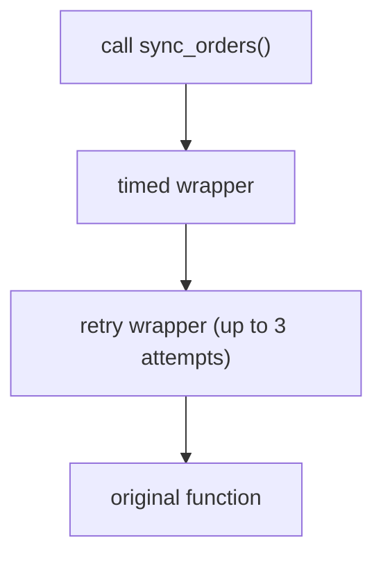

## Learning objectives

- Explain precisely what `@decorator` desugars to, and build decorators from scratch.
- Write parameterized decorators (three-layer), class-based decorators, and stacked decorators — and know the execution order.
- Use `functools.wraps` and explain what breaks without it.
- Apply the production decorator toolkit: caching, retries, timing, auth, deprecation.
- Recognize when a decorator is the wrong tool.

## Prerequisites

[Closures](/courses/python/closures-and-legb) — a decorator is a closure factory wearing syntax sugar. [Functions Deep Dive](/courses/python/functions-deep-dive) for `*args/**kwargs` pass-through.

## The core idea in one line

```python
@deco
def f(): ...
```

is *exactly*:

```python
def f(): ...
f = deco(f)
```

A decorator is **any callable that takes a callable and returns something** (usually a replacement callable). No magic — just function objects, closures, and assignment. Everything else in this lesson is engineering on top of that one line.

## Building up, step by step

### Step 1 — the identity decorator

```python
def passthrough(fn):
    return fn        # decorate with this and nothing changes
```

### Step 2 — a wrapping decorator

```python
import functools, time

def timed(fn):
    @functools.wraps(fn)                      # ← keep fn's identity
    def wrapper(*args, **kwargs):             # accept anything
        start = time.perf_counter()
        try:
            return fn(*args, **kwargs)        # delegate
        finally:
            dur = (time.perf_counter() - start) * 1000
            print(f"{fn.__name__} took {dur:.1f}ms")
    return wrapper

@timed
def slow_sum(n):
    return sum(range(n))
```

Line-by-line:

- `def timed(fn)` — receives the *function object* at decoration time (module import, usually).
- `wrapper(*args, **kwargs)` — the universal pass-through signature; the wrapper must be callable exactly like the original.
- `try/finally` — timing is recorded even if `fn` raises; the exception still propagates.
- `@functools.wraps(fn)` — copies `__name__`, `__doc__`, `__module__`, `__qualname__`, `__wrapped__`, and the signature metadata onto the wrapper.

**What breaks without `wraps`:** `slow_sum.__name__` becomes `'wrapper'`; docs, `help()`, tracebacks, pickling, and `inspect.signature` all lie; some frameworks (Flask route names, Celery task names) misregister. `wraps` also sets `__wrapped__`, letting `inspect.unwrap` reach the original. Non-negotiable in real code.

### Step 3 — decorators with arguments (three layers)

`@retry(attempts=3)` means: *call* `retry(attempts=3)` first, then use its return value as the decorator.

```python
def retry(attempts=3, exceptions=(Exception,), delay=0.1):
    def decorator(fn):                                  # layer 2: the real decorator
        @functools.wraps(fn)
        def wrapper(*args, **kwargs):                   # layer 3: runs per call
            last = None
            for attempt in range(1, attempts + 1):
                try:
                    return fn(*args, **kwargs)
                except exceptions as exc:
                    last = exc
                    if attempt < attempts:
                        time.sleep(delay * 2 ** (attempt - 1))   # exponential backoff
            raise last
        return wrapper
    return decorator

@retry(attempts=5, exceptions=(TimeoutError,))
def fetch_rates(): ...
```

Layer 1 (`retry`) runs at import; layer 2 runs immediately after with the function; layer 3 runs on every call. Keep this timeline in your head and parameterized decorators stop being confusing.

### Step 4 — stacking

```python
@timed
@retry(attempts=3)
def sync_orders(): ...
# ≡ sync_orders = timed(retry(attempts=3)(sync_orders))
```

**Application order is bottom-up** (retry wraps first), so **execution order is top-down**: `timed` starts its stopwatch, calls the retry wrapper, which calls the function up to 3 times. Order matters: `@retry` outside `@timed` would instead time each single attempt. Rule: think about which behavior should *surround* which.



### Class-based decorators

When a decorator needs rich state or extra methods, use a class with `__call__`:

```python
class CountCalls:
    def __init__(self, fn):
        functools.update_wrapper(self, fn)
        self.fn = fn
        self.count = 0

    def __call__(self, *args, **kwargs):
        self.count += 1
        return self.fn(*args, **kwargs)

@CountCalls
def ping(): ...
ping(); ping()
ping.count        # 2 — state lives on the decorator instance
```

Caveat: decorating **methods** with a class-based decorator breaks `self` binding unless you also implement `__get__` (the descriptor protocol). Function-based decorators handle methods for free — one reason they're the default choice.

### Decorators that register instead of wrap

Not every decorator replaces its target — many just *record* it:

```python
ROUTES = {}
def route(path):
    def register(fn):
        ROUTES[path] = fn
        return fn                 # unchanged!
    return register

@route("/health")
def health(): ...
```

This is how Flask routes, pytest marks, and plugin systems work — the decorator as a **registration hook** run at import time.

## The standard library's greatest hits

| Decorator | What it does |
|---|---|
| `@functools.cache` / `@lru_cache(maxsize=...)` | Memoize by arguments (hashable args only!) |
| `@functools.cached_property` | Compute once per instance, then attribute access |
| `@functools.singledispatch` | Type-based function overloading |
| `@functools.total_ordering` | Derive all comparisons from `__eq__` + one other |
| `@property`, `@staticmethod`, `@classmethod` | Descriptor-creating built-ins |
| `@contextlib.contextmanager` | Generator → context manager |
| `@dataclasses.dataclass` | A *class* decorator generating methods |

`lru_cache` deserves a warning label: caching an **instance method** keeps `self` alive in the cache (memory leak) and shares the cache across instances. Prefer `cached_property`, per-instance caches, or caching module-level functions.

## Common mistakes

1. **Forgetting `wraps`** — broken introspection, misnamed tasks/routes, unpicklable functions.
2. **Forgetting to return the wrapper** (decorator returns `None`; every decorated call explodes with `'NoneType' is not callable`).
3. **`@retry` vs `@retry()` confusion** — a three-layer decorator *must* be called; passing the function where arguments belong gives baffling errors. Defensive pattern: detect `callable(attempts)` and support both.
4. **Doing per-call work at decoration time** (opening files/connections in layer 2) — runs once at import, often before config exists.
5. **Swallowing exceptions in wrappers** (`except Exception: pass`) — decorators must be transparent by default.
6. **Decorating with heavy logic on hot paths** — a wrapper adds a call per call; a chain of five adds five.

## Best practices

- Always `functools.wraps`; always pass through `*args, **kwargs`; always re-raise by default.
- Keep decorators **single-purpose** (timing OR retrying OR auth), then compose by stacking.
- Make decorators **configurable but with sane zero-config defaults**: support `@retry` and `@retry(attempts=5)`.
- For cross-cutting concerns used everywhere (tracing, metrics), decorate at the framework boundary (middleware) instead of sprinkling hundreds of decorators.
- Test the decorator itself (with a dummy function) *and* one decorated integration path.

## Performance & memory notes

- Each wrapper layer adds roughly a function call (~50–100ns) plus tuple/dict packing — negligible for I/O code, measurable inside per-item hot loops.
- `lru_cache` lookups are C-speed dict operations; a hit is far cheaper than almost any recomputation. Size the cache (`maxsize`) for bounded memory; `maxsize=None` grows forever.
- Cached values are held strongly: caching functions returning large objects effectively pins them in RAM. `cache_clear()` exists; so do TTL caches in third-party libs (`cachetools`).
- Decoration itself happens once at import — a complex decorator costs startup time, not request time.

## Production tips

- The production decorator suite worth building once per codebase: `@timed` (metrics emit), `@retry` (with jittered exponential backoff and a capped total budget), `@deprecated(reason)` (warnings + logs), `@require_role(...)` (declarative auth checks).
- Retry decorators must retry **only idempotent operations** and only on transient exceptions (`TimeoutError`, connection errors) — never blanket `Exception`, or you'll retry `ValueError`s and duplicate payments.
- Emit metrics/logs inside `finally` so failures are measured too; include `fn.__qualname__` (thanks to `wraps`) as the metric label.
- Async needs async-aware wrappers: `async def wrapper(...): return await fn(...)`. A sync wrapper around a coroutine function silently returns an un-awaited coroutine. Detect with `inspect.iscoroutinefunction` if a decorator must support both.

## Interview questions

1. **"What is a decorator?"** — Callable taking a callable, returning a replacement; `@d` ≡ `f = d(f)`; built on first-class functions and closures.
2. **"Why `functools.wraps`?"** — Preserves identity/metadata (`__name__`, docs, signature, `__wrapped__`); without it introspection, tracebacks, and framework registration break.
3. **"How do decorators with arguments work?"** — Three layers: factory(args) → decorator(fn) → wrapper(*a, **kw); the factory is *called* first.
4. **"Order of stacked decorators?"** — Applied bottom-up, executed top-down; give the timed/retry example.
5. **"Write a memoization decorator."** — Closure with a dict keyed by `(args, frozenset(kwargs.items()))`; discuss hashability limits and compare to `lru_cache`.

## Summary

- `@deco` is assignment sugar; decorators = closures + first-class functions.
- Pattern: `wraps` + `*args/**kwargs` pass-through + `try/finally`; three layers when parameterized; registration decorators return the function unchanged.
- Stacked decorators apply bottom-up, execute top-down — order is a design decision.
- `functools` ships the classics; know `lru_cache`'s memory model before caching methods.
- Decorators shine for cross-cutting concerns; keep them transparent, single-purpose, composable.

## Exercises

**Easy**

1. Write `@shout` that uppercases a function's string return value. Verify `__name__` is preserved.
2. Write `@log_calls` printing arguments and result; confirm exceptions still propagate.

**Medium**

3. Build `@rate_limited(calls, per_seconds)` that raises `RuntimeError` when exceeded (sliding window with `collections.deque`).
4. Build `@validated` that reads type hints via `typing.get_type_hints` and raises `TypeError` on mismatched arguments (use `inspect.signature.bind`).

**Hard**

5. Build a dual-mode `@retry` usable as both `@retry` and `@retry(attempts=5)`, supporting sync *and* async functions, with jittered exponential backoff and a total-time budget.

**Debugging exercise**

6. Two bugs — find them (missing `wraps` is not one of them):

```python
def cache(fn):
    results = {}
    @functools.wraps(fn)
    def wrapper(*args, **kwargs):
        if args not in results:
            results[args] = fn(*args, **kwargs)
        return results[args]
    return wrapper
```

(kwargs are ignored in the key — `f(x=1)` and `f(x=2)` collide; unhashable args crash. Bonus: unbounded growth.)

**Refactoring exercise**

7. A codebase wraps every service function in identical try/except/log blocks. Extract a `@handled(logger)` decorator and refactor three sample functions; state precisely what behavior stayed identical.

**Mini project**

Build a mini metrics library: `@track` records call count, error count, and a latency histogram per function into a module-level registry; `report()` prints a table. Include an async-aware code path and tests for both.

## Quiz

<details>
<summary>1. What is <code>f</code> after decoration with a decorator that returns <code>None</code>?</summary>
<code>None</code> — the def'd function is immediately replaced by the decorator's return value, whatever it is.
</details>

<details>
<summary>2. When does the body of a parameterized decorator's factory layer run?</summary>
At import time, when the <code>@factory(args)</code> line executes — before any call to the function.
</details>

<details>
<summary>3. Why is <code>@lru_cache</code> on an instance method risky?</summary>
The cache keys include <code>self</code>, so every instance is held alive by the cache (leak), and one global cache is shared across instances.
</details>

<details>
<summary>4. In <code>@a</code> over <code>@b</code> over <code>def f</code>, which wrapper's code runs first on a call?</summary>
<code>a</code>'s — outermost first. Application was <code>a(b(f))</code>.
</details>

<details>
<summary>5. How does a decorated function still expose the original for tests?</summary>
Via <code>__wrapped__</code> (set by <code>functools.wraps</code>) — or <code>inspect.unwrap(f)</code> to strip all layers.
</details>

## Further reading

- `functools` docs — `wraps`, `lru_cache`, `singledispatch`, `cached_property`
- PEP 318 (function decorators), PEP 3129 (class decorators)
- The `tenacity` library — production-grade retry decorators to study
