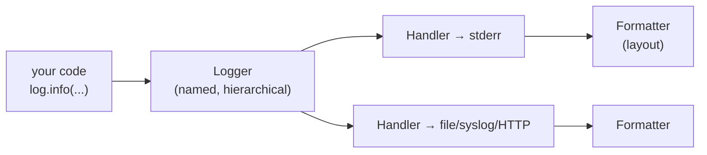

## Learning objectives

- Design exception handling that helps operators instead of hiding failures.
- Use EAFP, exception chaining, custom hierarchies, and `finally`/`else` correctly.
- Configure `logging` properly: loggers, handlers, formatters, and why `print` doesn't survive production.
- Emit structured logs and understand the pillars of observability.
- Answer interview questions on exception flow and error-handling philosophy.

## Prerequisites

General course foundations; [decorators](/courses/python/decorators) helps for the cross-cutting patterns.

## Exceptions are control flow — use them honestly

Python's philosophy is **EAFP** — *easier to ask forgiveness than permission*:

```python
# LBYL — look before you leap (racy, verbose)
if os.path.exists(path):
    f = open(path)          # file can vanish between check and open (TOCTOU)

# EAFP — pythonic
try:
    f = open(path)
except FileNotFoundError:
    handle_missing()
```

EAFP eliminates check/use races, matches how the stdlib behaves, and keeps the happy path unindented. Exceptions in Python are cheap enough to use for expected-but-exceptional flow (`KeyError`, `StopIteration` powers every `for` loop) — the "exceptions are slow" instinct is imported from other languages, though the *raising* path does cost more than an `if`; don't build per-item hot loops around raising.

### The full statement

```python
try:
    order = parse(payload)
except (KeyError, ValueError) as exc:     # catch SPECIFIC types, as a tuple
    raise InvalidOrder(f"bad payload") from exc   # chain: keep the cause
except Exception:
    log.exception("unexpected failure parsing order")   # logs traceback
    raise                                  # re-raise — don't swallow
else:
    metrics.incr("orders.parsed")          # runs only if NO exception
finally:
    release_buffer()                       # runs ALWAYS — cleanup only
```

Rules encoded above:

- **Catch the narrowest types you can handle.** Bare `except:` even catches `KeyboardInterrupt`/`SystemExit`; `except Exception` is the widest defensible net, and only at boundaries.
- **`raise ... from exc`** chains exceptions: the traceback shows both the domain error and the underlying cause. Translating low-level exceptions into domain exceptions at layer boundaries — with chaining — is a hallmark of maintainable services. (`from None` deliberately suppresses the cause; rare.)
- **A bare `raise`** re-raises the current exception with its original traceback — the correct way to "log and propagate".
- **`else`** separates "the risky operation" from "what follows on success", keeping the `try` block minimal.
- **`finally`** is for cleanup — and prefer context managers (`with`) over hand-written finallys; that's what they're for.

### Custom hierarchies

```python
class AppError(Exception):
    """Base for all expected application errors."""

class NotFound(AppError): ...
class Conflict(AppError): ...
class UpstreamTimeout(AppError):
    def __init__(self, service: str, timeout_s: float):
        super().__init__(f"{service} timed out after {timeout_s}s")
        self.service = service
        self.timeout_s = timeout_s
```

One base class per application/library lets callers choose granularity: `except NotFound` / `except AppError` / let it crash. Attach structured data as attributes (not just message text) — handlers can then map `NotFound → 404`, `Conflict → 409` mechanically ([FastAPI](/courses/fastapi/architecture-testing-deployment) and [Django](/courses/django/drf-apis) both formalize this).

**Where to handle:** as low as you can *act* (retry a timeout at the call site), as high as you must *decide* (one boundary handler converts uncaught errors to 500s + logs). Everything between should mostly let exceptions fly — the try/except-on-every-function style produces code that can't crash *and* can't be debugged.

## Logging: the operator's API

`print` writes an unstructured line to stdout with no level, timestamp, source, or routing. `logging` gives you all four, controlled at runtime without code changes.

The model — four cooperating pieces:



- **Logger** — named entry point; names form a dot-hierarchy (`app.billing.stripe` propagates up to `app`). Always `log = logging.getLogger(__name__)` — per-module loggers for free.
- **Level** — DEBUG (diagnosis detail), INFO (normal operations narrative), WARNING (surprising but handled), ERROR (operation failed), CRITICAL (process-level failure). Levels filter at both logger and handler.
- **Handler** — where records go (console, rotating file, syslog, HTTP shipper).
- **Formatter** — how a record renders.

```python
# once, at application entry point — NEVER in libraries:
logging.basicConfig(
    level=logging.INFO,
    format="%(asctime)s %(levelname)s %(name)s: %(message)s",
)

log = logging.getLogger(__name__)

log.info("payment captured order_id=%s amount=%d", order_id, amount)
log.exception("charge failed")     # inside except: message + full traceback
```

Three habits that mark production experience:

1. **Configure only at the entry point.** Libraries just `getLogger(__name__)` and log; the *application* decides levels/destinations. A library calling `basicConfig` is a bug.
2. **Lazy formatting**: `log.debug("state=%s", big_obj)` — the string only formats if DEBUG is enabled; the f-string version pays the cost always.
3. **`log.exception(...)` (or `error(..., exc_info=True)`) inside handlers** — a traceback you didn't log is an incident you can't diagnose.

### Structured logging

Grep-era logs are strings; observability-era logs are **events with fields**:

```python
log.info("order.placed", extra={"order_id": o.id, "user_id": u.id, "total": o.total})
```

With a JSON formatter (e.g. `python-json-logger`, or structlog as the ergonomic layer), each record becomes `{"event": "order.placed", "order_id": 123, ...}` — filterable, aggregatable, joinable in your log platform. Attach request-scoped context (request id, user id) once per request via `contextvars` (async-safe, unlike thread-locals) so every log line in a request carries correlation ids automatically.

Logs are one pillar of **observability**; the other two: **metrics** (cheap aggregates — request rates, latency histograms, error counts — for dashboards and alerts) and **traces** (per-request timing trees across services — OpenTelemetry). Logs tell you *what happened in detail*, metrics tell you *how much/how fast*, traces tell you *where the time went*.

## Common mistakes

1. **`except Exception: pass`** — the error black hole. If you truly must ignore, `contextlib.suppress(SpecificError)` at least names the intent.
2. **Catching too early/too broadly** — converting every exception to `None` return values pushes failures downstream where they're mystifying.
3. **Losing the cause** — `raise NewError(str(exc))` without `from exc` destroys the traceback chain.
4. **Logging *and* re-raising at every layer** — the same error appears five times; log where handled (once), propagate silently otherwise.
5. **`print` debugging left in services**, or logging secrets/PII (tokens, passwords, card numbers) — a compliance incident via `grep`.
6. **Control flow via broad exceptions** — `try: x = d["a"]["b"]["c"] except Exception:` hides typos and real failures alike.
7. **Duplicate log lines** — handlers added repeatedly (notebooks, re-imports) or propagate+root both handling; fix configuration, don't `propagate = False` reflexively.

## Best practices

- Fail fast and loudly on programmer errors; handle gracefully only what you can genuinely recover from.
- Design an exception hierarchy per service; translate at boundaries with chaining; map to HTTP codes in one place.
- Make messages actionable: include identifiers (`order_id=…`) and the attempted operation, not just "error occurred".
- INFO should narrate the business ("user registered", "export finished rows=5301"), DEBUG the mechanics; a person reading INFO logs should follow the story.
- Configure logging from environment (level, JSON on/off) — the same build must be verbose in staging and quiet in prod.
- Test error paths explicitly: `pytest.raises`, plus asserting log output with `caplog` where logs are the contract.

## Performance & memory notes

- A suppressed-by-level log call still costs a function call and arg evaluation — with %-style lazy args that's nanoseconds; guard truly expensive prep with `if log.isEnabledFor(logging.DEBUG):`.
- Raising is ~10× the cost of a taken `if` branch, and try/except entry is nearly free when nothing raises — structure hot paths so exceptions are exceptional.
- Tracebacks hold frames → frames hold locals → big locals stay alive while the exception is referenced; storing exceptions long-term (error collections) pins memory; keep `repr(exc)` instead.
- Synchronous handlers block: a file handler on slow disk or an HTTP handler shipping logs inline adds that latency to *requests*. Use `QueueHandler`/`QueueListener` to make logging async to your request path.

## Production tips

- **Log to stdout/stderr in containers**; let the platform (Docker, k8s) collect and ship. File rotation inside containers is legacy practice.
- One uncaught-exception boundary per process: web frameworks give you it (exception handlers/middleware); for workers, wrap the job loop; also `sys.excepthook`/`asyncio` exception handler for the truly unexpected — plus an error tracker (Sentry-class) capturing stack + context automatically.
- Alert on **rates** (error % over window), not single occurrences; page on symptoms (SLO burn), not every ERROR line.
- Include a request/correlation id in every log line and propagate it to downstream calls — the single highest-value observability habit; distributed debugging without it is archaeology.

## Interview questions

1. **"EAFP vs LBYL?"** — Try-and-catch vs check-first; EAFP avoids TOCTOU races and is idiomatic; know when LBYL still reads better (cheap, non-racy validations).
2. **"What does `finally` guarantee, and what's `else` for?"** — Always-runs cleanup (even on return/raise); `else` runs only on success, keeping `try` minimal.
3. **"Explain `raise X from Y`."** — Explicit chaining: preserves the causal traceback (`__cause__`) across abstraction boundaries; `from None` suppresses.
4. **"Why is `except: pass` bad, and when is suppressing OK?"** — Hides all failures incl. system exits; OK only for named, expected, truly-ignorable errors (`contextlib.suppress(FileNotFoundError)` on cleanup).
5. **"Design logging for a web service."** — Per-module loggers, entry-point config, JSON structured output to stdout, request-id via contextvars, exception boundary with `log.exception`, levels from env.

## Summary

- Catch narrowly, act where you can, decide at one boundary; chain causes across layers; `finally`/context managers own cleanup.
- Custom hierarchies with structured attributes turn errors into API responses mechanically.
- `logging` = loggers → handlers → formatters, configured once at the entry point; lazy args; `log.exception` in handlers.
- Structured JSON logs + correlation ids + metrics + traces = you can debug production; anything less = guessing.

## Exercises

**Easy**

1. Write `read_config(path)` that raises `ConfigError` (chained) for missing file and invalid JSON, distinguishable by subclass.
2. Set up `basicConfig` with a format including module name and line number; log at all five levels from two modules and observe hierarchy names.

**Medium**

3. Build the `AppError` hierarchy above plus a `to_http()` mapping function; unit-test that unknown exceptions map to 500 and known ones to their codes.
4. Add a JSON formatter (hand-rolled `logging.Formatter` subclass emitting `json.dumps` of a dict) and a `contextvars`-based request-id filter; demonstrate two simulated "requests" with interleaved logs staying correctly tagged.

**Hard**

5. Implement `@boundary(logger)` — a decorator for worker entry points that logs unhandled exceptions once with full context (function, args repr truncated, duration), increments an error counter, and re-raises; async-aware.

**Debugging exercise**

6. Ops reports "the export silently produces empty files sometimes." Explain how each marked line contributes, then fix:

```python
def export(rows, path):
    try:
        f = open(path, "w")
        for r in rows:
            try:
                f.write(serialize(r))
            except Exception:
                pass                    # ← A
    except Exception as e:
        print("error", e)               # ← B
    finally:
        try: f.close()
        except: pass                    # ← C
```

**Refactoring exercise**

7. Take a module where every function does `try/except Exception: log.error(...); return None` and callers check for `None`. Refactor to: exceptions propagate, one boundary handler, `Optional` only where absence is a *domain* concept. Compare traceback quality before/after with an injected bug.

**Mini project**

Build a resilient URL checker CLI: reads URLs from a file; per-URL — timeout, retry-on-timeout (with backoff), specific exception classes for DNS vs HTTP-status vs timeout failures; JSON-structured logs to stderr, human summary table to stdout; exit code 1 if any hard failures. This exercises hierarchies, chaining, logging config, and boundary design in ~120 lines.

## Quiz

<details>
<summary>1. A <code>return</code> inside <code>try</code> and a <code>return</code> inside <code>finally</code> — what wins?</summary>
The <code>finally</code> return wins — and it also silently swallows any in-flight exception. Never <code>return</code>/<code>break</code> inside <code>finally</code>.
</details>

<details>
<summary>2. Difference between <code>__cause__</code> and <code>__context__</code>?</summary>
<code>__cause__</code>: explicit chain via <code>raise ... from</code>. <code>__context__</code>: implicit — the exception that was already active when a new one was raised (the "during handling..." traceback).
</details>

<details>
<summary>3. Why <code>log.debug("x=%s", x)</code> rather than <code>log.debug(f"x={x}")</code>?</summary>
The %-args version defers formatting until the record is known to pass level filters; the f-string formats unconditionally.
</details>

<details>
<summary>4. Where may <code>logging.basicConfig</code> be called, and why?</summary>
Only in the application entry point — configuration is the app's decision; a library configuring global logging hijacks every other component's output.
</details>

<details>
<summary>5. What's wrong with alerting on every ERROR log line?</summary>
Noise: transient blips page humans; alert on error <em>rates/SLO burn</em> over windows, keep single errors for dashboards and debugging.
</details>

## Further reading

- Python docs — Logging HOWTO + Logging Cookbook (both, fully)
- PEP 3134 (exception chaining), PEP 654 (exception groups / `except*`)
- structlog documentation (even if you don't adopt it, the concepts are the curriculum)
- Google SRE book — chapters on monitoring and alerting philosophy
