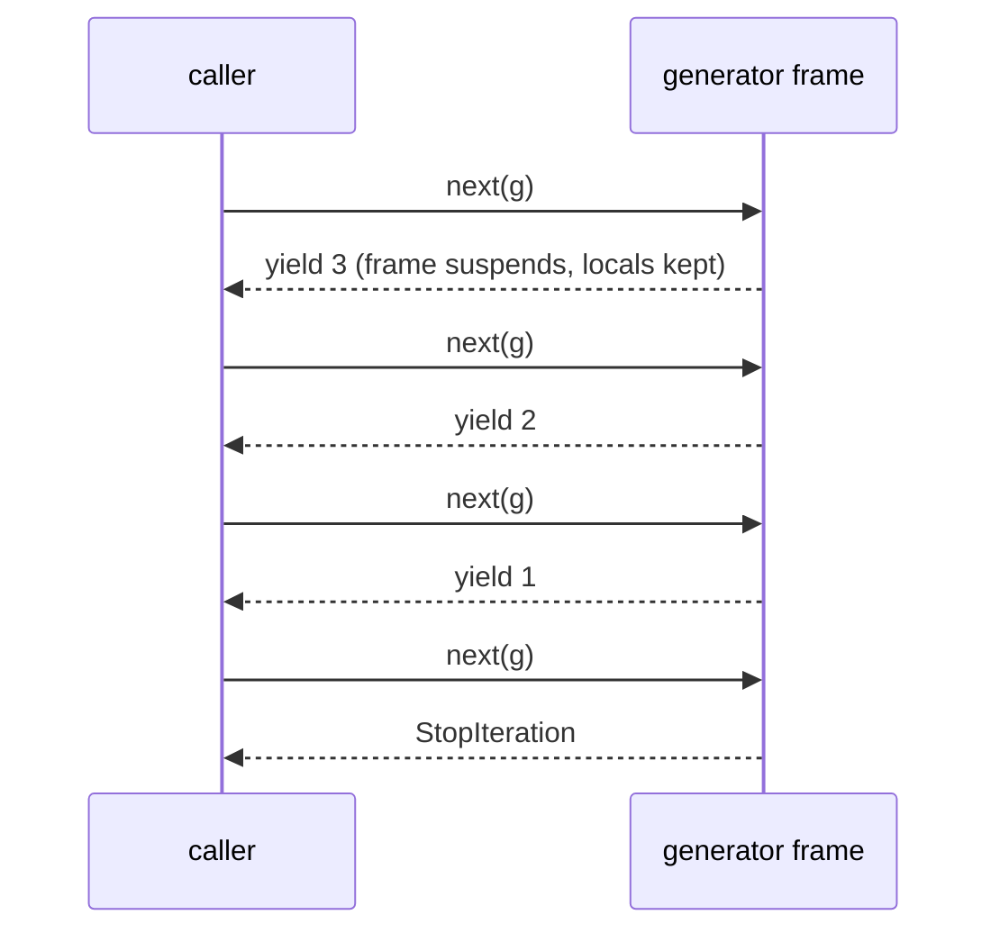

## Learning objectives

- Implement the iterator protocol (`__iter__`/`__next__`) by hand and explain how `for` uses it.
- Distinguish iterables, iterators, and generators precisely.
- Write generator functions and expressions, and reason about their suspended-frame mechanics.
- Compose lazy pipelines that process gigabytes in constant memory.
- Use `yield from`, generator `close`, and the essential `itertools` toolkit.

## Prerequisites

[Functions Deep Dive](/courses/python/functions-deep-dive); comfort with `for`, lists, and files.

## The iterator protocol

Every `for` loop is sugar over two dunder calls:

```python
for item in xs:
    process(item)

# is exactly:
_it = iter(xs)              # xs.__iter__()  → an iterator
while True:
    try:
        item = next(_it)    # _it.__next__() → next value
    except StopIteration:   # the protocol's "done" signal
        break
    process(item)
```

**Definitions that must be crisp:**

- **Iterable** — anything `iter()` accepts: has `__iter__` (or `__getitem__` with int indexes). Lists, dicts, strings, files, ranges.
- **Iterator** — has `__next__` *and* `__iter__` returning itself. It is a *cursor*: one-shot, stateful, exhaustible.

A list is iterable but **not** an iterator — `iter(lst)` makes a fresh cursor each time, which is why you can loop a list twice. An iterator returns itself from `__iter__`, which is why you *can't* loop it twice:

```python
it = iter([1, 2, 3])
list(it)    # [1, 2, 3]
list(it)    # []  — exhausted; a silent, classic bug
```

A hand-rolled iterator shows all the moving parts:

```python
class Countdown:
    def __init__(self, start):
        self.current = start
    def __iter__(self):
        return self                 # "I am my own cursor"
    def __next__(self):
        if self.current <= 0:
            raise StopIteration
        self.current -= 1
        return self.current + 1
```

This works — and nobody writes it, because generators generate all of this for you.

## Generators: iterators without the boilerplate

A function containing `yield` becomes a **generator function**. Calling it runs *no body code*; it returns a **generator object** implementing the full iterator protocol:

```python
def countdown(start):
    while start > 0:
        yield start          # emit a value, SUSPEND here
        start -= 1

g = countdown(3)             # nothing ran yet
next(g)                      # runs to first yield → 3
next(g)                      # resumes after yield → 2
```

Mechanically: the generator holds a **suspended frame** — all locals, plus the exact bytecode position. `next()` resumes execution until the next `yield` (value emitted, frame suspends) or the function returns (raises `StopIteration`). It's cooperative single-function multitasking — and literally the machinery `async`/`await` was built on ([asyncio lesson](/courses/python/asyncio-fundamentals)).



### Generator expressions

`(x * x for x in xs if x > 0)` — comprehension syntax, lazy semantics. Feed them straight into consumers without brackets: `sum(x*x for x in xs)`, `max(len(line) for line in f)`, `any(u.is_admin for u in users)` (short-circuits!).

**List comprehension vs genexp** is a memory decision: `[...]` materializes everything now (re-iterable, indexable, has `len`); `(...)` produces on demand (constant memory, one-shot). For a 10-million-row aggregation, the genexp wins massively; for a 10-item list you'll reuse, build the list.

### Pipelines — the killer feature

Generators compose into **streaming pipelines** where each stage pulls from the previous one item at a time:

```python
def read_lines(path):
    with open(path) as f:            # file closed when generator is GC'd/closed
        yield from f

def parse(lines):
    for line in lines:
        if line.strip() and not line.startswith("#"):
            yield line.rstrip("\n").split(",")

def to_records(rows):
    for cols in rows:
        yield {"ts": cols[0], "level": cols[1], "msg": cols[2]}

errors = (r for r in to_records(parse(read_lines("app.log")))
          if r["level"] == "ERROR")
for rec in errors:                   # ONE line in memory at a time
    print(rec["msg"])
```

A 50GB log file streams through this in a few kilobytes of memory. Each stage is independently testable (feed it a list) and reusable. This is the idiomatic Python answer to "ETL without a framework".

### `yield from`

`yield from sub` delegates to a sub-iterable: yields all its values, forwards `send`/`throw`, and evaluates to the subgenerator's `return` value. Use it for flattening and for splitting big generators into named stages:

```python
def walk(node):
    yield node.value
    for child in node.children:
        yield from walk(child)        # recursive tree traversal, lazily
```

### Cleanup: `close()` and `try/finally`

A generator's `finally` blocks run when it's exhausted, `close()`d, or garbage-collected. If a generator holds a resource (open file, DB cursor) and might not be fully consumed, close it deterministically — `contextlib.closing(gen)` or an explicit `try/finally` in the consumer. Relying on GC-time cleanup is nondeterministic (and PyPy makes it worse).

## The itertools toolkit

The stdlib's lazy building blocks — all C-speed, all constant-memory:

| Tool | Use |
|---|---|
| `islice(it, 10)` | take/skip without materializing (`it[start:stop]` for iterators) |
| `chain(a, b)` | concatenate streams |
| `batched(it, n)` (3.12+) | fixed-size chunks — DB inserts, API batching |
| `groupby(sorted_it, key)` | group **consecutive** items (sort first!) |
| `takewhile` / `dropwhile` | prefix/suffix by predicate |
| `count`, `cycle`, `repeat` | infinite streams (pair with `islice`) |
| `tee(it, 2)` | split one stream into two (buffers the gap!) |
| `product`, `permutations`, `combinations` | combinatorics without nested loops |

`groupby` is the classic trap: it groups *adjacent* equal keys only. Unsorted input → fragmented groups.

## Common mistakes

1. **Iterating an exhausted iterator** — second loop silently does nothing. If you need two passes, materialize (`list()`) or recreate.
2. **`groupby` on unsorted data** (above).
3. **Assuming `len()`/indexing works on generators** — they're not sequences; use `islice`, or materialize.
4. **Leaking resources in half-consumed generators** — the `with open(...)` inside a generator only exits when the generator finishes or is closed.
5. **Yield inside `except` swallowing intent** — a `StopIteration` raised *inside* a generator body becomes `RuntimeError` (PEP 479); return instead of raising `StopIteration` manually.
6. **`tee` on divergent consumers** — if one branch runs far ahead, the buffered gap grows unboundedly; `tee` is not free fan-out.

## Best practices

- **Accept iterables, return iterators** in data-processing APIs — callers choose when/whether to materialize.
- Name pipeline stages as small generator functions; compose in one obvious place.
- Put filters as **early** in the pipeline as possible — every later stage does less work.
- Use genexps for feed-into-aggregate one-liners; use listcomps when you need reuse/`len`/indexing.
- For chunked I/O (bulk inserts), `itertools.batched` (or a 5-line equivalent) is the pattern.

## Performance & memory notes

- Memory is the headline: a list of 10M small ints ≈ 400MB (pointers + objects); the equivalent generator ≈ 200 bytes. Streaming turns "OOM-killed" into "works".
- Per-item overhead: each `next()` resumes a frame — genexps are usually a bit *slower per item* than listcomps when everything fits in RAM. If the dataset is small and hot, the list can be faster; measure.
- Short-circuiting with `any`/`all`/`next(filtered_gen, default)` on a generator stops the *entire upstream pipeline* early — a huge win lists can't give you.
- Generators keep their frame (locals) alive while suspended — a suspended generator holding a big buffer holds that memory until closed.

## Production tips

- **Streaming HTTP/DB**: `csv.reader(f)`, database server-side cursors (`.stream_results` in SQLAlchemy, `iterator()` in Django ORM), and boto3 paginators are all iterator APIs — pipe them through generator stages rather than `list()`-ing.
- Web frameworks stream responses from generators (`StreamingResponse` in FastAPI, `StreamingHttpResponse` in Django) — constant-memory CSV/NDJSON exports.
- Add a `progress` passthrough stage (`for i, x in enumerate(it): if i % 10_000 == 0: log(...); yield x`) — free observability for long pipelines.
- Backpressure comes free: pull-based pipelines only produce as fast as the consumer consumes. The moment you buffer into queues/lists, *you* own backpressure.

## Interview questions

1. **"Iterable vs iterator?"** — Iterable: has `__iter__` producing an iterator; iterator: has `__next__` + returns itself from `__iter__`; iterators are one-shot cursors.
2. **"What happens when you call a generator function?"** — Nothing executes; you get a generator object with a suspended frame; `next()` drives it between yields.
3. **"Generator vs list comprehension — when each?"** — Lazy constant-memory one-shot vs eager reusable sequence; choose by data size, reuse, and short-circuit needs.
4. **"How does `for` terminate?"** — Catches `StopIteration` from `__next__`.
5. **"What does `yield from` add over a loop of yields?"** — Delegation: forwards `send`/`throw`/`close` and captures the subgenerator's return value — plus clarity.

## Summary

- `for` = `iter()` + repeated `next()` + `StopIteration`; iterables produce cursors, iterators *are* cursors.
- Generators build iterators from suspended frames; genexps inline the same idea.
- Pipelines of small generator stages process unbounded data in constant memory with early termination and free backpressure.
- `itertools` supplies the C-speed combinators; know `islice`, `chain`, `batched`, `groupby` (sorted!), `tee` (buffered!).
- Materialize deliberately, not by habit.

## Exercises

**Easy**

1. Write generator `evens(limit)` and confirm with `next()` that no body code runs before the first `next`.
2. Rewrite `[int(x) for x in open("nums.txt")]` into a fully-lazy sum, closing the file deterministically.

**Medium**

3. Build `chunked(it, n)` (without `itertools.batched`), yielding lists of ≤ n items; test edge cases (empty, exact multiple).
4. Write a pipeline over a generated fake access-log iterable: parse → filter 5xx → extract path → top-10 counts (`collections.Counter` over a genexp).

**Hard**

5. Implement `merge_sorted(*iterables)` lazily merging pre-sorted streams (compare with `heapq.merge` afterwards). Constant memory, any number of inputs.

**Debugging exercise**

6. This "works" in tests but returns zero rows in production the second time it's called per request. Explain and fix:

```python
def get_rows(cursor):
    rows = (normalize(r) for r in cursor)
    validate(rows)          # iterates!
    return rows             # now exhausted
```

**Refactoring exercise**

7. Refactor a 60-line function that reads a whole CSV into a list, then filters into a second list, then transforms into a third — into three generator stages plus one consumer. State the memory change for a 5GB input.

**Mini project**

Build `tail -f` in Python: a generator `follow(path)` that yields new lines as they're appended (poll with `time.sleep`), piped into stages `grep(pattern, lines)` and `alert_on(lines, threshold_per_minute)`. Demonstrate Ctrl-C cleanly closes the pipeline (`finally` blocks run).

## Quiz

<details>
<summary>1. <code>g = (x for x in range(3)); 1 in g; list(g)</code> — result of the last call?</summary>
<code>[2]</code> — the membership test consumed 0 and 1 (stopping at the match), leaving only 2. Iterators are shared state.
</details>

<details>
<summary>2. Why can you loop a dict twice but a file object needs reopening (or seek)?</summary>
Dicts are iterables producing fresh iterators per loop; file objects are their own iterator (one cursor into the OS file position).
</details>

<details>
<summary>3. What does a bare <code>return 42</code> inside a generator do?</summary>
Stops iteration; the value rides inside <code>StopIteration.value</code> and becomes the result of <code>yield from</code> in a delegating generator.
</details>

<details>
<summary>4. When do the <code>finally</code> blocks inside a generator run?</summary>
On exhaustion, on explicit <code>close()</code> (which throws GeneratorExit inside), or at garbage collection — the last being nondeterministic.
</details>

<details>
<summary>5. You need the 100 largest of 10⁹ streamed numbers. Approach?</summary>
<code>heapq.nlargest(100, stream)</code> — a bounded heap over a lazy stream: O(n log 100) time, O(100) memory. Never sort or materialize.
</details>

## Further reading

- `itertools` docs — including the "recipes" section (read all of it once)
- PEP 255 (generators), PEP 380 (`yield from`), PEP 479
- David Beazley — "Generator Tricks for Systems Programmers" (legendary)
