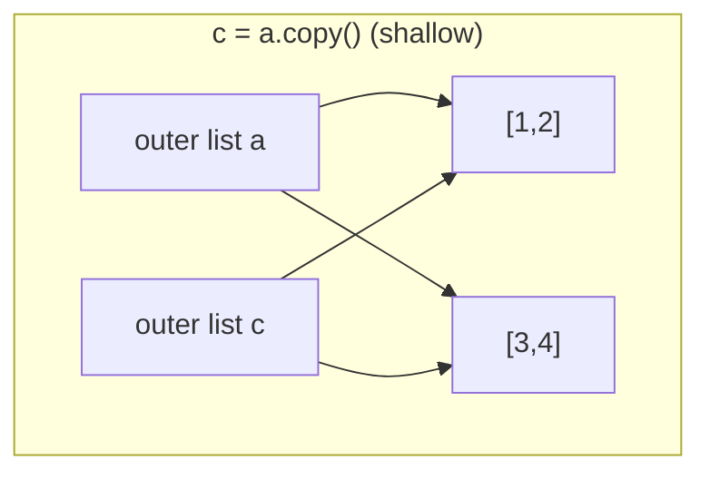

## Learning objectives

- Classify every built-in type as mutable or immutable and explain the consequences of each.
- Diagnose aliasing bugs on sight — including the infamous mutable default argument.
- Choose correctly between assignment, shallow copy, and deep copy.
- Explain hashability, why dict keys must be (effectively) immutable, and what `__hash__` has to do with `__eq__`.
- Design function signatures and data structures that make aliasing bugs impossible.

## Prerequisites

[Variables, Objects, and References](/courses/python/variables-objects-references) — this lesson is a direct continuation: aliasing only bites when the shared object is *mutable*.

## The type landscape

| Immutable | Mutable |
|---|---|
| `int`, `float`, `complex`, `bool` | `list` |
| `str`, `bytes` | `dict` |
| `tuple`, `frozenset` | `set`, `bytearray` |
| `range`, `NoneType` | most user-defined classes |

Immutability means **the object's value can never change after creation**. Every "modifying" string operation returns a new object. This buys three things:

1. **Safe sharing.** Any number of names, threads, or callers can hold an immutable object with zero risk.
2. **Hashability.** A hash must stay stable for the object's lifetime; only values that can't change can promise that (see below).
3. **Reasoning.** A function receiving a tuple *cannot* corrupt your data.

The subtlety: **immutability is shallow.** A tuple's *slots* are frozen; the objects in those slots keep their own nature:

```python
t = ([1, 2], "x")
t[0].append(3)      # fine!  t is now ([1, 2, 3], "x")
t[0] = [9]          # TypeError — the slot can't be rebound
```

## The mutable default argument trap

The most famous Python bug, and a direct consequence of the execution model: **default values are evaluated once, at `def` time, and stored on the function object.**

```python
def add_item(item, bucket=[]):     # ONE list, created at def time
    bucket.append(item)
    return bucket

add_item(1)   # [1]
add_item(2)   # [1, 2]   ← the same list, shared across calls
```

You can see the shared object: `add_item.__defaults__` → `([1, 2],)`. The fix is the sentinel idiom:

```python
def add_item(item, bucket=None):
    if bucket is None:
        bucket = []                # fresh list per call
    bucket.append(item)
    return bucket
```

The same trap applies to `{}`, `set()`, and — nastier — *computed* defaults like `when=datetime.now()` (frozen at import time, so every call gets the server's boot time). Any mutable or time-dependent default must be `None` + guard.

## Shallow vs deep copy

Three ways to "copy", three different results:

```python
import copy

a = [[1, 2], [3, 4]]
b = a                  # no copy: alias
c = a.copy()           # shallow: new outer list, SAME inner lists
d = copy.deepcopy(a)   # deep: everything duplicated recursively

a[0].append(99)
# b[0] → [1, 2, 99]   (alias sees everything)
# c[0] → [1, 2, 99]   (shallow copy shares inner objects!)
# d[0] → [1, 2]       (fully independent)
```



Equivalent shallow copies: `list(a)`, `a[:]`, `dict(d)`, `d.copy()`, `set(s)`. Since 3.3, `copy.replace()`/dataclasses' `dataclasses.replace()` give you "copy with changes" for records.

**When to use which:**

| Situation | Tool |
|---|---|
| Flat list/dict of immutables | shallow copy — cheap and fully safe |
| Nested structure you'll mutate | `deepcopy`, or better: restructure to avoid the need |
| Config/record objects | frozen dataclass + `dataclasses.replace` |
| Huge nested data | avoid deepcopy (slow, memory-doubling); redesign with immutable pieces |

`deepcopy` is expensive: it walks the whole graph, maintains a memo dict to preserve shared/cyclic structure, and can choke on objects holding sockets, locks, or DB connections. In services, needing `deepcopy` is usually a design smell — prefer building new values.

## Hashability

An object is hashable if it has a `__hash__` that never changes and an `__eq__` consistent with it. **Contract: `a == b` ⇒ `hash(a) == hash(b)`.** Dicts and sets locate items by hash bucket first, then confirm with `==`; if equal objects hashed differently, lookups would miss.

- Mutable built-ins (`list`, `dict`, `set`) are unhashable — their value can change, which would silently corrupt any hash table containing them.
- `tuple` is hashable **iff** all elements are.
- A user class is hashable by default (identity hash). If you define `__eq__` without `__hash__`, Python sets `__hash__ = None` — instances become unhashable, on purpose.
- `@dataclass(frozen=True, eq=True)` generates a correct pair for you.

```python
key = (user_id, tuple(sorted(roles)))   # listy data made hashable
cache[key] = result
```

## Common mistakes

1. **`def f(x, acc=[])`** — shared default. Use `None` + guard.
2. **`row = [[0] * 3] * 3`** — the outer `*` copies *references*: three names for one row. `row[0][0] = 1` changes "every row". Correct: `[[0] * 3 for _ in range(3)]`. (`[0] * 3` itself is fine — ints are immutable.)
3. **Returning internal mutable state.** `def get_items(self): return self._items` hands callers a live handle to your internals. Return a copy or an immutable view (`tuple(self._items)`).
4. **Shallow-copying nested config** then mutating a nested dict — both copies change. Deep-copy or freeze.
5. **Mutating a list while iterating it** (`for x in lst: lst.remove(x)`) — skips elements. Iterate a copy or build a new list.
6. **Using a mutable object as a dict key** via a custom class whose `__hash__` depends on mutable fields — the entry becomes unfindable after mutation.

## Best practices

- **Default to immutable interfaces.** Accept `Sequence`/`Mapping` (read-only protocols) instead of `list`/`dict` in signatures; return tuples for fixed collections.
- **Frozen dataclasses for records:**

```python
from dataclasses import dataclass, replace

@dataclass(frozen=True, slots=True)
class Money:
    amount: int          # minor units
    currency: str

price = Money(1000, "USD")
discounted = replace(price, amount=900)   # copy-with-change, original intact
```

- **Don't mutate arguments** unless the function's entire purpose is in-place mutation (and its name says so, like `list.sort` vs `sorted`).
- **`MappingProxyType`** gives a read-only *view* of a dict — great for exposing config without copying.
- Prefer building new collections (comprehensions) over surgically mutating shared ones; it eliminates aliasing reasoning entirely.

## Performance & memory notes

- Immutability trades safety for allocation: string `+=` in a loop is O(n²) — collect parts and `"".join`. Same logic favors `bytearray` for binary assembly.
- Shallow copies of an n-element list are O(n) pointer copies — cheap. `deepcopy` is O(total graph size) with high constants (memo dict, recursion) — often 50–100× slower than a shallow copy.
- Tuples are smaller than lists (no over-allocation for growth) and the compiler can build constant tuples at compile time.
- CPython caches small ints and interned strings, so immutables are shared aggressively behind the scenes — free memory savings you get only with immutable types.

## Production tips

- Aliasing bugs in production look like "data corrupts randomly under load" — two request handlers sharing a module-level mutable (a dict of defaults, a list used as scratch space). **Module-level mutable state must be either immutable, per-request, or lock-protected.**
- Celery/RQ task arguments get serialized, which *hides* aliasing locally but not in eager/test mode — another reason not to pass mutables you plan to mutate.
- Config objects should be frozen at startup (frozen dataclass / pydantic model with `model_config = ConfigDict(frozen=True)`); "mysteriously changing config" is a real and miserable class of incident.

## Interview questions

1. **"What will `def f(a, b=[])` do across calls, and why?"** — Shared single default list created at def time; classic. Give the `None` sentinel fix.
2. **"Difference between shallow and deep copy?"** — New outer container sharing inner objects vs full recursive duplication (with cycle handling via memo).
3. **"Why can't a list be a dict key?"** — Its value (and therefore any value-based hash) can change, which would corrupt the hash table's invariants; lists define no `__hash__`.
4. **"Is a tuple always hashable?"** — No: only if every element is hashable. `([1], 2)` raises `TypeError` on `hash()`.
5. **"You define `__eq__` on a class — what happens to hashing?"** — `__hash__` becomes `None`; instances are unhashable until you define a consistent `__hash__` (or use `frozen=True` dataclasses).

## Summary

- Mutability + aliasing is where Python bugs live; immutables are safe to share, mutables are not.
- Defaults evaluate once at `def` time → the mutable default trap; use `None` sentinels.
- Shallow copy duplicates one level; deep copy duplicates the graph; both are tools, not defaults — often the right answer is *don't share mutables at all*.
- Hashability requires stable value: `__eq__`/`__hash__` must agree; frozen dataclasses do it right for free.

## Exercises

**Easy**

1. Without running it, write the output: `x = [1, 2]; y = x[:]; y.append(3); x[0] = 9; print(x, y)`.
2. Make an "immutable point": a frozen, slotted dataclass with two floats; verify it's hashable and usable as a dict key.

**Medium**

3. Write `deep_freeze(obj)` converting nested list/dict/set structures into tuple/`MappingProxyType`/frozenset equivalents, recursively.
4. Demonstrate the `[[0]*3]*3` bug with a 3×3 grid, then write a property-based check (loop over all cells) proving your fixed version is fully independent.

**Hard**

5. Implement a `Snapshot` context manager: `with Snapshot(cfg) as s:` lets code mutate `cfg` (a nested dict), but restores it exactly on exception. Decide — and defend — shallow vs deep snapshotting.

**Debugging exercise**

6. Users report that *new* shopping carts sometimes already contain items. Find the two bugs:

```python
class Cart:
    def __init__(self, items=[]):
        self.items = items

    def merged_with(self, other):
        self.items += other.items    # "merge" that mutates self
        return self
```

**Refactoring exercise**

7. Refactor `merged_with` into a pure method returning a new `Cart`, and the constructor to the sentinel idiom. Explain why `+=` on a list here was worse than `+`.

**Mini project**

Build an "undo stack" for a nested settings dict: `set(path, value)`, `undo()`, `redo()`. Store *reverse deltas* (path + old value) instead of deep copies; write tests that prove no operation aliases live state into history.

## Quiz

<details>
<summary>1. <code>t = (1, [2, 3])</code>. What do <code>t[1] += [4]</code> and the resulting <code>t</code> do?</summary>
It raises <code>TypeError</code> (can't assign into a tuple slot) — but the list <em>is still mutated</em> first, so <code>t</code> becomes <code>(1, [2, 3, 4])</code>. <code>+=</code> mutates via <code>__iadd__</code>, then attempts the (illegal) store back.
</details>

<details>
<summary>2. When is a shallow copy completely safe?</summary>
When every element is immutable (or you'll never mutate elements) — the outer container is independent and inner sharing can't be observed.
</details>

<details>
<summary>3. Why is <code>when=datetime.now()</code> as a default argument broken?</summary>
Defaults are evaluated once at function definition (import) time, so every call sees the module's import timestamp.
</details>

<details>
<summary>4. What invariant links <code>__eq__</code> and <code>__hash__</code>?</summary>
Equal objects must have equal hashes; otherwise hash-based containers can't find items that compare equal.
</details>

<details>
<summary>5. Your function receives a dict and needs to try modifications safely. Cheapest correct approach?</summary>
Work on <code>dict(d)</code> if values are immutable (shallow suffices); deep-copy only the nested parts you'll touch — or build a new dict and never mutate at all.
</details>

## Further reading

- `copy` module docs (including `__copy__`/`__deepcopy__` customization)
- Python docs: "Why are default values shared between objects?" (FAQ)
- Hettinger's talks on dataclasses; `types.MappingProxyType`
