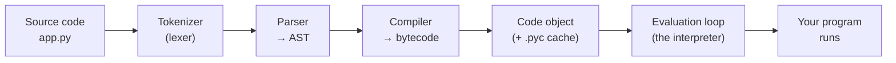

## Learning objectives

By the end of this lesson you will be able to:

- Describe every stage CPython goes through between `python app.py` and your first line of output.
- Explain why calling Python "an interpreted language" is technically wrong — and what it actually is.
- Read bytecode with the `dis` module and use it to reason about performance.
- Explain what `.pyc` files and `__pycache__` are, when they are used, and when they are ignored.
- Answer interview questions about compilation, interpretation, and Python startup.

## Prerequisites

You can write and run Python functions and modules. No internals knowledge is assumed — this lesson *is* the internals introduction that the rest of the course builds on.

## Why this matters

Most "weird" Python behaviors — mutable default arguments, late-binding closures, why a list comprehension beats a `for` loop, why function-local variables are faster than globals — stop being weird the moment you know what the interpreter actually does with your code. Senior engineers debug at this level. Interviewers probe at this level. This is the single highest-leverage mental model in the whole course.

## The pipeline: what happens when you run a script

When you execute `python app.py`, CPython (the reference implementation written in C — the one you almost certainly use) runs a **compiler** and then an **interpreter**, in that order:



Let's walk through each stage.

### Stage 1 — Tokenizing

The tokenizer splits raw text into **tokens**: `def`, `NAME`, `(`, `:`, `NEWLINE`, `INDENT`… This is where `IndentationError` and most `SyntaxError: invalid syntax` messages are born. Indentation is not cosmetic in Python; the tokenizer emits explicit `INDENT`/`DEDENT` tokens, which is how whitespace becomes structure.

You can watch it happen:

```python
import tokenize, io

code = "x = 1 + 2\n"
for tok in tokenize.generate_tokens(io.StringIO(code).readline):
    print(tok.type, repr(tok.string))
```

### Stage 2 — Parsing into an AST

Tokens are assembled into an **Abstract Syntax Tree** — a tree of nodes like `Assign`, `BinOp`, `FunctionDef`. Since Python 3.9, CPython uses a **PEG parser**, which enabled syntax like structural pattern matching (`match`/`case`).

```python
import ast
print(ast.dump(ast.parse("x = 1 + 2"), indent=2))
```

```text
Module(
  body=[
    Assign(
      targets=[Name(id='x', ctx=Store())],
      value=BinOp(left=Constant(value=1), op=Add(), right=Constant(value=2)))],
  type_ignores=[])
```

The AST is a real, practical tool — linters (ruff, flake8), formatters (black), and security scanners (bandit) are all AST walkers. If you ever build a code-analysis tool, you'll live in this module.

### Stage 3 — Compiling to bytecode

The AST is compiled into **bytecode**: a compact sequence of instructions for Python's *virtual machine*. This is the punchline of the lesson:

> **Python is compiled — to bytecode — and that bytecode is then interpreted by a virtual machine.** "Interpreted language" is a description of the typical implementation, not the language.

Inspect bytecode with `dis`:

```python
import dis

def add(a, b):
    return a + b

dis.dis(add)
```

```text
  2           RESUME                   0
  3           LOAD_FAST                0 (a)
              LOAD_FAST                1 (b)
              BINARY_OP                0 (+)
              RETURN_VALUE
```

Line by line:

- `RESUME` — bookkeeping instruction (used by the interpreter for tracing and, since 3.11, for the specializing adaptive interpreter).
- `LOAD_FAST 0 (a)` — push local variable slot 0 onto the value stack. **Locals are array slots, accessed by index** — this is why locals are faster than globals, which need a dict lookup (`LOAD_GLOBAL`).
- `BINARY_OP 0 (+)` — pop two values, apply `+` (which may call `__add__`/`__radd__`), push the result.
- `RETURN_VALUE` — pop the top of stack and return it.

CPython's VM is a **stack machine**: instructions push and pop an operand stack rather than using registers. Once you can read the five most common opcodes (`LOAD_FAST`, `LOAD_GLOBAL`, `LOAD_CONST`, `CALL`, `STORE_FAST`) you can settle most "which is faster?" debates with evidence instead of folklore.

### Stage 4 — Code objects and `.pyc` files

Compilation produces a **code object**: bytecode plus metadata (constants, names, argument counts). Every function has one — that's `add.__code__`. Try `add.__code__.co_consts` and `add.__code__.co_varnames`.

When you **import a module**, CPython caches its compiled form in `__pycache__/module.cpython-313.pyc` so the next import can skip tokenizing/parsing/compiling. Three facts engineers routinely get wrong:

| Claim | Reality |
|---|---|
| ".pyc files make my code run faster" | **No.** They make *import* faster. Runtime speed is identical. |
| "The main script gets a .pyc too" | **No.** Only imported modules are cached. |
| "Stale .pyc files can run old code" | Practically no — the cache stores the source's size and mtime (or a hash) and recompiles on mismatch. Deleting `__pycache__` is safe but almost never the fix you're looking for. |

### Stage 5 — The evaluation loop

The heart of CPython is a C function (`_PyEval_EvalFrameDefault`) — essentially a giant loop with a switch over opcodes: fetch instruction, execute, repeat. Key consequences:

- **Every bytecode instruction has interpreter overhead.** Fewer instructions ≈ faster code. This is why builtins implemented in C (`sum`, `sorted`, `str.join`) beat hand-rolled Python loops: the loop happens *inside* one C call instead of thousands of interpreted instructions.
- **The GIL exists at this level** — one thread executes bytecode at a time (full story in the [GIL lesson](/courses/python/concurrency-gil-threads-processes)).
- **Python 3.11+ specializes hot bytecode at runtime** (the "adaptive interpreter" from PEP 659): after seeing that a `BINARY_OP` always gets two `int`s, it swaps in a specialized fast-path instruction. This is a big part of why 3.11 was ~25% faster than 3.10, and the foundation for the JIT work in 3.13+.

## Compiled vs interpreted — the honest comparison

| Aspect | C / Rust / Go | Java / C# | **CPython** | PyPy |
|---|---|---|---|---|
| Compilation output | native machine code | JVM/CLR bytecode | Python bytecode | bytecode + JIT |
| When compiled | ahead of time | ahead of time | at import time | at runtime |
| Executed by | CPU directly | VM + JIT | **VM (interpreter)** | VM + tracing JIT |
| Type checking | compile time | compile time | **runtime** | runtime |

So Python sits in the same architectural family as Java — source → bytecode → VM — with two big differences: compilation happens transparently at import time, and (before 3.13's experimental JIT) the VM interprets rather than JIT-compiles. The *dynamism* (types checked at runtime, everything mutable at runtime) is what makes Python slower, more than interpretation per se.

## Common mistakes

1. **"Python doesn't compile, so there are no compile-time errors."** Wrong — `SyntaxError` and `IndentationError` are compile-time: the whole file fails before *any* line runs. But `NameError`/`TypeError` are runtime: compilation happily accepts `undefined_function()` because names are resolved during execution.
2. **Committing `__pycache__` to git.** It's machine- and version-specific cache. Add `__pycache__/` and `*.pyc` to `.gitignore`.
3. **Benchmarking with wall-clock one-shots.** Import/compile cost pollutes short measurements. Use `timeit`, which handles warm-up and repetition.
4. **Assuming code inside `if False:` has no cost.** It still gets compiled (and syntax-checked). Only execution is skipped.
5. **Cargo-culting "optimizations" without reading bytecode.** `dis` settles arguments. For example, `x = x + 1` and `x += 1` compile to nearly identical bytecode for ints — the difference that matters is `__iadd__` semantics on mutable types, not speed.

## Best practices

- **Keep hot loops inside C.** Prefer `sum(xs)`, `"".join(parts)`, comprehensions, and vectorized libraries over manual accumulation loops.
- **Bind frequently-used globals to locals in hot code paths** (`append = out.append` before a tight loop) — it converts `LOAD_GLOBAL` + attribute lookup into `LOAD_FAST`. Do this only when profiling shows it matters; readability wins by default.
- **Let imports be cached.** Module-level work runs once per process thanks to `sys.modules`; expensive setup belongs at module level or behind an explicit cache, not inside per-request functions.
- **Upgrade your interpreter.** Moving from 3.10 → 3.12/3.13 is a free double-digit performance win for most workloads thanks to the specializing interpreter.

## Performance & memory notes

- Startup cost is dominated by **imports** (thousands of stat calls + compile/unmarshal). CLI tools that feel slow usually import too much at top level; serverless cold starts suffer the same way. Defer heavy imports (`import pandas` inside the function that needs it) when startup latency matters.
- A code object's constants are created **once at compile time** — `x in (1, 2, 3)` builds the tuple at compile time, while `x in [1, 2, 3]`... also gets optimized to a constant nowadays. The lesson: check `dis` before assuming.
- Function call overhead is real (~50–100ns each). In a loop over millions of items, inlining trivial one-line helpers can matter. Everywhere else, it does not — design for readability first.

## Production tips

- Set `PYTHONDONTWRITEBYTECODE=1` in Docker images (or use `python -B`): the container filesystem is ephemeral, and read-only images can't write `__pycache__` anyway. Alternatively pre-compile at build time with `python -m compileall` to speed cold starts.
- Pin the interpreter version in production (`FROM python:3.13-slim`, `requires-python` in `pyproject.toml`). Bytecode and behavior differ across minor versions.
- If a service is slow, **profile before touching code** (`cProfile`, `py-spy`). The evaluation-loop model tells you *why* things are slow; the profiler tells you *where*.

## Interview questions

1. **"Is Python compiled or interpreted?"** — Both: compiled to bytecode at import time, then interpreted by a stack-based VM. Distinguish the language from the implementation; mention PyPy (JIT) and the 3.13 experimental JIT for bonus points.
2. **"What is a `.pyc` file? Does it make code faster?"** — Cached compiled bytecode; speeds up import only, not execution.
3. **"Why are local variables faster than globals?"** — Locals are indexed array slots (`LOAD_FAST`); globals are dict lookups (`LOAD_GLOBAL`).
4. **"What errors happen at compile time in Python?"** — `SyntaxError`/`IndentationError`; everything about names and types is runtime.
5. **"Why is `''.join(list)` faster than `+=` in a loop?"** — String concatenation in a loop is O(n²) (immutable strings are recopied each time) and each iteration pays interpreter overhead; `join` is one C call that computes the final size once.

## Summary

- CPython runs a pipeline: **source → tokens → AST → bytecode → evaluation loop**.
- Python **is** compiled — to bytecode; the VM interprets that bytecode.
- `.pyc` files cache compilation to speed up **imports**, nothing else.
- The evaluation loop model explains locals vs globals, the power of C builtins, the GIL's location, and 3.11+ speedups.
- `dis` and `ast` turn performance debates into evidence.

## Exercises

**Easy**

1. Run `dis.dis` on a function using an f-string, a list comprehension, and a `for` loop. Identify `LOAD_FAST` vs `LOAD_GLOBAL` in the output.
2. Create a two-module package, import it, and inspect `__pycache__`. Touch the source file and re-import in a fresh process — verify the cache is regenerated.

**Medium**

3. Write a script using the `ast` module that reports every function in a file that has more than 3 arguments.
4. With `timeit`, measure `sum(range(1_000_000))` vs a manual loop. Explain the ratio using the evaluation-loop model.

**Hard**

5. Write an AST transformer (`ast.NodeTransformer`) that rewrites all `print(...)` calls into `logging.info(...)` calls and executes the transformed module with `compile()` + `exec()`.

**Debugging exercise**

6. A teammate reports: "I edited `utils.py` but the server still runs old code!" `__pycache__` turned out to be irrelevant. List three *actual* likely causes (hint: a stale process that imported the old module, a duplicate `utils.py` shadowing on `sys.path`, an installed copy of the package taking precedence over the working tree).

**Refactoring exercise**

7. You find this in a hot path — refactor it and justify with bytecode/complexity arguments:

```python
result = ""
for row in rows:
    result = result + str(row) + "\n"
```

**Mini project**

Build a tiny "bytecode explorer" CLI: given a Python file, print each function's name, argument count, number of bytecode instructions, and the count of `LOAD_GLOBAL` instructions (a rough "global pressure" metric). Everything you need is in `ast` (to find functions) and `dis.get_instructions`.

## Quiz

<details>
<summary>1. At which stage does <code>IndentationError</code> occur?</summary>
Tokenizing — the lexer emits INDENT/DEDENT tokens and inconsistent indentation breaks there, before parsing or execution. No line of the file runs.
</details>

<details>
<summary>2. Does a <code>.pyc</code> file speed up a loop inside a function?</summary>
No. It only skips re-compilation at import time. The loop executes identical bytecode either way.
</details>

<details>
<summary>3. Why does <code>undefined_function()</code> at the bottom of a file not fail until that line runs?</summary>
Name resolution is a runtime operation (<code>LOAD_GLOBAL</code> does a dict lookup when executed). The compiler only checks syntax, not name existence.
</details>

<details>
<summary>4. What is the CPython VM's architecture: stack machine or register machine?</summary>
A stack machine — instructions push and pop an operand stack (<code>LOAD_FAST</code> pushes, <code>BINARY_OP</code> pops two and pushes one).
</details>

<details>
<summary>5. Name two things that made Python 3.11+ faster.</summary>
The specializing adaptive interpreter (PEP 659) that rewrites hot bytecode into type-specialized fast paths, plus cheaper frames and inlined function calls. (3.13 adds an experimental JIT.)
</details>

## Further reading

- CPython Developer Guide — "Compiler design" and "The bytecode interpreter"
- PEP 659 — Specializing Adaptive Interpreter
- `dis`, `ast`, `tokenize` module docs
- *CPython Internals* by Anthony Shaw
